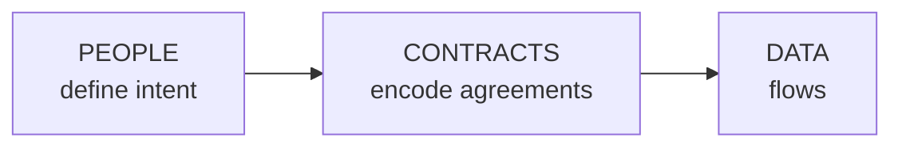
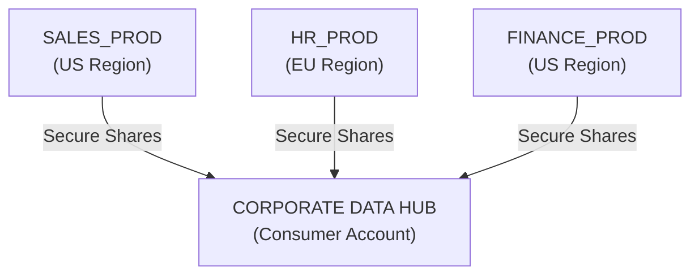
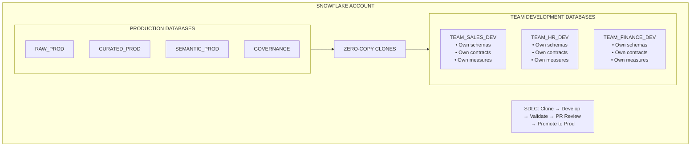
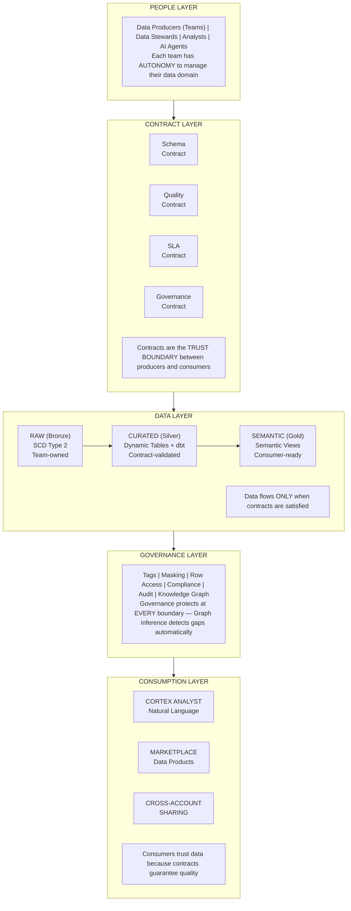
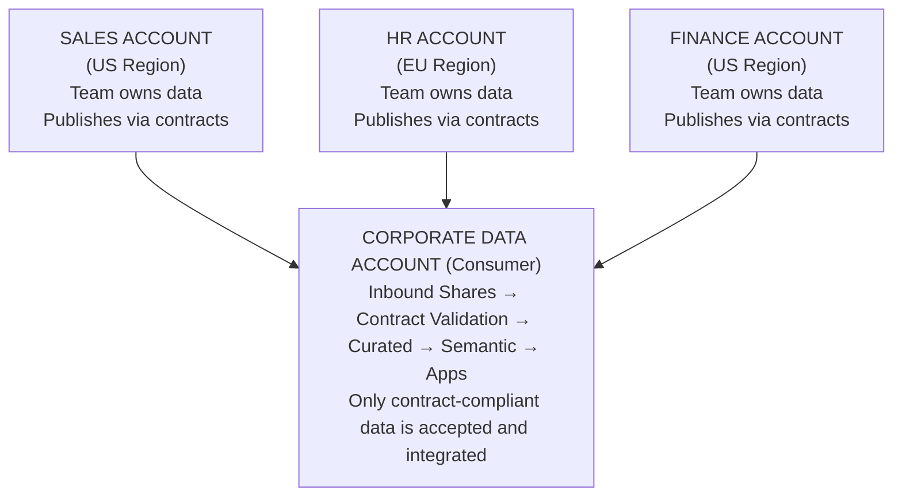
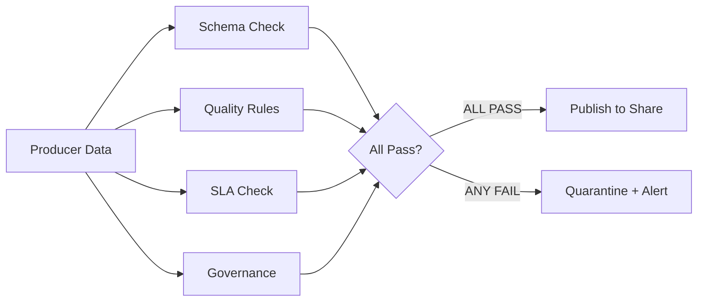
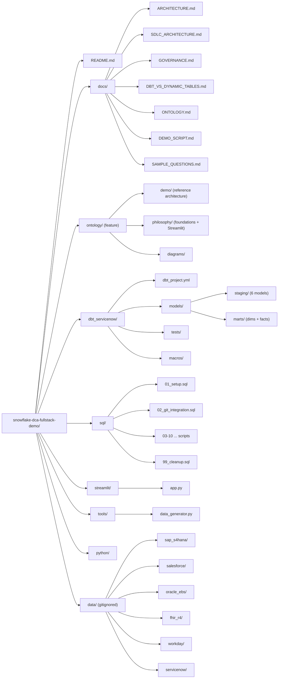
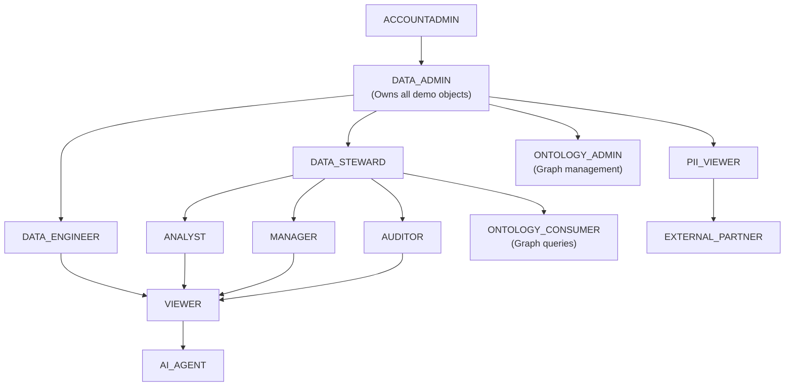

# Snowflake Data Cloud Architecture — Full Stack Demo

> **People-First, Contract-Driven Data Architecture** — A complete enterprise data platform where teams have autonomy to manage their data, contracts encode intent and agreements, and only validated data flows to production.

## Philosophy

This architecture is built on a fundamental principle: **data serves people, and people must retain control over their data**.



**The Data Cloud Philosophy:**
- Teams own their data domains with full autonomy
- Contracts establish mutual expectations (quality, schema, SLA)
- Quality gates enforce standards before production
- Governance protects at every boundary
- Cross-account sharing enables true federation

Whether you operate in a **single Snowflake account** or across **multiple accounts spanning regions and clouds**, this architecture provides the patterns for federated data management with centralized trust.

## Deployment Patterns

This demo supports two reference architectures. See [SDLC_ARCHITECTURE.md](docs/SDLC_ARCHITECTURE.md) for detailed documentation.

### Multi-Account Architecture

For organizations requiring strong isolation between business units, regions, or environments:



### Single-Account Architecture

For organizations preferring centralized management with logical separation via RBAC/ABAC:



**Key Features:**
- **Zero-copy clones** from production for instant, cost-effective development environments
- **Team autonomy** to create schemas, contracts, and semantic measures
- **RBAC/ABAC/CGAC** for fine-grained access control without account proliferation
- **CI/CD promotion gates** with contract validation before production deployment

### Implementation Maturity Journey

Building a data platform is a journey. See [SDLC_ARCHITECTURE.md](docs/SDLC_ARCHITECTURE.md) for the complete guide.

| Phase | Focus | Key Deliverables |
|-------|-------|------------------|
| **Phase 1: Foundation** | Get data flowing with basic controls | Infrastructure, basic roles, manual deployment |
| **Phase 2: Automation** | Reduce manual work, increase consistency | CI/CD, tag-based governance, Dynamic Tables, team clones |
| **Phase 3: Enterprise Scale** | Contract-driven, self-service platform | Data contracts, semantic layer, marketplace, Cortex |

## Key Capabilities

| Capability | Description |
|------------|-------------|
| **Data Contracts** | Schema, quality, SLA, and governance agreements between producers and consumers |
| **Multi-Account Support** | Cross-region, cross-cloud data sharing with contract validation |
| **Team Autonomy** | Each team manages their data their way, publishing to production via contracts |
| **Medallion Architecture** | RAW → CURATED → SEMANTIC with SCD Type 2 history |
| **Dynamic Tables** | Automated transformation with TARGET_LAG SLAs (SAP, Salesforce, Oracle, FHIR, Workday) |
| **dbt (ServiceNow)** | Code-first, tested, documented transformation pipeline with full DAG lineage |
| **Semantic Views** | Native Snowflake Semantic Views for Cortex Analyst |
| **Cortex Analyst** | Natural language to SQL via semantic models |
| **Snowflake Horizon** | Tag-based governance, masking, row-level security |
| **Compliance Framework** | GDPR, HIPAA, FERPA, CCPA, SOC2, PCI-DSS patterns |
| **Data Marketplace** | Secure data products for internal/external consumption |
| **Ontology Reference Architecture** | Snowflake-native knowledge graph over the same six sources: triple store (TBox/ABox), property-graph projections, Graph RAG, SHACL data quality, and a per-source Cortex Analyst analytics layer. See [`ontology/`](ontology/) and [ONTOLOGY.md](docs/ONTOLOGY.md) |
| **Ontology Knowledge Graph** | Snowflake-native node/edge governance graph (recursive CTEs + SQL) linking metadata and business entities with governance scoring. Used by the fintech, hcls & dcim demos. See [KNOWLEDGE_GRAPH.md](docs/KNOWLEDGE_GRAPH.md) |
| **Streamlit in Snowflake** | Interactive demo with role-switching |

## Architecture Overview



### Transformation Approaches

The DCA supports a **hybrid transformation strategy** — teams choose the engine that fits their workflow:

| Aspect | Dynamic Tables | dbt |
|--------|---------------|-----|
| **Engine** | Snowflake-native, declarative SQL | Code-first, Git-native with Jinja |
| **Orchestration** | Zero-orchestration (`TARGET_LAG` SLAs) | dbt CLI / dbt Cloud / Airflow |
| **Testing** | Contract validation procedures | Built-in `schema.yml` tests + custom SQL tests |
| **Lineage** | Snowflake UI dependency graph | `ref()` DAG with `dbt docs` |
| **Incremental** | Automatic (Snowflake-managed) | Explicit `is_incremental()` logic |
| **Best for** | Teams standardizing on Snowflake-native | Teams with existing dbt investment |

**In this demo:** Dynamic Tables manage SAP, Salesforce, Oracle EBS, FHIR, and Workday. dbt manages ServiceNow ITSM. Consumers see identical curated tables regardless of which engine produced them.

See [DBT_VS_DYNAMIC_TABLES.md](docs/DBT_VS_DYNAMIC_TABLES.md) for a detailed comparison and decision framework.

## Multi-Account Topology

For organizations with multiple Snowflake accounts (regional, business unit, or partner):



## Data Contracts

Contracts are explicit agreements between data producers and consumers:

| Contract Type | What It Defines | Example |
|---------------|-----------------|---------|
| **Schema** | Column names, types, keys | `CUSTOMER_ID VARCHAR NOT NULL PRIMARY KEY` |
| **Quality** | Rules with pass thresholds | `email_valid: 99% of emails match regex` |
| **SLA** | Freshness, availability | `Data no older than 4 hours, 99.9% uptime` |
| **Governance** | Classification, compliance | `CONFIDENTIAL, GDPR, US_ONLY residency` |

### Contract Validation Flow



## Quick Start

### Prerequisites

- Snowflake account with ACCOUNTADMIN role
- Git repository access (GitHub, GitLab, etc.)
- Python 3.9+ (for local data generation)
- dbt-snowflake 1.7+ (for ServiceNow dbt pipeline)

### Deployment

```sql
-- Run each script in sequence
@sql/01_setup.sql              -- Roles, warehouses, databases, tags
@sql/02_git_integration.sql    -- Git repository connection
@sql/03_raw_layer.sql          -- Dynamic RAW layer infrastructure
@sql/04_load_data.sql          -- Load source system data (auto-infer schema)
@sql/05_curated_layer.sql      -- Dynamic Tables
@sql/06_semantic_layer.sql     -- Native Semantic Views
@sql/07_governance.sql         -- Horizon masking & row access
@sql/08_contracts.sql          -- Data contracts & validation
@sql/09_streamlit_app.sql      -- Deploy Streamlit app
@sql/10_marketplace.sql        -- Data products
@sql/11_rai_setup.sql          -- Knowledge graph roles & grants
@sql/12_ontology_graph_tables.sql -- Knowledge graph node/edge tables
@sql/13_ontology_graph_populate.sql -- Populate graph from metadata + curated
@sql/14_rai_graph_sync.sql     -- Graph inference procedures (pure SQL)
@sql/15_ontology_sharing.sql   -- Share graph data + data product catalog
@sql/16_graph_algorithms.sql   -- On-demand graph algorithms (views + procs)
```

### dbt Pipeline (ServiceNow)

After deploying the SQL scripts, run the dbt pipeline for ServiceNow ITSM:

```bash
cd dbt_servicenow
pip install dbt-snowflake
cp profiles.yml.example ~/.dbt/profiles.yml  # Edit with your credentials

dbt deps                       # Install packages
dbt build                      # Run models + tests
dbt docs generate && dbt docs serve  # View DAG and documentation
```

The dbt pipeline creates staging views and mart tables in `CURATED_DEV.DBT_SERVICENOW_STAGING` and `CURATED_DEV.DBT_SERVICENOW` — sitting alongside the Dynamic Table schemas for the other five source systems.

### Load Source System Data

After generating data, upload to Snowflake and use dynamic schema inference:

```sql
-- Upload files to stage (SnowSQL)
PUT file:///path/to/data/sap_s4hana/*.csv @RAW_DEV.STAGING.DATA_STAGE/sap_s4hana/ AUTO_COMPRESS=TRUE;

-- Auto-create tables with inferred schema
CALL RAW_DEV.STAGING.INFER_AND_CREATE_TABLE('SAP', 'KNA1', 'CSV', 'sap_s4hana/KNA1.csv');

-- Or load all tables for a source system at once
CALL RAW_DEV.STAGING.LOAD_SOURCE_SYSTEM('SAP', 'CSV');
```

### Generate Test Data

The data generator produces **source system-specific** synthetic data that mirrors real enterprise systems:

```bash
cd tools
pip install -r requirements.txt

# SAP S/4HANA (KNA1, MARA, VBAK, VBAP, PA0001, PA0002, LFA1, EKKO, BKPF)
python data_generator.py --system sap --domain all --output ../data

# Salesforce (Account, Contact, Opportunity, Case, Lead, Product2, Campaign, Task)
python data_generator.py --system salesforce --domain all --output ../data

# Oracle EBS (HZ_PARTIES, OE_ORDER_*, AP_*, RA_*, GL_JE_LINES, HR_*, MTL_*)
python data_generator.py --system oracle --domain all --output ../data

# FHIR R4 (Patient, Practitioner, Encounter, Condition, Observation, Claim)
python data_generator.py --system fhir --domain all --output ../data

# Workday HCM (Workers, Organizations, Compensation, Time_Off, Benefits)
python data_generator.py --system workday --domain hcm --output ../data

# ServiceNow (incident, change_request, problem, cmdb_ci, sc_request, kb_knowledge)
python data_generator.py --system servicenow --domain itsm --output ../data

# Quick test (1/10th size)
python data_generator.py --system sap --domain all --quick --output ../data
```

See [DATA_GENERATION.md](docs/DATA_GENERATION.md) for full documentation.

## Repository Structure



## Compliance Framework

| Regulation | Region | Implementation |
|------------|--------|----------------|
| **GDPR** | EU | `RESIDENCY_REGION='EU_ONLY'`, consent tracking, right to erasure |
| **HIPAA** | US | `HIPAA_CATEGORY` tags, PHI masking, audit trails |
| **FERPA** | US | `FERPA_CATEGORY` tags, educational record protection |
| **CCPA** | California | Consent management, data deletion support |
| **PCI-DSS** | Global | Credit card masking (never full number visible) |
| **SOC2** | Global | Access controls, availability monitoring |

## Governance Tags

| Tag | Purpose | Values |
|-----|---------|--------|
| `DATA_CLASSIFICATION` | Sensitivity level | PUBLIC, INTERNAL, CONFIDENTIAL, RESTRICTED |
| `PII_TYPE` | Personal info type | NONE, INDIRECT, DIRECT, SENSITIVE |
| `AI_ALLOWED` | AI/ML eligibility | TRUE, FALSE, PSEUDONYMIZED, AGGREGATED |
| `RESIDENCY_REGION` | Data sovereignty | GLOBAL, US_ONLY, EU_ONLY, ORIGIN |
| `COMPLIANCE_FRAMEWORK` | Applicable regs | GDPR, HIPAA, FERPA, CCPA, PCI, SOC2 |

## Role Hierarchy



## Documentation

- [ARCHITECTURE.md](docs/ARCHITECTURE.md) — People-first, contract-driven design
- [SDLC_ARCHITECTURE.md](docs/SDLC_ARCHITECTURE.md) — Single-account & multi-account deployment patterns, CI/CD, team autonomy
- [DBT_VS_DYNAMIC_TABLES.md](docs/DBT_VS_DYNAMIC_TABLES.md) — dbt vs Dynamic Tables: comparison, decision framework, hybrid architecture
- [DATA_GENERATION.md](docs/DATA_GENERATION.md) — Source system data generation (SAP, Salesforce, Oracle, FHIR, Workday, ServiceNow)
- [GOVERNANCE.md](docs/GOVERNANCE.md) — Compliance framework details
- [ONTOLOGY.md](docs/ONTOLOGY.md) — Ontology Reference Architecture: Snowflake-native knowledge graph, ontology vs. analytics layers, and how it plugs into the DCA patterns
- [KNOWLEDGE_GRAPH.md](docs/KNOWLEDGE_GRAPH.md) — Ontology Knowledge Graph (Snowflake-native): node/edge schema, inference, and graph algorithms
- [DEMO_SCRIPT.md](docs/DEMO_SCRIPT.md) — 15-minute demo walkthrough
- [SAMPLE_QUESTIONS.md](docs/SAMPLE_QUESTIONS.md) — Cortex Analyst examples

## Focused Demos

Customer-specific applications of DCA patterns — each demo maps the core architecture to a real engagement.

- [Focused Demos Index](demos/) — Overview and structure convention
- [United Rentals](demos/united-rentals/) — Equipment rental industry: federated platform, account consolidation, Cortex AI pipeline, SDLC bridge

## Resources

- [Snowflake Horizon](https://www.snowflake.com/en/data-cloud/horizon/)
- [Dynamic Tables](https://docs.snowflake.com/en/user-guide/dynamic-tables-intro)
- [dbt-snowflake](https://docs.getdbt.com/docs/core/connect-data-platform/snowflake-setup)
- [dbt Best Practices](https://docs.getdbt.com/best-practices)
- [Semantic Views](https://docs.snowflake.com/en/sql-reference/sql/create-semantic-view)
- [Cortex Analyst](https://docs.snowflake.com/en/user-guide/snowflake-cortex/cortex-analyst)
- [Data Sharing](https://docs.snowflake.com/en/user-guide/data-sharing-intro)
- [Cross-Region Replication](https://docs.snowflake.com/en/user-guide/database-replication-intro)
- [Git Integration](https://docs.snowflake.com/en/developer-guide/git/git-setting-up)

## License

MIT License — See LICENSE file for details.
