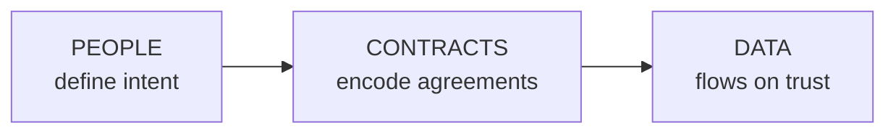
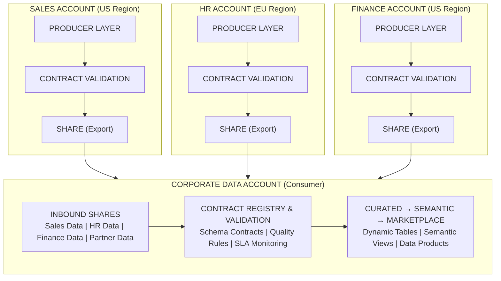
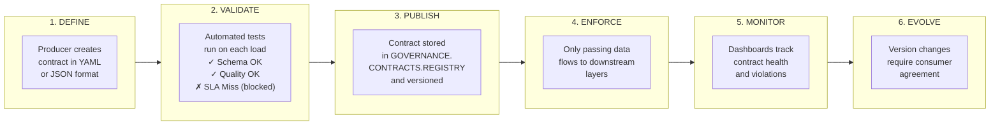
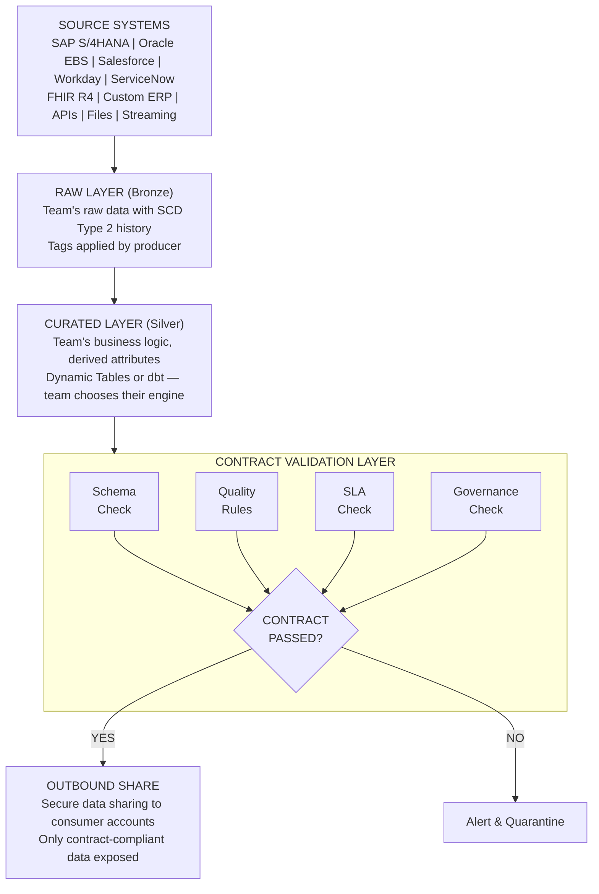
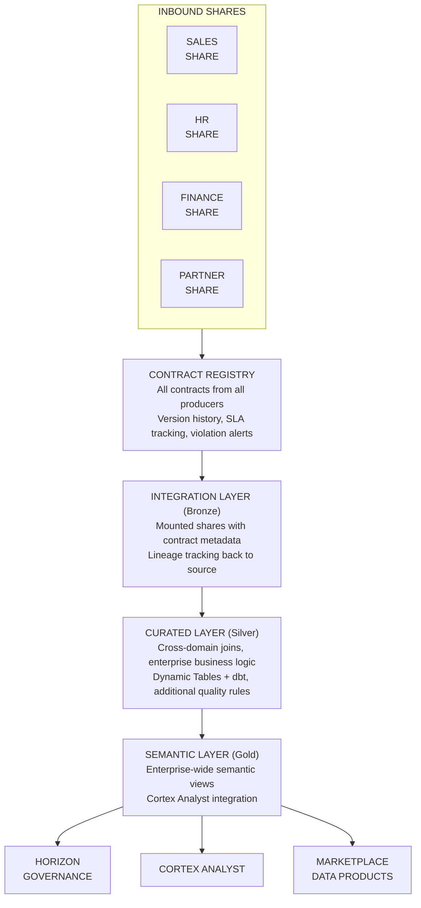
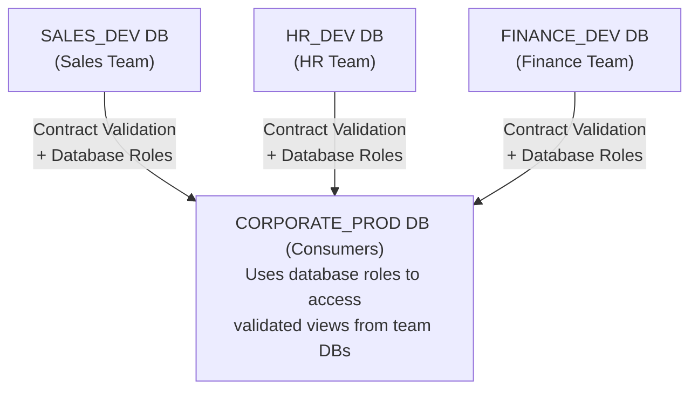
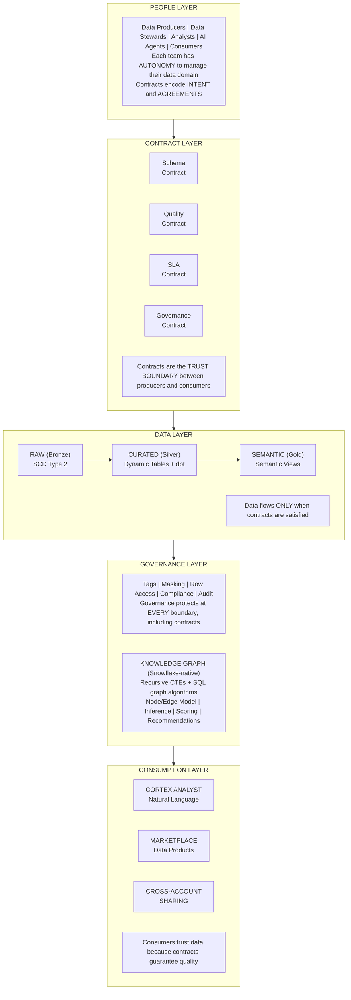
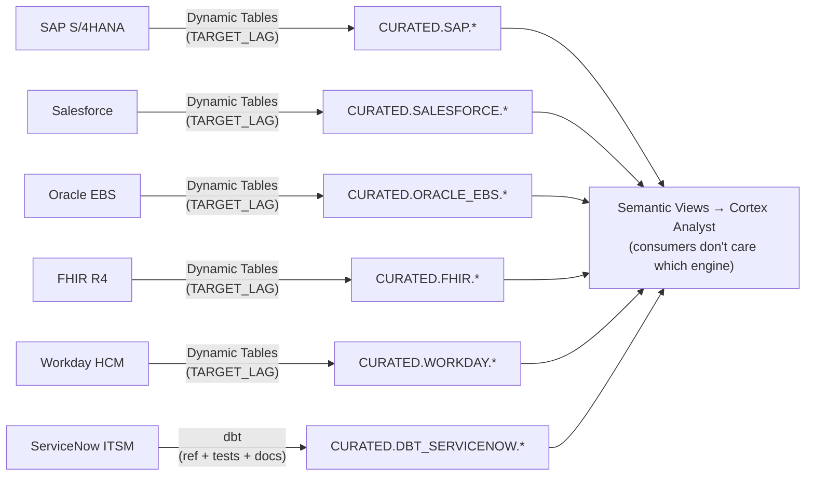
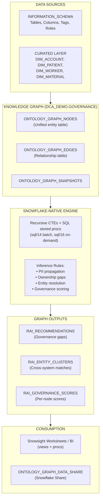

# Architecture Documentation

## Philosophy: People-First, Contract-Driven Data

This architecture embodies a fundamental truth: **data serves people, and people must retain control over their data**. In enterprise environments, data flows from many teams, regions, and even separate Snowflake accounts. Each team knows their data best and must have the freedom to manage it their way—while still participating in the larger organizational data ecosystem.

The solution is **Data Contracts**: explicit agreements between data producers and consumers that define quality, quantity, freshness, schema, and governance expectations. Only when contracts are satisfied does data flow to production.



**The Data Cloud Architecture Philosophy:**
- Teams own their data domains
- Contracts establish mutual expectations
- Quality gates enforce standards before production
- Governance protects at every boundary
- Cross-account sharing enables federation

---

## Multi-Account, Multi-Region Reality

Real enterprises don't have one Snowflake account. They have:

- **Regional accounts** (US, EU, APAC) for data residency compliance
- **Business unit accounts** (Sales, Finance, HR) for organizational boundaries
- **Environment accounts** (Dev, QA, Prod) for lifecycle separation
- **Subsidiary accounts** for acquired companies or partners

The architecture must support **federated data management** where each team operates independently but connects to a shared corporate data fabric.



---

## The Contract Layer

**Data Contracts are the bridge between producer autonomy and consumer trust.** They define:

| Contract Type | What It Defines | Who Agrees |
|---------------|-----------------|------------|
| **Schema Contract** | Column names, types, nullability, keys | Producer + Consumer |
| **Quality Contract** | Completeness, accuracy, timeliness rules | Producer + Data Steward |
| **SLA Contract** | Freshness, availability, latency targets | Producer + Platform |
| **Governance Contract** | Classification, PII handling, residency | Producer + Compliance |
| **Semantic Contract** | Business meaning, relationships, metrics | Producer + Analyst |

### Contract Lifecycle



### Contract Definition Example

```yaml
# contracts/sales/customer_contract_v1.yaml
contract:
  id: "CONTRACT-SALES-CUSTOMER-001"
  version: "1.0.0"
  producer:
    account: "SALES_PROD"
    team: "Sales Operations"
    owner: "john.smith@company.com"
  consumers:
    - account: "CORP_ANALYTICS"
      team: "Business Intelligence"
    - account: "MARKETING_PROD"
      team: "Marketing Analytics"

  schema:
    table: "CUSTOMER"
    columns:
      - name: CUSTOMER_ID
        type: VARCHAR(50)
        nullable: false
        is_primary_key: true
        description: "Unique customer identifier from CRM"
      - name: EMAIL
        type: VARCHAR(255)
        nullable: true
        pii_type: DIRECT
        governance:
          - GDPR_PERSONAL_DATA
          - MASK_EMAIL
      - name: CREATED_DATE
        type: DATE
        nullable: false
        description: "Date customer record was created"

  quality:
    rules:
      - name: "customer_id_not_null"
        expression: "CUSTOMER_ID IS NOT NULL"
        threshold: 100%  # Must pass 100%
      - name: "email_valid_format"
        expression: "EMAIL RLIKE '^[A-Za-z0-9._%+-]+@[A-Za-z0-9.-]+\\.[A-Za-z]{2,}$'"
        threshold: 99%   # Allow 1% invalid
      - name: "created_date_not_future"
        expression: "CREATED_DATE <= CURRENT_DATE()"
        threshold: 100%
      - name: "row_count_minimum"
        expression: "COUNT(*) >= 1000"
        threshold: 100%

  sla:
    freshness:
      target: "4 hours"
      maximum: "24 hours"
    availability:
      target: "99.9%"
    latency:
      p95: "500ms"

  governance:
    classification: CONFIDENTIAL
    compliance:
      - GDPR
      - CCPA
    residency: US_ONLY
    retention: 2555  # 7 years in days
```

---

## Producer Layer (Team-Owned)

Each team owns their data domain and operates independently. They:

1. **Ingest** data from their source systems
2. **Transform** according to their business logic
3. **Validate** against published contracts
4. **Share** to downstream consumers when contracts pass

### Producer Architecture



---

## Consumer Layer (Corporate/Central)

The corporate data account consumes from multiple producers:



---

## Contract Enforcement

### Contract Types

#### 1. Schema Contract

Ensures structural compatibility between producer and consumer:

```sql
-- Schema contract validation
CREATE OR REPLACE PROCEDURE GOVERNANCE.CONTRACTS.VALIDATE_SCHEMA_CONTRACT(
    contract_id VARCHAR,
    source_table VARCHAR
)
RETURNS TABLE (rule_name VARCHAR, passed BOOLEAN, message VARCHAR)
AS
$$
DECLARE
    contract_schema VARIANT;
BEGIN
    -- Get contract schema definition
    SELECT schema_definition INTO contract_schema
    FROM GOVERNANCE.CONTRACTS.CONTRACT_REGISTRY
    WHERE contract_id = :contract_id;
    
    -- Validate each column exists with correct type
    RETURN TABLE(
        SELECT 
            col.value:name::VARCHAR AS rule_name,
            CASE 
                WHEN ic.COLUMN_NAME IS NOT NULL 
                     AND ic.DATA_TYPE = col.value:type::VARCHAR
                THEN TRUE 
                ELSE FALSE 
            END AS passed,
            CASE 
                WHEN ic.COLUMN_NAME IS NULL THEN 'Column missing: ' || col.value:name::VARCHAR
                WHEN ic.DATA_TYPE != col.value:type::VARCHAR THEN 'Type mismatch: expected ' || col.value:type::VARCHAR || ', got ' || ic.DATA_TYPE
                ELSE 'OK'
            END AS message
        FROM TABLE(FLATTEN(:contract_schema:columns)) col
        LEFT JOIN INFORMATION_SCHEMA.COLUMNS ic
            ON ic.TABLE_NAME = UPPER(SPLIT_PART(:source_table, '.', -1))
            AND ic.COLUMN_NAME = UPPER(col.value:name::VARCHAR)
    );
END;
$$;
```

#### 2. Quality Contract

Enforces data quality rules:

```sql
-- Quality rule validation table
CREATE TABLE GOVERNANCE.CONTRACTS.QUALITY_RULES (
    CONTRACT_ID         VARCHAR(100) NOT NULL,
    RULE_ID            VARCHAR(100) NOT NULL,
    RULE_NAME          VARCHAR(255) NOT NULL,
    RULE_EXPRESSION    VARCHAR(4000) NOT NULL,
    THRESHOLD_PERCENT  NUMBER(5,2) DEFAULT 100.0,
    SEVERITY           VARCHAR(20) DEFAULT 'ERROR',  -- ERROR, WARNING, INFO
    IS_ACTIVE          BOOLEAN DEFAULT TRUE,
    
    PRIMARY KEY (CONTRACT_ID, RULE_ID)
);

-- Quality validation procedure
CREATE OR REPLACE PROCEDURE GOVERNANCE.CONTRACTS.VALIDATE_QUALITY_CONTRACT(
    contract_id VARCHAR,
    source_table VARCHAR
)
RETURNS TABLE (rule_name VARCHAR, pass_rate NUMBER, threshold NUMBER, passed BOOLEAN)
AS
$$
BEGIN
    RETURN TABLE(
        SELECT 
            r.RULE_NAME,
            pass_rate.rate AS pass_rate,
            r.THRESHOLD_PERCENT AS threshold,
            pass_rate.rate >= r.THRESHOLD_PERCENT AS passed
        FROM GOVERNANCE.CONTRACTS.QUALITY_RULES r
        CROSS JOIN LATERAL (
            SELECT 100.0 * SUM(CASE WHEN eval.result THEN 1 ELSE 0 END) / COUNT(*) AS rate
            FROM TABLE(RESULT_SCAN(LAST_QUERY_ID())) eval
        ) pass_rate
        WHERE r.CONTRACT_ID = :contract_id AND r.IS_ACTIVE = TRUE
    );
END;
$$;
```

#### 3. SLA Contract

Monitors freshness and availability:

```sql
-- SLA tracking table
CREATE TABLE GOVERNANCE.CONTRACTS.SLA_METRICS (
    CONTRACT_ID         VARCHAR(100) NOT NULL,
    METRIC_TIMESTAMP   TIMESTAMP_NTZ DEFAULT CURRENT_TIMESTAMP(),
    
    -- Freshness
    DATA_TIMESTAMP     TIMESTAMP_NTZ,
    FRESHNESS_SECONDS  NUMBER,
    FRESHNESS_TARGET   NUMBER,
    FRESHNESS_PASSED   BOOLEAN,
    
    -- Availability
    IS_AVAILABLE       BOOLEAN,
    
    -- Latency
    QUERY_LATENCY_MS   NUMBER,
    LATENCY_TARGET_MS  NUMBER,
    LATENCY_PASSED     BOOLEAN
);

-- SLA monitoring view
CREATE OR REPLACE VIEW GOVERNANCE.CONTRACTS.VW_SLA_HEALTH AS
SELECT 
    CONTRACT_ID,
    -- Freshness SLA (last 24 hours)
    AVG(CASE WHEN FRESHNESS_PASSED THEN 100.0 ELSE 0.0 END) AS freshness_compliance_pct,
    
    -- Availability SLA
    AVG(CASE WHEN IS_AVAILABLE THEN 100.0 ELSE 0.0 END) AS availability_pct,
    
    -- Latency SLA
    PERCENTILE_CONT(0.95) WITHIN GROUP (ORDER BY QUERY_LATENCY_MS) AS p95_latency_ms,
    AVG(CASE WHEN LATENCY_PASSED THEN 100.0 ELSE 0.0 END) AS latency_compliance_pct,
    
    -- Overall health
    CASE 
        WHEN AVG(CASE WHEN FRESHNESS_PASSED THEN 1.0 ELSE 0.0 END) >= 0.99
             AND AVG(CASE WHEN IS_AVAILABLE THEN 1.0 ELSE 0.0 END) >= 0.999
             AND AVG(CASE WHEN LATENCY_PASSED THEN 1.0 ELSE 0.0 END) >= 0.95
        THEN 'HEALTHY'
        WHEN AVG(CASE WHEN FRESHNESS_PASSED THEN 1.0 ELSE 0.0 END) >= 0.95
        THEN 'DEGRADED'
        ELSE 'CRITICAL'
    END AS health_status
    
FROM GOVERNANCE.CONTRACTS.SLA_METRICS
WHERE METRIC_TIMESTAMP >= DATEADD('hour', -24, CURRENT_TIMESTAMP())
GROUP BY CONTRACT_ID;
```

---

## Contract Registry

Central catalog of all contracts across the organization:

```sql
-- Master contract registry
CREATE TABLE GOVERNANCE.CONTRACTS.CONTRACT_REGISTRY (
    CONTRACT_ID         VARCHAR(100) PRIMARY KEY,
    CONTRACT_VERSION    VARCHAR(20) NOT NULL,
    CONTRACT_STATUS     VARCHAR(20) DEFAULT 'DRAFT',  -- DRAFT, ACTIVE, DEPRECATED, RETIRED
    
    -- Producer info
    PRODUCER_ACCOUNT    VARCHAR(255),
    PRODUCER_TEAM       VARCHAR(255),
    PRODUCER_OWNER      VARCHAR(255),
    
    -- Consumer info
    CONSUMER_ACCOUNTS   ARRAY,
    
    -- Contract definitions (JSON)
    SCHEMA_DEFINITION   VARIANT,
    QUALITY_DEFINITION  VARIANT,
    SLA_DEFINITION      VARIANT,
    GOVERNANCE_DEFINITION VARIANT,
    
    -- Metadata
    EFFECTIVE_FROM      TIMESTAMP_NTZ,
    EFFECTIVE_TO        TIMESTAMP_NTZ DEFAULT '9999-12-31',
    CREATED_AT          TIMESTAMP_NTZ DEFAULT CURRENT_TIMESTAMP(),
    UPDATED_AT          TIMESTAMP_NTZ DEFAULT CURRENT_TIMESTAMP(),
    CREATED_BY          VARCHAR(255) DEFAULT CURRENT_USER(),
    
    -- Documentation
    DESCRIPTION         VARCHAR(4000),
    DOCUMENTATION_URL   VARCHAR(1000)
);

-- Contract validation history
CREATE TABLE GOVERNANCE.CONTRACTS.VALIDATION_HISTORY (
    VALIDATION_ID       VARCHAR(100) DEFAULT UUID_STRING(),
    CONTRACT_ID         VARCHAR(100) NOT NULL,
    VALIDATION_TIME     TIMESTAMP_NTZ DEFAULT CURRENT_TIMESTAMP(),
    
    -- Results
    SCHEMA_PASSED       BOOLEAN,
    QUALITY_PASSED      BOOLEAN,
    SLA_PASSED          BOOLEAN,
    GOVERNANCE_PASSED   BOOLEAN,
    OVERALL_PASSED      BOOLEAN,
    
    -- Details
    VALIDATION_DETAILS  VARIANT,
    ROW_COUNT           NUMBER,
    
    PRIMARY KEY (VALIDATION_ID)
);
```

---

## Cross-Account Data Sharing

### Producer Side (Outbound)

```sql
-- Create share for contract-validated data
CREATE OR REPLACE SHARE SALES_CONTRACT_SHARE
    COMMENT = 'Sales data shared per contract CONTRACT-SALES-CUSTOMER-001';

-- Only share contract-compliant views
CREATE OR REPLACE SECURE VIEW SALES.EXPORTS.CUSTOMER_EXPORT AS
SELECT 
    c.*,
    -- Add contract metadata
    'CONTRACT-SALES-CUSTOMER-001' AS _CONTRACT_ID,
    '1.0.0' AS _CONTRACT_VERSION,
    CURRENT_TIMESTAMP() AS _EXPORTED_AT
FROM SALES.CURATED.DIM_CUSTOMER c
WHERE EXISTS (
    -- Only include if latest validation passed
    SELECT 1 FROM GOVERNANCE.CONTRACTS.VALIDATION_HISTORY v
    WHERE v.CONTRACT_ID = 'CONTRACT-SALES-CUSTOMER-001'
      AND v.OVERALL_PASSED = TRUE
      AND v.VALIDATION_TIME >= DATEADD('hour', -1, CURRENT_TIMESTAMP())
);

-- Grant to share
GRANT SELECT ON VIEW SALES.EXPORTS.CUSTOMER_EXPORT TO SHARE SALES_CONTRACT_SHARE;

-- Add consumer account
ALTER SHARE SALES_CONTRACT_SHARE ADD ACCOUNTS = 'ORG1.CORP_ANALYTICS';
```

### Consumer Side (Inbound)

```sql
-- Create database from share
CREATE OR REPLACE DATABASE SALES_INBOUND
    FROM SHARE SALES_PROD.SALES_CONTRACT_SHARE
    COMMENT = 'Inbound sales data from Sales team account';

-- Validate contract on receipt
CALL GOVERNANCE.CONTRACTS.VALIDATE_INBOUND_CONTRACT(
    'CONTRACT-SALES-CUSTOMER-001',
    'SALES_INBOUND.PUBLIC.CUSTOMER_EXPORT'
);
```

---

## Single-Account Mode

For organizations using a single Snowflake account, the same principles apply using **database boundaries** instead of account boundaries:



---

## The Complete Picture



---

## Hybrid Transformation Strategy

The DCA curated layer supports multiple transformation engines. Teams choose the tool that fits their workflow and existing investment:

### Dynamic Tables (Snowflake-Native)

Used by: **SAP, Salesforce, Oracle EBS, FHIR, Workday** domains in this demo.

- Zero-orchestration — Snowflake manages refresh via `TARGET_LAG`
- Metadata-driven — `CURATED_CONFIG` table + `BUILD_CURATED_LAYER()` procedure generates all Dynamic Tables from config rows
- Automatic incremental refresh — no developer logic required
- Ideal for teams standardizing on Snowflake-native tooling

### dbt (Code-First)

Used by: **ServiceNow ITSM** domain in this demo.

- `ref()` lineage — explicit DAG with `dbt docs generate`
- Built-in testing — `schema.yml` tests (not_null, unique, accepted_values, relationships) plus custom SQL tests
- Jinja macros — reusable logic (e.g., `sla_breach_check()` macro)
- Git-native — PRs, code review, version control for all transformation logic
- CI/CD-friendly — `dbt build` in pipelines with `--select` for incremental deploys
- Ideal for teams with existing dbt investment or requiring portable transformation logic

### Consumer Transparency

Regardless of which engine produces a curated table, downstream consumers see the same contract-validated, governance-tagged tables. The transformation engine is an implementation detail — contracts and governance are the trust boundary.



For a detailed comparison and decision framework, see [DBT_VS_DYNAMIC_TABLES.md](DBT_VS_DYNAMIC_TABLES.md).

---

## Ontology Knowledge Graph (Snowflake-Native)

The architecture includes an **Ontology Knowledge Graph** that provides graph-based governance analysis entirely in Snowflake — recursive CTEs + window functions over `ONTOLOGY_GRAPH_NODES` / `ONTOLOGY_GRAPH_EDGES`. There is no sidecar and no container service: the graph is always live against the source tables and inherits Snowflake's governance, replication, and sharing. It handles governance scoring, PII propagation, ownership gaps, entity resolution, and traversal (shortest path, centrality, connected components, k-hop neighborhood).

### Purpose

The Knowledge Graph operationalizes the ontological framework described in `ontology/philosophy/04-dca-ontological-synthesis.md`. It materializes the relationships between metadata objects (tables, columns, tags, roles, policies) and business entities (customers, patients, employees, products) as a queryable graph with SQL-powered inference.

### Architecture



### Graph Layers

| Layer | Node Types | Edge Types | Source |
|-------|-----------|------------|--------|
| **METADATA** | TABLE, COLUMN, TAG, ROLE, POLICY | HAS_COLUMN, TAGGED_WITH, GRANTED_TO, MASKED_BY, LINEAGE_FROM | INFORMATION_SCHEMA, TAG_REFERENCES |
| **BUSINESS** | CUSTOMER, PATIENT, EMPLOYEE, PRODUCT, INCIDENT, ORDER | PURCHASES, TREATED_BY, WORKS_FOR, ASSIGNED_TO | Curated dimension/fact tables |
| **CROSS** | (links between layers) | REPRESENTS, STORED_IN | Mapping business entities to their metadata tables |

### Graph Inference

The graph engine provides inference via two complementary paths, both pure SQL:
- **Batch**: `SP_RUN_INFERENCE()` materializes PII propagation, ownership gaps, entity resolution, and governance scores into recommendation tables (`sql/14_rai_graph_sync.sql`)
- **On-demand**: Views and stored procedures in `sql/16_graph_algorithms.sql` expose shortest path, centrality, connected components, and k-hop neighborhood — callable from any Worksheet

Inference capabilities:

1. **PII Propagation Detection** — If a column receives data from a PII-tagged upstream column via lineage, infer it should also be tagged
2. **Ownership Gap Detection** — Tables in SEMANTIC schemas with no `data_contract_owner` tag
3. **Entity Resolution** — Cross-system entity matching using name similarity (e.g., same customer in SAP and Salesforce)
4. **Governance Scoring** — Composite score per node: tag coverage (30%), contract (30%), ownership (25%), quality monitoring (15%)

### On-Demand Graph Algorithms

`sql/16_graph_algorithms.sql` exposes graph algorithms as views and stored procedures, callable from any Snowsight Worksheet:

| Object | Type | Description |
|--------|------|-------------|
| `V_GRAPH_DEGREE_CENTRALITY` | View | Top-N hub nodes by degree |
| `V_GRAPH_PII_PROPAGATION` | View | Live PII propagation findings |
| `V_GRAPH_GOVERNANCE_SCORES` | View | Live composite governance scores |
| `SP_GRAPH_SHORTEST_PATH(from, to, hops)` | Procedure | Shortest path between two nodes |
| `SP_GRAPH_CONNECTED_COMPONENTS()` | Procedure | Weakly connected components |
| `SP_GRAPH_NEIGHBORHOOD(start, k)` | Procedure | k-hop neighborhood expansion |

### Sharing

The graph is shareable via the **Snowflake Share** (`ONTOLOGY_GRAPH_DATA_SHARE`) — secure views over the node/edge/score tables, granted to consumer accounts as needed.

For full documentation, see [KNOWLEDGE_GRAPH.md](KNOWLEDGE_GRAPH.md).

---

## References

- [Snowflake Data Sharing](https://docs.snowflake.com/en/user-guide/data-sharing-intro)
- [Cross-Region/Cross-Cloud Replication](https://docs.snowflake.com/en/user-guide/database-replication-intro)
- [Snowflake Organizations](https://docs.snowflake.com/en/user-guide/organizations)
- [Dynamic Tables](https://docs.snowflake.com/en/user-guide/dynamic-tables-intro)
- [dbt-snowflake](https://docs.getdbt.com/docs/core/connect-data-platform/snowflake-setup)
- [dbt Best Practices](https://docs.getdbt.com/best-practices)
- [Snowflake Horizon](https://www.snowflake.com/en/data-cloud/horizon/)
- [dbt vs Dynamic Tables — Decision Framework](DBT_VS_DYNAMIC_TABLES.md)
- [Snowpark Container Services](https://docs.snowflake.com/en/developer-guide/snowpark-container-services/overview)
