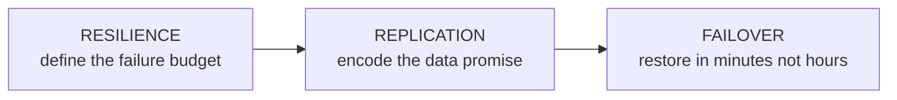
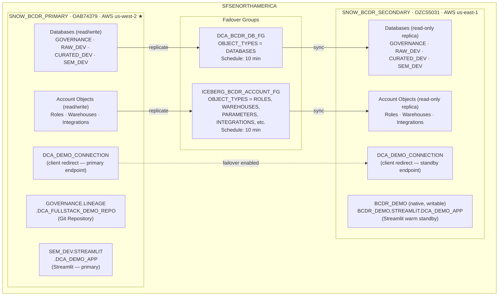
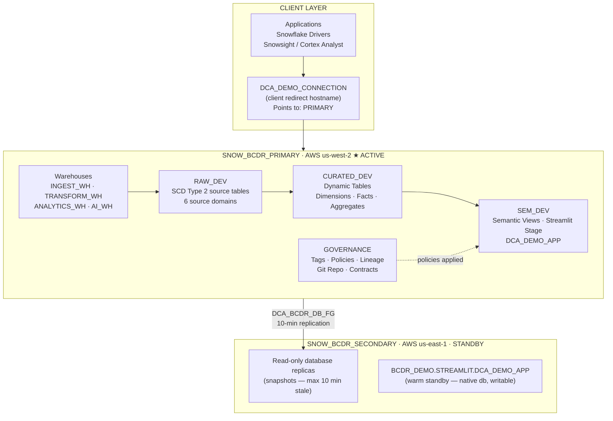
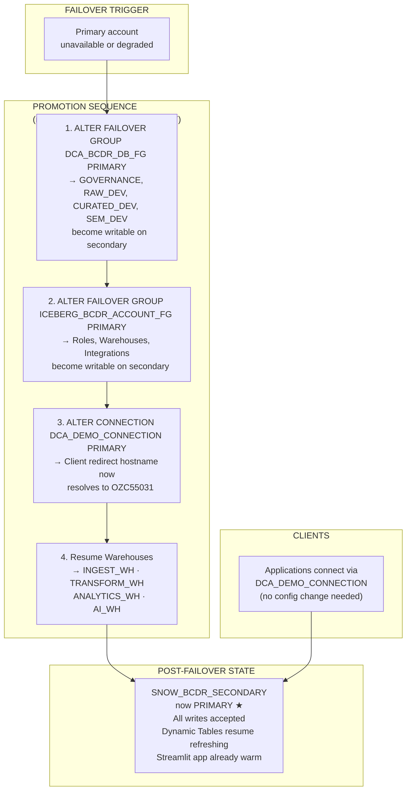
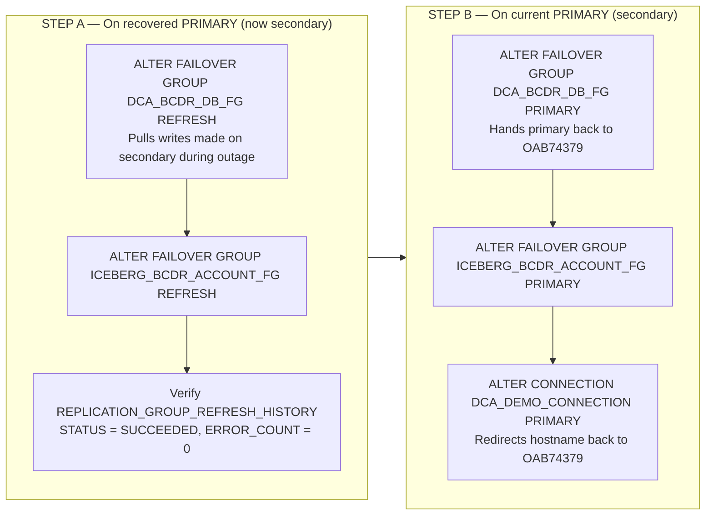
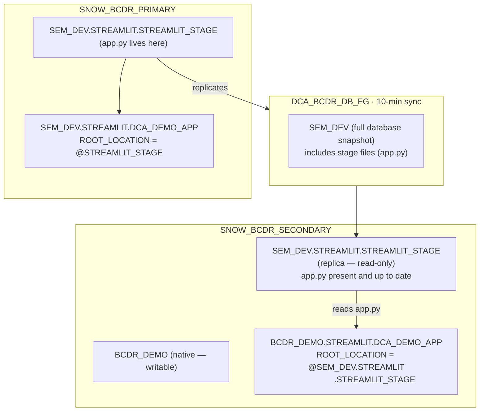
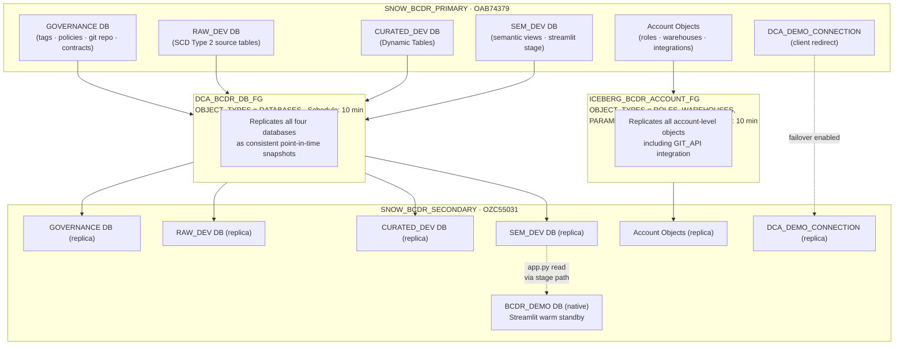

# Business Continuity & Disaster Recovery (BCDR Lite)

## Philosophy: Resilience Without Complexity

Enterprise data platforms must survive failure. But full active-active multi-region architectures are expensive, operationally complex, and often overkill for a demo or mid-market deployment. **BCDR Lite** is the pragmatic middle ground: a cross-region warm standby that uses Snowflake's native replication primitives to protect all application data with a defined, testable failover runbook — no third-party tooling required.

The core principle is **asymmetry**: the primary account handles all reads and writes during normal operations. The secondary account sits warm, continuously receiving replicated snapshots, ready to be promoted with a single SQL statement.



**The BCDR Lite Design Principles:**
- Native Snowflake primitives only — no custom sync jobs or ETL pipelines
- Cross-region (AWS us-west-2 → AWS us-east-1) for geographic fault isolation
- Warm standby — secondary receives continuous 10-minute snapshots
- Single-step promotion — one SQL statement makes secondary writable
- Client-redirect Connection — application connection strings never change during failover
- Streamlit warm standby — app is pre-deployed on secondary and works immediately after failover

---

## Account Topology

```
┌─────────────────────────────────────────────────────────────────────────┐
│  ORG: SFSENORTHAMERICA                                                  │
│                                                                         │
│  ┌──────────────────────────────┐      ┌──────────────────────────────┐ │
│  │  SNOW_BCDR_PRIMARY           │      │  SNOW_BCDR_SECONDARY         │ │
│  │  Locator : OAB74379          │      │  Locator : OZC55031          │ │
│  │  Cloud   : AWS               │      │  Cloud   : AWS               │ │
│  │  Region  : us-west-2         │      │  Region  : us-east-1         │ │
│  │  Role    : PRIMARY ★         │      │  Role    : WARM STANDBY      │ │
│  │                              │      │                              │ │
│  │  Databases (read/write)      │─────▶│  Databases (read-only)       │ │
│  │  ├─ GOVERNANCE               │ 10m  │  ├─ GOVERNANCE  (replica)    │ │
│  │  ├─ RAW_DEV                  │ sync │  ├─ RAW_DEV     (replica)    │ │
│  │  ├─ CURATED_DEV              │      │  ├─ CURATED_DEV (replica)    │ │
│  │  └─ SEM_DEV                  │      │  └─ SEM_DEV     (replica)    │ │
│  │                              │      │                              │ │
│  │  Roles + Warehouses          │─────▶│  Roles + Warehouses (replica)│ │
│  │  (via ICEBERG_BCDR_ACCT_FG)  │      │                              │ │
│  │                              │      │  BCDR_DEMO (native, writable)│ │
│  │  DCA_DEMO_CONNECTION ★       │─────▶│  DCA_DEMO_CONNECTION (replica│ │
│  └──────────────────────────────┘      └──────────────────────────────┘ │
└─────────────────────────────────────────────────────────────────────────┘
```



---

## What Replicates and What Doesn't

Understanding the replication boundary is critical for operating and extending this pattern.

| Object | Replication Method | Writable on Secondary? | Notes |
|---|---|---|---|
| `GOVERNANCE` database | `DCA_BCDR_DB_FG` (10 min) | No — read-only replica | Tags, policies, lineage |
| `RAW_DEV` database | `DCA_BCDR_DB_FG` (10 min) | No — read-only replica | SCD Type 2 source tables |
| `CURATED_DEV` database | `DCA_BCDR_DB_FG` (10 min) | No — read-only replica | Dynamic Tables replicate as static snapshots |
| `SEM_DEV` database | `DCA_BCDR_DB_FG` (10 min) | No — read-only replica | Semantic views + Streamlit stage files |
| `GOVERNANCE.LINEAGE.DCA_FULLSTACK_DEMO_REPO` | **Not replicated** | N/A | `CREATE GIT REPOSITORY` objects do not replicate with the database. Created directly in `BCDR_DEMO.PUBLIC` on the secondary instead. |
| Roles (DATA_ADMIN, ANALYST, etc.) | `ICEBERG_BCDR_ACCOUNT_FG` (10 min) | No — read-only replica | Grants replicate too |
| Warehouses (INGEST_WH, etc.) | `ICEBERG_BCDR_ACCOUNT_FG` (10 min) | No — read-only replica | Resume/suspend after failover |
| `GIT_API` integration | `ICEBERG_BCDR_ACCOUNT_FG` (10 min) | No — read-only replica | API integrations type |
| `DCA_DEMO_CONNECTION` | Replica Connection | Promotion required | Client redirect hostname |
| `SEM_DEV.STREAMLIT.DCA_DEMO_APP` | **Not replicated** | N/A | `CREATE STREAMLIT` is not a replicable object type |
| `BCDR_DEMO` database | **Not replicated** | **Yes — native** | Created directly on secondary; hosts Streamlit warm standby |

### Dynamic Tables on the Secondary

Dynamic Tables on the primary continuously refresh from upstream sources. On the secondary, they replicate as **static snapshots** — the last computed state at the time of the most recent failover group refresh. The secondary does not run its own refresh cycles. After failover (promotion to primary), Dynamic Tables resume their normal refresh cadence automatically.

```
PRIMARY                          SECONDARY
──────────────────────────────   ──────────────────────────────
DIM_CUSTOMER (Dynamic Table)     DIM_CUSTOMER (static snapshot)
  ↑ refreshes from RAW_DEV         ← 10-min replication snapshot
  ↑ TARGET_LAG = downstream        (no refresh until promoted)
```

---

## Normal Operations: Data Flow

During steady-state, all traffic flows to the primary. The secondary receives continuous replication but serves no active queries.



---

## Failover: Promoting the Secondary

A failover event promotes the secondary to primary. Three SQL statements are required. The client redirect Connection automatically routes all application traffic to the newly promoted account — no application reconfiguration needed.

```
BEFORE FAILOVER                          AFTER FAILOVER
─────────────────────────────────────    ─────────────────────────────────────
SNOW_BCDR_PRIMARY  ★ PRIMARY             SNOW_BCDR_PRIMARY    (recovering)
SNOW_BCDR_SECONDARY  STANDBY             SNOW_BCDR_SECONDARY ★ PRIMARY

DCA_DEMO_CONNECTION → OAB74379           DCA_DEMO_CONNECTION → OZC55031
All databases: PRIMARY on OAB74379       All databases: PRIMARY on OZC55031
```



**Recovery Time Objective (RTO):** Minutes — limited to executing the three promotion statements and warehouse resume.

**Recovery Point Objective (RPO):** Up to 10 minutes — the replication schedule interval. The last snapshot may be up to 10 minutes behind the primary at the time of failure.

---

## Failback: Returning to Primary

Once the original primary account recovers, traffic is returned to it. This requires syncing any writes that occurred on the secondary during the outage before handing back.



---

## Streamlit Warm Standby

`CREATE STREAMLIT` is not a replicated object type in Snowflake. `SEM_DEV.STREAMLIT.DCA_DEMO_APP` exists only on the primary. To give the secondary an immediately functional Streamlit without waiting for promotion, a warm standby app is pre-deployed in `BCDR_DEMO.STREAMLIT` — a **native writable database** created directly on the secondary.

```
PRIMARY account                          SECONDARY account
─────────────────────────────────────    ─────────────────────────────────────
SEM_DEV.STREAMLIT                        BCDR_DEMO.STREAMLIT
  ├── STREAMLIT_STAGE         ──────────▶  (replicated with SEM_DEV — read-only)
  │     └── app.py            10-min sync
  └── DCA_DEMO_APP                        DCA_DEMO_APP
        ROOT_LOCATION =                     ROOT_LOCATION =
        @SEM_DEV.STREAMLIT                  @SEM_DEV.STREAMLIT    ← same path
         .STREAMLIT_STAGE                    .STREAMLIT_STAGE

★ Both apps read app.py from the same replicated stage path.
  After failover SEM_DEV becomes writable — the path is unchanged.
```



**Why this works after failover:** The `ROOT_LOCATION` path `@SEM_DEV.STREAMLIT.STREAMLIT_STAGE` is identical on both accounts. After failover, `SEM_DEV` is promoted to primary (writable) on the secondary account. The `BCDR_DEMO.STREAMLIT.DCA_DEMO_APP` app continues reading from the same path — no DDL changes required.

---

## Git Repository on the Secondary

`CREATE GIT REPOSITORY` objects do **not** replicate with the database — confirmed by testing. The repository must be created directly on the secondary.

`GOVERNANCE` is a read-only replica on the secondary so the repo cannot be placed in `GOVERNANCE.LINEAGE`. It is instead created in `BCDR_DEMO.PUBLIC` (the native writable database provisioned in Part 8). After failover — when `GOVERNANCE` is promoted to primary and becomes writable — it can optionally be recreated in `GOVERNANCE.LINEAGE` to match the primary layout.

```
PRIMARY                                   SECONDARY
─────────────────────────────────────     ─────────────────────────────────────
GOVERNANCE.LINEAGE                        BCDR_DEMO.PUBLIC
  └── DCA_FULLSTACK_DEMO_REPO               └── DCA_FULLSTACK_DEMO_REPO
        API_INTEGRATION = GIT_API                 API_INTEGRATION = GIT_API
        ORIGIN = github.com/...                   ORIGIN = github.com/...
        (authoritative — FETCH runs here)         (independent — created directly)

Note: different schema locations, identical ORIGIN.
      After failover the secondary becomes primary and can host
      the repo in GOVERNANCE.LINEAGE if desired.
```

The `GIT_API` API integration that backs both repositories **is** replicated via `ICEBERG_BCDR_ACCOUNT_FG` (account objects group, API integrations type). However, because the secondary's replicated integration is read-only until failover, Part 5 creates a fresh `GIT_API` integration directly on the secondary using `CREATE API INTEGRATION IF NOT EXISTS` — which is a no-op if the replica is already present and usable.

---

## Replication Architecture Summary



---

## Monitoring Replication Health

Run these queries on the **secondary** account to monitor replication status.

### Refresh History

```sql
-- Last 10 refresh cycles for the DCA database group.
-- Healthy: STATUS = 'SUCCEEDED', ERROR_COUNT = 0.
SELECT
    REPLICATION_GROUP_NAME,
    PHASE_TIME,
    STATUS,
    ERROR_COUNT,
    BYTES_TRANSFERRED,
    OBJECT_COUNT
FROM SNOWFLAKE.ACCOUNT_USAGE.REPLICATION_GROUP_REFRESH_HISTORY
WHERE REPLICATION_GROUP_NAME = 'DCA_BCDR_DB_FG'
ORDER BY PHASE_TIME DESC
LIMIT 10;
```

### Replication Lag

```sql
-- How stale is the secondary right now?
-- LAG_MINUTES > 15 warrants investigation.
SELECT
    PRIMARY_SNAPSHOT_TIMESTAMP,
    LAST_REFRESH_COMPLETED_ON,
    DATEDIFF('minute',
             LAST_REFRESH_COMPLETED_ON,
             CURRENT_TIMESTAMP()) AS LAG_MINUTES
FROM SNOWFLAKE.ACCOUNT_USAGE.REPLICATION_GROUP_USAGE_HISTORY
WHERE REPLICATION_GROUP_NAME = 'DCA_BCDR_DB_FG'
ORDER BY PRIMARY_SNAPSHOT_TIMESTAMP DESC
LIMIT 5;
```

### Replica Database Verification

```sql
-- Confirm databases on secondary are SECONDARY kind (read-only replicas).
SHOW DATABASES LIKE 'GOVERNANCE';
SHOW DATABASES LIKE 'RAW_DEV';
SHOW DATABASES LIKE 'CURATED_DEV';
SHOW DATABASES LIKE 'SEM_DEV';
```

---

## Script Execution Order

```
02_bcdr.sql
│
├── Parts 1–4 · Run on SNOW_BCDR_PRIMARY (OAB74379)
│   ├── PART 1  Pre-flight verification
│   ├── PART 2  Create GOVERNANCE.LINEAGE.DCA_FULLSTACK_DEMO_REPO
│   ├── PART 3  CREATE FAILOVER GROUP DCA_BCDR_DB_FG
│   └── PART 4  CREATE CONNECTION DCA_DEMO_CONNECTION
│
├── Switch connection to SNOW_BCDR_SECONDARY (OZC55031)
│
└── Parts 5–8 · Run on SNOW_BCDR_SECONDARY
    ├── PART 5  Pre-flight + verify SHOW REPLICATION GROUPS
    ├── PART 6  CREATE FAILOVER GROUP DCA_BCDR_DB_FG (replica)
    ├── PART 7  CREATE CONNECTION DCA_DEMO_CONNECTION (replica) + REFRESH
    └── PART 8  CREATE DATABASE BCDR_DEMO + Streamlit warm standby
```

---

## Operational Runbook Summary

| Scenario | Account | Commands |
|---|---|---|
| **Check replication lag** | Secondary | `REPLICATION_GROUP_REFRESH_HISTORY` query |
| **Force immediate sync** | Secondary | `ALTER FAILOVER GROUP DCA_BCDR_DB_FG REFRESH` |
| **Trigger failover** | Secondary | `ALTER FAILOVER GROUP ... PRIMARY` × 2 + `ALTER CONNECTION ... PRIMARY` |
| **Resume warehouses** | Secondary (post-failover) | `ALTER WAREHOUSE ... RESUME IF SUSPENDED` × 4 |
| **Failback — sync** | Primary (recovering) | `ALTER FAILOVER GROUP ... REFRESH` × 2 |
| **Failback — hand back** | Secondary (current primary) | `ALTER FAILOVER GROUP ... PRIMARY` × 2 + `ALTER CONNECTION ... PRIMARY` |

---

## References

- [Snowflake Failover Groups](https://docs.snowflake.com/en/user-guide/account-replication-failover-failback)
- [Snowflake Client Redirect (Connections)](https://docs.snowflake.com/en/user-guide/client-redirect)
- [Database Replication and Failover](https://docs.snowflake.com/en/user-guide/db-replication-intro)
- [Git Repositories in Snowflake](https://docs.snowflake.com/en/developer-guide/git/git-overview)
- [Streamlit in Snowflake](https://docs.snowflake.com/en/developer-guide/streamlit/about-streamlit)
