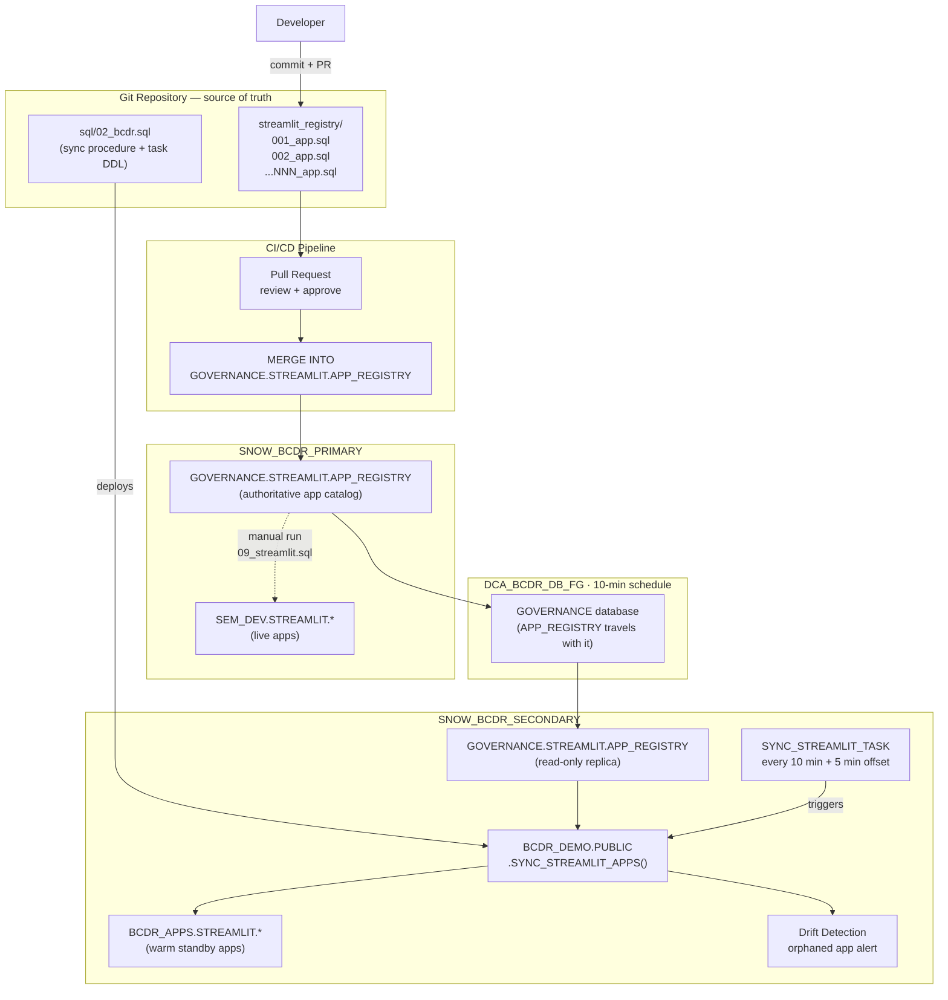
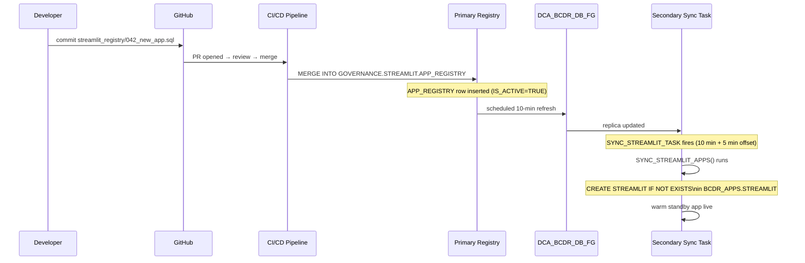
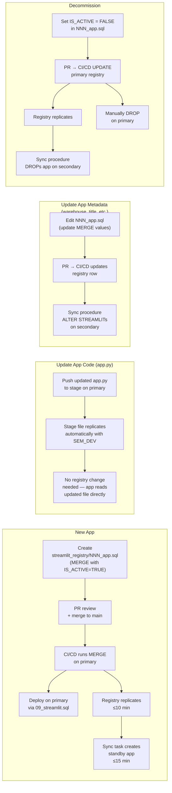
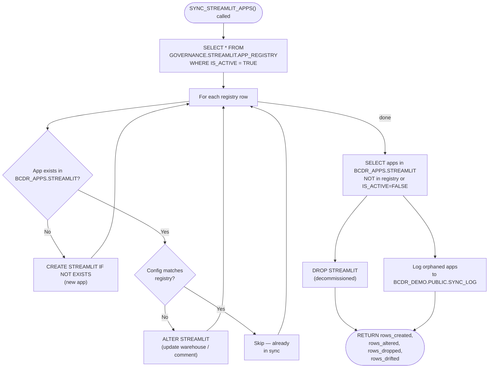

# Streamlit App Registry Pattern — BCDR Reference Architecture

> **Production gap pattern for managing hundreds of Streamlit apps across primary and secondary accounts.**
> `CREATE STREAMLIT` objects do not replicate natively. This pattern bridges that gap using a metadata registry, a sync procedure, and a scheduled task.

---

## Table of Contents

1. [Problem Statement](#problem-statement)
2. [System Architecture](#system-architecture)
3. [Component Reference](#component-reference)
4. [Process Flow — Normal Operations](#process-flow--normal-operations)
5. [App Lifecycle](#app-lifecycle)
6. [Registry Table Schema](#registry-table-schema)
7. [Sync Procedure Logic](#sync-procedure-logic)
8. [Git-Based Code Management](#git-based-code-management)
9. [Drift Detection](#drift-detection)
10. [Post-Failover Considerations](#post-failover-considerations)

---

## Problem Statement

Snowflake does not replicate `CREATE STREAMLIT` objects as part of database replication. When `GOVERNANCE`, `RAW_DEV`, `CURATED_DEV`, and `SEM_DEV` are replicated to a secondary account via `DCA_BCDR_DB_FG`, the Streamlit app definitions in `SEM_DEV.STREAMLIT.*` are **not carried across**.

```
┌─────────────────────────────────────────────┐
│  WHAT REPLICATES                            │
│  ✓ Tables, views, dynamic tables            │
│  ✓ Stages and staged files                  │
│  ✓ Stored procedures and functions          │
│  ✓ Schemas and grants                       │
│                                             │
│  WHAT DOES NOT REPLICATE                    │
│  ✗ CREATE STREAMLIT objects                 │
│  ✗ CREATE GIT REPOSITORY objects            │
└─────────────────────────────────────────────┘
```

At small scale (1–2 apps) this is handled by a warm standby — a manually scripted `CREATE STREAMLIT` in a native writable database (`BCDR_DEMO`) on the secondary. At large scale (hundreds of apps) that approach becomes unmanageable without a systematic pattern.

---

## System Architecture

```
┌──────────────────────────────────────────────────────────────────────────────┐
│  SNOW_BCDR_PRIMARY (OAB74379 · us-west-2)                                    │
│                                                                              │
│  ┌──────────────────────┐    ┌───────────────────────────────────────────┐  │
│  │  Git Repository      │    │  GOVERNANCE.STREAMLIT.APP_REGISTRY        │  │
│  │  (source of truth)   │    │  (metadata — replicates with GOVERNANCE)  │  │
│  │  streamlit_registry/ │    │  app_name · root_location · main_file     │  │
│  │  001_app.sql         │    │  query_warehouse · is_active · version     │  │
│  │  002_app.sql         │    └───────────────────────────────────────────┘  │
│  │  ...NNN_app.sql      │                       │                           │
│  └──────────────────────┘                       │                           │
│            │  CI/CD MERGE                       │ DCA_BCDR_DB_FG            │
└────────────┼───────────────────────────────────┼───────────────────────────┘
             │                                   │ 10-min replication
             │                   ┌───────────────▼───────────────────────────┐
             │                   │  SNOW_BCDR_SECONDARY (OZC55031 · us-east-1)│
             │                   │                                            │
             │                   │  GOVERNANCE.STREAMLIT.APP_REGISTRY (r/o)  │
             │                   │            │                               │
             │                   │            ▼                               │
             │                   │  BCDR_DEMO.PUBLIC.SYNC_STREAMLIT_APPS()   │
             │                   │  (stored procedure — reconciles app state) │
             │                   │            │                               │
             │                   │            ▼  triggered every 10 min      │
             │                   │  BCDR_DEMO.PUBLIC.SYNC_STREAMLIT_TASK     │
             │                   │            │                               │
             │                   │            ▼                               │
             │                   │  BCDR_APPS.STREAMLIT.*  (warm standby)    │
             │                   └────────────────────────────────────────────┘
             │
             ▼ (post-failover only)
     SEM_DEV.STREAMLIT.*  promoted to read/write on new primary
```

---



---

## Component Reference

| Component | Account | Object | Purpose |
|-----------|---------|--------|---------|
| App Registry | PRIMARY | `GOVERNANCE.STREAMLIT.APP_REGISTRY` | Single source of truth — replicates automatically |
| Sync Procedure | SECONDARY | `BCDR_DEMO.PUBLIC.SYNC_STREAMLIT_APPS()` | Reconciles live apps against replicated registry |
| Sync Task | SECONDARY | `BCDR_DEMO.PUBLIC.SYNC_STREAMLIT_TASK` | Drives sync on a schedule (10 min + offset) |
| Warm Standby DB | SECONDARY | `BCDR_APPS.STREAMLIT.*` | Native writable database — hosts secondary apps |
| Git Registry Files | Both | `streamlit_registry/NNN_app.sql` | One MERGE file per app — version-controlled lifecycle |
| Stage (files) | PRIMARY → SECONDARY | `SEM_DEV.STREAMLIT.STREAMLIT_STAGE` | App source files — replicates with SEM_DEV |

---

## Process Flow — Normal Operations



**End-to-end lag: ≤ 25 minutes** (10 min replication + 5 min offset + procedure runtime)

---

## App Lifecycle



---

## Registry Table Schema

```sql
CREATE TABLE IF NOT EXISTS GOVERNANCE.STREAMLIT.APP_REGISTRY (
    app_id           NUMBER AUTOINCREMENT PRIMARY KEY,
    app_name         VARCHAR(255)  NOT NULL,        -- STREAMLIT object name
    target_schema    VARCHAR(500)  NOT NULL,         -- e.g. BCDR_APPS.STREAMLIT
    root_location    VARCHAR(1000) NOT NULL,         -- @SEM_DEV.STREAMLIT.STREAMLIT_STAGE/apps/my_app
    main_file        VARCHAR(255)  NOT NULL DEFAULT 'app.py',
    query_warehouse  VARCHAR(255)  NOT NULL DEFAULT 'ANALYTICS_WH',
    title            VARCHAR(500),
    comment          VARCHAR(2000),
    is_active        BOOLEAN       NOT NULL DEFAULT TRUE,
    version          NUMBER        NOT NULL DEFAULT 1,
    created_at       TIMESTAMP_NTZ NOT NULL DEFAULT CURRENT_TIMESTAMP(),
    updated_at       TIMESTAMP_NTZ NOT NULL DEFAULT CURRENT_TIMESTAMP()
);
```

---

## Sync Procedure Logic

The procedure runs on the secondary against the read-only replica of `APP_REGISTRY`. It is strictly additive/corrective — it never modifies the registry itself.



---

## Git-Based Code Management

Each app has exactly one registry file. The file contains a single idempotent `MERGE` statement.

```
streamlit_registry/
├── 001_dca_demo_app.sql
├── 002_contracts_explorer.sql
├── 003_governance_dashboard.sql
└── ...
```

**Example registry file (`042_cost_monitor.sql`):**

```sql
-- App: Cost Monitor Dashboard
-- Owner: data-platform-team
-- PR: #142

MERGE INTO GOVERNANCE.STREAMLIT.APP_REGISTRY AS tgt
USING (
    SELECT
        'COST_MONITOR'                                    AS app_name,
        'BCDR_APPS.STREAMLIT'                            AS target_schema,
        '@SEM_DEV.STREAMLIT.STREAMLIT_STAGE/cost_monitor' AS root_location,
        'app.py'                                          AS main_file,
        'ANALYTICS_WH'                                    AS query_warehouse,
        'Cost Monitor Dashboard'                          AS title,
        'Real-time warehouse cost monitoring'             AS comment,
        TRUE                                              AS is_active,
        42                                                AS version
) AS src
ON tgt.app_name = src.app_name
WHEN MATCHED THEN UPDATE SET
    root_location   = src.root_location,
    query_warehouse = src.query_warehouse,
    title           = src.title,
    comment         = src.comment,
    is_active       = src.is_active,
    version         = src.version,
    updated_at      = CURRENT_TIMESTAMP()
WHEN NOT MATCHED THEN INSERT (
    app_name, target_schema, root_location, main_file,
    query_warehouse, title, comment, is_active, version
) VALUES (
    src.app_name, src.target_schema, src.root_location, src.main_file,
    src.query_warehouse, src.title, src.comment, src.is_active, src.version
);
```

**Why one file per app:**
- Git blame shows exactly who changed which app and when
- PRs are scoped to a single app — easy review
- Merge conflicts are impossible (no shared file)
- CI/CD runs only the changed file — fast pipelines

---

## Drift Detection

Run on secondary to find apps that exist in `BCDR_APPS.STREAMLIT` but are no longer in the active registry:

```sql
-- Apps on secondary not in registry (orphaned)
SELECT s.name AS orphaned_app
FROM   INFORMATION_SCHEMA.STREAMLITS s
WHERE  s.streamlit_schema = 'STREAMLIT'
  AND  s.streamlit_catalog = 'BCDR_APPS'
  AND  NOT EXISTS (
           SELECT 1
           FROM   GOVERNANCE.STREAMLIT.APP_REGISTRY r
           WHERE  r.app_name  = s.name
             AND  r.is_active = TRUE
       );

-- Registry apps not yet created on secondary (sync lag or failure)
SELECT r.app_name AS missing_standby
FROM   GOVERNANCE.STREAMLIT.APP_REGISTRY r
WHERE  r.is_active = TRUE
  AND  NOT EXISTS (
           SELECT 1
           FROM   INFORMATION_SCHEMA.STREAMLITS s
           WHERE  s.streamlit_catalog = 'BCDR_APPS'
             AND  s.streamlit_schema  = 'STREAMLIT'
             AND  s.name              = r.app_name
       );

-- Last sync run and results
SELECT *
FROM   BCDR_DEMO.PUBLIC.SYNC_LOG
ORDER  BY sync_time DESC
LIMIT  20;
```

---

## Post-Failover Considerations

> **This is where the pattern is a product gap, not a product feature.**

After failover promotion, the secondary becomes the new primary. At that point:

- `GOVERNANCE` is promoted — `APP_REGISTRY` becomes read/write
- `SEM_DEV` is promoted — `STREAMLIT_STAGE` files are available
- `BCDR_APPS.STREAMLIT.*` apps (warm standby) are already live and usable

However, the **canonical** app location (`SEM_DEV.STREAMLIT.*`) still needs to be recreated on the new primary:

```
┌────────────────────────────────────────────────────────┐
│  POST-FAILOVER RUNBOOK (Streamlit)                     │
│                                                        │
│  1. Verify warm standby apps are serving traffic       │
│     SELECT * FROM INFORMATION_SCHEMA.STREAMLITS        │
│     WHERE STREAMLIT_CATALOG = 'BCDR_APPS';             │
│                                                        │
│  2. Update DCA_DEMO_CONNECTION to point to new primary │
│     ALTER CONNECTION DCA_DEMO_CONNECTION PRIMARY;       │
│                                                        │
│  3. Run 09_streamlit.sql on new primary to rebuild     │
│     canonical SEM_DEV.STREAMLIT.* apps                 │
│     (or run SYNC_STREAMLIT_APPS() if procedure exists) │
│                                                        │
│  4. Validate all apps respond at new primary URL       │
│                                                        │
│  5. SYNC_STREAMLIT_TASK resumes automatically once     │
│     DCA_BCDR_DB_FG is refreshed from new primary       │
└────────────────────────────────────────────────────────┘
```

| Scenario | Handled by Registry Pattern | Manual Step Required |
|----------|----------------------------|----------------------|
| Traffic redirect | `DCA_DEMO_CONNECTION` failover | None |
| Stage files available | SEM_DEV replication | None |
| Warm standby apps serving | `SYNC_STREAMLIT_TASK` pre-failover | None |
| Canonical SEM_DEV apps rebuilt | **No** | Run `09_streamlit.sql` or `SYNC_STREAMLIT_APPS()` |
| New apps added post-failover | Registry writable again | Normal CI/CD flow resumes |
| Old primary re-syncs on failback | Registry replicates back | Verify no duplicate apps |

---

## Summary

```
                         ┌─────────────────────────────┐
                         │       PRODUCT GAP            │
                         │  CREATE STREAMLIT does not   │
                         │  replicate with databases    │
                         └──────────────┬──────────────┘
                                        │
                                        ▼
         ┌──────────────────────────────────────────────────────┐
         │                  REGISTRY PATTERN                     │
         │                                                       │
         │  Metadata replicates (GOVERNANCE table)               │
         │  Stage files replicate (SEM_DEV stage)                │
         │  Sync procedure reconciles app definitions            │
         │  Task drives continuous reconciliation                │
         │                                                       │
         │  RTO for warm standby:  already live                  │
         │  RTO for canonical apps: minutes (run one script)     │
         │  RPO:  ≤ 10 min (registry + stage files)             │
         └──────────────────────────────────────────────────────┘
```
