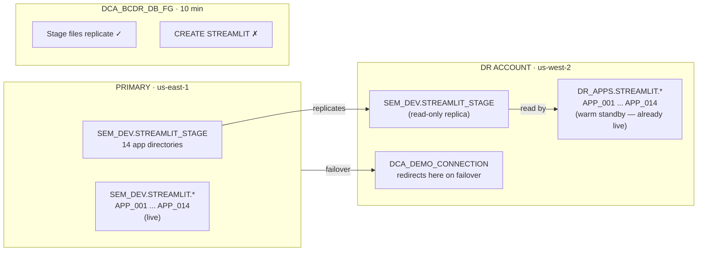
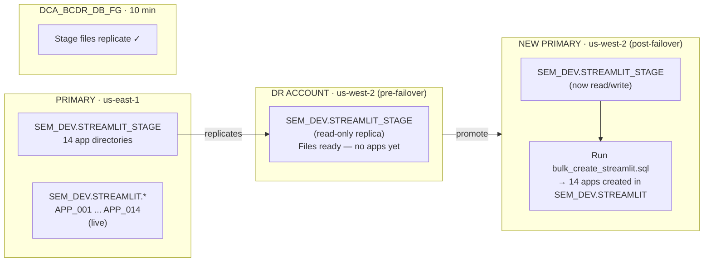
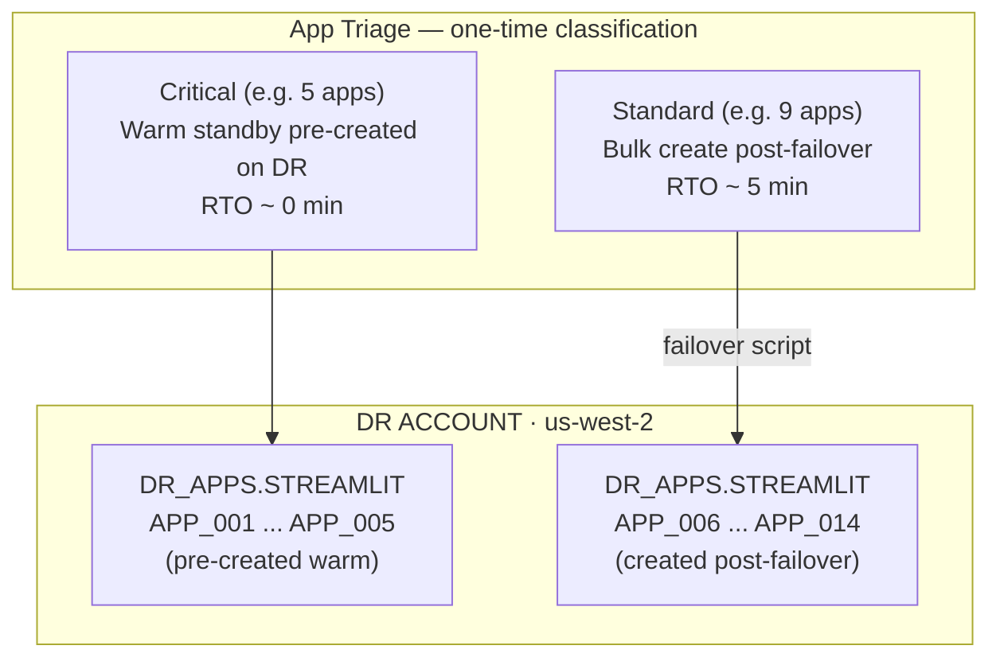

# Streamlit DR Patterns

> **Three operational patterns for DR continuity of Streamlit apps across Snowflake accounts.**
> `CREATE STREAMLIT` objects do not replicate via failover groups — app source files do (via stage replication). These patterns bridge that gap with the minimum viable operational overhead for a fleet of 14 apps while Snowflake works toward a native solution.

---

## Pattern Comparison

| | Warm Standby | Post-Failover Bulk Create | Hybrid |
|---|---|---|---|
| **Apps pre-created on DR** | All 14 | None | Critical subset |
| **Steady-state maintenance** | Low (add `CREATE STREAMLIT` per new app) | None | Low (critical apps only) |
| **RTO — app availability** | ~0 min | ~5 min | ~0 min (critical) / ~5 min (rest) |
| **RPO** | ≤ 10 min (stage files) | ≤ 10 min (stage files) | ≤ 10 min (stage files) |
| **Failover steps** | 1 — redirect connection | 2 — redirect + run bulk script | 2 — redirect + run script for remainder |
| **Best for** | All apps business-critical | Tolerant of short RTO window | Mixed criticality fleet |

---

## How App Files Reach DR

Regardless of which pattern you choose, the **app source files always replicate automatically**. The gap is only the `CREATE STREAMLIT` DDL object.

```
┌─────────────────────────────┐             ┌─────────────────────────────┐
│  PRIMARY · us-east-1        │             │  DR · us-west-2             │
│                             │             │                             │
│  SEM_DEV.STREAMLIT          │  ─────────► │  SEM_DEV.STREAMLIT (r/o)    │
│  STREAMLIT_STAGE/           │  DCA_BCDR   │  STREAMLIT_STAGE/           │
│    app_001/app.py           │  _DB_FG     │    app_001/app.py  ✓        │
│    app_002/app.py           │  10 min     │    app_002/app.py  ✓        │
│    ...                      │             │    ...             ✓        │
│    app_014/app.py           │             │    app_014/app.py  ✓        │
│                             │             │                             │
│  SEM_DEV.STREAMLIT.*        │      ✗      │  (no CREATE STREAMLIT       │
│    APP_001 object           │  does not   │   objects on DR)            │
│    APP_002 object           │  replicate  │                             │
│    ...                      │             │                             │
└─────────────────────────────┘             └─────────────────────────────┘
```

**The stage path is identical on both accounts.** Apps created on DR point to the same `@SEM_DEV.STREAMLIT.STREAMLIT_STAGE/...` path — which works because `SEM_DEV` is a read-only replica on DR (reading is fine; only `CREATE STREAMLIT` must go into a writable native DB).

```sql
-- Key insight: split READ vs WRITE across the replication boundary
READ  from: @SEM_DEV.STREAMLIT.STREAMLIT_STAGE/app_001   -- replicated (r/o is fine)
WRITE to:   DR_APPS.STREAMLIT.APP_001                    -- native writable DB on DR
```

---

## Pattern 1: Warm Standby

All 14 apps are pre-created on the DR account before any DR event. Traffic redirects via `DCA_DEMO_CONNECTION` and users hit live apps with no rebuild step.



### Setup — run once on DR account

```sql
-- DR account only
-- Creates native writable DB to host the 14 standby app objects

CREATE DATABASE IF NOT EXISTS DR_APPS
    COMMENT = 'Native writable DR database — hosts Streamlit warm standby apps.';

CREATE SCHEMA IF NOT EXISTS DR_APPS.STREAMLIT;

-- Create all 14 apps pointing to the replicated stage path
-- App code reads from SEM_DEV replica (read-only is fine for STREAMLIT ROOT_LOCATION)

CREATE STREAMLIT IF NOT EXISTS DR_APPS.STREAMLIT.APP_001
    ROOT_LOCATION   = '@SEM_DEV.STREAMLIT.STREAMLIT_STAGE/app_001'
    MAIN_FILE       = 'app.py'
    QUERY_WAREHOUSE = ANALYTICS_WH;

CREATE STREAMLIT IF NOT EXISTS DR_APPS.STREAMLIT.APP_002
    ROOT_LOCATION   = '@SEM_DEV.STREAMLIT.STREAMLIT_STAGE/app_002'
    MAIN_FILE       = 'app.py'
    QUERY_WAREHOUSE = ANALYTICS_WH;

-- ... repeat for APP_003 through APP_014

-- Verify all 14 are present
SELECT name, query_warehouse, url_id
FROM   INFORMATION_SCHEMA.STREAMLITS
WHERE  streamlit_catalog = 'DR_APPS'
ORDER  BY name;
```

### Steady-state maintenance

| Event | Action required on DR |
|-------|----------------------|
| `app.py` updated on primary | Nothing — stage replicates automatically (≤ 10 min) |
| New app added on primary | Run one `CREATE STREAMLIT` on DR |
| App decommissioned on primary | Run one `DROP STREAMLIT` on DR |
| App warehouse changed on primary | Run one `ALTER STREAMLIT SET QUERY_WAREHOUSE` on DR |

### Failover runbook

```sql
-- Step 1 only — apps are already live

-- On new primary (formerly DR account):
ALTER CONNECTION DCA_DEMO_CONNECTION PRIMARY;

-- Verify 14 apps are responding
SELECT name, url_id
FROM   INFORMATION_SCHEMA.STREAMLITS
WHERE  streamlit_catalog = 'DR_APPS'
ORDER  BY name;
-- All 14 should return a url_id
```

**RTO for app availability: ~0 minutes.** Apps serve traffic immediately after connection redirect.

---

## Pattern 2: Post-Failover Bulk Create

Nothing is pre-created on DR. After failover is triggered and SEM_DEV is promoted to read/write on the new primary, a single script creates all 14 apps in under 5 minutes.



### Setup — nothing on DR in advance

No pre-work needed. Keep `sql/09_streamlit.sql` (or an equivalent bulk script) in source control. That script becomes the failover tool.

### Failover runbook

```sql
-- Step 1: promote the connection
-- (can be done before or after app creation)
ALTER CONNECTION DCA_DEMO_CONNECTION PRIMARY;

-- Step 2: create all 14 apps on the new primary (formerly DR account)
-- SEM_DEV is now promoted to read/write — CREATE STREAMLIT works in SEM_DEV directly

CREATE DATABASE IF NOT EXISTS DR_APPS;
CREATE SCHEMA  IF NOT EXISTS DR_APPS.STREAMLIT;

CREATE STREAMLIT IF NOT EXISTS DR_APPS.STREAMLIT.APP_001
    ROOT_LOCATION   = '@SEM_DEV.STREAMLIT.STREAMLIT_STAGE/app_001'
    MAIN_FILE       = 'app.py'
    QUERY_WAREHOUSE = ANALYTICS_WH;

-- ... repeat for APP_002 through APP_014

-- Verify
SELECT COUNT(*) AS apps_created
FROM   INFORMATION_SCHEMA.STREAMLITS
WHERE  streamlit_catalog = 'DR_APPS';
-- Expected: 14
```

### Steady-state maintenance

None. No objects exist on DR during normal operations.

**RTO for app availability: ~5 minutes.** Time to run the bulk script after failover promotion.

---

## Pattern 3: Hybrid

Critical apps get warm standby. The rest are created post-failover. Balances maintenance overhead against RTO for a mixed-criticality fleet.



### Setup — run once on DR account (critical apps only)

```sql
CREATE DATABASE IF NOT EXISTS DR_APPS;
CREATE SCHEMA  IF NOT EXISTS DR_APPS.STREAMLIT;

-- Warm standby: critical apps only
CREATE STREAMLIT IF NOT EXISTS DR_APPS.STREAMLIT.APP_001
    ROOT_LOCATION   = '@SEM_DEV.STREAMLIT.STREAMLIT_STAGE/app_001'
    MAIN_FILE       = 'app.py'
    QUERY_WAREHOUSE = ANALYTICS_WH;

-- ... repeat for APP_002 through APP_005
```

### Failover runbook

```sql
-- Step 1: redirect connection
ALTER CONNECTION DCA_DEMO_CONNECTION PRIMARY;
-- Critical apps (APP_001–005) are immediately live.

-- Step 2: bulk create remaining 9 apps
CREATE STREAMLIT IF NOT EXISTS DR_APPS.STREAMLIT.APP_006
    ROOT_LOCATION   = '@SEM_DEV.STREAMLIT.STREAMLIT_STAGE/app_006'
    MAIN_FILE       = 'app.py'
    QUERY_WAREHOUSE = ANALYTICS_WH;

-- ... repeat for APP_007 through APP_014

-- Verify full fleet
SELECT name FROM INFORMATION_SCHEMA.STREAMLITS
WHERE  streamlit_catalog = 'DR_APPS'
ORDER  BY name;
-- Expected: 14 rows
```

### Steady-state maintenance

Same as Warm Standby, but only for the critical subset.

---

## Choosing a Pattern

```
Is any app's RTO requirement < 5 minutes?
│
├─ YES: all apps → Pattern 1 (Warm Standby)
│
├─ YES: some apps, NO for others → Pattern 3 (Hybrid)
│        Classify apps by criticality. Warm standby the critical set.
│
└─ NO: all apps can tolerate ~5 min RTO → Pattern 2 (Post-Failover Bulk)
         Lowest maintenance. One script to maintain. Easiest to reason about.
```

| Situation | Recommended pattern |
|-----------|-------------------|
| DR exercise with tight RTO SLA | Pattern 1 |
| DR exercise with relaxed RTO (≤ 5 min acceptable) | Pattern 2 |
| Mixed SLA fleet, want minimal overhead | Pattern 3 |
| Native Streamlit replication ships | Drop DR_APPS objects; let replication handle it |

---

## Failback

After failing back to the original primary, recreate the warm standby objects on the original DR account:

```sql
-- On original DR account (now secondary again):
-- Stage files will replicate back within 10 min after DCA_BCDR_DB_FG refreshes.
-- Just re-run the warm standby setup script for whichever pattern you used.

-- Redirect connection back to original primary:
-- (run on original primary account)
ALTER CONNECTION DCA_DEMO_CONNECTION PRIMARY;
```

---

## Native Solution Note

Snowflake Product is working on native support for Streamlit object replication. When that ships:

1. Drop `DR_APPS` and all `DR_APPS.STREAMLIT.*` objects
2. Remove any warm standby scripts from your runbook
3. Verify apps appear on DR via normal replication
4. Update connection failover as before

No data migration required — the stage files and app code are already managed via failover group replication.
