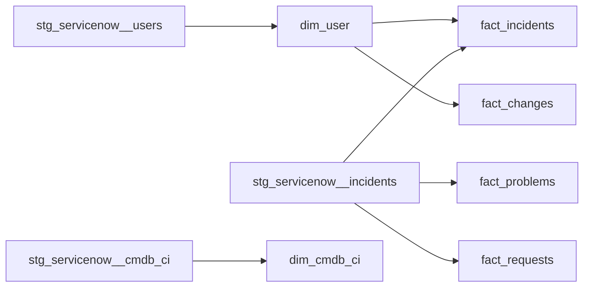
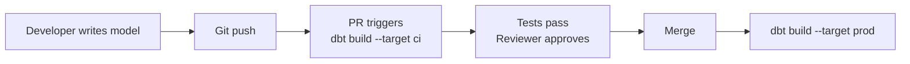
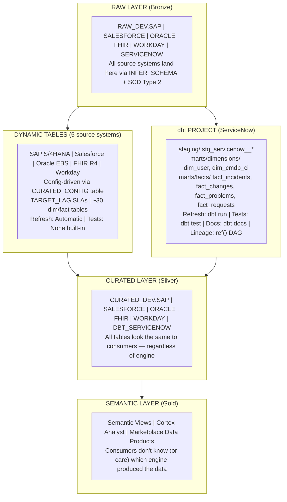
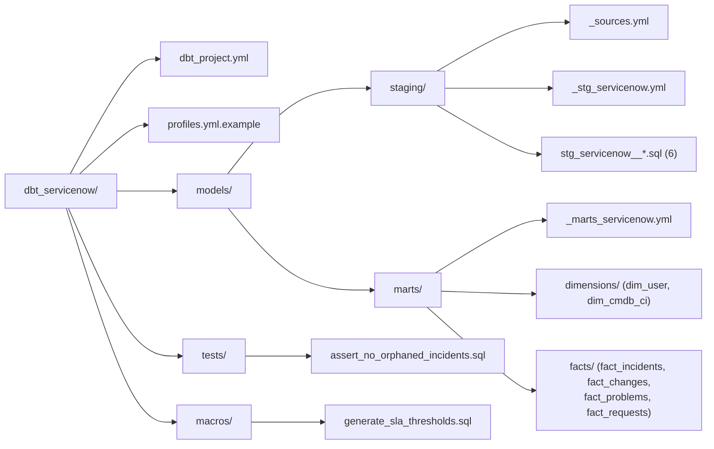
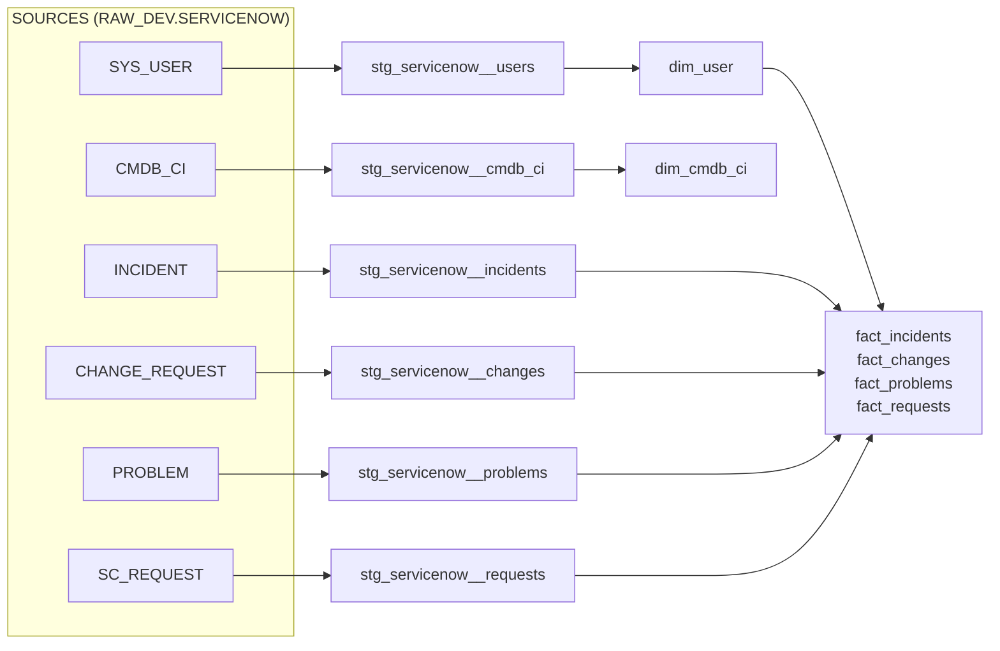

# dbt vs Dynamic Tables: Transformation Strategies in the Data Cloud Architecture

> **When to use which, why both can coexist, and how this demo proves it.**

---

## Overview

The DCA Full Stack Demo now includes **two transformation engines** working side by side:

| Engine | Manages | Pattern |
|--------|---------|---------|
| **Dynamic Tables** | SAP, Salesforce, Oracle EBS, FHIR, Workday | Snowflake-native, config-driven, zero-orchestration |
| **dbt** | ServiceNow ITSM | Code-first, Git-native, test-driven |

This is intentional. Real enterprises don't pick one tool for everything. Teams that already invested in dbt should keep using it. Teams that want zero-ops simplicity should use Dynamic Tables. The architecture supports both — and this document explains the tradeoffs.

---

## Head-to-Head Comparison

| Capability | dbt | Dynamic Tables |
|------------|-----|----------------|
| **Orchestration** | External (CI/CD, cron, Airflow, dbt Cloud) | Built-in (Snowflake-managed refresh via TARGET_LAG) |
| **Refresh Model** | Push (dbt run triggers materialization) | Pull (Snowflake detects upstream changes) |
| **Freshness SLA** | Manual (dbt source freshness checks) | Declarative (TARGET_LAG = '1 hour') |
| **Testing** | Built-in (not_null, unique, relationships, custom SQL tests) | None built-in (requires external quality checks or DMFs) |
| **Documentation** | Auto-generated (dbt docs serve + catalog) | Table comments only |
| **Lineage** | Full DAG visualization (ref() tracking) | Snowflake ACCESS_HISTORY and OBJECT_DEPENDENCIES |
| **Version Control** | Native (SQL files in Git, PR workflows) | Possible via Git integration, but DDL-based |
| **CI/CD Integration** | Native (dbt build in GitHub Actions, etc.) | Requires SQL execution in pipeline |
| **Incremental Logic** | Explicit (developer writes incremental strategy) | Automatic (Snowflake manages incremental vs full refresh) |
| **Learning Curve** | Moderate (Jinja, ref, YAML configs, profiles) | Low (just SQL + TARGET_LAG) |
| **Operational Overhead** | Medium (scheduler, compute, monitoring) | Minimal (Snowflake manages everything) |
| **Portability** | High (adapters for Snowflake, BigQuery, Redshift, Databricks) | Snowflake-only |
| **Cost Model** | Warehouse credits when dbt run executes | Warehouse credits on refresh (auto-managed) |
| **Ecosystem** | dbt packages (dbt-utils, dbt-expectations, etc.) | Snowflake-native only |

---

## What dbt Brings

### 1. Built-In Testing

dbt's testing framework is its strongest differentiator for data quality. Every model can have schema tests (YAML) and custom SQL tests:

```yaml
# Schema tests — declared in YAML, run via `dbt test`
columns:
  - name: incident_key
    tests:
      - not_null
      - unique
  - name: caller_key
    tests:
      - relationships:
          to: ref('dim_user')
          field: user_key
```

```sql
-- Custom SQL test — assert_no_orphaned_incidents.sql
-- Returns rows that violate the rule (0 rows = pass)
select incident_key, caller_key
from {{ ref('fact_incidents') }} f
left join {{ ref('dim_user') }} u on f.caller_key = u.user_key
where f.caller_key is not null and u.user_key is null
```

**Dynamic Tables have no equivalent.** Quality checks require external tooling, Data Metric Functions (DMFs), or the contract validation pattern used in this demo's `08_contracts.sql`.

### 2. DAG-Based Lineage

dbt's `ref()` function creates an explicit dependency graph:



This DAG is:
- **Visible** via `dbt docs generate && dbt docs serve`
- **Executable** — `dbt build` runs models in dependency order
- **Selectable** — `dbt run --select fact_incidents+` runs a model and everything downstream

### 3. Documentation Generation

`dbt docs` produces a browsable catalog with:
- Model descriptions and column-level documentation
- Lineage graph (interactive)
- Source freshness status
- Test results
- Governance metadata (via `meta` config)

### 4. CI/CD-Native Workflow



This fits naturally into existing engineering workflows. Every model change is reviewed, tested, and deployed through the same Git pipeline as application code.

### 5. Jinja Macros for Reusable Logic

```sql

    case
        when {{ priority_column }} in ('1', '1 - Critical')
            and {{ minutes_column }} > 240 then true
        ...
    end

```

Macros allow business logic (like SLA thresholds) to be defined once and reused across models. Dynamic Tables require copy-pasting SQL or using stored procedures.

### 6. Cross-Warehouse Portability

dbt runs on Snowflake, BigQuery, Redshift, Databricks, and more. Organizations with multi-cloud or multi-warehouse strategies can use the same transformation layer everywhere. Dynamic Tables are Snowflake-exclusive.

---

## What Dynamic Tables Bring

### 1. Zero-Orchestration

No scheduler. No CI/CD pipeline for refresh. No monitoring of job queues. You write:

```sql
CREATE DYNAMIC TABLE dim_customer
    TARGET_LAG = '1 hour'
    WAREHOUSE = TRANSFORM_WH
AS SELECT ... FROM raw.customers;
```

Snowflake handles when and how to refresh. This is a fundamentally different operational model — there's nothing to break, nothing to schedule, nothing to monitor (beyond the table itself).

### 2. Declarative Freshness SLAs

`TARGET_LAG` is a first-class SLA primitive:

| Table | TARGET_LAG | Meaning |
|-------|-----------|---------|
| FACT_INCIDENTS | 15 minutes | Near-real-time incident tracking |
| DIM_CUSTOMER | 1 hour | Hourly customer refresh |
| DIM_PRODUCT | 24 hours | Daily product updates |

dbt requires external scheduling (cron, Airflow, dbt Cloud) to achieve similar SLAs, and freshness is checked after-the-fact rather than guaranteed.

### 3. Automatic Incremental Processing

Dynamic Tables automatically determine whether to do a full refresh or incremental update. No developer intervention. dbt requires explicit incremental model configuration:

```sql
-- dbt incremental model (developer must write this logic)
{{ config(materialized='incremental', unique_key='id') }}
select * from {{ source('raw', 'events') }}

    where updated_at > (select max(updated_at) from {{ this }})

```

### 4. Simpler Operational Footprint

| Concern | Dynamic Tables | dbt |
|---------|---------------|-----|
| Scheduler | None needed | Airflow / dbt Cloud / cron |
| Compute | Auto-managed | Must size warehouses for dbt runs |
| Monitoring | `DYNAMIC_TABLE_REFRESH_HISTORY()` | dbt Cloud / custom dashboards |
| Failure recovery | Automatic retry | Manual re-run or alerting |

### 5. Deep Snowflake Integration

Dynamic Tables natively integrate with Snowflake's:
- Micro-partitioning and query optimization
- Time Travel and Fail-safe
- Object-level governance tags
- ACCESS_HISTORY lineage

---

## When to Use Which

**Use dbt when:**
- Team already has dbt expertise and existing dbt projects
- Heavy testing requirements (regulatory, contractual)
- Multi-warehouse strategy (Snowflake + BigQuery, etc.)
- Complex business logic that benefits from version-controlled Jinja macros
- CI/CD-driven deployment is already established
- Auto-generated documentation and lineage are high priority
- Source freshness checks and data quality gates in pipeline

**Use Dynamic Tables when:**
- Team wants minimal operational overhead
- Near-real-time freshness SLAs (TARGET_LAG < 1 hour)
- Simple pass-through or light transformations
- Team is Snowflake-native and prefers fewer tools
- No existing scheduler infrastructure
- Rapid prototyping (just write SQL)
- Dozens of similar tables that can be config-driven

---

## The Hybrid Architecture (This Demo)

This demo proves that dbt and Dynamic Tables coexist cleanly. Here's how:



### Key Design Principle

**The consumer doesn't care which engine produced the data.** Semantic Views, Cortex Analyst, and Marketplace data products work identically whether the underlying table is a Dynamic Table or a dbt-materialized table. The transformation engine is a producer concern, not a consumer concern.

---

## The dbt ServiceNow Pipeline in This Demo

### Project Structure



### Running the Pipeline

```bash
cd dbt_servicenow

# Install dependencies (if using packages)
dbt deps

# Run all models (staging views + mart tables)
dbt run

# Run tests (schema + custom)
dbt test

# Build = run + test in dependency order
dbt build

# Generate and serve documentation
dbt docs generate
dbt docs serve

# Check source freshness against SLA targets
dbt source freshness

# Run just the incident pipeline and its upstream
dbt build --select +fact_incidents
```

### DAG Visualization

When you run `dbt docs serve`, you see the full lineage graph:



**6 sources → 6 staging views → 2 dimensions + 4 facts = 12 models**
**23 schema tests + 1 custom test + 7 source freshness checks**

---

## For Teams Already Using dbt

If your organization already has dbt in production, the DCA architecture welcomes it:

1. **Keep your existing dbt projects.** They become domain-specific transformation pipelines within the DCA, writing to the CURATED layer just like Dynamic Tables do.

2. **dbt tests replace (or complement) data contracts.** The `schema.yml` tests in dbt serve the same purpose as the contract validation in `08_contracts.sql`. Teams can choose which enforcement mechanism fits their workflow.

3. **dbt source freshness maps to SLA contracts.** The `freshness` config in `_sources.yml` is functionally equivalent to the SLA monitoring views in the governance layer.

4. **dbt docs integrate with the data marketplace.** The auto-generated catalog provides discovery and documentation that complements the Snowflake-native marketplace listings.

5. **No migration required.** You don't need to convert Dynamic Tables to dbt or vice versa. Each source system can use whichever engine its owning team prefers.

---

## Summary

| Question | Answer |
|----------|--------|
| Can dbt and Dynamic Tables coexist? | Yes — this demo proves it |
| Should I migrate from Dynamic Tables to dbt? | Only if you need dbt's testing, docs, or portability |
| Should I migrate from dbt to Dynamic Tables? | Only if you want zero-ops and Snowflake-native SLAs |
| What does the consumer see? | Identical tables in the CURATED layer — engine-agnostic |
| What should new teams pick? | Depends on existing skills, tooling, and operational preferences |
