# Snowflake DR Failover & Fallback — Customer Walkthrough Agenda

**Meeting Type:** Technical Deep-Dive  
**Audience:** Customer DBA / Platform Engineering Team  
**Prerequisites:** Business Critical Edition (or higher), Failover Groups (FG) configured with replication schedules  
**Estimated Duration:** 75-90 minutes  

---

## Agenda Overview

| # | Topic | Section |
|---|-------|---------|
| 1 | Current State Review & Replication Architecture | Setup |
| 2 | Non-Replicated Objects: Hybrid Tables, Time Travel, Failsafe | Failover |
| 3 | Replication Schedule Behavior During Failover | Failover |
| 4 | Replication Direction Reversal | Failover |
| 5 | Discarding DR Changes for Clean Fallback | Failover |
| 6 | Scheduled Task Behavior During Failover | Failover |
| 7 | Non-Replicated Object Availability After Fallback | Fallback |
| 8 | Replication Schedule Behavior During Fallback | Fallback |
| 9 | Resuming Replication After Fallback | Fallback |
| 10 | Task Recovery & Validation After Fallback | Fallback |
| 11 | SQL Runbook Review | Operational |
| 12 | Action Items & DR Drill Planning | Close |

---

## Agenda Item 1: Current State Review & Replication Architecture

**Objective:** Establish shared understanding of the current FG configuration, replication direction, and object inventory.

### Architecture — Steady State

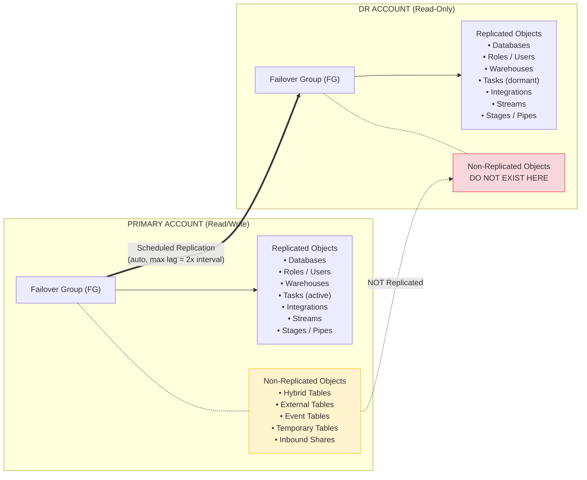

### Discussion Points

- Inventory all Failover Groups: `SHOW FAILOVER GROUPS;`
- Identify replication schedule interval (determines max RPO = 2x interval)
- Catalog non-replicated objects: `SHOW HYBRID TABLES IN ACCOUNT;`

### Non-Replicated Object Reference

| Object Type | Replicated? | DR Impact |
|-------------|-------------|-----------|
| Hybrid Tables | No | Not on DR. No Fail-safe. Limited Time Travel. |
| External Tables | No | Must recreate manually on DR if needed |
| Event Tables | No | Not replicated |
| Temporary Tables | No | Session-scoped, never replicated |
| Temporary Stages | No | Not replicated |
| Inbound Shares | No | Shares FROM providers not replicated |
| Class Instances | No | Except CUSTOM_CLASSIFIER |
| Online Feature Tables | No | Not replicated |

---

## Agenda Item 2: Non-Replicated Objects — What Happens on Failover?

**Customer Question:** *We have Hybrid Tables, Time Travel, and Failsafe that are not being replicated to DR. Would these objects be removed from the current primary once we failover?*

### Answer

**No — nothing is removed or deleted from the original primary.**

After failover:
- The original primary becomes a **read-only secondary**
- All objects (including non-replicated ones like Hybrid Tables) **remain intact** on the former primary
- They are NOT deleted, NOT dropped, NOT modified — simply not writable while in secondary mode
- On DR: non-replicated objects **do not exist** (they were never transferred)

**Time Travel specifics:**
- The `DATA_RETENTION_TIME_IN_DAYS` parameter IS replicated
- Time Travel operates **independently per account**
- Historical Time Travel states that only existed on the original primary are **NOT queryable on DR**
- After failover, DR begins its own retention window from the last refresh snapshot

**Failsafe specifics:**
- 7-day Failsafe operates **per-account**, not transferable
- DR begins its own Failsafe window from the point of each refresh forward

### Non-Replicated Objects Lifecycle

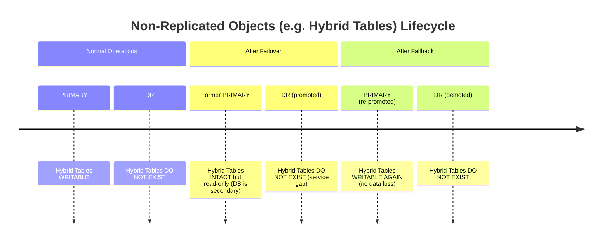

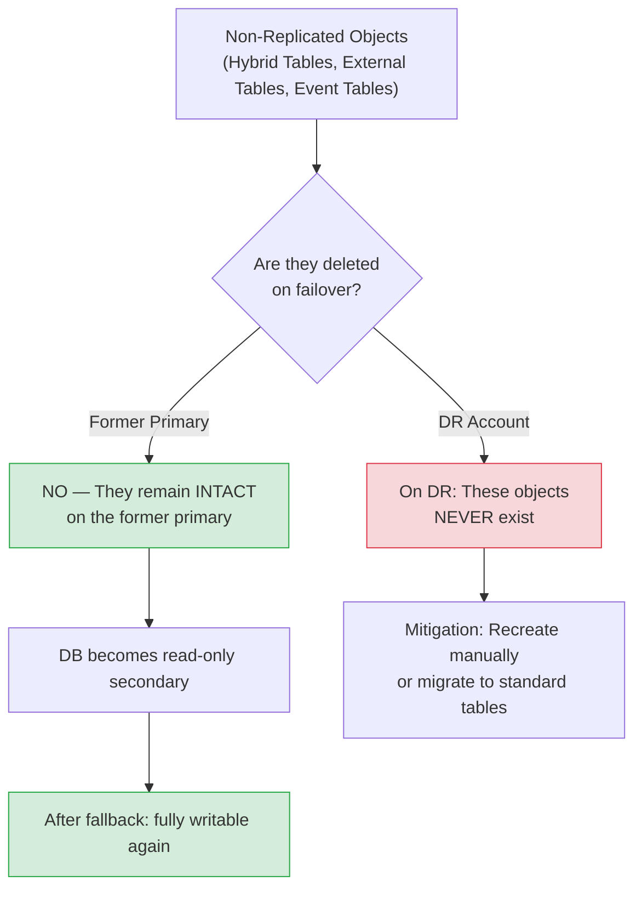

---

## Agenda Item 3: Replication Schedule Behavior During Failover

**Customer Question:** *What would happen to the current replication schedule of FG in primary?*

### Answer

After promoting DR to primary (`ALTER FAILOVER GROUP <fg_name> PRIMARY`):

1. The former primary's FG automatically becomes a **secondary** (read-only)
2. **All scheduled refreshes on ALL secondary failover groups are SUSPENDED automatically**
3. The schedule **definition is preserved** — no recreation needed
4. The FG structure, ALLOWED_ACCOUNTS, and schedule configuration all persist

### Replication Schedule State Machine

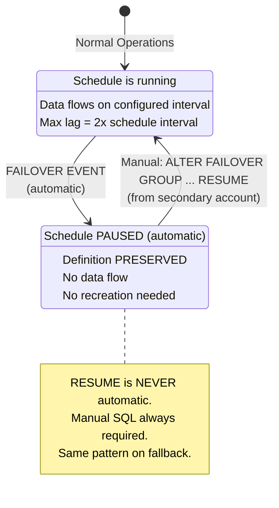

### Verification SQL

```sql
-- Check current FG state and schedule status:
SHOW FAILOVER GROUPS;

-- Check last refresh history:
SELECT * FROM TABLE(INFORMATION_SCHEMA.REPLICATION_GROUP_REFRESH_HISTORY('<fg_name>'))
  ORDER BY PHASE_NAME, START_TIME DESC;
```

---

## Agenda Item 4: Replication Direction Reversal After Failover

**Customer Question:** *Would they start replicating from DR to current primary automatically?*

### Answer

**No — replication direction reversal is NOT automatic.**

After failover completes:
1. The former primary is now a secondary (read-only)
2. Scheduled refreshes are **suspended** on all secondaries
3. You must **manually resume** replication:

```sql
-- Run from the former-primary account (now secondary):
ALTER FAILOVER GROUP <fg_name> RESUME;
```

4. Once resumed, replication flows in the new direction using the **existing schedule definition**

### Failover Data Flow

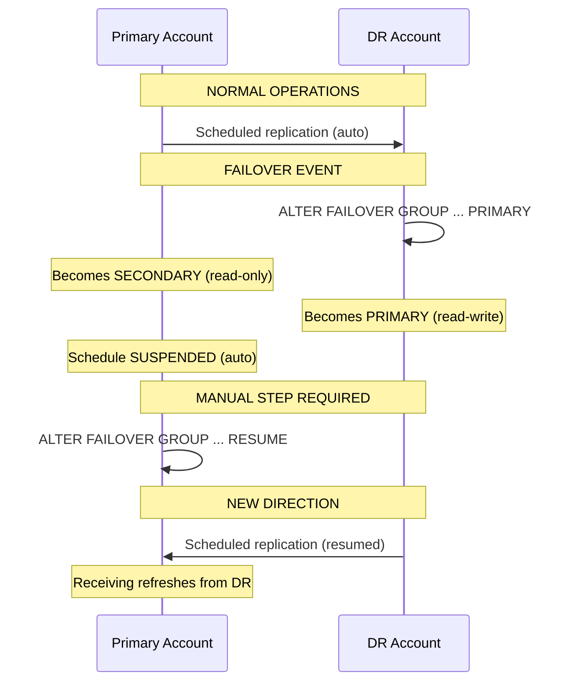

### Post-Failover State

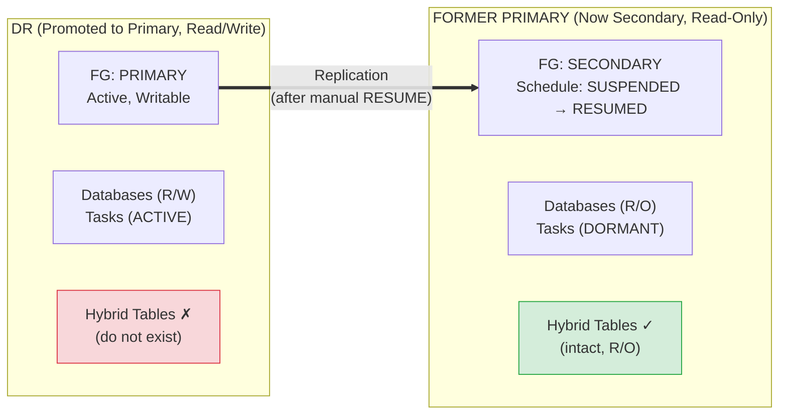

---

## Agenda Item 5: Discarding DR Changes for Clean Fallback

**Customer Question:** *How can we ensure we can discard the changes in DR for the fallback?*

### Answer

There is no native "rollback DR" or "discard changes" command. However, the architecture provides natural strategies:

**Strategy A — Do NOT resume replication (recommended for DR drills)**
- If you never run `ALTER FAILOVER GROUP ... RESUME` on the former primary, it retains its pre-failover state
- Simply failback (re-promote the former primary) — DR changes are effectively discarded

**Strategy B — Time Travel on the former primary**
- The former primary keeps pre-failover data intact (read-only)
- If you failback before any refresh reaches it, you return to exact pre-failover state

**Strategy C — Controlled refresh with validation**
- Resume replication but validate data on the former primary before failback
- Use `REPLICATION_GROUP_REFRESH_HISTORY()` to track refresh status

### Decision Tree

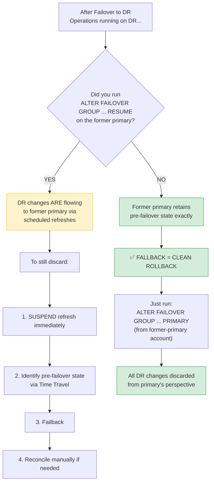

> **Best Practice for DR Drills:** Do NOT resume replication to the former primary. This guarantees a clean fallback with zero data contamination.

---

## Agenda Item 6: Scheduled Task Behavior During Failover

**Customer Question:** *What would happen to the current scheduled tasks in primary?*

### Answer

**Prerequisites:** `ENABLE_STREAM_TASK_REPLICATION = TRUE` must be set at database, FG, or account level.

**Behavior:**
- Tasks ARE replicated to DR (including their definitions, schedules, and privilege grants)
- On the secondary (DR), tasks sit **dormant** — they are NOT scheduled or executing regardless of their state
- **After failover**, tasks on the promoted DR **resume their schedules and begin executing automatically**
- On the former primary (now read-only secondary), tasks **become dormant** — they stop executing

**Caveats:**
- Task graphs fail replication if owned by a different role than the replication role
- Tasks referencing streams: both the task DB and stream DB **must** be in the same Failover Group
- Snowpipe Streaming channels must be reopened manually after failover

### Task Lifecycle State Diagram

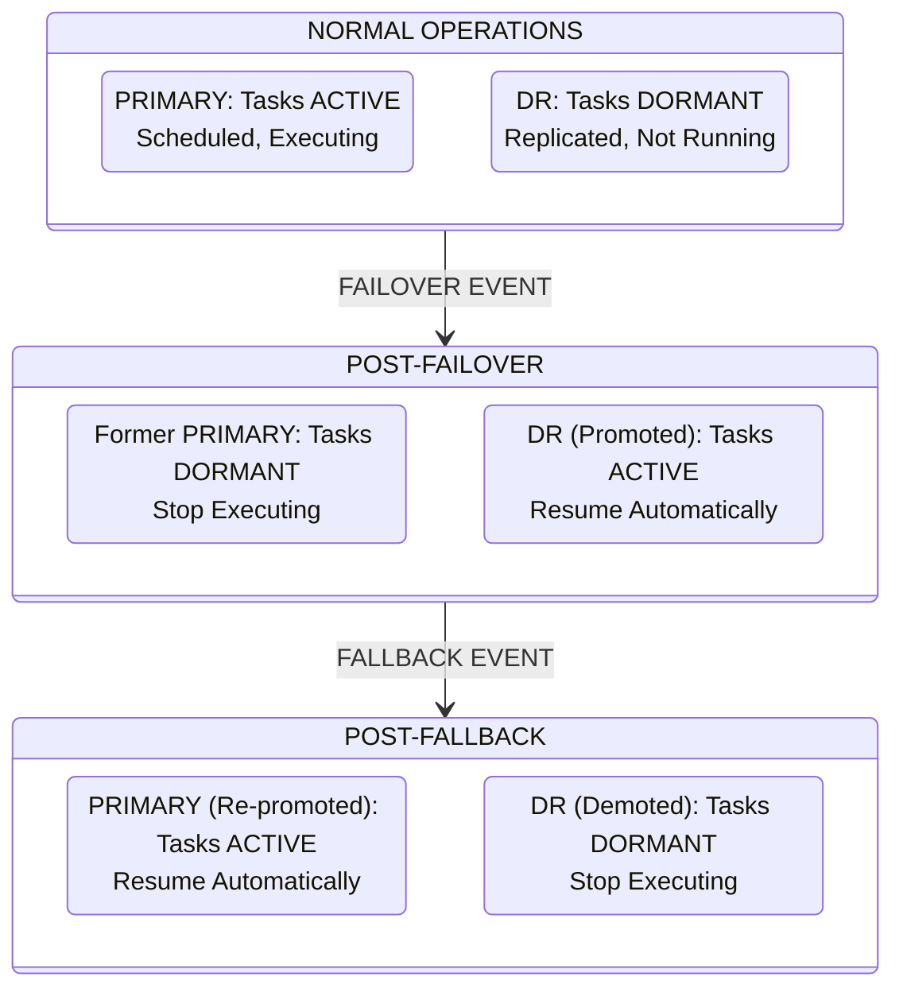

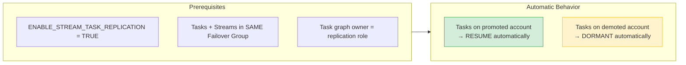

---

## Agenda Item 7: Non-Replicated Object Availability After Fallback

**Customer Question:** *What would happen to the non-replicated objects? Would they still be available?*

### Answer

**Yes.** Non-replicated objects were **never deleted** from the original primary.

- During the failover window, the original primary's databases were in read-only (secondary) mode
- The objects persisted in place — just not writable
- After fallback (re-promoting the original primary), they become **fully writable again**
- No data loss for these objects

**Caveat:** Any data operations performed on DR during the failover window for non-replicated object types will **NOT exist** on the original primary. Those objects are never replicated in either direction. If the customer created Hybrid Tables on DR during the failover window, those will remain on DR (now secondary, read-only) and would need manual migration.

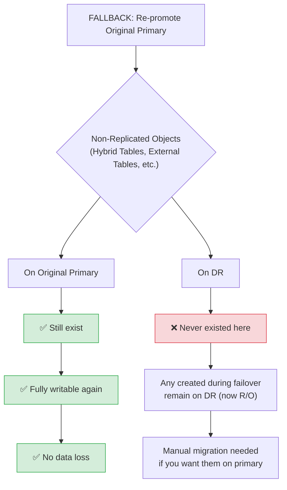

---

## Agenda Item 8: Replication Schedule Behavior During Fallback

**Customer Question:** *What would happen to the current replication schedule of FG?*

### Answer

Identical pattern to failover:

1. The schedule **definition persists** — no recreation needed
2. After fallback, all secondaries' refresh schedules are **SUSPENDED automatically**
3. Manual RESUME required to restart replication

The same state machine from Agenda Item 3 applies. Fallback is mechanically identical to failover — just reversed.

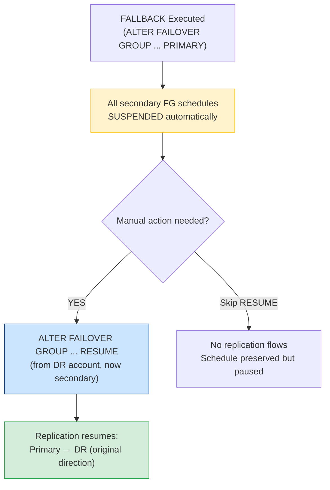

---

## Agenda Item 9: Resuming Replication After Fallback

**Customer Question:** *Would they start replicating from primary to DR automatically or do we need to start the schedule again?*

### Answer

**No — manual action is required. Same pattern as failover.**

```sql
-- After fallback, run from the DR account (now secondary again):
ALTER FAILOVER GROUP <fg_name> RESUME;
```

- The existing schedule and configuration remain intact
- You are simply toggling the SUSPENDED state back to ACTIVE
- No need to recreate the FG, modify ALLOWED_ACCOUNTS, or redefine the schedule
- Replication resumes in the original direction: Primary → DR

### Fallback Complete — Return to Normal

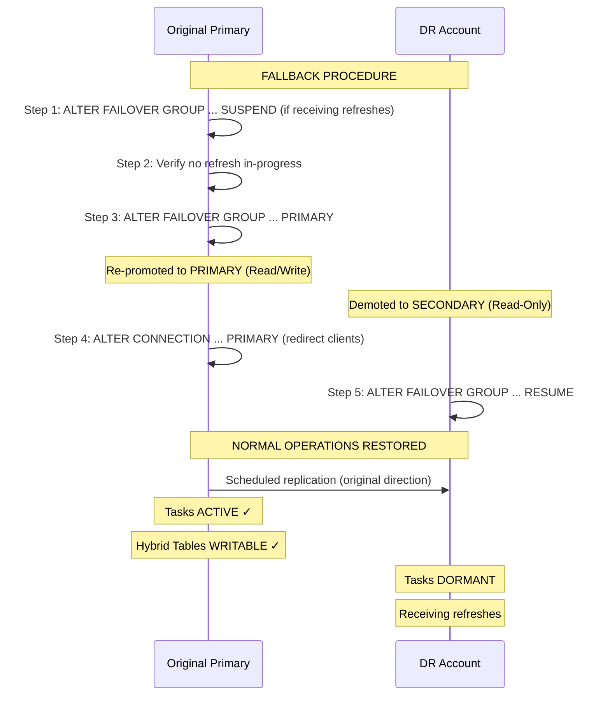

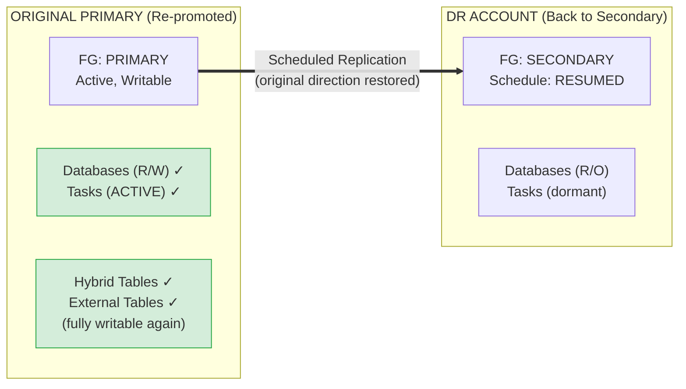

---

## Agenda Item 10: Task Recovery & Validation After Fallback

**Customer Question:** *What would happen to the scheduled tasks before we failed over? How can we ensure they resume their schedules?*

### Answer

After fallback (re-promoting the original primary):

- Tasks on the original primary **resume their schedules and begin executing automatically**
- Tasks on DR (now secondary again) **become dormant**
- No manual task resume is needed in the normal case

**However, validate post-fallback to confirm:**

```sql
-- 1. Verify all tasks are in expected state
SHOW TASKS IN DATABASE <db_name>;
-- Look for: state = 'started' on tasks that should be active

-- 2. Check recent execution history
SELECT SCHEDULED_TIME, NAME, STATE, ERROR_MESSAGE
FROM TABLE(INFORMATION_SCHEMA.TASK_HISTORY())
WHERE DATABASE_NAME = '<db_name>'
ORDER BY SCHEDULED_TIME DESC
LIMIT 50;

-- 3. If any tasks show as SUSPENDED (edge case), manually resume:
ALTER TASK <schema_name>.<task_name> RESUME;

-- 4. Validate task graphs are intact
SELECT *
FROM TABLE(INFORMATION_SCHEMA.CURRENT_TASK_GRAPHS())
WHERE DATABASE_NAME = '<db_name>';

-- 5. Check stream offsets (tasks consuming streams)
SHOW STREAMS IN DATABASE <db_name>;
-- Verify streams have valid offsets and are not stale
```

**Edge case:** If a task was manually suspended on the primary BEFORE failover, it will remain suspended after fallback. Only tasks that were actively running will auto-resume.

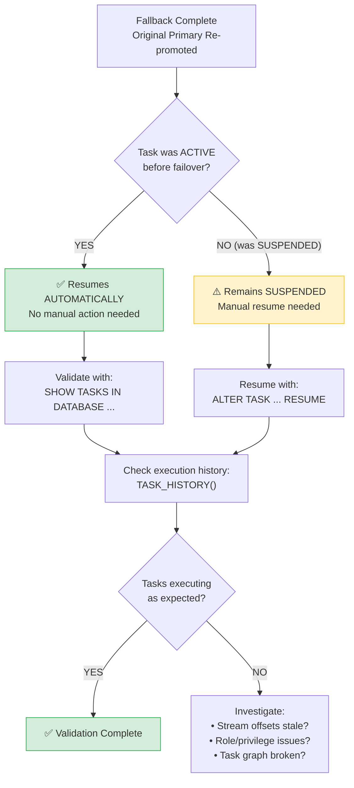

---

## Agenda Item 11: SQL Runbook Review

### Failover Procedure (Primary → DR)

```sql
-- ═══════════════════════════════════════════════════════════════════════════
-- FAILOVER RUNBOOK: Promote DR to Primary
-- ═══════════════════════════════════════════════════════════════════════════

-- PRE-FAILOVER CHECKS (from DR account)
-- ─────────────────────────────────────────────────────────────────────────
-- 1. Verify current replication lag
SELECT PHASE_NAME, START_TIME, END_TIME, 
       DATEDIFF('minute', START_TIME, END_TIME) AS DURATION_MIN
FROM TABLE(INFORMATION_SCHEMA.REPLICATION_GROUP_REFRESH_HISTORY('<fg_name>'))
ORDER BY START_TIME DESC
LIMIT 5;

-- 2. Confirm no refresh currently in-progress
-- (Failover will fail if a refresh is running)

-- EXECUTE FAILOVER (from DR account)
-- ─────────────────────────────────────────────────────────────────────────
-- 3. Suspend scheduled refresh (prevent conflicts)
ALTER FAILOVER GROUP <fg_name> SUSPEND;

-- 4. Promote DR to primary
ALTER FAILOVER GROUP <fg_name> PRIMARY;

-- 5. Redirect client connections
ALTER CONNECTION <connection_name> PRIMARY;

-- POST-FAILOVER VALIDATION (from DR account, now primary)
-- ─────────────────────────────────────────────────────────────────────────
-- 6. Verify FG status
SHOW FAILOVER GROUPS;

-- 7. Verify tasks are running
SHOW TASKS IN DATABASE <db_name>;

-- 8. Verify database is writable
SELECT CURRENT_ACCOUNT(), CURRENT_ROLE(), CURRENT_DATABASE();

-- OPTIONAL: Resume replication to former primary
-- ─────────────────────────────────────────────────────────────────────────
-- 9. (Run from FORMER PRIMARY account)
-- ⚠️  SKIP THIS STEP if you want a clean fallback path
ALTER FAILOVER GROUP <fg_name> RESUME;
```

### Fallback Procedure (DR → Original Primary)

```sql
-- ═══════════════════════════════════════════════════════════════════════════
-- FALLBACK RUNBOOK: Re-promote Original Primary
-- ═══════════════════════════════════════════════════════════════════════════

-- PRE-FALLBACK CHECKS
-- ─────────────────────────────────────────────────────────────────────────
-- 1. (From former-primary account) Suspend refresh to prevent conflicts
ALTER FAILOVER GROUP <fg_name> SUSPEND;

-- 2. Verify no refresh in-progress
SELECT PHASE_NAME, START_TIME, END_TIME
FROM TABLE(INFORMATION_SCHEMA.REPLICATION_GROUP_REFRESH_HISTORY('<fg_name>'))
WHERE END_TIME IS NULL;

-- EXECUTE FALLBACK (from original-primary account)
-- ─────────────────────────────────────────────────────────────────────────
-- 3. Re-promote original primary
ALTER FAILOVER GROUP <fg_name> PRIMARY;

-- 4. Redirect client connections back
ALTER CONNECTION <connection_name> PRIMARY;

-- POST-FALLBACK VALIDATION (from original-primary account)
-- ─────────────────────────────────────────────────────────────────────────
-- 5. Verify FG status
SHOW FAILOVER GROUPS;

-- 6. Verify tasks resumed
SHOW TASKS IN DATABASE <db_name>;
SELECT * FROM TABLE(INFORMATION_SCHEMA.TASK_HISTORY())
  WHERE DATABASE_NAME = '<db_name>'
  ORDER BY SCHEDULED_TIME DESC LIMIT 20;

-- 7. Verify non-replicated objects available
SHOW HYBRID TABLES IN DATABASE <db_name>;

-- 8. Verify database is writable
INSERT INTO <db_name>.<schema>.DR_TEST_TABLE VALUES (CURRENT_TIMESTAMP(), 'fallback_validation');

-- RESUME REPLICATION TO DR
-- ─────────────────────────────────────────────────────────────────────────
-- 9. (Run from DR account, now secondary again)
ALTER FAILOVER GROUP <fg_name> RESUME;

-- 10. Verify replication is flowing
-- (Wait for one schedule interval, then check)
SELECT * FROM TABLE(INFORMATION_SCHEMA.REPLICATION_GROUP_REFRESH_HISTORY('<fg_name>'))
  ORDER BY START_TIME DESC LIMIT 3;
```

### Runbook Flow Diagram

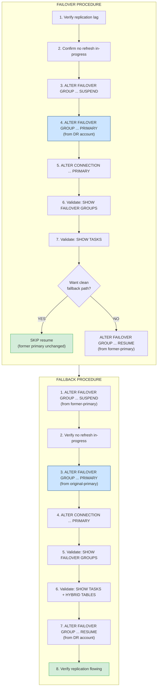

---

## Agenda Item 12: Action Items & DR Drill Planning

### Immediate Action Items

| # | Action | Owner | Priority |
|---|--------|-------|----------|
| 1 | Audit non-replicated objects: `SHOW HYBRID TABLES IN ACCOUNT;` | DBA Team | High |
| 2 | Verify `ENABLE_STREAM_TASK_REPLICATION = TRUE` at account level | DBA Team | High |
| 3 | Confirm all task/stream DBs are in the same Failover Group | DBA Team | High |
| 4 | Build account-specific runbook with actual FG names, connection names | DBA Team | High |
| 5 | Document Hybrid Table mitigation strategy (app-level replay or migration) | Arch Team | Medium |
| 6 | Establish "no-resume" policy for DR drills | Operations | Medium |
| 7 | Configure Client Redirect connection objects if not already done | DBA Team | Medium |
| 8 | Schedule and execute DR drill with acceptance criteria | All | Medium |

### DR Drill Acceptance Criteria (Template)

- [ ] Failover completes without error
- [ ] Tasks resume executing on DR within one schedule interval
- [ ] Application connectivity restored via Client Redirect
- [ ] Data freshness validated (max lag within tolerance)
- [ ] Fallback completes without error
- [ ] Tasks resume on original primary
- [ ] Non-replicated objects (Hybrid Tables) confirmed available post-fallback
- [ ] Replication resumed in original direction
- [ ] End-to-end RTO measured and documented
- [ ] RPO confirmed against replication lag at time of failover

### Key Reminders

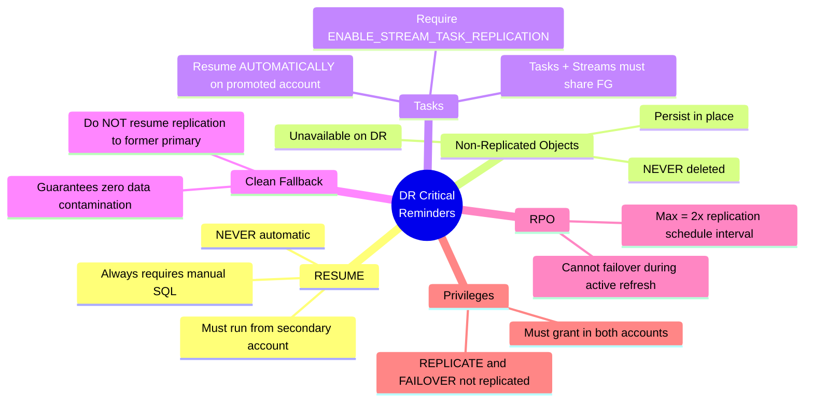

---

*Document prepared for customer technical walkthrough. Based on Snowflake documentation for Business Critical Edition failover groups.*
