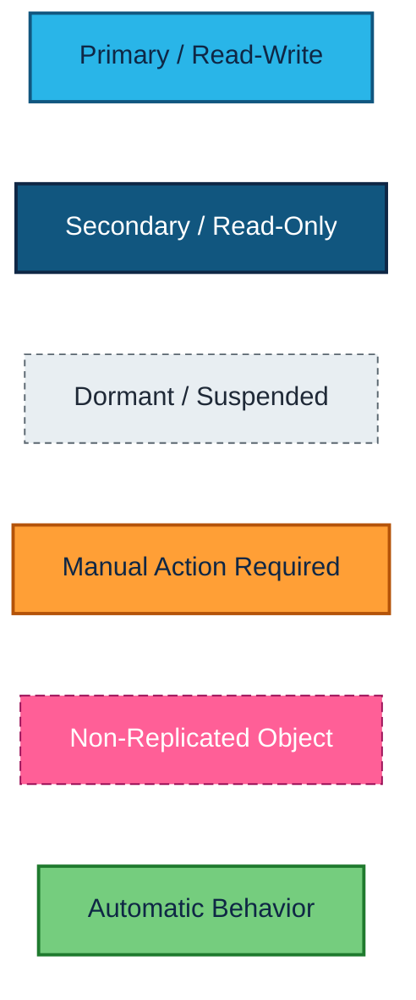
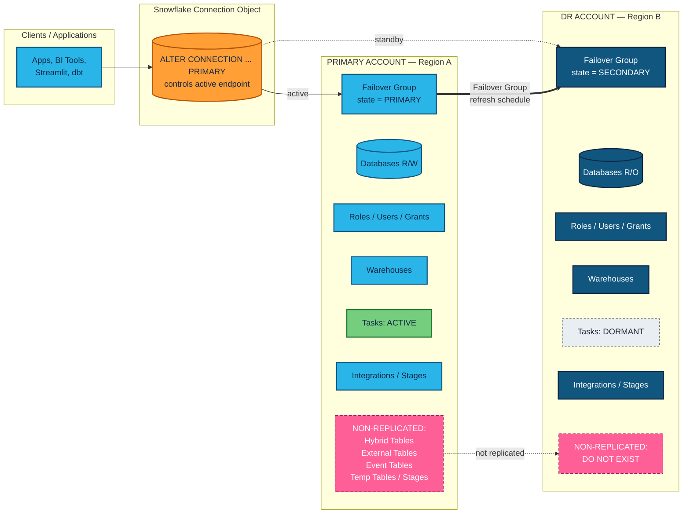
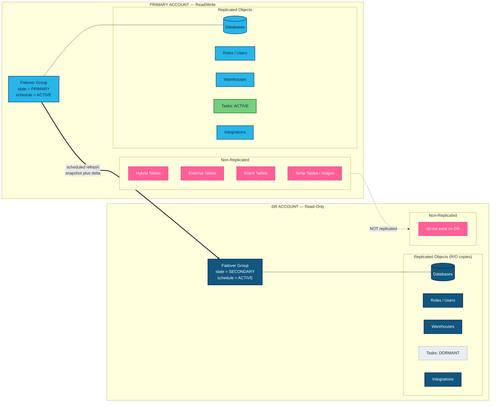
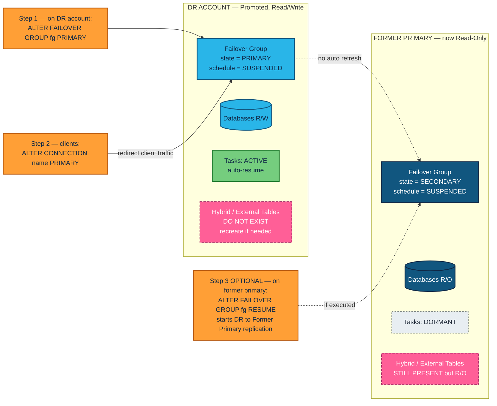
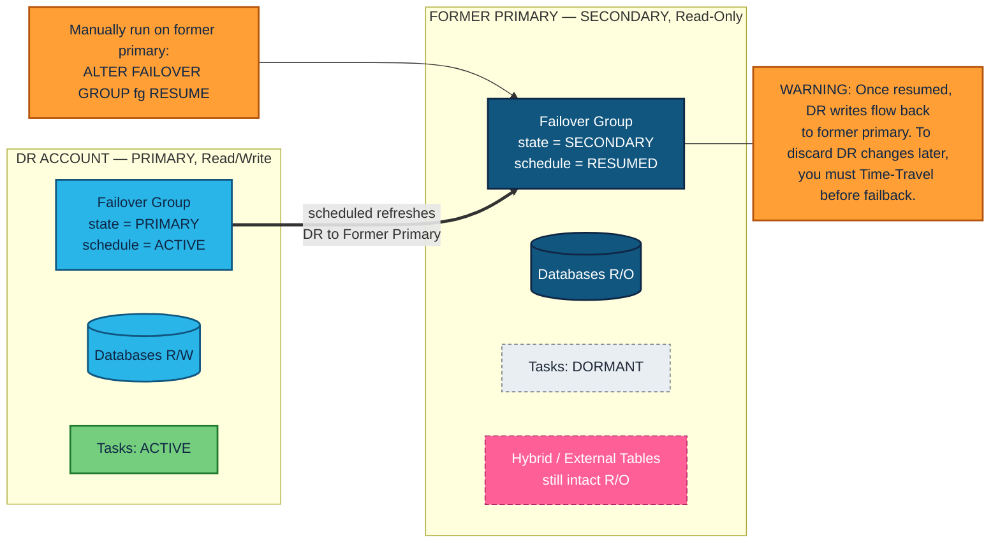
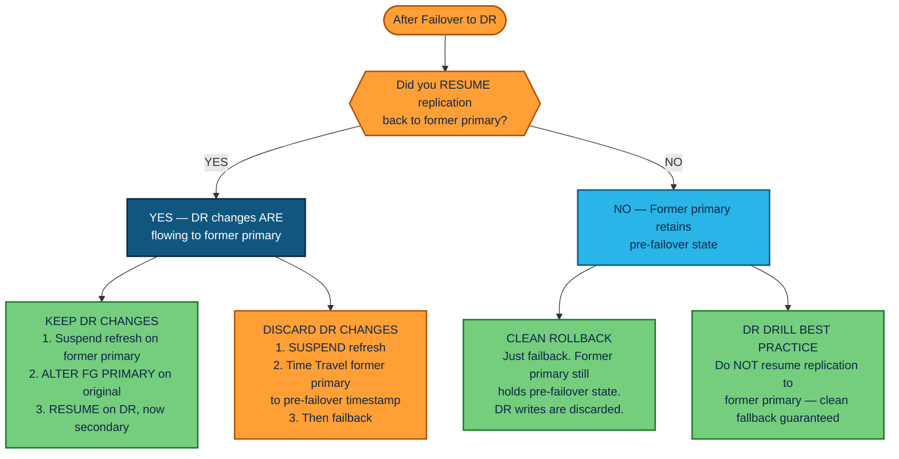
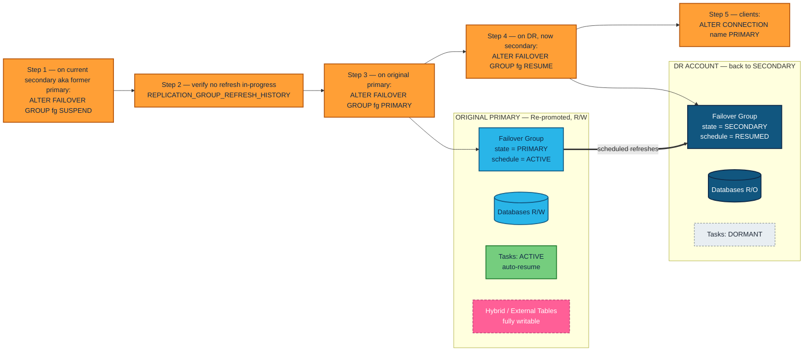
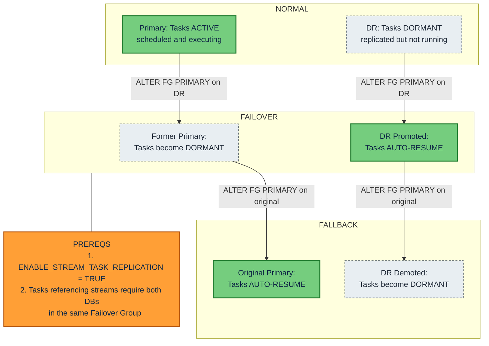
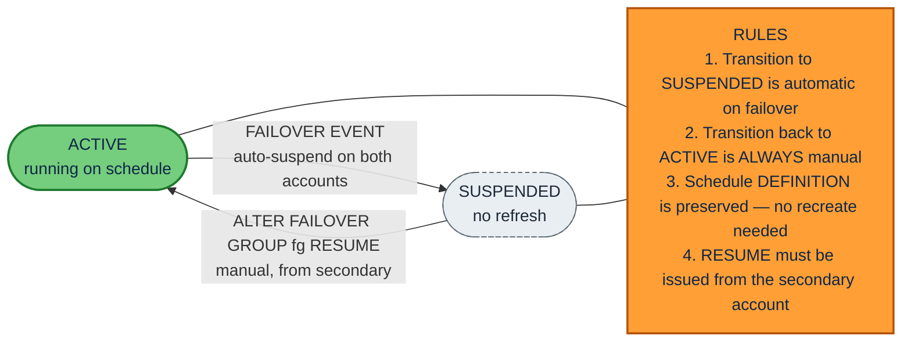
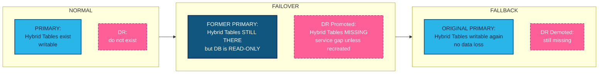

# Snowflake DR: Failover & Fallback

**Prerequisites:** Business Critical Edition (or higher), Failover Groups configured with replication schedules, `ENABLE_STREAM_TASK_REPLICATION = TRUE`.

> Diagrams use **Mermaid** and render natively in GitHub, Cursor, and VS Code (with the Markdown Preview Mermaid Support extension). They also import directly into **Excalidraw** via *Generate → Mermaid to Excalidraw*. A standalone diagrams-only version lives in [`DR_FAILOVER_FALLBACK_DIAGRAMS.md`](./DR_FAILOVER_FALLBACK_DIAGRAMS.md).
>
> The tables below are designed as a **working runbook**. Fill in the blanks (`_______`) and check boxes (`[ ]`) at drill or event time, then archive a copy with the post-event signatures.

---

## Drill / Event Information

| Field | Value |
|---|---|
| Document version | `v_______` |
| Drill or event type | [ ] Tabletop  [ ] Scheduled drill  [ ] Production failover  [ ] Production fallback |
| Scheduled start (UTC) | `_______` |
| Actual start (UTC) | `_______` |
| Actual end (UTC) | `_______` |
| Scope (databases / FGs) | `_______` |
| Customer Change Request # | `_______` |
| Snowflake Support case # (if any) | `_______` |

---

## Customer Environment Profile

| Field | Value |
|---|---|
| Customer / Tenant | `_______` |
| Snowflake Organization | `_______` |
| Snowflake Edition | [ ] Business Critical  [ ] VPS |
| Primary Account Locator | `<PRIMARY_ACCOUNT_LOCATOR>` |
| Primary Account Region | `_______` |
| Primary Account URL | `https://<primary>.snowflakecomputing.com` |
| DR Account Locator | `<DR_ACCOUNT_LOCATOR>` |
| DR Account Region | `_______` |
| DR Account URL | `https://<dr>.snowflakecomputing.com` |
| Failover Group name(s) | `_______` |
| Replication schedule | `USING CRON _______` |
| Replication cadence target | `_______ minutes` |
| Connection object name | `_______` |
| Service role for DR ops | `_______` |
| `ENABLE_STREAM_TASK_REPLICATION` | [ ] TRUE  [ ] FALSE |
| In-scope databases | `_______` |
| Out-of-scope databases / objects | `_______` |

---

## Contact Roster

| Role | Name | Email / Slack | Phone | Backup Contact |
|---|---|---|---|---|
| DR Commander | `_______` | `_______` | `_______` | `_______` |
| Snowflake Operator — Primary | `_______` | `_______` | `_______` | `_______` |
| Snowflake Operator — DR | `_______` | `_______` | `_______` | `_______` |
| Application Owner | `_______` | `_______` | `_______` | `_______` |
| Data Platform / dbt lead | `_______` | `_______` | `_______` | `_______` |
| Security / Compliance | `_______` | `_______` | `_______` | `_______` |
| Snowflake Account Team | `_______` | `_______` | `_______` | `_______` |
| Executive Sponsor | `_______` | `_______` | `_______` | `_______` |

---

## Communications Log

| Time (UTC) | Channel | Sender | Audience | Message Summary |
|---|---|---|---|---|
| `_______` | `_______` | `_______` | `_______` | `_______` |
| `_______` | `_______` | `_______` | `_______` | `_______` |
| `_______` | `_______` | `_______` | `_______` | `_______` |
| `_______` | `_______` | `_______` | `_______` | `_______` |

---

## Legend

All diagrams share one visual vocabulary built on the **Snowflake brand palette** (Snowflake Blue + Star Blue basics; Valencia, Greenery, Vivid Pink accents).

| Style | Meaning | Snowflake Color |
|---|---|---|
| **Snowflake Blue** | Primary / Read-Write | `#29B5E8` (basic) |
| **Star Blue** | Secondary / Read-Only | `#11567F` (basic) |
| **Ice, dashed** | Dormant / Suspended | `#E8EEF2` |
| **Valencia Orange** | Manual action required | `#FF9F36` (accent) |
| **Greenery** | Automatic behavior | `#75CD7E` (accent) |
| **Vivid Pink, dashed** | Non-replicated object | `#FF5F97` (accent) |



---

## Architecture

Two-account topology. Clients reach the active account through a Snowflake **Connection object**, which is what `ALTER CONNECTION <name> PRIMARY` redirects during failover and fallback.



---

## Normal Operations — Steady State

Primary is read/write and the Failover Group's schedule is active. DR holds read-only copies of every replicated object plus dormant copies of any tasks. Anything in the **non-replicated** list never makes it across at all.



---

## Failover: Primary → DR

**What it does:** promotes the DR account to PRIMARY, demotes the former primary to SECONDARY (read-only), and lets you redirect client traffic to the new primary.



### Hybrid Tables, Time Travel, and Failsafe after failover

**Non-replicated objects are not removed from the original primary.** After failover:

- The original primary becomes a **read-only secondary**.
- All objects — including Hybrid Tables — remain **intact** on the former primary; they are simply not writable while the account is in secondary mode.
- On DR these objects **do not exist** (they were never replicated).

**Time Travel:** the `DATA_RETENTION_TIME_IN_DAYS` parameter *is* replicated. Time Travel **history** from the original primary, however, is not transferred — DR starts fresh from each refresh snapshot.

**Failsafe:** operates independently per account. The 7-day window on DR begins from the refresh point forward.

### Replication schedule on the former primary

- The Failover Group on the former primary becomes a **secondary**.
- All scheduled refreshes are **suspended automatically**.
- The schedule **definition is preserved** — no recreation is needed.

### Replicating from DR back to the former primary

Not automatic. To start DR → former-primary replication, manually run from the former-primary account (now secondary):

```sql
ALTER FAILOVER GROUP <fg_name> RESUME;
```

If you skip this step, the former primary is frozen at its pre-failover state and any writes on DR remain isolated to DR. That is sometimes exactly what you want — see [Decision: Discard vs. Keep DR Changes](#decision-discard-vs-keep-dr-changes).

### Scheduled tasks after failover

- Tasks on DR **resume automatically** once DR is promoted.
- Tasks on the former primary **become dormant**.
- Requires `ENABLE_STREAM_TASK_REPLICATION = TRUE`. Tasks that reference streams also require both databases to live in the same Failover Group.

### SQL — Failover procedure

```sql
-- PRE-FAILOVER: Verify replication lag
SELECT *
FROM TABLE(INFORMATION_SCHEMA.REPLICATION_GROUP_REFRESH_HISTORY('<fg_name>'));

-- STEP 1: Suspend refresh on DR (prevent conflicts)
-- Run from DR account:
ALTER FAILOVER GROUP <fg_name> SUSPEND;

-- STEP 2: Promote DR to primary
-- Run from DR account:
ALTER FAILOVER GROUP <fg_name> PRIMARY;

-- STEP 3: Redirect clients
ALTER CONNECTION <connection_name> PRIMARY;

-- STEP 4 (OPTIONAL): Resume replication back to former primary
-- Run from former-primary account:
ALTER FAILOVER GROUP <fg_name> RESUME;

-- POST-FAILOVER: Validate tasks
SHOW TASKS IN DATABASE <db>;
SELECT *
FROM TABLE(INFORMATION_SCHEMA.TASK_HISTORY())
WHERE DATABASE_NAME = '<db>'
ORDER BY SCHEDULED_TIME DESC
LIMIT 50;
```

### Pre-Failover Checklist

| # | Check | Status | Operator | Timestamp (UTC) | Notes |
|---|---|---|---|---|---|
| 1 | Replication lag verified < target RPO | [ ] | `_______` | `_______` | `_______` |
| 2 | No active replication refresh in flight | [ ] | `_______` | `_______` | `_______` |
| 3 | Stakeholders notified per Contact Roster | [ ] | `_______` | `_______` | `_______` |
| 4 | Application freeze / read-only window declared | [ ] | `_______` | `_______` | `_______` |
| 5 | DR account capacity verified (warehouses, credits, network) | [ ] | `_______` | `_______` | `_______` |
| 6 | Non-replicated object mitigation prepared (Hybrid Tables, ext. tables, shares) | [ ] | `_______` | `_______` | `_______` |
| 7 | Audit log capture enabled (query history, role usage, DDL) | [ ] | `_______` | `_______` | `_______` |
| 8 | Rollback decision documented (see Decision Log) | [ ] | `_______` | `_______` | `_______` |
| 9 | DNS / load-balancer / app config for new Connection URL prepared | [ ] | `_______` | `_______` | `_______` |
| 10 | Backout plan reviewed | [ ] | `_______` | `_______` | `_______` |

### Failover Execution Log

Record actual execution. One row per command. Status = `OK` / `FAIL` / `SKIPPED`.

| Step | Action | Account | SQL | Status | Operator | Start (UTC) | End (UTC) | Notes |
|---|---|---|---|---|---|---|---|---|
| 1 | Verify replication lag | DR | `SELECT * FROM TABLE(INFORMATION_SCHEMA.REPLICATION_GROUP_REFRESH_HISTORY('<fg>'));` | `_______` | `_______` | `_______` | `_______` | `_______` |
| 2 | Suspend refresh | DR | `ALTER FAILOVER GROUP <fg> SUSPEND;` | `_______` | `_______` | `_______` | `_______` | `_______` |
| 3 | Promote DR to PRIMARY | DR | `ALTER FAILOVER GROUP <fg> PRIMARY;` | `_______` | `_______` | `_______` | `_______` | `_______` |
| 4 | Redirect Connection object | Either | `ALTER CONNECTION <name> PRIMARY;` | `_______` | `_______` | `_______` | `_______` | `_______` |
| 5 | Validate task state | DR | `SHOW TASKS IN DATABASE <db>;` | `_______` | `_______` | `_______` | `_______` | `_______` |
| 6 (opt) | Resume replication back to former primary | Former Primary | `ALTER FAILOVER GROUP <fg> RESUME;` | `_______` | `_______` | `_______` | `_______` | `_______` |

### Post-Failover Validation

| # | Validation | Status | Operator | Timestamp (UTC) | Notes |
|---|---|---|---|---|---|
| 1 | Connection URL resolves to DR account | [ ] | `_______` | `_______` | `_______` |
| 2 | Smoke-test query succeeds from one BI tool / app | [ ] | `_______` | `_______` | `_______` |
| 3 | Critical tasks executed at next schedule | [ ] | `_______` | `_______` | `_______` |
| 4 | Replicated security objects (roles / grants / network policies) intact | [ ] | `_______` | `_______` | `_______` |
| 5 | Non-replicated objects gap documented or recreated | [ ] | `_______` | `_______` | `_______` |
| 6 | Application write tests passed | [ ] | `_______` | `_______` | `_______` |
| 7 | RPO actual recorded | [ ] | `_______` | `_______` | `_______` |
| 8 | RTO actual recorded | [ ] | `_______` | `_______` | `_______` |
| 9 | Audit / compliance evidence captured | [ ] | `_______` | `_______` | `_______` |

---

## Post-Failover: Replication Resumed (DR → Former Primary)

Only relevant when you *want* to keep changes made on DR. After manually running `ALTER FAILOVER GROUP <fg_name> RESUME;` from the former primary, DR begins replicating back on its normal schedule.



> **Heads-up:** once you resume replication this direction, DR writes start landing on the former primary. To roll back DR changes after that, you'd need to Time-Travel the former primary to a pre-failover timestamp *before* failing back.

---

## Decision: Discard vs. Keep DR Changes

Before you run a fallback, decide whether writes that happened on DR should make it into the original primary.



**DR drill best practice:** do *not* resume replication to the former primary. A clean fallback — with DR writes discarded — is then guaranteed.

### Decision Log

| Decision Point | Choice | Decision Maker | Timestamp (UTC) | Rationale |
|---|---|---|---|---|
| Resume replication DR → Former Primary? | [ ] Yes  [ ] No | `_______` | `_______` | `_______` |
| If Yes: Keep DR writes on fallback? | [ ] Keep  [ ] Discard via Time Travel rollback | `_______` | `_______` | `_______` |
| If discarding: Time Travel target timestamp | `_______` (UTC) | `_______` | `_______` | `_______` |
| If No: Clean-fallback strategy confirmed | [ ] Confirmed | `_______` | `_______` | `_______` |

---

## Fallback: DR → Original Primary

**What it does:** re-promotes the original primary back to PRIMARY and returns DR to its SECONDARY role.



### Non-replicated objects after fallback

They were never deleted. After re-promoting the original primary, Hybrid Tables and the rest of the non-replicated objects are **fully writable again**.

### Replication schedule after fallback

Same pattern as failover: schedule definitions persist, the state on the new secondary moves to SUSPENDED on demotion, and a manual `RESUME` is required to start refreshes flowing in the new primary → secondary direction.

### Replication resume after fallback

Not automatic. Run from the DR account (now secondary again):

```sql
ALTER FAILOVER GROUP <fg_name> RESUME;
```

### Validating tasks after fallback

Tasks resume automatically when the original primary is re-promoted. Verify with:

```sql
SHOW TASKS IN DATABASE <db>;

SELECT *
FROM TABLE(INFORMATION_SCHEMA.TASK_HISTORY())
WHERE DATABASE_NAME = '<db>'
ORDER BY SCHEDULED_TIME DESC
LIMIT 50;
```

### SQL — Fallback procedure

```sql
-- STEP 1: Suspend refresh on former primary (now secondary)
-- Run from former-primary account:
ALTER FAILOVER GROUP <fg_name> SUSPEND;

-- STEP 2: Verify no refresh in-progress
SELECT *
FROM TABLE(INFORMATION_SCHEMA.REPLICATION_GROUP_REFRESH_HISTORY('<fg_name>'));

-- STEP 3: Re-promote original primary
-- Run from original-primary account:
ALTER FAILOVER GROUP <fg_name> PRIMARY;

-- STEP 4: Redirect clients back
ALTER CONNECTION <connection_name> PRIMARY;

-- STEP 5: Resume replication to DR
-- Run from DR account (now secondary again):
ALTER FAILOVER GROUP <fg_name> RESUME;

-- POST-FALLBACK: Validate
SHOW TASKS IN DATABASE <db>;
SHOW HYBRID TABLES IN DATABASE <db>;
```

### Pre-Fallback Checklist

| # | Check | Status | Operator | Timestamp (UTC) | Notes |
|---|---|---|---|---|---|
| 1 | DR has been stable for required dwell time | [ ] | `_______` | `_______` | `_______` |
| 2 | Original primary account healthy and reachable | [ ] | `_______` | `_______` | `_______` |
| 3 | Decision Log finalized (keep vs. discard DR changes) | [ ] | `_______` | `_______` | `_______` |
| 4 | If "Keep DR changes": latest DR → Former Primary refresh complete | [ ] | `_______` | `_______` | `_______` |
| 5 | If "Discard DR changes": Time Travel target verified on former primary | [ ] | `_______` | `_______` | `_______` |
| 6 | Application freeze / read-only window declared | [ ] | `_______` | `_______` | `_______` |
| 7 | Stakeholders notified | [ ] | `_______` | `_______` | `_______` |
| 8 | Non-replicated objects on original primary verified intact | [ ] | `_______` | `_______` | `_______` |

### Fallback Execution Log

| Step | Action | Account | SQL | Status | Operator | Start (UTC) | End (UTC) | Notes |
|---|---|---|---|---|---|---|---|---|
| 1 | Suspend refresh on former primary | Former Primary | `ALTER FAILOVER GROUP <fg> SUSPEND;` | `_______` | `_______` | `_______` | `_______` | `_______` |
| 2 | Verify no refresh in flight | Either | `SELECT * FROM TABLE(INFORMATION_SCHEMA.REPLICATION_GROUP_REFRESH_HISTORY('<fg>'));` | `_______` | `_______` | `_______` | `_______` | `_______` |
| 3 | Re-promote original primary | Original Primary | `ALTER FAILOVER GROUP <fg> PRIMARY;` | `_______` | `_______` | `_______` | `_______` | `_______` |
| 4 | Resume replication on DR (now secondary) | DR | `ALTER FAILOVER GROUP <fg> RESUME;` | `_______` | `_______` | `_______` | `_______` | `_______` |
| 5 | Redirect Connection back | Either | `ALTER CONNECTION <name> PRIMARY;` | `_______` | `_______` | `_______` | `_______` | `_______` |
| 6 | Validate task state | Original Primary | `SHOW TASKS IN DATABASE <db>;` | `_______` | `_______` | `_______` | `_______` | `_______` |
| 7 | Validate Hybrid Tables writable | Original Primary | `SHOW HYBRID TABLES IN DATABASE <db>;` | `_______` | `_______` | `_______` | `_______` | `_______` |

### Post-Fallback Validation

| # | Validation | Status | Operator | Timestamp (UTC) | Notes |
|---|---|---|---|---|---|
| 1 | Connection URL resolves to original primary | [ ] | `_______` | `_______` | `_______` |
| 2 | Smoke-test query succeeds from one BI tool / app | [ ] | `_______` | `_______` | `_______` |
| 3 | Critical tasks executed at next schedule on original primary | [ ] | `_______` | `_______` | `_______` |
| 4 | Hybrid Tables / External Tables writable again | [ ] | `_______` | `_______` | `_______` |
| 5 | Application write tests passed | [ ] | `_______` | `_______` | `_______` |
| 6 | DR account back to SECONDARY, schedule = RESUMED | [ ] | `_______` | `_______` | `_______` |
| 7 | RPO / RTO actuals recorded | [ ] | `_______` | `_______` | `_______` |
| 8 | Audit / compliance evidence captured | [ ] | `_______` | `_______` | `_______` |

---

## Task Lifecycle During Failover and Fallback

Tasks transition automatically as the Failover Group's PRIMARY/SECONDARY role flips. The only manual prerequisite is `ENABLE_STREAM_TASK_REPLICATION = TRUE` at account level.



---

## Replication Schedule State Machine

The Failover Group's refresh schedule has just two states. The transition into SUSPENDED is automatic on failover; the transition back to ACTIVE is **always** manual and must be issued from the secondary account. The schedule **definition** is preserved across failover/fallback — no recreation is required.



> Drawn as a flowchart on purpose: Excalidraw's Mermaid importer does not yet support `stateDiagram-v2`.

---

## Non-Replicated Objects



### Reference

| Object Type           | DR Impact                                              |
|-----------------------|--------------------------------------------------------|
| Hybrid Tables         | Not on DR. No Fail-safe. Limited Time Travel.          |
| External Tables       | Not replicated. Recreate manually on DR.               |
| Event Tables          | Not replicated.                                        |
| Temporary Tables      | Session-scoped, never replicated.                      |
| Temporary Stages      | Not replicated.                                        |
| Inbound Shares        | Not replicated (shares **from** providers).            |
| Class Instances       | Not replicated (except `CUSTOM_CLASSIFIER`).           |
| Online Feature Tables | Not replicated.                                        |

### Customer Inventory (fill in)

Use `SHOW HYBRID TABLES IN ACCOUNT;`, `SHOW EXTERNAL TABLES IN ACCOUNT;`, `SHOW EVENT TABLES IN ACCOUNT;`, `SHOW SHARES;`, and `SHOW CLASS INSTANCES IN ACCOUNT;` to populate. Add rows as needed.

| Object Type | Database | Schema | Object Name | Mitigation Strategy on DR | Owner | Verified (Date) |
|---|---|---|---|---|---|---|
| `_______` | `_______` | `_______` | `_______` | `_______` | `_______` | `_______` |
| `_______` | `_______` | `_______` | `_______` | `_______` | `_______` | `_______` |
| `_______` | `_______` | `_______` | `_______` | `_______` | `_______` | `_______` |
| `_______` | `_______` | `_______` | `_______` | `_______` | `_______` | `_______` |
| `_______` | `_______` | `_______` | `_______` | `_______` | `_______` | `_______` |
| `_______` | `_______` | `_______` | `_______` | `_______` | `_______` | `_______` |

---

## End-to-End Operator Sequence

Full DR lifecycle from the operator's perspective — steady state, failover, optional reverse replication, fallback. Useful for live runbook walk-throughs and tabletop drills.

```mermaid
sequenceDiagram
    autonumber
    actor OPS as DR Operator
    participant PRIM as Primary Account
    participant DR as DR Account
    participant CONN as Connection Object
    participant APP as Client Apps

    Note over PRIM,DR: NORMAL — PRIMARY R/W, DR R/O, FG schedule ACTIVE

    PRIM->>DR: Scheduled FG refresh (auto)
    APP->>CONN: Resolve hostname
    CONN->>PRIM: Route traffic

    Note over OPS: FAILOVER EVENT

    OPS->>DR: ALTER FAILOVER GROUP fg SUSPEND
    OPS->>DR: ALTER FAILOVER GROUP fg PRIMARY
    DR-->>DR: Tasks auto-resume; DB becomes R/W
    PRIM-->>PRIM: Becomes SECONDARY R/O; tasks dormant
    OPS->>CONN: ALTER CONNECTION name PRIMARY
    APP->>CONN: Re-resolve
    CONN->>DR: Route traffic

    opt Resume replication back to former primary
        OPS->>PRIM: ALTER FAILOVER GROUP fg RESUME
        DR->>PRIM: Scheduled refreshes (DR to Former Primary)
    end

    Note over OPS: FALLBACK EVENT

    OPS->>PRIM: ALTER FAILOVER GROUP fg SUSPEND
    OPS->>PRIM: Verify REPLICATION_GROUP_REFRESH_HISTORY idle
    OPS->>PRIM: ALTER FAILOVER GROUP fg PRIMARY
    PRIM-->>PRIM: R/W restored; tasks auto-resume
    DR-->>DR: Becomes SECONDARY; tasks dormant
    OPS->>DR: ALTER FAILOVER GROUP fg RESUME
    OPS->>CONN: ALTER CONNECTION name PRIMARY
    APP->>CONN: Re-resolve
    CONN->>PRIM: Route traffic

    Note over PRIM,DR: STEADY STATE RESTORED
```

---

## RPO / RTO Targets vs. Actuals

| Metric | Target | Failover Drill | Failover Production | Fallback Drill | Fallback Production | Notes |
|---|---|---|---|---|---|---|
| Replication lag (steady-state, p95) | `_______` | `_______` | `_______` | `_______` | `_______` | `_______` |
| RPO — max acceptable data loss | `_______` | `_______` | `_______` | `_______` | `_______` | `_______` |
| RTO — time from declaration to first write on new primary | `_______` | `_______` | `_______` | `_______` | `_______` | `_______` |
| Connection redirect time | `_______` | `_______` | `_______` | `_______` | `_______` | `_______` |
| Time until tasks resume on new primary | `_______` | `_______` | `_______` | `_______` | `_______` | `_______` |
| Time to recreate non-replicated objects on DR | `_______` | `_______` | `_______` | `_______` | `_______` | `_______` |

---

## Action Items

| # | Action | Priority | Owner | Due Date | Status | Notes |
|---|---|---|---|---|---|---|
| 1 | Audit non-replicated objects: `SHOW HYBRID TABLES IN ACCOUNT;` and populate Customer Inventory | High | `_______` | `_______` | [ ] Open  [ ] In Progress  [ ] Done | `_______` |
| 2 | Verify `ENABLE_STREAM_TASK_REPLICATION = TRUE` at account level | High | `_______` | `_______` | [ ] Open  [ ] In Progress  [ ] Done | `_______` |
| 3 | Populate Environment Profile, Contact Roster, and Communications Log templates | High | `_______` | `_______` | [ ] Open  [ ] In Progress  [ ] Done | `_______` |
| 4 | Build operational runbook with account-specific FG / Connection / role names | High | `_______` | `_______` | [ ] Open  [ ] In Progress  [ ] Done | `_______` |
| 5 | Establish "no-resume" policy for DR drills (default: do not RESUME replication back) | Medium | `_______` | `_______` | [ ] Open  [ ] In Progress  [ ] Done | `_______` |
| 6 | Document Hybrid Table / External Table mitigation strategy on DR | Medium | `_______` | `_______` | [ ] Open  [ ] In Progress  [ ] Done | `_______` |
| 7 | Schedule and execute first DR tabletop / drill | Medium | `_______` | `_______` | [ ] Open  [ ] In Progress  [ ] Done | `_______` |
| 8 | Record RPO / RTO baselines and confirm vs. business targets | Medium | `_______` | `_______` | [ ] Open  [ ] In Progress  [ ] Done | `_______` |
| 9 | Quarterly review of this runbook | Low | `_______` | `_______` | [ ] Open  [ ] In Progress  [ ] Done | `_______` |

---

## Sign-Off

Capture signatures after the drill or event. One row per approver.

| Role | Name | Signature | Date | Comments |
|---|---|---|---|---|
| DR Commander | `_______` | `_______` | `_______` | `_______` |
| Snowflake Operator — Lead | `_______` | `_______` | `_______` | `_______` |
| Application Owner | `_______` | `_______` | `_______` | `_______` |
| Security / Compliance | `_______` | `_______` | `_______` | `_______` |
| Snowflake Account Team | `_______` | `_______` | `_______` | `_______` |
| Executive Sponsor | `_______` | `_______` | `_______` | `_______` |

### Post-Event Summary

> Free-form notes: what went well, what surprised the team, lessons learned, action items raised, follow-up timeline.

```
_______________________________________________________________________

_______________________________________________________________________

_______________________________________________________________________

_______________________________________________________________________
```

---

## Exporting Diagrams to Excalidraw

1. Open Excalidraw → **Generate → Mermaid to Excalidraw** (or *File → Import → Mermaid…*).
2. Copy the contents of any ```` ```mermaid ```` block above (just the code between the fences).
3. Paste, click **Insert**, then tweak colors and positions in Excalidraw.
4. Excalidraw's importer fully supports `flowchart` and `sequenceDiagram`; `classDiagram` is supported with minor fidelity loss. `stateDiagram-v2` is **not** supported — that's why the schedule state machine here is drawn as a flowchart.
