# Snowflake DR: Failover & Fallback — Mermaid Diagrams

> Companion to `DR_FAILOVER_FALLBACK.md`. All diagrams use **Mermaid** syntax that imports cleanly into **Excalidraw** (via *File → Import → Mermaid…*).
> Stick to `flowchart`, `sequenceDiagram`, and `classDiagram` blocks — these are the types Excalidraw's `mermaid-to-excalidraw` library renders natively.

**Prerequisites:** Business Critical Edition (or higher), Failover Groups configured with replication schedules, `ENABLE_STREAM_TASK_REPLICATION = TRUE`.

---

## Legend (shared styling)

All diagrams use the **Snowflake brand palette** — *Snowflake Blue* + *Star Blue* as basics, *Valencia*, *Greenery*, and *Vivid Pink* as accents. Copy this `classDef` block into Excalidraw if you want the colors to carry over.

| Style | Meaning | Snowflake Color |
|---|---|---|
| **Snowflake Blue** | Primary / Read-Write | `#29B5E8` (basic) |
| **Star Blue** | Secondary / Read-Only | `#11567F` (basic) |
| **Ice, dashed** | Dormant / Suspended | `#E8EEF2` |
| **Valencia Orange** | Manual action required | `#FF9F36` (accent) |
| **Greenery** | Automatic behavior | `#75CD7E` (accent) |
| **Vivid Pink, dashed** | Non-replicated object | `#FF5F97` (accent) |

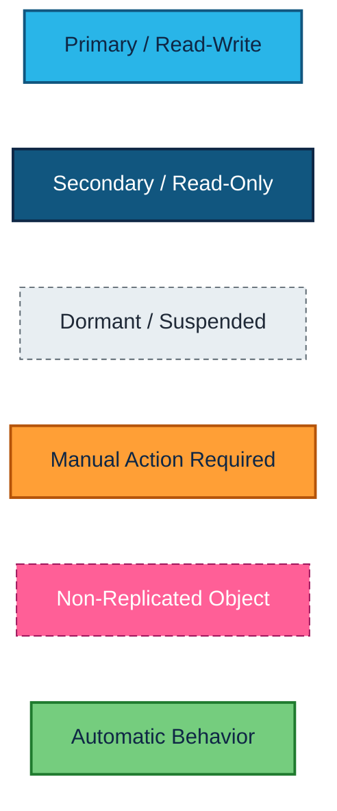

---

## 1. High-Level Architecture (Two-Account DR Topology)

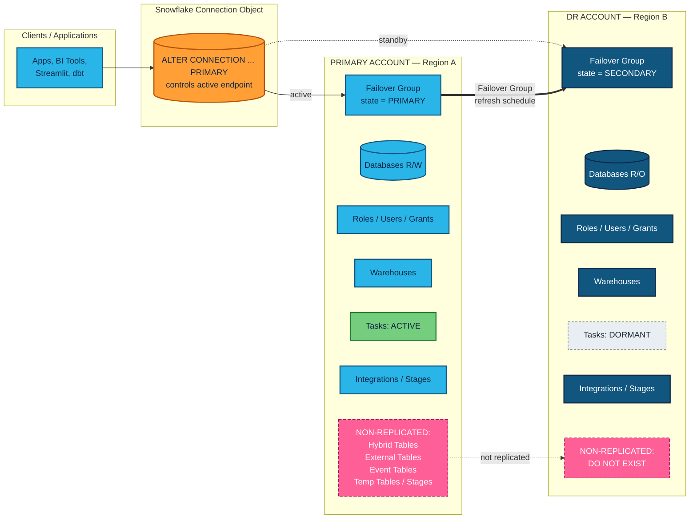

---

## 2. Normal Operations — Steady State

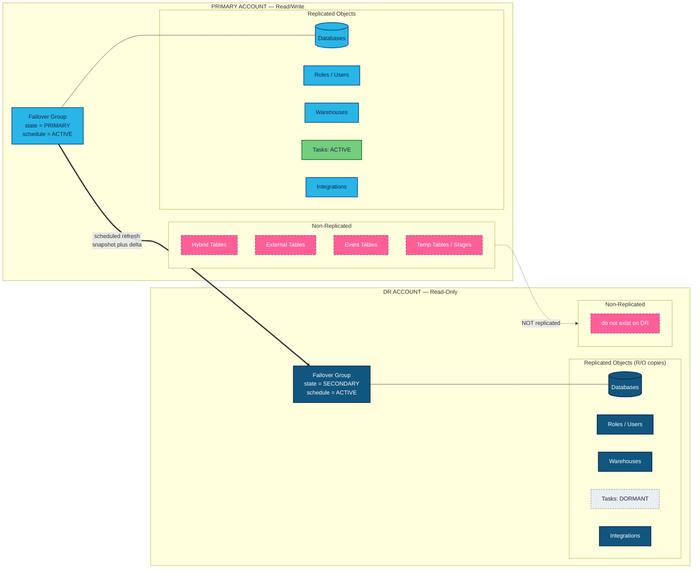

---

## 3. Failover: Primary → DR

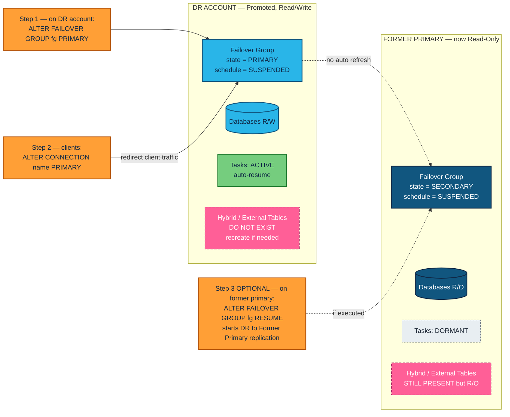

---

## 4. Post-Failover: Replication Resumed (DR → Former Primary)

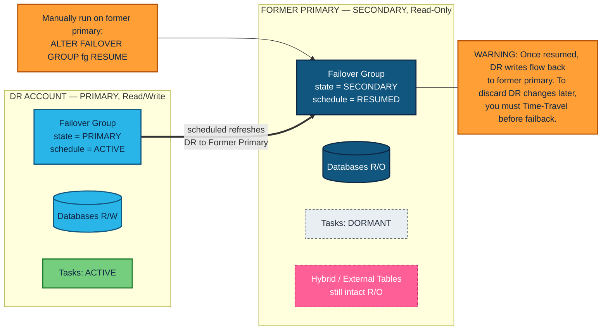

---

## 5. Fallback: DR → Original Primary

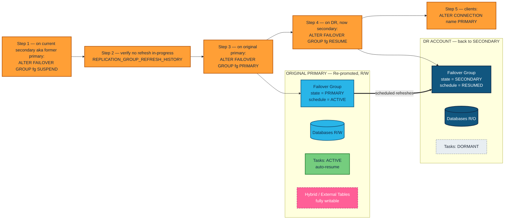

---

## 6. End-to-End Sequence: Failover → Operate on DR → Fallback

Operator-perspective sequence covering the full DR lifecycle. Useful for runbook walk-throughs.

```mermaid
sequenceDiagram
    autonumber
    actor OPS as DR Operator
    participant PRIM as Primary Account
    participant DR as DR Account
    participant CONN as Connection Object
    participant APP as Client Apps

    Note over PRIM,DR: NORMAL — PRIMARY R/W, DR R/O, FG schedule ACTIVE

    PRIM->>DR: Scheduled FG refresh (auto)
    APP->>CONN: Resolve hostname
    CONN->>PRIM: Route traffic

    Note over OPS: FAILOVER EVENT

    OPS->>DR: ALTER FAILOVER GROUP fg SUSPEND
    OPS->>DR: ALTER FAILOVER GROUP fg PRIMARY
    DR-->>DR: Tasks auto-resume; DB becomes R/W
    PRIM-->>PRIM: Becomes SECONDARY R/O; tasks dormant
    OPS->>CONN: ALTER CONNECTION name PRIMARY
    APP->>CONN: Re-resolve
    CONN->>DR: Route traffic

    opt Resume replication back to former primary
        OPS->>PRIM: ALTER FAILOVER GROUP fg RESUME
        DR->>PRIM: Scheduled refreshes (DR to Former Primary)
    end

    Note over OPS: FALLBACK EVENT

    OPS->>PRIM: ALTER FAILOVER GROUP fg SUSPEND
    OPS->>PRIM: Verify REPLICATION_GROUP_REFRESH_HISTORY idle
    OPS->>PRIM: ALTER FAILOVER GROUP fg PRIMARY
    PRIM-->>PRIM: R/W restored; tasks auto-resume
    DR-->>DR: Becomes SECONDARY; tasks dormant
    OPS->>DR: ALTER FAILOVER GROUP fg RESUME
    OPS->>CONN: ALTER CONNECTION name PRIMARY
    APP->>CONN: Re-resolve
    CONN->>PRIM: Route traffic

    Note over PRIM,DR: STEADY STATE RESTORED
```

---

## 7. Task Lifecycle During Failover/Fallback

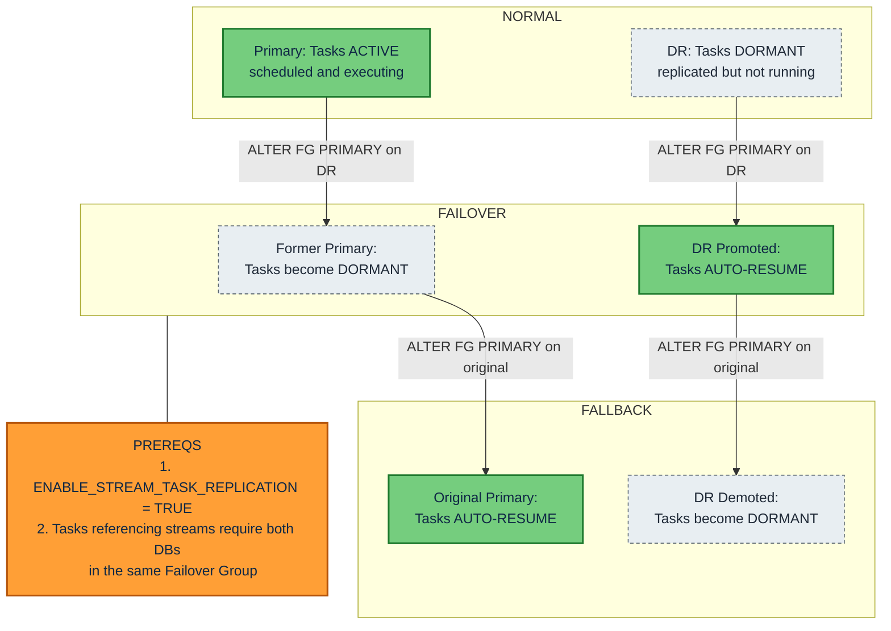

---

## 8. Decision Tree: Discard vs. Keep DR Changes

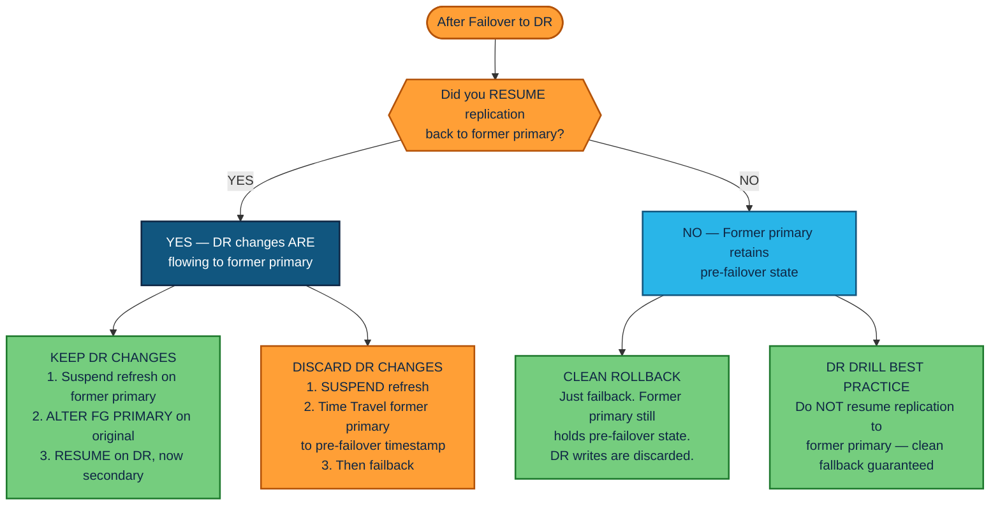

---

## 9. Replication Schedule State Machine

> Excalidraw's Mermaid importer prefers `flowchart` over `stateDiagram-v2`. This is the state machine drawn as a flowchart for portability.

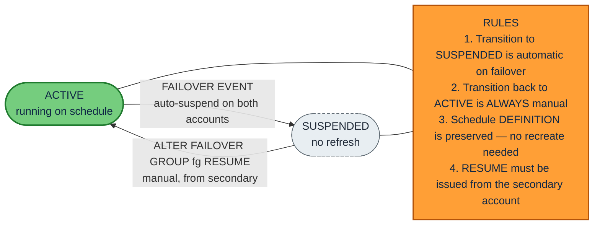

---

## 10. Non-Replicated Objects — Lifecycle Timeline

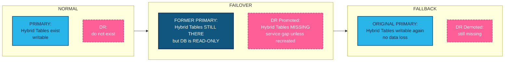

### Non-Replicated Object Reference

| Object Type           | DR Impact                                              |
|-----------------------|--------------------------------------------------------|
| Hybrid Tables         | Not on DR. No Fail-safe. Limited Time Travel.          |
| External Tables       | Not replicated. Recreate manually on DR.               |
| Event Tables          | Not replicated.                                        |
| Temporary Tables      | Session-scoped, never replicated.                      |
| Temporary Stages      | Not replicated.                                        |
| Inbound Shares        | Not replicated (shares **from** providers).            |
| Class Instances       | Not replicated (except `CUSTOM_CLASSIFIER`).           |
| Online Feature Tables | Not replicated.                                        |

---

## 11. Account / Object Class Map (Optional — for Excalidraw class import)

A `classDiagram` view of which object types live where and what state they occupy. Useful as a one-page reference card.

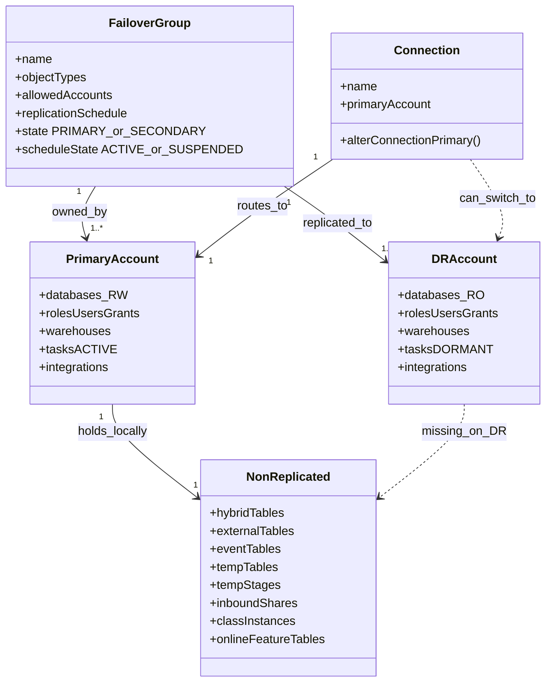

---

## SQL Runbook (reference)

### Failover Procedure

```sql
-- PRE-FAILOVER: Verify replication lag
SELECT *
FROM TABLE(INFORMATION_SCHEMA.REPLICATION_GROUP_REFRESH_HISTORY('<fg_name>'));

-- STEP 1: Suspend refresh on DR (prevent conflicts)
-- Run from DR account:
ALTER FAILOVER GROUP <fg_name> SUSPEND;

-- STEP 2: Promote DR to primary
-- Run from DR account:
ALTER FAILOVER GROUP <fg_name> PRIMARY;

-- STEP 3: Redirect clients
ALTER CONNECTION <connection_name> PRIMARY;

-- STEP 4 (OPTIONAL): Resume replication back to former primary
-- Run from former-primary account:
ALTER FAILOVER GROUP <fg_name> RESUME;

-- POST-FAILOVER: Validate tasks
SHOW TASKS IN DATABASE <db>;
SELECT *
FROM TABLE(INFORMATION_SCHEMA.TASK_HISTORY())
WHERE DATABASE_NAME = '<db>'
ORDER BY SCHEDULED_TIME DESC
LIMIT 50;
```

### Fallback Procedure

```sql
-- STEP 1: Suspend refresh on former primary (now secondary)
-- Run from former-primary account:
ALTER FAILOVER GROUP <fg_name> SUSPEND;

-- STEP 2: Verify no refresh in-progress
SELECT *
FROM TABLE(INFORMATION_SCHEMA.REPLICATION_GROUP_REFRESH_HISTORY('<fg_name>'));

-- STEP 3: Re-promote original primary
-- Run from original-primary account:
ALTER FAILOVER GROUP <fg_name> PRIMARY;

-- STEP 4: Redirect clients back
ALTER CONNECTION <connection_name> PRIMARY;

-- STEP 5: Resume replication to DR
-- Run from DR account (now secondary again):
ALTER FAILOVER GROUP <fg_name> RESUME;

-- POST-FALLBACK: Validate
SHOW TASKS IN DATABASE <db>;
SHOW HYBRID TABLES IN DATABASE <db>;
```

---

## Action Items

| # | Action | Priority |
|---|--------|----------|
| 1 | Audit non-replicated objects: `SHOW HYBRID TABLES IN ACCOUNT;` | High |
| 2 | Verify `ENABLE_STREAM_TASK_REPLICATION = TRUE` at account level | High |
| 3 | Build operational runbook with account-specific FG names | High |
| 4 | Establish "no-resume" policy for DR drills | Medium |
| 5 | Document Hybrid Table mitigation strategy | Medium |
| 6 | Schedule and execute DR drill | Medium |

---

## Importing into Excalidraw

1. Open Excalidraw → **Generate → Mermaid to Excalidraw** (or *File → Import → Mermaid…*).
2. Copy the contents of any ```` ```mermaid ```` block above (just the code between the fences).
3. Paste, click **Insert**, then tweak colors/positions in Excalidraw.
4. Excalidraw's importer fully supports `flowchart` and `sequenceDiagram`. `classDiagram` is supported with minor fidelity loss. State diagrams (`stateDiagram-v2`) are **not** supported — that's why §9 is drawn as a flowchart.
