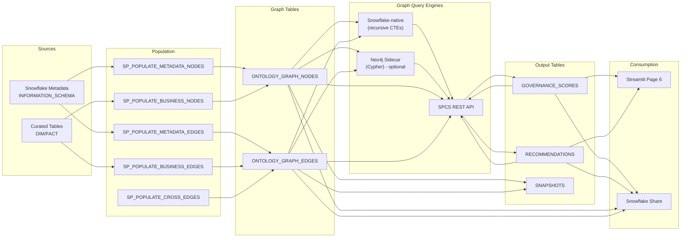

# Ontology Knowledge Graph — Dual-Backend Architecture

> **Graph-based governance analysis** — A knowledge graph that links metadata objects and business entities, queryable through either a Snowflake-native engine (recursive CTEs + window functions, default) or a Neo4j sidecar on Snowpark Container Services (Cypher / property-graph), or both.

## Overview

The Ontology Knowledge Graph operationalizes the philosophical framework described in [ontology/04-dca-ontological-synthesis.md](../ontology/04-dca-ontological-synthesis.md). It materializes the relationships between Snowflake metadata (tables, columns, tags, roles, policies) and business entities (customers, patients, employees, products) as a queryable node/edge graph, with graph inference for governance gap detection, entity resolution, and scoring.

The **graph of record always lives in Snowflake** — two tables, `ONTOLOGY_GRAPH_NODES` and `ONTOLOGY_GRAPH_EDGES`. Both query engines read from those tables. Neo4j syncs into its in-memory representation; the Snowflake-native engine queries the tables directly with recursive CTEs.

### Two interchangeable backends, one API

| Backend | Strengths | When to use |
|---|---|---|
| **Snowflake-native** (default) | Zero sidecar, always live, inherits Snowflake governance/replication/sharing, queries against the data of record | Governance scoring, PII propagation, ownership gaps, entity resolution, paths up to ~10 hops |
| **Neo4j** (optional sidecar) | Sub-100ms shortest path at any depth, GDS-class algorithms (PageRank, Louvain), visual exploration via Neo4j Browser | Deep traversal (5+ hops), real-time exploration, competing against TigerGraph/Neptune |

Select the backend with the `GRAPH_BACKEND` env var (`snowflake` | `neo4j` | `both`) and override per request via `?backend=`. The `/inference/compare` endpoint runs the same query through every loaded backend and returns timings + results side-by-side.

**See [GRAPH_BACKENDS.md](./GRAPH_BACKENDS.md) for the full compare/contrast and decision matrix.**

## Architecture



## Deployment

### Prerequisites
- Scripts 01-10 deployed successfully
- Docker (for building/pushing images to Snowflake registry)
- Curated layer populated with source system data

### Deployment Order

```sql
@sql/11_rai_setup.sql              -- SPCS infrastructure, compute pool, image repo, roles
@sql/12_ontology_graph_tables.sql  -- Node/edge/snapshot/output table DDL
@sql/13_ontology_graph_populate.sql -- Graph population stored procedures
@sql/14_rai_graph_sync.sql         -- Batch graph inference (pure SQL stored procs)
@sql/15_ontology_sharing.sql       -- Sharing configuration
@sql/16_graph_algorithms.sql       -- On-demand graph algorithms (views + procs callable from any Worksheet)
```

After `@sql/16_graph_algorithms.sql`, the Snowflake-native graph engine is fully usable from any Snowsight Worksheet — no SPCS service required:

```sql
-- Top hubs
SELECT * FROM DCA_DEMO.GOVERNANCE.V_GRAPH_DEGREE_CENTRALITY ORDER BY centrality_rank LIMIT 20;

-- Live PHI propagation findings
SELECT * FROM DCA_DEMO.GOVERNANCE.V_GRAPH_PII_PROPAGATION;

-- Live composite governance scores
SELECT * FROM DCA_DEMO.GOVERNANCE.V_GRAPH_GOVERNANCE_SCORES ORDER BY overall_score ASC LIMIT 10;

-- Shortest path between two nodes
CALL DCA_DEMO.GOVERNANCE.SP_GRAPH_SHORTEST_PATH('<from_node_id>', '<to_node_id>', 10);

-- Weakly connected components
CALL DCA_DEMO.GOVERNANCE.SP_GRAPH_CONNECTED_COMPONENTS(15, 25);

-- 3-hop neighborhood
CALL DCA_DEMO.GOVERNANCE.SP_GRAPH_NEIGHBORHOOD('<start_node_id>', 3);
```

The SPCS service is only required if you want the **Neo4j backend** (for deep traversal / GDS algorithms) or the **REST API surface** (for Streamlit / external apps).

### SPCS Service Deployment

```bash
# Build and push container image
cd ontology/spcs
docker build -t ontology-graph-api:latest .
docker tag ontology-graph-api:latest <repo_url>/ontology-graph-api:latest
docker push <repo_url>/ontology-graph-api:latest

# Deploy service (from Snowsight or SQL)
# CREATE SERVICE DCA_DEMO.GOVERNANCE.ONTOLOGY_GRAPH_SERVICE
#   IN COMPUTE POOL ONTOLOGY_COMPUTE_POOL
#   FROM @DCA_DEMO.GOVERNANCE.ONTOLOGY_GRAPH_STAGE
#   SPEC = 'service-spec.yaml';
```

## Graph Schema

### Nodes (ONTOLOGY_GRAPH_NODES)

| Column | Type | Description |
|--------|------|-------------|
| node_id | VARCHAR | Unique node identifier (MD5-based) |
| node_type | VARCHAR | TABLE, COLUMN, TAG, ROLE, POLICY, CUSTOMER, PATIENT, EMPLOYEE, PRODUCT, INCIDENT, ORDER |
| layer | VARCHAR | METADATA, BUSINESS |
| source_system | VARCHAR | SNOWFLAKE, SAP, ORACLE, SALESFORCE, FHIR, WORKDAY, SERVICENOW |
| fqn | VARCHAR | Fully qualified name (metadata) or source ID (business) |
| display_name | VARCHAR | Human-readable name |
| properties | VARIANT | JSON bag of type-specific attributes |

### Edges (ONTOLOGY_GRAPH_EDGES)

| Column | Type | Description |
|--------|------|-------------|
| edge_id | VARCHAR | Unique edge identifier (MD5-based) |
| source_node_id | VARCHAR | Source node reference |
| target_node_id | VARCHAR | Target node reference |
| edge_type | VARCHAR | HAS_COLUMN, TAGGED_WITH, GRANTED_TO, MASKED_BY, LINEAGE_FROM, PURCHASES, TREATED_BY, WORKS_FOR, etc. |
| layer | VARCHAR | METADATA, BUSINESS, CROSS |
| weight | FLOAT | Edge weight/confidence (default 1.0) |

### Edge Types

| Edge Type | Layer | From → To | Meaning |
|-----------|-------|-----------|---------|
| HAS_COLUMN | METADATA | TABLE → COLUMN | Table contains column |
| TAGGED_WITH | METADATA | TABLE/COLUMN → TAG | Tag applied to object |
| GRANTED_TO | METADATA | ROLE → TABLE | Role has access |
| MASKED_BY | METADATA | COLUMN → POLICY | Masking policy applied |
| LINEAGE_FROM | METADATA | TABLE → TABLE | Data flows from source |
| PURCHASES | BUSINESS | CUSTOMER → ORDER | Customer placed order |
| TREATED_BY | BUSINESS | PATIENT → PRACTITIONER | Patient seen by provider |
| WORKS_FOR | BUSINESS | EMPLOYEE → ORG | Employment relationship |
| REPRESENTS | CROSS | BUSINESS_NODE → TABLE_NODE | Business entity stored in table |

## Graph Inference (Dual-Backend)

Inference runs through one or both query engines, chosen by `GRAPH_BACKEND`:

- **Snowflake-native (default).** Recursive CTEs + window functions over `ONTOLOGY_GRAPH_NODES` / `EDGES`. Materialized in `sql/14_rai_graph_sync.sql` (batch) and `sql/16_graph_algorithms.sql` (on-demand views/procs). Always live — reads source tables directly.
- **Neo4j (optional sidecar).** Cypher queries against an in-memory property graph synced from Snowflake at startup. Strengths: deep traversal, GDS-class algorithms, sub-100ms shortest path.

Both backends compute identical results for governance scoring, PII propagation, ownership gaps, and entity resolution. They diverge in performance on shortest-path queries (Neo4j wins at depth) and visual exploration (Neo4j Browser has no Snowflake equivalent). See [GRAPH_BACKENDS.md](./GRAPH_BACKENDS.md) for the full comparison.

### Inference Rules

1. **PII Propagation** — If column A is tagged PII and has LINEAGE_FROM edge to column B, and column B has no PII tag → recommend tagging B
2. **Ownership Gaps** — SEMANTIC-layer tables with no `data_contract_owner` tag edge → recommend assigning owner
3. **Layer Bypass** — Consumer roles with GRANTED_TO edges directly to RAW-layer tables → flag as bypass
4. **Entity Resolution** — Cross-system nodes with similar display_name (Jaccard > 0.7) → suggest as same entity

### Graph Algorithms

Available through both backends (Cypher / recursive CTE) and as Snowflake stored procedures in `sql/16_graph_algorithms.sql`:

| Algorithm | Snowflake-native | Neo4j | Recommended use |
|---|---|---|---|
| **Shortest path** | `SP_GRAPH_SHORTEST_PATH(from, to, hops)` — recursive CTE, ≤10 hops | `shortestPath((a)-[*..15]-(b))` — any depth | Snowflake for governance lineage; Neo4j for 10+ hops |
| **Degree centrality** | `V_GRAPH_DEGREE_CENTRALITY` — single query | `size([(n)-[]-()])` | Snowflake (one query, no sync) |
| **Connected components** | `SP_GRAPH_CONNECTED_COMPONENTS()` — iterative reachability | GDS `wcc.stream` | Neo4j for >100k nodes |
| **k-hop neighborhood** | `SP_GRAPH_NEIGHBORHOOD(start, k)` — recursive CTE | `MATCH (n)-[*..k]-(m)` | Neo4j for deeper, denser |
| **PageRank / Louvain** | Not practical in pure SQL | GDS library | Neo4j (only) |
| **Transitive closure** | Recursive CTE in any view | Cypher variable-depth | Either |

### Governance Scoring

Composite score (0.0 - 1.0) per node:

| Dimension | Weight | Metric |
|-----------|--------|--------|
| Tag coverage | 30% | Proportion of expected tags present |
| Contract coverage | 30% | Active data contract exists |
| Ownership | 25% | Non-SYSADMIN owner assigned |
| Quality monitoring | 15% | Quality checks configured |

## Stored Procedures

| Procedure | Purpose |
|-----------|---------|
| `SP_POPULATE_METADATA_NODES()` | Reads INFORMATION_SCHEMA → creates METADATA-layer nodes |
| `SP_POPULATE_METADATA_EDGES()` | Builds ownership, tagging, access, lineage edges |
| `SP_POPULATE_BUSINESS_NODES()` | Reads curated tables → creates BUSINESS-layer nodes |
| `SP_POPULATE_BUSINESS_EDGES()` | Builds cross-entity relationships |
| `SP_POPULATE_CROSS_EDGES()` | Links business entities to their metadata tables |
| `SP_REFRESH_GRAPH()` | Orchestrator — truncates, repopulates, snapshots |
| `SP_RUN_INFERENCE()` | Executes inference rules, writes results back |
| `SP_APPLY_RECOMMENDATIONS()` | Applies approved recommendations (tags/policies) |

## SPCS REST API

Base URL: `https://<account>.snowflakecomputing.app/ontology-api/`

### Endpoints

Every inference endpoint accepts `?backend=snowflake|neo4j|both` to override the default backend per request.

| Method | Path | Description | Auth |
|--------|------|-------------|------|
| GET | `/health` | Service health + per-backend status | Public |
| GET | `/inference/backends` | List loaded backends and the default | Public |
| GET | `/nodes` | List nodes (query params: layer, node_type, source_system, limit, offset) | ONTOLOGY_CONSUMER |
| GET | `/nodes/{id}` | Get single node | ONTOLOGY_CONSUMER |
| GET | `/nodes/{id}/neighbors` | Connected nodes | ONTOLOGY_CONSUMER |
| GET | `/edges` | List edges (query params: layer, edge_type, limit, offset) | ONTOLOGY_CONSUMER |
| GET | `/edges/path/{from}/{to}?backend=` | Shortest path | ONTOLOGY_CONSUMER |
| GET | `/governance-scores` | All scores (query param: min_score) | ONTOLOGY_CONSUMER |
| GET | `/governance-scores/{id}` | Single node score | ONTOLOGY_CONSUMER |
| GET | `/inference/pii-propagation?backend=` | Live PII propagation findings | ONTOLOGY_CONSUMER |
| GET | `/inference/ownership-gaps?backend=` | Tables without owner/contract/steward | ONTOLOGY_CONSUMER |
| GET | `/inference/entity-resolution?threshold=&backend=` | Cross-system entity match | ONTOLOGY_CONSUMER |
| GET | `/inference/centrality?top_n=&backend=` | Hub detection | ONTOLOGY_CONSUMER |
| GET | `/inference/components?backend=` | Connected components | ONTOLOGY_CONSUMER |
| GET | `/inference/governance-scores/compute?backend=` | Live composite scores | ONTOLOGY_CONSUMER |
| GET | `/inference/compare?endpoint=...` | Run query through every backend; return timings + diff | ONTOLOGY_CONSUMER |
| POST | `/inference/reload?backend=` | Re-sync graph (no-op for Snowflake backend) | ONTOLOGY_ADMIN |

### Example Requests

```bash
# Get all poorly-governed tables
curl "$BASE_URL/governance-scores?min_score=0"

# Get neighbors of a specific node
curl "$BASE_URL/nodes/META_abc123/neighbors"

# Find shortest path — let the service pick the backend
curl "$BASE_URL/edges/path/META_source_table/META_target_table"

# Force the Snowflake-native backend
curl "$BASE_URL/edges/path/META_source_table/META_target_table?backend=snowflake"

# Side-by-side comparison: run PII propagation through every loaded backend
curl "$BASE_URL/inference/compare?endpoint=pii-propagation"
```

## Sharing

### Snowflake Share
- Share name: `ONTOLOGY_GRAPH_DATA_SHARE`
- Contains: Secure views over NODES, EDGES, SCORES, RECOMMENDATIONS
- Grant to consumer accounts as needed

### SPCS Endpoint
- Service role: `ONTOLOGY_GRAPH_SERVICE!ALL_ENDPOINTS_USAGE`
- Granted to: `ONTOLOGY_CONSUMER` role

### Data Product Catalog
- Registered in `GOVERNANCE.DATA_PRODUCT_CATALOG`
- Domain: GOVERNANCE
- Contract: v1.0.0 ACTIVE

## Roles and Access

| Role | Graph Tables | Inference Procedures | SPCS API | Share |
|------|-------------|----------------|----------|-------|
| ONTOLOGY_ADMIN | Full | Execute | All endpoints | Manage |
| ONTOLOGY_CONSUMER | SELECT | - | Read endpoints | Query via share |
| DATA_ADMIN | Full (inherits) | Execute (inherits) | All | Manage |
| DATA_STEWARD | SELECT (inherits) | - | Read | Query |

## Streamlit Visualization

**Page 6: Knowledge Graph** (`ontology/streamlit/pages/6_Knowledge_Graph.py`)

Three tabs:
1. **Graph Explorer** — Interactive node/edge visualization with filters (layer, source system, node type)
2. **Governance Scores** — Color-coded score table with heatmap (red/yellow/green)
3. **Recommendations** — Open recommendations grouped by type with severity badges

## Troubleshooting

| Issue | Cause | Fix |
|-------|-------|-----|
| Empty graph after SP_REFRESH_GRAPH | Curated tables not populated | Run scripts 04 (load data) first |
| Neo4j container not ready | Compute pool suspended or container restarting | Check SPCS service logs: `CALL SYSTEM$GET_SERVICE_LOGS('DCA_DEMO.GOVERNANCE.ONTOLOGY_GRAPH_SERVICE', 0, 'neo4j')` |
| SPCS service unhealthy | Container not started | Check `SHOW SERVICES` and service logs |
| Zero recommendations | No governance gaps exist | Run `ontology/setup/04_governance_gaps.sql` to create test gaps |
| Low node count | Missing source system data | Check which source systems have data in CURATED_DEV |

## File Reference

| File | Purpose |
|------|---------|
| `sql/11_rai_setup.sql` | Infrastructure: SPCS compute pool, image repo, roles |
| `sql/12_ontology_graph_tables.sql` | Table DDL (6 tables) |
| `sql/13_ontology_graph_populate.sql` | Population procedures (6 SPs) |
| `sql/14_rai_graph_sync.sql` | Graph inference procedures (pure SQL) |
| `sql/15_ontology_sharing.sql` | Share + views + catalog registration |
| `ontology/spcs/app/cypher_queries/` | Cypher inference queries |
| `ontology/spcs/Dockerfile` | Container image build |
| `ontology/spcs/service-spec.yaml` | SPCS service spec |
| `ontology/spcs/app/` | FastAPI application (main + routes) |
| `ontology/streamlit/pages/6_Knowledge_Graph.py` | Streamlit visualization |

## References

- [Snowpark Container Services](https://docs.snowflake.com/en/developer-guide/snowpark-container-services/overview)
- [DCA Ontological Synthesis](../ontology/04-dca-ontological-synthesis.md)
- [Governance Documentation](GOVERNANCE.md)
- [Architecture Documentation](ARCHITECTURE.md)
