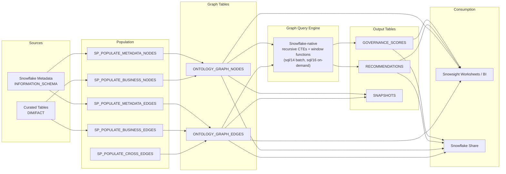

# Ontology Knowledge Graph — Snowflake-Native

> **Graph-based governance analysis** — A knowledge graph that links metadata objects and business entities, queried entirely in-database with recursive CTEs and SQL stored procedures. No sidecar, no container service.

## Overview

The Ontology Knowledge Graph operationalizes the philosophical framework described in [ontology/philosophy/04-dca-ontological-synthesis.md](../ontology/philosophy/04-dca-ontological-synthesis.md). It materializes the relationships between Snowflake metadata (tables, columns, tags, roles, policies) and business entities (customers, patients, employees, products) as a queryable node/edge graph, with graph inference for governance gap detection, entity resolution, and scoring.

The **graph of record lives in Snowflake** — two tables, `ONTOLOGY_GRAPH_NODES` and `ONTOLOGY_GRAPH_EDGES`. All queries run directly against those tables with recursive CTEs and window functions, so the graph is always live against the data of record and inherits Snowflake's governance, replication, and sharing.

> For the broader, multi-source ontology reference architecture (triple store,
> property-graph projections, Graph RAG, and a per-source Cortex Analyst layer),
> see [ONTOLOGY.md](ONTOLOGY.md) and [`ontology/demo/`](../ontology/demo/). This
> document covers the governance-focused node/edge graph used by the core DCA
> demo and the industry demos.

## Architecture



## Deployment

### Prerequisites
- Scripts 01-10 deployed successfully
- Curated layer populated with source system data

### Deployment Order

```sql
@sql/11_rai_setup.sql              -- Roles & grants for the graph (ONTOLOGY_ADMIN / ONTOLOGY_CONSUMER)
@sql/12_ontology_graph_tables.sql  -- Node/edge/snapshot/output table DDL
@sql/13_ontology_graph_populate.sql -- Graph population stored procedures
@sql/14_rai_graph_sync.sql         -- Batch graph inference (pure SQL stored procs)
@sql/15_ontology_sharing.sql       -- Sharing configuration
@sql/16_graph_algorithms.sql       -- On-demand graph algorithms (views + procs callable from any Worksheet)
```

After `@sql/16_graph_algorithms.sql`, the graph is fully usable from any Snowsight Worksheet:

```sql
-- Top hubs
SELECT * FROM DCA_DEMO.GOVERNANCE.V_GRAPH_DEGREE_CENTRALITY ORDER BY centrality_rank LIMIT 20;

-- Live PHI propagation findings
SELECT * FROM DCA_DEMO.GOVERNANCE.V_GRAPH_PII_PROPAGATION;

-- Live composite governance scores
SELECT * FROM DCA_DEMO.GOVERNANCE.V_GRAPH_GOVERNANCE_SCORES ORDER BY overall_score ASC LIMIT 10;

-- Shortest path between two nodes
CALL DCA_DEMO.GOVERNANCE.SP_GRAPH_SHORTEST_PATH('<from_node_id>', '<to_node_id>', 10);

-- Weakly connected components
CALL DCA_DEMO.GOVERNANCE.SP_GRAPH_CONNECTED_COMPONENTS(15, 25);

-- 3-hop neighborhood
CALL DCA_DEMO.GOVERNANCE.SP_GRAPH_NEIGHBORHOOD('<start_node_id>', 3);
```

## Graph Schema

### Nodes (ONTOLOGY_GRAPH_NODES)

| Column | Type | Description |
|--------|------|-------------|
| node_id | VARCHAR | Unique node identifier (MD5-based) |
| node_type | VARCHAR | TABLE, COLUMN, TAG, ROLE, POLICY, CUSTOMER, PATIENT, EMPLOYEE, PRODUCT, INCIDENT, ORDER |
| layer | VARCHAR | METADATA, BUSINESS |
| source_system | VARCHAR | SNOWFLAKE, SAP, ORACLE, SALESFORCE, FHIR, WORKDAY, SERVICENOW |
| fqn | VARCHAR | Fully qualified name (metadata) or source ID (business) |
| display_name | VARCHAR | Human-readable name |
| properties | VARIANT | JSON bag of type-specific attributes |

### Edges (ONTOLOGY_GRAPH_EDGES)

| Column | Type | Description |
|--------|------|-------------|
| edge_id | VARCHAR | Unique edge identifier (MD5-based) |
| source_node_id | VARCHAR | Source node reference |
| target_node_id | VARCHAR | Target node reference |
| edge_type | VARCHAR | HAS_COLUMN, TAGGED_WITH, GRANTED_TO, MASKED_BY, LINEAGE_FROM, PURCHASES, TREATED_BY, WORKS_FOR, etc. |
| layer | VARCHAR | METADATA, BUSINESS, CROSS |
| weight | FLOAT | Edge weight/confidence (default 1.0) |

### Edge Types

| Edge Type | Layer | From → To | Meaning |
|-----------|-------|-----------|---------|
| HAS_COLUMN | METADATA | TABLE → COLUMN | Table contains column |
| TAGGED_WITH | METADATA | TABLE/COLUMN → TAG | Tag applied to object |
| GRANTED_TO | METADATA | ROLE → TABLE | Role has access |
| MASKED_BY | METADATA | COLUMN → POLICY | Masking policy applied |
| LINEAGE_FROM | METADATA | TABLE → TABLE | Data flows from source |
| PURCHASES | BUSINESS | CUSTOMER → ORDER | Customer placed order |
| TREATED_BY | BUSINESS | PATIENT → PRACTITIONER | Patient seen by provider |
| WORKS_FOR | BUSINESS | EMPLOYEE → ORG | Employment relationship |
| REPRESENTS | CROSS | BUSINESS_NODE → TABLE_NODE | Business entity stored in table |

## Graph Inference

Inference runs as recursive CTEs + window functions over `ONTOLOGY_GRAPH_NODES` / `EDGES`, materialized in `sql/14_rai_graph_sync.sql` (batch) and exposed live via `sql/16_graph_algorithms.sql` (on-demand views/procs). Everything reads the source tables directly — there is no separate engine to sync.

### Inference Rules

1. **PII Propagation** — If column A is tagged PII and has a LINEAGE_FROM edge to column B, and column B has no PII tag → recommend tagging B
2. **Ownership Gaps** — SEMANTIC-layer tables with no `data_contract_owner` tag edge → recommend assigning owner
3. **Layer Bypass** — Consumer roles with GRANTED_TO edges directly to RAW-layer tables → flag as bypass
4. **Entity Resolution** — Cross-system nodes with similar display_name (Jaccard > 0.7) → suggest as same entity

### Graph Algorithms

Implemented as Snowflake stored procedures and views in `sql/16_graph_algorithms.sql`:

| Algorithm | Implementation | Notes |
|---|---|---|
| **Shortest path** | `SP_GRAPH_SHORTEST_PATH(from, to, hops)` | BFS via recursive CTE; sub-second to ~10 hops on graphs < 1M edges |
| **Degree centrality** | `V_GRAPH_DEGREE_CENTRALITY` | Single query, no precompute |
| **Connected components** | `SP_GRAPH_CONNECTED_COMPONENTS()` | Iterative reachability; suitable for demo graphs < 50k nodes |
| **k-hop neighborhood** | `SP_GRAPH_NEIGHBORHOOD(start, k)` | Recursive CTE neighborhood expansion |
| **Transitive closure** | Recursive CTE in any view | Variable-depth reachability |

### Governance Scoring

Composite score (0.0 - 1.0) per node:

| Dimension | Weight | Metric |
|-----------|--------|--------|
| Tag coverage | 30% | Proportion of expected tags present |
| Contract coverage | 30% | Active data contract exists |
| Ownership | 25% | Non-SYSADMIN owner assigned |
| Quality monitoring | 15% | Quality checks configured |

## Stored Procedures

| Procedure | Purpose |
|-----------|---------|
| `SP_POPULATE_METADATA_NODES()` | Reads INFORMATION_SCHEMA → creates METADATA-layer nodes |
| `SP_POPULATE_METADATA_EDGES()` | Builds ownership, tagging, access, lineage edges |
| `SP_POPULATE_BUSINESS_NODES()` | Reads curated tables → creates BUSINESS-layer nodes |
| `SP_POPULATE_BUSINESS_EDGES()` | Builds cross-entity relationships |
| `SP_POPULATE_CROSS_EDGES()` | Links business entities to their metadata tables |
| `SP_REFRESH_GRAPH()` | Orchestrator — truncates, repopulates, snapshots |
| `SP_RUN_INFERENCE()` | Executes inference rules, writes results back |
| `SP_APPLY_RECOMMENDATIONS()` | Applies approved recommendations (tags/policies) |

## Sharing

### Snowflake Share
- Share name: `ONTOLOGY_GRAPH_DATA_SHARE`
- Contains: Secure views over NODES, EDGES, SCORES, RECOMMENDATIONS
- Grant to consumer accounts as needed

### Data Product Catalog
- Registered in `GOVERNANCE.DATA_PRODUCT_CATALOG`
- Domain: GOVERNANCE
- Contract: v1.0.0 ACTIVE

## Roles and Access

| Role | Graph Tables | Inference Procedures | Share |
|------|-------------|----------------|-------|
| ONTOLOGY_ADMIN | Full | Execute | Manage |
| ONTOLOGY_CONSUMER | SELECT | - | Query via share |
| DATA_ADMIN | Full (inherits) | Execute (inherits) | Manage |
| DATA_STEWARD | SELECT (inherits) | - | Query |

## Troubleshooting

| Issue | Cause | Fix |
|-------|-------|-----|
| Empty graph after SP_REFRESH_GRAPH | Curated tables not populated | Run scripts 04 (load data) first |
| Zero recommendations | No governance gaps exist | Run `ontology/philosophy/setup/04_governance_gaps.sql` to create test gaps |
| Low node count | Missing source system data | Check which source systems have data in CURATED_DEV |

## File Reference

| File | Purpose |
|------|---------|
| `sql/11_rai_setup.sql` | Roles & grants (ONTOLOGY_ADMIN / ONTOLOGY_CONSUMER) |
| `sql/12_ontology_graph_tables.sql` | Table DDL (6 tables) |
| `sql/13_ontology_graph_populate.sql` | Population procedures (6 SPs) |
| `sql/14_rai_graph_sync.sql` | Graph inference procedures (pure SQL) |
| `sql/15_ontology_sharing.sql` | Share + views + catalog registration |
| `sql/16_graph_algorithms.sql` | On-demand graph algorithms (views + procs) |

## References

- [Ontology Reference Architecture](ONTOLOGY.md)
- [DCA Ontological Synthesis](../ontology/philosophy/04-dca-ontological-synthesis.md)
- [Governance Documentation](GOVERNANCE.md)
- [Architecture Documentation](ARCHITECTURE.md)
