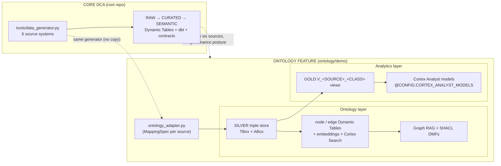

# Ontology Reference Architecture

> **A Snowflake-native knowledge graph + analytics layer over the same six DCA source systems.** Lives in [`ontology/`](../ontology/). Reuses the DCA's `tools/data_generator.py`, projects the relational output into an ontology (triple store + property graph), and exposes it through Graph RAG, SHACL data quality, and per-source Cortex Analyst models.

## Where it lives

```
ontology/
├── demo/                 The runnable reference architecture (numbered SQL 01–12 + Streamlit)
│   ├── ontologies/       ── ONTOLOGY (knowledge) layer ── per-source TBox: <source>.sql + <source>.ttl
│   ├── analytics_models/ ── ANALYTICS layer ── per-source Cortex Analyst models: analytics_<source>.yaml
│   ├── tools/            ontology_adapter.py + generators + mappings/<source>.py
│   └── streamlit_app.py  Ontology Console (source-aware, multi-tab)
├── philosophy/           Conceptual foundations (00–05) + Streamlit foundations app
└── diagrams/             Architecture diagrams
```

This folder is **self-contained except for the data generator**: the generators
walk up to the repo root and import `tools/data_generator.py` (the same one the
core DCA demo uses), so there is no duplicated generator to keep in sync.

> **Note:** an earlier Neo4j sidecar / SPCS REST service and a dual-backend
> visualization were part of this track. They have been removed for now and can
> be re-added later. Everything here is **Snowflake-native** (recursive CTEs,
> Dynamic Tables, Cortex).

## Two layers, one source of truth

The single most important idea: the **ontology** and the **analytics** layers are
deliberately separate. They are generated from the *same* curated `MappingSpec`
per source, but they serve different consumers and live in different
folders/stages.

| | Ontology (knowledge) layer | Analytics (Cortex Analyst) layer |
|---|---|---|
| **Question it answers** | *What is this, and how is it related?* | *What's the number, by dimension?* |
| **Shape** | Triples / graph (classes, properties, edges, SHACL) | Logical tables (dimensions + facts) |
| **Artifacts** | `ontology/demo/ontologies/<source>.{sql,ttl}` | `ontology/demo/analytics_models/analytics_<source>.yaml` |
| **Snowflake home** | `SILVER` triple store + property-graph Dynamic Tables | `GOLD.V_<SOURCE>_<CLASS>` views + `@CONFIG.CORTEX_ANALYST_MODELS` |
| **Consumer** | Graph RAG, traversal, governance, reasoning | Cortex Analyst natural-language BI |

Because both derive from the same `MappingSpec`, every predicate in the ABox has a
matching TBox definition and a matching Gold column — no dangling references.

## How it plugs into the DCA patterns

The core DCA demo lands six enterprise sources and runs them through a medallion
(`RAW → CURATED → SEMANTIC`) with contracts and governance. The ontology
reference architecture **consumes the same synthetic sources** and adds a
knowledge dimension alongside the analytics dimension.



- **Same data, two projections.** The DCA produces governed relational/curated
  data; the ontology feature reprojects identical source records into triples
  (knowledge) and into flattened Gold views (analytics).
- **Same governance philosophy.** The ontology demo carries source-system tags,
  row-access policies, and column masking — mirroring the DCA's
  contract-and-Horizon model, scoped per source.
- **Complementary consumption.** DCA Cortex Analyst answers metric questions over
  Semantic Views; the ontology adds graph traversal / Graph RAG ("what's
  connected to this, and why") that tabular BI can't express.

## The generation pipeline

```
tools/data_generator.py              ontology/demo/tools/mappings/<source>.py
  (relational rows)        ─────────────────────┐  (curated MappingSpec)
                                                 ▼
                         ontology/demo/tools/ontology_adapter.py
                  (emit_triples / derive_tbox — the engine)
                                                 │
        ┌────────────────────────┬──────────────┴───────────────────────────┐
        ▼                        ▼                                           ▼
 generate_ontology_data.py   generate_tbox.py                  generate_semantic_models.py
   data/<prefix>/*.csv        ontologies/<prefix>.{sql,ttl}     analytics_models/analytics_<source>.yaml
      (ABox)                       (TBox)                        (Cortex Analyst — analytics layer)
```

All three generators read the same `MappingSpec`. See
[DATA_GENERATION.md](DATA_GENERATION.md#ontology-adapter-relational--triples)
for the adapter walkthrough.

## Naming conventions (what you see in Cortex Analyst)

| Concern | Convention | Example |
|---|---|---|
| Ontology TBox/ABox | keyed by **namespace prefix** | `ontologies/sfdc.sql`, `SYSTEM=sfdc` |
| Analytics model file | `analytics_<source>.yaml` (readable) | `analytics_salesforce.yaml` |
| Analytics model stage | `@ONT_DEMO.CONFIG.CORTEX_ANALYST_MODELS` | one stage, files at root |
| Logical tables in a model | `<prefix>_<class>` (never a reserved keyword) | `sfdc_account`, `snow_user` |
| Streamlit app stage | `@ONT_DEMO.CONFIG.STREAMLIT_STAGE` | separate from the models |

Logical table names are prefixed so they can never collide with Snowflake
reserved keywords (e.g. `Case` → `sfdc_case`, `User` → `snow_user`), which Cortex
Analyst rejects.

## Running it

See [`ontology/demo/README.md`](../ontology/demo/README.md) for the full Snowflake
load order (small demo, single source, and all-six + Graph RAG + Governance). In
short:

```bash
cd ontology/demo
pip install -r tools/requirements.txt
python tools/generate_ontology_data.py --system all   # ABox CSVs (uses root data_generator.py)
python tools/generate_tbox.py                         # TBox SQL + TTL
python tools/generate_semantic_models.py              # analytics_<source>.yaml
# then snow sql -f 01_… through 12_…  +  snow streamlit deploy
```

## Related

- [`ontology/demo/README.md`](../ontology/demo/README.md) — full demo run order and file reference
- [DATA_GENERATION.md](DATA_GENERATION.md) — the shared data generator + ontology adapter
- [`ontology/philosophy/`](../ontology/philosophy/) — conceptual foundations (object/human ontology, DCA synthesis)
- [GOVERNANCE.md](GOVERNANCE.md) — the DCA governance model the ontology demo mirrors
