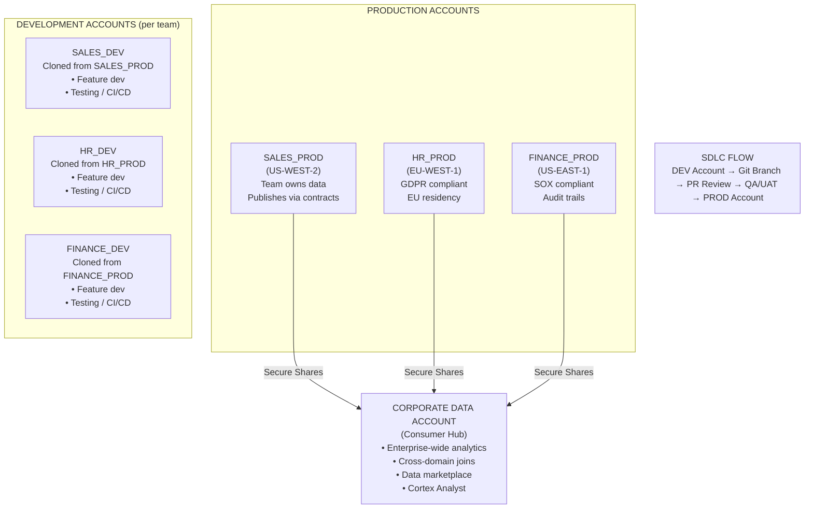
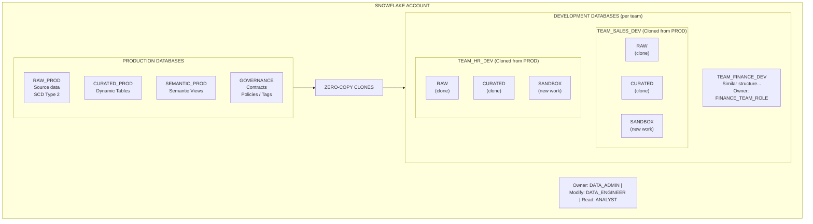
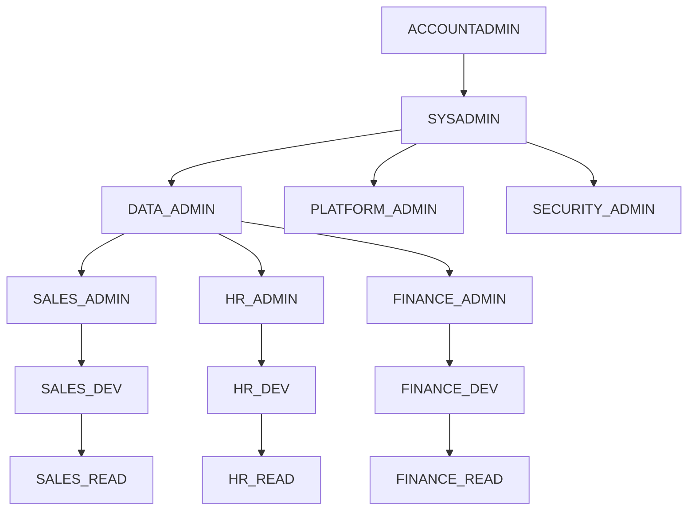
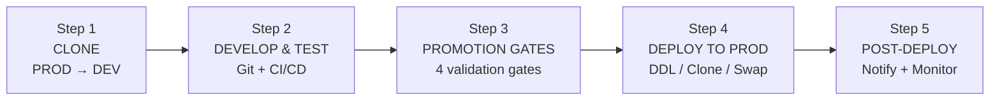
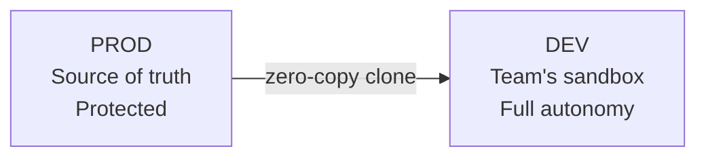
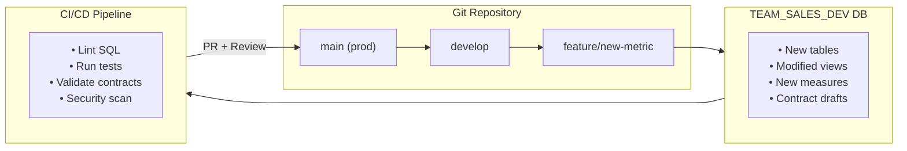
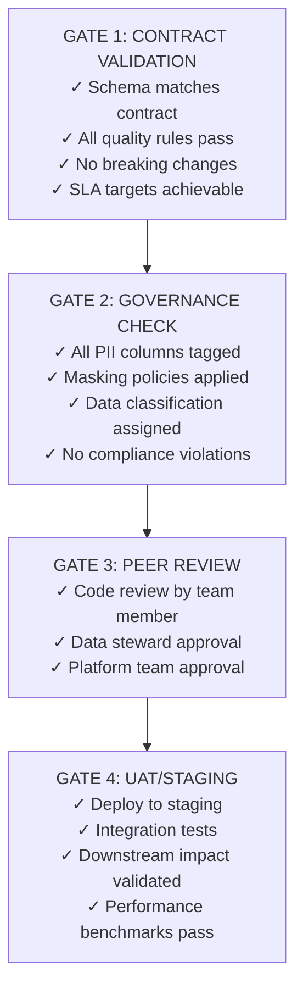
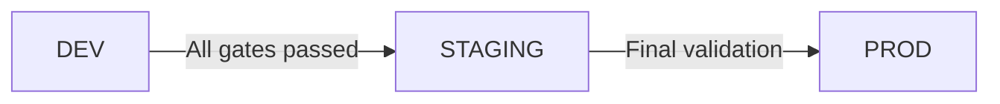
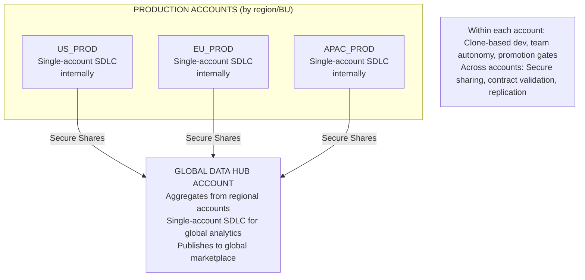

# SDLC & Reference Architectures

> **Deployment Patterns for Enterprise Snowflake** — Whether you operate in a single account or across multiple accounts, this guide provides reference architectures for Software Development Lifecycle (SDLC), team autonomy, and production promotion with appropriate governance.

---

## Table of Contents

1. [Overview](#overview)
2. [Implementation Maturity Journey](#implementation-maturity-journey)
3. [Multi-Account Architecture](#multi-account-architecture)
4. [Single-Account Architecture](#single-account-architecture)
5. [SDLC & CI/CD Patterns](#sdlc--cicd-patterns)
6. [Choosing Your Architecture](#choosing-your-architecture)

---

## Overview

Organizations deploying Snowflake face a fundamental architecture decision: **single account** vs **multiple accounts**. Both approaches are valid, and the choice depends on organizational structure, compliance requirements, and operational maturity.

| Aspect | Multi-Account | Single-Account |
|--------|---------------|----------------|
| **Isolation** | Complete account-level separation | Database/schema-level separation |
| **Governance** | Account-level policies | Role-based policies |
| **Cost Management** | Separate billing per account | Centralized with resource monitors |
| **Complexity** | Higher (shares, replication) | Lower (roles, grants) |
| **Best For** | Regulated industries, M&A, global orgs | Mid-size orgs, unified teams |

---

## Implementation Maturity Journey

Implementing a complete data platform is a journey, not a destination. This section outlines three phases of maturity that organizations typically progress through. Each phase builds on the previous, adding capabilities while maintaining stability.

### Phase 1: Foundation

**Goal:** Establish the core platform with basic governance and manual processes.

**Timeline:** 4-8 weeks

**Focus Areas:**
- Basic infrastructure (databases, warehouses, roles)
- Initial data ingestion pipelines
- Fundamental access controls
- Manual deployment processes

#### What You Build

**Infrastructure**
- RAW_DEV / RAW_PROD databases
- CURATED_DEV / CURATED_PROD
- Standard warehouses (XS-M)
- Staging areas for file loads

**Governance**
- Basic role hierarchy
- DATA_ADMIN, DATA_ENGINEER, ANALYST
- Database-level grants
- Manual access requests

**Data Pipeline**
- File-based ingestion (CSV/JSON)
- Basic transformations
- Simple views
- Scheduled tasks (if needed)

**Deployment**
- SQL scripts in Git
- Manual execution via SnowSQL
- Peer review via PR
- No automated testing

#### Success Criteria

- Data is flowing from sources to RAW layer
- Basic transformations produce CURATED outputs
- Users can query data with appropriate access
- All SQL is version-controlled in Git
- DEV and PROD environments are separated

#### Key Deliverables

1. Role hierarchy document
2. Database/schema naming conventions
3. Git repository structure
4. Basic runbook for deployments
5. At least one end-to-end data pipeline

**Typical Challenges in Phase 1:**
- Scope creep — resist the urge to build everything at once
- Permission complexity — start simple, refine later
- Data quality issues surface — document but don't block on perfection

---

### Phase 2: Automation

**Goal:** Introduce automation, governance policies, and team self-service capabilities.

**Timeline:** 8-16 weeks (after Phase 1)

**Focus Areas:**
- CI/CD pipelines for automated deployment
- Tag-based governance and masking policies
- Dynamic Tables for declarative transformations
- Team-specific development environments (clones)
- Basic data contracts

#### What You Add

**CI/CD Pipeline**
- GitHub Actions / Azure DevOps
- Automated SQL linting
- Automated deployment to DEV
- Manual approval for PROD
- Rollback procedures

**Governance Policies**
- Object tags (PII_TYPE, etc.)
- Tag-based masking policies
- Row access policies
- Compliance tagging (GDPR, HIPAA)
- Audit logging enabled

**Dynamic Tables / dbt**
- Replace scheduled tasks
- Declarative transformations
- TARGET_LAG for SLA management
- dbt for code-first pipelines
- Built-in refresh orchestration

**Team Self-Service**
- Clone provisioning procedure
- Team-owned DEV databases
- Sandbox schemas for experiments
- Self-service data loading

**Data Contracts (Basic)**
- Schema documentation
- Column-level descriptions
- Owner/contact metadata
- Quality expectations (informal)

**Monitoring**
- Query performance monitoring
- Resource usage alerts
- Dynamic Table lag monitoring
- Failed task alerts

#### Success Criteria

- All deployments go through CI/CD pipeline
- PII columns are automatically masked for unauthorized roles
- Teams can provision their own development environments
- Dynamic Tables or dbt handle transformation orchestration
- Governance tags are applied to all production tables
- Alerts fire when data pipelines fail

#### Key Deliverables

1. CI/CD pipeline (GitHub Actions or equivalent)
2. Tag taxonomy and masking policy library
3. Clone provisioning stored procedure
4. Dynamic Table and/or dbt implementation for curated layer
5. Monitoring dashboard (Snowsight or external)
6. Team onboarding runbook

**Typical Challenges in Phase 2:**
- CI/CD pipeline complexity — start with simple validation, add gates incrementally
- Tag proliferation — define a taxonomy early, resist custom tags per team
- Clone sprawl — implement automated cleanup for stale environments

---

### Phase 3: Enterprise Scale

**Goal:** Full contract-driven architecture with semantic layer, marketplace, and cross-domain integration.

**Timeline:** Ongoing (after Phase 2)

**Focus Areas:**
- Formal data contracts with automated validation
- Semantic layer with business measures and dimensions
- Internal data marketplace for discovery
- Cross-account/cross-region capabilities (if needed)
- AI/ML integration (Cortex Analyst, etc.)

#### What You Add

**Data Contracts (Formal)**
- Contract registry database
- Schema contracts (enforced)
- Quality contracts (automated)
- SLA contracts (monitored)
- Breaking change detection
- Consumer notification

**Semantic Layer**
- Native Semantic Views
- Business measures & dimensions
- Cross-domain relationships
- Natural language interface
- Cortex Analyst integration
- Self-service analytics

**Data Marketplace**
- Internal data product catalog
- Domain-specific data products
- Usage tracking & analytics
- Data product SLAs
- Consumer feedback loop

**Cross-Domain/Account**
- Secure data sharing
- Cross-account replication
- Multi-region deployment
- Federated governance
- Contract validation at boundaries

**Advanced Automation**
- Contract validation in CI/CD
- Automated impact analysis
- Self-healing pipelines
- Cost optimization automation

**AI/ML Integration**
- Cortex Analyst for NL→SQL
- ML feature stores
- AI governance (AI_ALLOWED tag)
- Automated data quality ML

#### Success Criteria

- All production data has formal contracts
- Breaking changes are detected before production deployment
- Business users can discover data via internal marketplace
- Analysts can query data using natural language
- Cross-domain analytics are enabled via shared semantic models
- Contract violations trigger automated alerts
- Data quality is continuously monitored and reported

#### Key Deliverables

1. Contract registry with validation procedures
2. Semantic views for all major business domains
3. Internal marketplace with domain data products
4. Cortex Analyst semantic models
5. Contract-aware CI/CD pipeline
6. Data platform health dashboard
7. Self-service documentation portal

**Typical Challenges in Phase 3:**
- Organizational change management — contracts require producer/consumer alignment
- Semantic model complexity — start with one domain, expand gradually
- Cross-account governance — establish clear ownership boundaries

---

### Maturity Assessment

Use this matrix to assess your current state and identify gaps:

| Capability | Phase 1 | Phase 2 | Phase 3 |
|------------|---------|---------|---------|
| **Deployment** | Manual SQL execution | CI/CD with linting | Contract validation gates |
| **Governance** | Database grants | Tag-based masking | Automated compliance |
| **Transformations** | Views + Tasks | Dynamic Tables / dbt | Semantic Views |
| **Team Access** | Shared DEV database | Clone-based isolation | Self-service marketplace |
| **Data Quality** | Ad-hoc checks | Basic monitoring + dbt tests | Contract-enforced SLAs |
| **Discovery** | Documentation | Tagged metadata + dbt docs | Internal marketplace |
| **AI/Analytics** | SQL queries | BI dashboards | Natural language (Cortex) |

---

## Multi-Account Architecture

For organizations requiring **strong isolation** between business units, regions, or environments. This pattern is common in regulated industries (healthcare, finance), global organizations with data residency requirements, and companies with active M&A activity.

### Reference Architecture



#### Diagram Notes: Multi-Account Architecture

**Production Accounts (Top Section)**

The diagram shows three domain-specific production accounts, each deployed in different cloud regions based on data residency requirements:

- **SALES_PROD (US-WEST-2)**: Houses all sales and customer data. This team has full autonomy over their data domain and publishes curated data via secure shares. The US-WEST-2 region is chosen for proximity to sales operations.

- **HR_PROD (EU-WEST-1)**: Contains employee data subject to GDPR. The EU region ensures data never leaves European soil. All employee PII is masked by default, with strict access controls. This account operates independently with its own CISO oversight.

- **FINANCE_PROD (US-EAST-1)**: Financial data with SOX compliance requirements. Complete audit trails are maintained for all data changes. Segregation of duties is enforced at the account level.

**Secure Shares (Middle Arrows)**

Data flows from producer accounts to the corporate hub via Snowflake Secure Data Sharing. Key characteristics:
- **Zero-copy**: No data duplication; consumers query live data
- **Governed**: Shares include only contract-compliant views
- **Real-time**: Changes in producer accounts are immediately visible
- **Secure**: Encryption at rest and in transit, no data leaves Snowflake

**Corporate Data Account (Consumer Hub)**

The central analytics hub receives shares from all producer accounts. This account:
- Validates inbound data against registered contracts
- Creates cross-domain curated views (e.g., joining Sales and Finance data)
- Hosts the semantic layer for business analytics
- Publishes data products to the internal marketplace
- Provides the Cortex Analyst interface for natural language queries

**Development Accounts (Bottom Section)**

Each team has a dedicated development account that mirrors their production environment:
- **Isolated billing**: Development costs are tracked separately
- **Safe experimentation**: Developers cannot accidentally impact production
- **Realistic testing**: Cloned data provides production-like test scenarios
- **Independent CI/CD**: Each team manages their own deployment pipeline

### Multi-Account Benefits

| Benefit | Description | Example |
|---------|-------------|---------|
| **Complete Isolation** | Billing, security, and governance are entirely separate | Finance account has different CISO than HR account |
| **Regional Compliance** | Data residency requirements are naturally enforced | EU employee data never leaves EU-WEST-1 |
| **Blast Radius Containment** | Failures or security incidents are contained | Compromised dev account cannot access prod data |
| **M&A Ready** | Acquired companies can operate independently | New acquisition keeps their account, shares to hub |
| **Independent Scaling** | Each account scales based on its workload | Finance account scales during quarter-end close |

### Multi-Account Challenges

| Challenge | Description | Mitigation |
|-----------|-------------|------------|
| **Operational Complexity** | More accounts to manage, monitor, and secure | Centralized Snowflake Organization management |
| **Cross-Account Sharing** | Requires shares, listings, or replication setup | Standardized share templates and automation |
| **Cost Visibility** | Harder to see unified spend without tooling | Snowflake Organization usage views, FinOps tooling |
| **Schema Drift** | Teams may diverge without strong governance | Centralized contract registry, schema validation |
| **Latency for Global Queries** | Cross-region shares may have latency | Database replication for frequently-joined data |

---

## Single-Account Architecture

For organizations that prefer **centralized management** with **logical separation** via RBAC, ABAC, and Column/Row-Level Security. This pattern is ideal for mid-size organizations, companies with a strong central data platform team, or those prioritizing operational simplicity over hard isolation.

### Reference Architecture



#### Diagram Notes: Single-Account Architecture

**Production Databases (Top Section)**

All production data resides in centrally-managed databases within a single Snowflake account:

- **RAW_PROD**: The landing zone for all source system data. Each source system (SAP, Salesforce, Workday, etc.) has its own schema. Data is stored with SCD Type 2 history, preserving a complete audit trail of all changes. Only the ingestion process can write here; all other access is read-only.

- **CURATED_PROD**: Business-ready transformations implemented as Dynamic Tables or dbt models (depending on team preference). Each domain (Sales, HR, Finance) has its own schema. Dynamic Tables use `TARGET_LAG` for SLA enforcement; dbt models use `dbt build` with schema tests. Cross-domain joins happen here when business logic requires it.

- **SEMANTIC_PROD**: The consumption layer with Semantic Views that define business measures, dimensions, and relationships. This is the primary interface for analysts and BI tools. Cortex Analyst uses these semantic models for natural language queries.

- **GOVERNANCE**: The control plane containing contract definitions, tag taxonomies, masking policies, row access policies, and validation procedures. This database is managed by the platform team and referenced by all other databases.

**Zero-Copy Clones (Middle Arrow)**

The key enabler for team autonomy without account proliferation:

- **Instant provisioning**: Creating a clone takes seconds regardless of data size
- **Zero storage cost**: Clones share underlying storage until data diverges
- **Point-in-time snapshot**: Teams work with a consistent view of production data
- **Full isolation**: Changes in the clone don't affect production (and vice versa)

**Development Databases (Bottom Section)**

Each team receives their own development database with complete autonomy:

- **Cloned schemas**: RAW and CURATED schemas are cloned from production, giving teams realistic test data
- **Sandbox schema**: A new schema where teams create their experimental work
- **Full ownership**: The team's role owns the entire database and can create any object
- **Promotion path**: Validated work moves from SANDBOX → STAGING → PRODUCTION

### Single-Account Benefits

| Benefit | Description | Example |
|---------|-------------|---------|
| **Operational Simplicity** | One account to manage, monitor, and secure | Single pane of glass for all data assets |
| **Unified Cost Management** | All costs in one bill, easy resource monitoring | Resource monitors enforce budget by team |
| **Instant Cloning** | Zero-copy clones enable fast team provisioning | New team has dev environment in seconds |
| **Centralized Governance** | Policies apply uniformly across all data | One masking policy protects all PII columns |
| **Cross-Domain Queries** | No sharing required for cross-domain analytics | Sales can join with Finance data directly |

### Single-Account Challenges

| Challenge | Description | Mitigation |
|-----------|-------------|------------|
| **Blast Radius** | Issues can potentially affect all teams | Strict role separation, resource monitors |
| **Noisy Neighbors** | Large queries can impact other workloads | Dedicated warehouses per team, query tagging |
| **Data Residency** | All data in one region by default | Use database replication for regional copies |
| **Audit Complexity** | Single audit log for all activity | Tag-based filtering, separate audit views per team |

### Access Control Model (RBAC/ABAC/CGAC)

#### Role Hierarchy (RBAC)



#### Attribute-Based Access (ABAC)

**Object Tags**

| Tag | Values |
|-----|--------|
| DATA_CLASSIFICATION | PUBLIC, INTERNAL, CONFIDENTIAL, RESTRICTED |
| PII_TYPE | NONE, INDIRECT, DIRECT, SENSITIVE |
| DATA_DOMAIN | SALES, HR, FINANCE, HEALTHCARE |
| ENVIRONMENT | DEV, QA, UAT, PROD |
| COST_CENTER | Team-specific cost allocation |

**Tag-Based Masking Policies**

```
IF column.PII_TYPE = 'DIRECT' AND NOT current_role() IN ('PII_VIEWER', 'DATA_ADMIN')
THEN mask_value()
```

#### Column/Row-Level Security (CGAC)

**Row Access Policies**
- SALES team sees only their region's data
- HR team sees only their department's employees
- FINANCE sees aggregated data unless in FINANCE_DETAIL role

**Column Masking Policies**
- SSN: `****-**-1234` (last 4 visible)
- Email: `j***@company.com` (partial mask)
- Salary: NULL or range (redacted for non-HR)

#### Diagram Notes: Access Control Model

**Role-Based Access Control (RBAC) - Top Section**

The role hierarchy establishes the foundation for all access control. Key design principles:

- **ACCOUNTADMIN**: Reserved for emergency access and account-level changes. Should not be used for day-to-day operations.

- **SYSADMIN**: Creates and manages all databases and warehouses. The parent of all functional admin roles.

- **Functional Admin Roles**:
  - **DATA_ADMIN**: Manages data objects, grants access, oversees data quality
  - **PLATFORM_ADMIN**: Manages infrastructure, warehouses, resource monitors
  - **SECURITY_ADMIN**: Manages roles, policies, and audit configuration

- **Team Roles** (per domain): Each team has three tiers:
  - **TEAM_ADMIN**: Full control over team's databases and schemas
  - **TEAM_DEV**: Read/write access for development work
  - **TEAM_READ**: Read-only access for consumers within the team

**Attribute-Based Access Control (ABAC) - Middle Section**

Tags extend RBAC by allowing access decisions based on data attributes rather than just role membership:

- **DATA_CLASSIFICATION**: Controls who can see data based on sensitivity level. RESTRICTED data is only visible to specific roles.

- **PII_TYPE**: Drives automatic masking. DIRECT PII (SSN, email) is masked for most users; only PII_VIEWER role sees unmasked values.

- **DATA_DOMAIN**: Enables domain-specific policies. HR data has different rules than Sales data, automatically enforced.

- **ENVIRONMENT**: Distinguishes DEV from PROD data. Teams have broader access in DEV environments.

- **COST_CENTER**: Enables chargeback and resource monitoring by team or project.

**Column/Row-Level Security (CGAC) - Bottom Section**

Fine-grained controls that operate at the row and column level:

- **Row Access Policies**: Filter rows dynamically based on the querying user's attributes. For example, a sales rep sees only their region's customers even though they query the same table as other reps.

- **Column Masking Policies**: Transform sensitive column values on read. The masking function is evaluated for every query, allowing context-aware decisions (e.g., mask unless user is in HR and querying their own department).

### Team Autonomy Model

Each team gets their own development database where they have full autonomy. This model balances freedom with governance by clearly delineating what teams control versus what the platform enforces.

#### Team Owns (in their DEV database)

**Schemas**
- SANDBOX — Experimental work
- STAGING — Pre-production testing
- FEATURE_* — Feature branch schemas
- ANALYTICS — Team-specific analytics

**Data Objects**
- Tables, Views, Materialized Views
- Dynamic Tables (team-defined TARGET_LAG)
- Streams, Tasks, Pipes
- Stored Procedures, UDFs, UDTFs

**Contracts & Semantics**
- Data contracts (schema, quality, SLA)
- Semantic models (measures, dimensions)
- Business glossary terms
- Documentation

#### Platform Owns (enforced centrally)

**Governance**
- Tag definitions (DATA_CLASSIFICATION, PII_TYPE, etc.)
- Masking policies (applied via tags)
- Row access policies
- Compliance frameworks (GDPR, HIPAA, etc.)

**Security**
- Role hierarchy and inheritance
- Network policies
- Authentication (SSO, MFA)
- Audit logging configuration

**Production Promotion**
- Approval workflows
- Contract validation gates
- Deployment automation
- Rollback procedures

#### Diagram Notes: Team Autonomy Model

**What Teams Own (Top Section)**

The team ownership model gives each team control over their development environment while maintaining guardrails:

- **Schemas**: Teams create purpose-specific schemas within their DEV database:
  - `SANDBOX`: For experimentation and prototyping. No expectations of stability.
  - `STAGING`: Pre-production testing area. Must pass all validation before promotion.
  - `FEATURE_*`: Optional schemas for feature branch isolation.
  - `ANALYTICS`: Team-specific analysis that may or may not be promoted.

- **Data Objects**: Teams have full CREATE/ALTER/DROP privileges for:
  - Tables, views, and materialized views
  - Dynamic Tables with team-defined freshness SLAs (`TARGET_LAG`)
  - Streams, tasks, and pipes for orchestration
  - Stored procedures, UDFs, and UDTFs for business logic

- **Contracts & Semantics**: Teams define and own their data contracts:
  - Schema contracts specify expected column names, types, and constraints
  - Quality contracts define pass/fail thresholds for data quality rules
  - Semantic models define business measures and dimensions for analytics
  - Documentation is maintained alongside code in Git

**What Platform Owns (Bottom Section)**

The platform team maintains centralized control over cross-cutting concerns:

- **Governance**: All policy definitions are centrally managed:
  - Tag taxonomies are defined once and applied consistently
  - Masking policies reference tags, not individual columns
  - Row access policies enforce data boundaries (region, department)
  - Compliance mappings (GDPR, HIPAA) are maintained centrally

- **Security**: Infrastructure security is not delegable:
  - Role hierarchy ensures consistent access patterns
  - Network policies control ingress/egress
  - Authentication standards (SSO, MFA) apply to all users
  - Audit logging captures all activity for compliance

- **Production Promotion**: The path to production is controlled:
  - Approval workflows ensure proper review
  - Contract validation gates prevent non-compliant changes
  - Deployment automation ensures consistency
  - Rollback procedures provide safety nets

**The Principle**: Teams have freedom to innovate in their sandbox, but must meet platform standards to reach production. This balance enables agility without chaos.

---

## SDLC & CI/CD Patterns

This section details the Software Development Lifecycle workflow for Snowflake data platforms. The approach combines Git-based version control, zero-copy cloning for development environments, and automated promotion gates.

### Single-Account SDLC Flow



#### Step 1: Clone Production to Development

```sql
-- Team requests development environment (automated)
CREATE DATABASE TEAM_SALES_DEV CLONE RAW_PROD;
CREATE DATABASE TEAM_SALES_CURATED_DEV CLONE CURATED_PROD;

-- Zero-copy, instant, cost-effective
-- Team has full read/write in their clone
-- Production data is point-in-time snapshot
```



#### Step 2: Develop & Test



#### Step 3: Promotion Gates (Checks & Balances)



#### Step 4: Deploy to Production

```sql
-- Automated deployment (after all gates pass)

-- Option A: Execute DDL from Git
EXECUTE IMMEDIATE FROM @git_repo/sql/curated/new_view.sql;

-- Option B: Clone validated objects
CREATE OR REPLACE VIEW CURATED_PROD.SALES.NEW_VIEW
  CLONE TEAM_SALES_DEV.STAGING.NEW_VIEW;

-- Option C: Swap tables (for large changes)
ALTER TABLE CURATED_PROD.SALES.FACT_SALES
  SWAP WITH TEAM_SALES_DEV.STAGING.FACT_SALES_V2;
```



#### Step 5: Post-Deployment

- Update contract registry with new version
- Notify downstream consumers
- Monitor for issues (automated alerting)
- Drop stale development clones (cost management)

#### Diagram Notes: SDLC Workflow

**Step 1: Clone Production to Development**

Zero-copy cloning is the foundation of the development workflow:

- **Instant**: Cloning a 10TB database takes the same time as cloning a 10MB database — seconds
- **Free**: No additional storage charges until data diverges from the source
- **Isolated**: Teams can modify cloned data without affecting production
- **Realistic**: Developers work with actual production schemas and realistic data volumes

The clone command creates a point-in-time snapshot. For sensitive data, consider cloning from a sanitized replica with PII masked or synthetic data.

**Step 2: Develop & Test**

Development follows a Git-based workflow:

- All SQL changes are committed to feature branches
- The development database serves as the execution environment
- CI/CD pipelines validate changes automatically on each push
- Unit tests run against the cloned data

Key practices:
- Keep feature branches short-lived (days, not weeks)
- Run tests frequently during development
- Use the `SANDBOX` schema for experimentation
- Move validated work to `STAGING` schema before promotion

**Step 3: Promotion Gates (Checks & Balances)**

Four gates ensure quality and compliance:

| Gate | Purpose | Who Reviews | Blocking? |
|------|---------|-------------|-----------|
| **Contract Validation** | Ensure schema and quality compliance | Automated | Yes |
| **Governance Check** | Verify PII tagging and masking | Automated | Yes |
| **Peer Review** | Human validation of logic and intent | Team + Steward | Yes |
| **UAT/Staging** | Integration testing with dependencies | Automated + QA | Yes |

Gates are sequential — each must pass before the next executes. Failed gates halt the pipeline and notify the developer.

**Step 4: Deploy to Production**

Three deployment strategies depending on the change type:

- **Execute DDL from Git**: For views, procedures, and idempotent DDL. Most common approach.
- **Clone Objects**: For tables with data that was transformed in DEV and validated.
- **Swap Tables**: For large tables where in-place modification is risky. Provides instant rollback capability.

All deployments are executed by CI/CD (not humans) using service account credentials.

**Step 5: Post-Deployment**

Operational hygiene after deployment:

- **Contract Registry Update**: New version is recorded with metadata
- **Consumer Notification**: Downstream teams are alerted to changes
- **Monitoring**: Alerts are configured for new objects
- **Cleanup**: Stale development clones are dropped to manage costs

### CI/CD Pipeline Configuration

```yaml
# .github/workflows/snowflake-deploy.yml
name: Snowflake SDLC Pipeline

on:
  pull_request:
    branches: [develop, main]
  push:
    branches: [main]

env:
  SNOWFLAKE_ACCOUNT: ${{ secrets.SNOWFLAKE_ACCOUNT }}
  SNOWFLAKE_USER: ${{ secrets.SNOWFLAKE_USER }}
  SNOWFLAKE_PRIVATE_KEY: ${{ secrets.SNOWFLAKE_PRIVATE_KEY }}

jobs:
  # Gate 1: Validate SQL and Contracts
  validate:
    runs-on: ubuntu-latest
    steps:
      - uses: actions/checkout@v4
      
      - name: Lint SQL
        run: |
          pip install sqlfluff
          sqlfluff lint sql/ --dialect snowflake
      
      - name: Validate Contracts
        run: |
          python tools/validate_contracts.py \
            --contracts contracts/ \
            --sql sql/
      
      - name: Check for Breaking Changes
        run: |
          python tools/breaking_change_detector.py \
            --base origin/main \
            --head HEAD

  # Gate 2: Governance Check
  governance:
    runs-on: ubuntu-latest
    needs: validate
    steps:
      - uses: actions/checkout@v4
      
      - name: Verify PII Tags
        run: |
          python tools/governance_check.py \
            --check pii-tagging \
            --sql sql/
      
      - name: Verify Masking Policies
        run: |
          python tools/governance_check.py \
            --check masking-policies \
            --sql sql/
      
      - name: Compliance Scan
        run: |
          python tools/compliance_scanner.py \
            --frameworks GDPR,HIPAA,SOC2 \
            --sql sql/

  # dbt Pipeline (for dbt-managed domains like ServiceNow)
  dbt:
    runs-on: ubuntu-latest
    needs: validate
    steps:
      - uses: actions/checkout@v4

      - name: Install dbt
        run: pip install dbt-snowflake

      - name: dbt Build (models + tests)
        working-directory: dbt_servicenow
        run: dbt build --profiles-dir . --target ${{ github.ref == 'refs/heads/main' && 'prod' || 'dev' }}

      - name: dbt Source Freshness
        working-directory: dbt_servicenow
        run: dbt source freshness --profiles-dir .

  # Gate 3: Deploy to Staging
  staging:
    runs-on: ubuntu-latest
    needs: governance
    if: github.event_name == 'pull_request'
    environment: staging
    steps:
      - uses: actions/checkout@v4
      
      - name: Deploy to Staging
        run: |
          snowsql -c staging \
            -f sql/deploy_staging.sql \
            -D ENVIRONMENT=staging
      
      - name: Run Integration Tests
        run: |
          python tools/integration_tests.py \
            --environment staging

  # Gate 4: Deploy to Production
  production:
    runs-on: ubuntu-latest
    needs: [validate, governance, dbt]
    if: github.ref == 'refs/heads/main'
    environment: production
    steps:
      - uses: actions/checkout@v4
      
      - name: Deploy to Production
        run: |
          snowsql -c production \
            -f sql/deploy_production.sql \
            -D ENVIRONMENT=production
      
      - name: Update Contract Registry
        run: |
          python tools/update_contract_registry.py \
            --version ${{ github.sha }}
      
      - name: Notify Consumers
        run: |
          python tools/notify_consumers.py \
            --contracts contracts/
```

### Contract Validation Gate (Example)

```sql
-- GOVERNANCE.CONTRACTS.VALIDATE_FOR_PROMOTION
CREATE OR REPLACE PROCEDURE GOVERNANCE.CONTRACTS.VALIDATE_FOR_PROMOTION(
    p_source_schema VARCHAR,      -- e.g., 'TEAM_SALES_DEV.STAGING'
    p_target_schema VARCHAR,      -- e.g., 'CURATED_PROD.SALES'
    p_contract_id VARCHAR
)
RETURNS TABLE (
    check_name VARCHAR,
    passed BOOLEAN,
    message VARCHAR,
    severity VARCHAR
)
LANGUAGE SQL
AS
$$
DECLARE
    result RESULTSET;
BEGIN
    -- Collect all validation results
    result := (
        -- Schema validation
        SELECT 
            'SCHEMA_MATCH' AS check_name,
            CASE WHEN COUNT(*) = 0 THEN TRUE ELSE FALSE END AS passed,
            CASE WHEN COUNT(*) = 0 THEN 'Schema matches contract' 
                 ELSE 'Schema mismatch: ' || LISTAGG(column_name, ', ') END AS message,
            'ERROR' AS severity
        FROM (
            SELECT c.column_name
            FROM INFORMATION_SCHEMA.COLUMNS c
            WHERE c.table_schema = SPLIT_PART(:p_source_schema, '.', 2)
            EXCEPT
            SELECT column_name FROM GOVERNANCE.CONTRACTS.CONTRACT_SCHEMA
            WHERE contract_id = :p_contract_id
        )
        
        UNION ALL
        
        -- Quality rules validation
        SELECT 
            'QUALITY_RULES' AS check_name,
            CASE WHEN MIN(pass_rate) >= MIN(threshold) THEN TRUE ELSE FALSE END AS passed,
            CASE WHEN MIN(pass_rate) >= MIN(threshold) 
                 THEN 'All quality rules pass'
                 ELSE 'Quality threshold not met' END AS message,
            'ERROR' AS severity
        FROM GOVERNANCE.CONTRACTS.VALIDATE_QUALITY(:p_contract_id, :p_source_schema)
        
        UNION ALL
        
        -- Breaking change detection
        SELECT
            'NO_BREAKING_CHANGES' AS check_name,
            CASE WHEN COUNT(*) = 0 THEN TRUE ELSE FALSE END AS passed,
            CASE WHEN COUNT(*) = 0 THEN 'No breaking changes detected'
                 ELSE 'Breaking changes: ' || LISTAGG(change_description, '; ') END AS message,
            'ERROR' AS severity
        FROM GOVERNANCE.CONTRACTS.DETECT_BREAKING_CHANGES(:p_source_schema, :p_target_schema)
        
        UNION ALL
        
        -- Governance tagging check
        SELECT
            'GOVERNANCE_TAGS' AS check_name,
            CASE WHEN COUNT(*) = 0 THEN TRUE ELSE FALSE END AS passed,
            CASE WHEN COUNT(*) = 0 THEN 'All columns properly tagged'
                 ELSE 'Untagged PII columns: ' || LISTAGG(column_name, ', ') END AS message,
            'WARNING' AS severity
        FROM (
            SELECT column_name
            FROM INFORMATION_SCHEMA.COLUMNS
            WHERE table_schema = SPLIT_PART(:p_source_schema, '.', 2)
              AND column_name IN ('SSN', 'EMAIL', 'PHONE', 'DOB', 'SALARY', 'NATIONAL_ID')
              AND column_name NOT IN (
                  SELECT column_name 
                  FROM TABLE(INFORMATION_SCHEMA.TAG_REFERENCES_ALL_COLUMNS(:p_source_schema || '.%', 'TABLE'))
                  WHERE tag_name = 'PII_TYPE'
              )
        )
    );
    
    RETURN TABLE(result);
END;
$$;
```

---

## Choosing Your Architecture

### Decision Matrix

| Factor | Choose Multi-Account | Choose Single-Account |
|--------|---------------------|----------------------|
| **Regulatory Requirements** | Strict data residency, SOX, HIPAA isolation | Standard compliance, shared policies |
| **Organizational Structure** | Separate BUs, M&A activity, partners | Unified teams, shared resources |
| **Team Maturity** | Independent ops teams per BU | Centralized data platform team |
| **Cost Model** | Separate budgets per BU | Unified cost management |
| **Data Sharing Needs** | Cross-org, external parties | Internal only |
| **Blast Radius Concerns** | High (finance, healthcare) | Moderate |
| **Operational Complexity Tolerance** | High | Lower |

### Hybrid Approach

Many organizations use a **hybrid approach**:



---

## Implementation Checklist

### Single-Account Setup

- [ ] Create role hierarchy (TEAM_*_ADMIN, TEAM_*_DEV, TEAM_*_READ)
- [ ] Create production databases (RAW_PROD, CURATED_PROD, SEMANTIC_PROD)
- [ ] Create GOVERNANCE database with contract registry
- [ ] Define tag taxonomy (DATA_CLASSIFICATION, PII_TYPE, etc.)
- [ ] Create masking policies attached to tags
- [ ] Set up Git integration for SQL versioning
- [ ] Create clone automation (stored procedure for team onboarding)
- [ ] Set up CI/CD pipeline with promotion gates
- [ ] Configure dbt project for code-first domains (if applicable)
- [ ] Create monitoring for stale clones (cost management)
- [ ] Document team onboarding process

### Multi-Account Setup

- [ ] All single-account items above (per account)
- [ ] Configure Snowflake Organization
- [ ] Set up cross-account shares with contract metadata
- [ ] Configure replication for DR accounts
- [ ] Create centralized contract registry (shared or replicated)
- [ ] Set up cross-account monitoring
- [ ] Document cross-account data flow

---

## References

- [Snowflake Zero-Copy Cloning](https://docs.snowflake.com/en/user-guide/tables-storage-considerations#label-cloning-tables)
- [Snowflake Organizations](https://docs.snowflake.com/en/user-guide/organizations)
- [Role-Based Access Control](https://docs.snowflake.com/en/user-guide/security-access-control-overview)
- [Tag-Based Masking](https://docs.snowflake.com/en/user-guide/tag-based-masking-policies)
- [Git Integration](https://docs.snowflake.com/en/developer-guide/git/git-setting-up)
- [Data Sharing](https://docs.snowflake.com/en/user-guide/data-sharing-intro)
- [dbt-snowflake](https://docs.getdbt.com/docs/core/connect-data-platform/snowflake-setup)
- [dbt CI/CD](https://docs.getdbt.com/docs/deploy/continuous-integration)
