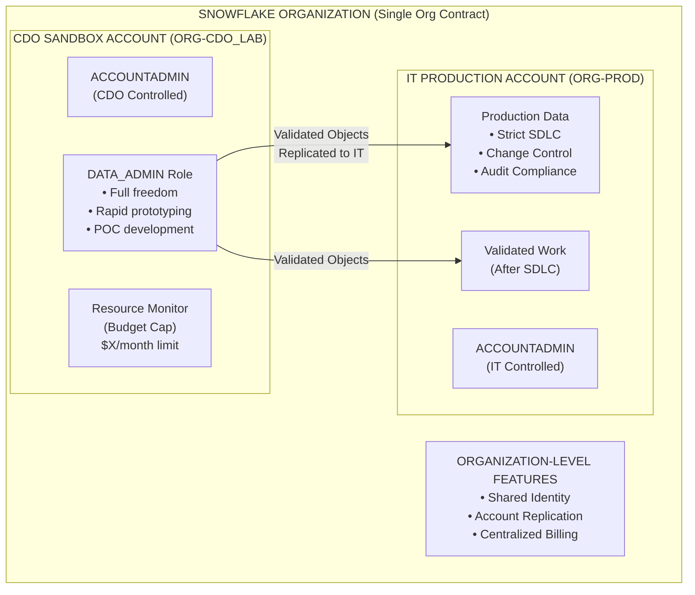
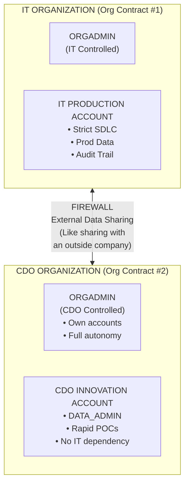
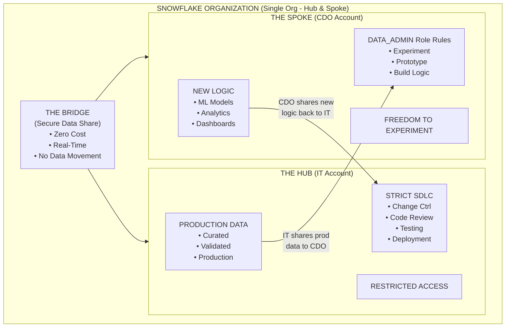
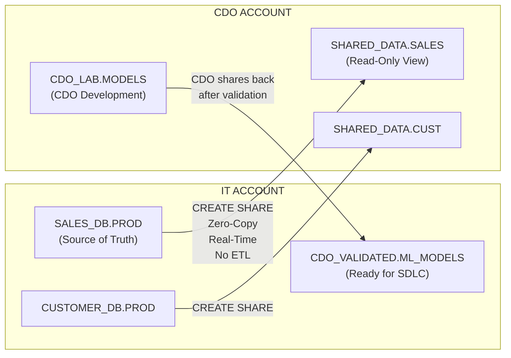
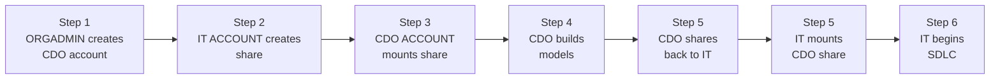
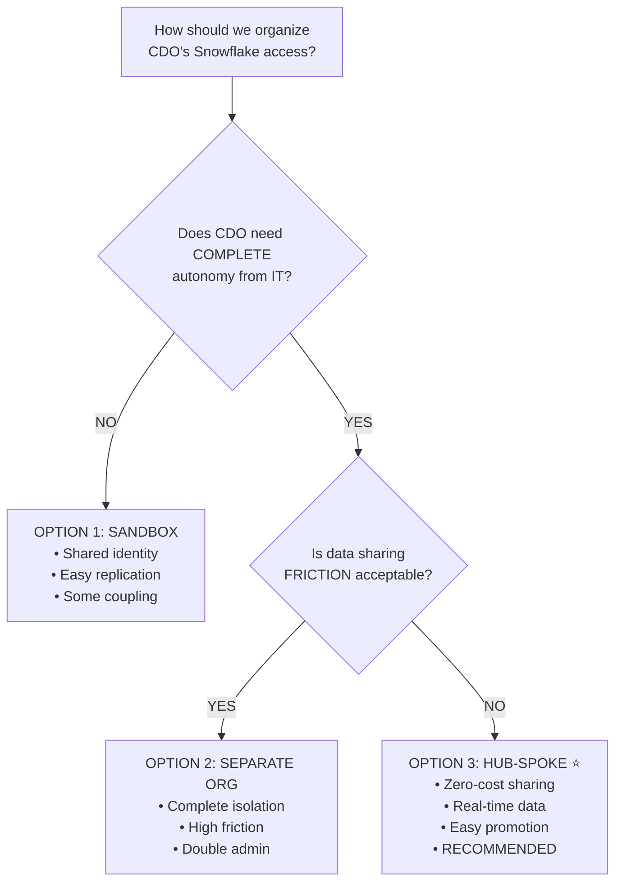

# Snowflake Account Architecture Patterns

Reference architectures for organizing Snowflake accounts for CDO/Innovation teams alongside IT-managed production environments.

---

## Option 1: Sandbox Account in Existing Organization

A new account (e.g., `ORG-CDO_LAB`) created under your current organization umbrella.



### Pros

- **Shared Identity** — Organization Users: data scientist is the same person in both accounts
- **Easy Promotion** — IT uses Account Replication to "pull" validated work into SDLC
- **Cost Control** — Account-level Resource Monitor prevents budget overruns

### Cons

- **Edition Differences** — If CDO needs different edition (Business Critical vs Enterprise), costs must be managed separately
- **No Cross-Account Cloning** — Must pay for data transfer/storage when replicating large datasets

---

## Option 2: Entirely New Organization

Treating the CDO's team like an outside company with complete separation.



### Pros

- **Ultimate Autonomy** — CDO has own ORGADMIN, creates accounts without asking IT
- **Zero Leakage** — Impossible for CDO config error to affect IT production

### Cons

- **Massive Friction** — Moving "Public Preview" objects requires External Data Sharing. You are essentially sharing with yourself as an outside company
- **Admin Overhead** — Double the credentials, contracts, and security audits

---

## Option 3: Hub-and-Spoke (RECOMMENDED)

The most successful high-velocity teams use this hybrid model within a Single Organization.



### The Workflow


### Secure Data Sharing Details



### Comparison Matrix

| Criteria | Sandbox | Separate Org | Hub-Spoke (Winner) |
|----------|---------|-------------|-------------------|
| Data Sharing Cost | Medium | High | **Zero** |
| Real-Time Access | Yes | No | **Yes** |
| Identity Management | **Shared** | Separate | **Shared** |
| CDO Autonomy | Medium | **Full** | **Full** |
| IT Governance | **Strong** | Weak | **Strong** |
| Admin Overhead | Low | High | **Low** |
| SDLC Integration | Medium | Hard | **Easy** |
| Security Isolation | Medium | **Maximum** | Strong |
| Production Impact | Possible | **None** | **None** |

### Key Benefits

- **Zero-Copy Data Sharing** — No storage duplication
- **Real-Time Data** — CDO always sees current production
- **Clear Ownership** — IT owns prod, CDO owns innovation
- **Easy Promotion** — Share back → Copy to Git → SDLC
- **Budget Control** — Resource Monitors per account
- **Single Contract** — One vendor relationship
- **Shared Identity** — SSO, same user across accounts
- **Hybrid Transformation** — Dynamic Tables + dbt coexist

---

## Implementation Quick Start

### Setup Sequence



### SQL Implementation

```sql
-- =============================================================================
-- STEP 1: Create CDO Account (ORGADMIN in IT's Org)
-- =============================================================================
USE ROLE ORGADMIN;

CREATE ACCOUNT CDO_LAB
    ADMIN_NAME = 'cdo_admin'
    ADMIN_PASSWORD = 'InitialPassword123!'
    EMAIL = 'cdo@company.com'
    EDITION = 'ENTERPRISE'
    REGION = 'AWS_US_WEST_2'
    COMMENT = 'CDO Innovation Lab - Hub-and-Spoke Model';

-- =============================================================================
-- STEP 2: Create Share from IT to CDO (IT Account)
-- =============================================================================
USE ROLE ACCOUNTADMIN;  -- In IT Account

-- Create outbound share
CREATE SHARE IT_TO_CDO_SHARE
    COMMENT = 'Production data shared to CDO for analysis';

-- Grant access to databases/schemas
GRANT USAGE ON DATABASE PRODUCTION_DB TO SHARE IT_TO_CDO_SHARE;
GRANT USAGE ON SCHEMA PRODUCTION_DB.ANALYTICS TO SHARE IT_TO_CDO_SHARE;
GRANT SELECT ON ALL TABLES IN SCHEMA PRODUCTION_DB.ANALYTICS TO SHARE IT_TO_CDO_SHARE;

-- Add CDO account as consumer
ALTER SHARE IT_TO_CDO_SHARE ADD ACCOUNTS = CDO_LAB;

-- =============================================================================
-- STEP 3: Mount Share in CDO Account (CDO Account)
-- =============================================================================
USE ROLE ACCOUNTADMIN;  -- In CDO Account

-- Create database from share
CREATE DATABASE PROD_DATA_SHARED FROM SHARE IT_ACCOUNT.IT_TO_CDO_SHARE;

-- Grant access to DATA_ADMIN
GRANT IMPORTED PRIVILEGES ON DATABASE PROD_DATA_SHARED TO ROLE DATA_ADMIN;

-- =============================================================================
-- STEP 4: CDO Shares Back to IT (CDO Account)
-- =============================================================================
USE ROLE ACCOUNTADMIN;  -- In CDO Account

-- Create outbound share for validated work
CREATE SHARE CDO_TO_IT_SHARE
    COMMENT = 'CDO validated work ready for IT SDLC';

GRANT USAGE ON DATABASE CDO_LAB_DB TO SHARE CDO_TO_IT_SHARE;
GRANT USAGE ON SCHEMA CDO_LAB_DB.VALIDATED TO SHARE CDO_TO_IT_SHARE;
GRANT SELECT ON ALL VIEWS IN SCHEMA CDO_LAB_DB.VALIDATED TO SHARE CDO_TO_IT_SHARE;

-- Add IT account as consumer
ALTER SHARE CDO_TO_IT_SHARE ADD ACCOUNTS = IT_PROD_ACCOUNT;

-- =============================================================================
-- STEP 5: Resource Monitor for CDO Budget (CDO Account)
-- =============================================================================
USE ROLE ACCOUNTADMIN;  -- In CDO Account

CREATE RESOURCE MONITOR CDO_MONTHLY_BUDGET
    WITH 
        CREDIT_QUOTA = 1000  -- $3000/month at $3/credit
        FREQUENCY = MONTHLY
        START_TIMESTAMP = IMMEDIATELY
        TRIGGERS
            ON 75 PERCENT DO NOTIFY
            ON 90 PERCENT DO NOTIFY
            ON 100 PERCENT DO SUSPEND;

-- Apply to all warehouses
ALTER ACCOUNT SET RESOURCE_MONITOR = CDO_MONTHLY_BUDGET;
```

---

## Decision Flowchart



---

## Transformation Engines in Multi-Account

In a Hub-and-Spoke topology, both Dynamic Tables and dbt can operate within each account:

| Account | Dynamic Tables | dbt |
|---------|---------------|-----|
| **IT Hub (Production)** | Curated layer for SAP, Salesforce, Oracle, FHIR, Workday — `TARGET_LAG` SLAs enforced | CI/CD runs `dbt build` for ServiceNow ITSM domain — tests gate production promotion |
| **CDO Spoke (Innovation)** | Rapid prototyping on shared production data | Feature branch development with `dbt build --select` for incremental testing |
| **Regional Spokes** | Local transformations with region-specific `TARGET_LAG` | Local dbt projects with region-specific profiles and source freshness checks |

The transformation engine is an account-level choice per domain. Shared data (via Secure Data Sharing) is engine-agnostic — consumers in any account see the same curated tables regardless of which engine produced them.

See [DBT_VS_DYNAMIC_TABLES.md](DBT_VS_DYNAMIC_TABLES.md) for a detailed comparison and decision framework.

---

## Reference

- [Snowflake Organizations](https://docs.snowflake.com/en/user-guide/organizations)
- [Secure Data Sharing](https://docs.snowflake.com/en/user-guide/data-sharing-intro)
- [Account Replication](https://docs.snowflake.com/en/user-guide/account-replication-intro)
- [Resource Monitors](https://docs.snowflake.com/en/user-guide/resource-monitors)
