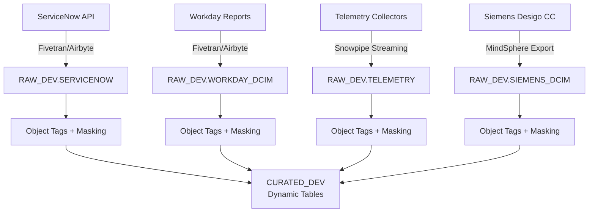
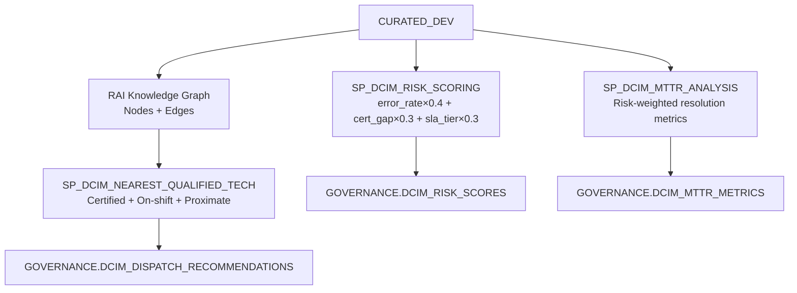
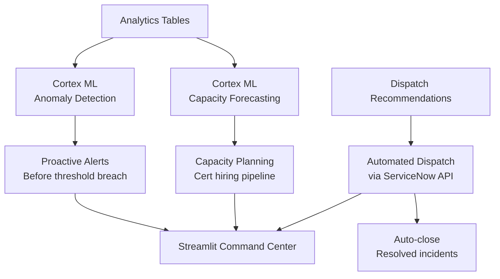
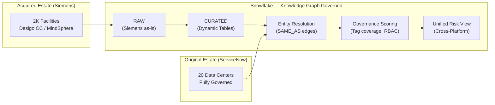

# DCIM — Architecture Strategy

> How we unify ServiceNow, Workday, Network Observability, and Siemens Desigo CC into a governed, real-time DCIM analytics platform on Snowflake.

---

## Strategic Thesis

**Snowflake becomes the single source of truth for data center operations** — not by replacing ServiceNow, Workday, or the telemetry stack, but by unifying their data into a governed analytical layer that enables cross-system intelligence impossible in any single tool.

The architecture prioritizes:
- **Freshness over batch** — telemetry at 1-minute lag, not overnight ETL
- **Governance by default** — every column tagged, every access audited
- **State preservation** — SCD6 means nothing is ever lost
- **Graph intelligence** — relationship traversal for dispatch and impact analysis

---

## Architecture Principles

| # | Principle | Rationale | Implementation |
|---|-----------|-----------|----------------|
| 1 | **Ingest raw, transform in place** | Preserve source fidelity; avoid lossy extraction | SCD6 columns in RAW layer |
| 2 | **Dynamic Tables over scheduled ETL** | Declarative transforms; automatic dependency resolution | 14 curated DTs with tiered lags |
| 3 | **Tag everything at birth** | Governance is cheaper when applied early | Column tags on RAW tables at DDL time |
| 4 | **Cross-system IDs are deterministic** | Reproducible joins without lookup tables | uuid5 with domain-specific namespaces |
| 5 | **Graph is a projection, not a copy** | Graph nodes reference Snowflake tables; no data duplication | RAI reads from CURATED views |
| 6 | **Procedures encapsulate business logic** | Complex scoring/dispatch logic is testable and auditable | SP_DCIM_* stored procedures |
| 7 | **Semantic views for self-service** | Business users ask questions in English, not SQL | 3 semantic views over analytics tables |
| 8 | **Orchestration is idempotent** | Any phase can be re-run without side effects | Master orchestrator with phase flags |

---

## Four-Stage Evolution

### Stage 1: Governed Data Lake

Unify all four sources into Snowflake with full lineage and governance.



**Key deliverables:**
- 26 raw tables with SCD6 state tracking (18 original + 8 Siemens)
- Column-level tags (PII, SENSITIVE, OPERATIONAL)
- Masking policies for technician PII
- Dynamic Tables with tiered target lags

### Stage 2: Cross-System Intelligence

Layer analytics that require joining across system boundaries.



**Key deliverables:**
- Risk scoring procedure (40% error rate + 30% cert gap + 30% SLA tier)
- MTTR analysis with staff correlation
- Graph-based dispatch optimization
- Historical snapshots and audit trail

### Stage 3: Predictive Operations

Move from reactive to predictive with ML and automation.



**Key deliverables:**
- Anomaly detection on telemetry streams
- Capacity forecasting (power, thermal, staffing)
- Automated dispatch to ServiceNow
- Proactive certification pipeline recommendations

### Acquisition Absorption — "Acquire and Govern"

The Knowledge Graph enables rapid integration of acquired infrastructure estates:



**Principle: "Load First, Govern Incrementally"**
1. Ingest Siemens data as-is (no transformation) into `RAW_DEV.SIEMENS_DCIM`
2. Dynamic Tables auto-curate into `CURATED_DEV.SIEMENS_DCIM`
3. Knowledge Graph creates `CANDIDATE_SAME_AS` edges (algorithmic matching)
4. Human review promotes candidates to `SAME_AS` (confirmed matches)
5. Governance scoring flags ungoverned facilities for prioritized migration
6. Cross-platform risk view gives unified NOC visibility from day one

---

## Tiered Freshness Strategy

Not all data needs the same refresh cadence. The architecture implements tiered target lags aligned to business urgency:

| Tier | Target Lag | Tables | Rationale |
|------|-----------|--------|-----------|
| **Real-time** | 1 minute | PORT_METRICS, SWITCH_HEALTH | Active incident response |
| **Near-real-time** | 5 minutes | FACT_INCIDENTS, FACT_ALERTS, DIM_SWITCH | Incident correlation |
| **Operational** | 15 minutes | FACT_SHIFTS, FACT_CHANGE_REQUESTS | Shift changes, scheduling |
| **Reference** | 1 hour | DIM_DATA_CENTER, DIM_TECHNICIAN, DIM_CERTIFICATION | Slowly changing dimensions |

---

## SCD Type 6 Design

The raw layer implements SCD Type 6 (hybrid) to support three temporal queries simultaneously:

| Column Pattern | Purpose | Example Query |
|---------------|---------|---------------|
| `CURRENT_*` | Latest known value | "What is the current firmware version?" |
| `HISTORICAL_*` | Value at `_VALID_FROM` | "What was the firmware when this incident occurred?" |
| `ORIGINAL_*` | Value at first ingestion | "What was the original deployment config?" |
| `_VALID_FROM` / `_VALID_TO` | Row validity window | "Show all states for this switch in Q4" |

This enables the `SP_DCIM_TIME_TRAVEL` procedure to reconstruct any entity's complete state history without relying on Snowflake's native Time Travel (which has retention limits).

---

## Security & Governance Architecture

```
ACCOUNTADMIN
├── DCA_ADMIN (DDL, procedure ownership)
├── DCA_ENGINEER (read/write curated, execute procedures)
├── DCA_ANALYST (read curated + analytics, semantic views)
└── DCA_NOC (read analytics only, PII masked)
```

| Control | Scope | Implementation |
|---------|-------|----------------|
| Object Tags | All columns | `SYSTEM$TAG` at DDL time |
| Masking | Technician PII | Dynamic masking policy on DCA_NOC role |
| Row Access | Campus isolation | RAP on campus_id for regional managers |
| Audit | All reads/writes | `DCIM_AUDIT_TRAIL` table + ACCESS_HISTORY |
| Lineage | Cross-system | Graph edges + ACCOUNT_USAGE.ACCESS_HISTORY |

---

## Integration Patterns

| Source | Ingestion | Frequency | Method |
|--------|-----------|-----------|--------|
| ServiceNow | CDC via API | Every 5 min | Fivetran connector → external stage |
| Workday | Report-as-a-Service | Every 15 min | Airbyte connector → external stage |
| Telemetry | Streaming | Continuous | Snowpipe Streaming SDK |
| Siemens Desigo CC | MindSphere API export | Every 1–60 min | Bulk CSV → external stage |
| RAI Graph | Pull from Snowflake | On-demand | SPCS service reads CURATED views |

---

## Failure Modes & Recovery

| Failure | Detection | Recovery |
|---------|-----------|----------|
| Source lag > 2x target | Dynamic Table REFRESH_STATUS | Alert → investigate source connector |
| Graph service down | SPCS health check | Dispatch falls back to rule-based (no graph) |
| Risk score stale | Orchestrator heartbeat | SP_DCIM_QUICK_REFRESH re-runs scoring |
| Siemens entity resolution stale | CANDIDATE_SAME_AS edge count drift | Re-run 04b Siemens graph populate |
| Certification data gap | Validation script (Phase 6) | Re-trigger Workday sync |
| Telemetry gap > 15 min | FACT_ALERTS freshness check | Restart Snowpipe Streaming channel |
