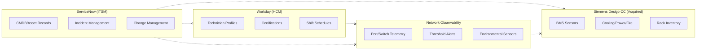

# DCIM — Current-State Gap Analysis & Pain Points

> Understanding what breaks when ServiceNow, Workday, Network Observability, and Siemens Desigo CC operate as disconnected silos — and the compounding challenge of acquisition integration.

---

## The Four Silos

Most data center operators run multiple critical systems that never talk to each other — and acquisitions compound the problem:



**The gap**: No unified view connects *which equipment is degrading* with *who is qualified and available to fix it*, *what the telemetry actually shows*, and *how the acquired estate overlaps with existing infrastructure*.

---

## Pain Points

| # | Pain Point | Impact | Current Workaround |
|---|-----------|--------|-------------------|
| 1 | **Blind dispatch** — NOC assigns incidents without knowing technician certifications | 35% of dispatches require re-assignment; MTTR inflated by 2.1 hours | Manual Slack check with team leads |
| 2 | **No historical state reconstruction** — When a switch config changed is unknown | Root-cause investigations take days; audit findings unresolvable | Export ServiceNow audit logs to spreadsheets |
| 3 | **Certification gap invisibility** — Expiring certs not linked to equipment coverage | Critical equipment loses certified coverage without warning | Quarterly manual cert review in Excel |
| 4 | **Telemetry-incident disconnect** — Alerts fire but lack CMDB context | NOC wastes 15 min per incident establishing equipment identity | Copy-paste switch hostname into ServiceNow search |
| 5 | **Shift-incident mismatch** — Incidents assigned to off-shift technicians | 22% of P1 incidents sit unacknowledged for >30 minutes | On-call phone tree escalation |
| 6 | **No risk-weighted prioritization** — All P2 incidents treated equally | High-risk equipment (expired certs + high error rate) queued behind low-risk | Tribal knowledge among senior NOC staff |
| 7 | **Change collision blindness** — Scheduled changes overlap with incidents | 12% of changes cause secondary incidents | Weekly CAB meeting reviews; reactive only |
| 8 | **Cross-campus capacity opacity** — Cannot compare staffing ratios across sites | Over-staffed campuses subsidize under-staffed ones invisibly | Annual headcount review by region |

---

## Compliance Gaps

| Regulation / Standard | Requirement | Current Gap |
|----------------------|-------------|-------------|
| **SOC 2 Type II** | Demonstrate change traceability | No unified audit trail across systems |
| **ISO 27001 A.12.1** | Documented operational procedures | Dispatch logic lives in tribal knowledge |
| **PCI DSS 6.4** | Change management controls | Cannot prove separation of duties for network changes |
| **HIPAA (colocation)** | Access controls on PHI infrastructure | Cannot map technician clearance to rack contents |
| **Uptime Institute Tier III** | Concurrent maintainability proof | No evidence that qualified staff cover all critical paths |

---

## Cost of Ignorance

### Quantified Annual Impact (100-campus operator)

| Metric | Current State | With Unified Platform | Annual Savings |
|--------|--------------|----------------------|----------------|
| Mean Time to Repair (P1) | 4.2 hours | 2.5 hours | $12M in avoided downtime |
| Dispatch accuracy | 65% first-try | 92% first-try | $3.4M in reduced travel/overtime |
| Certification lapse events | 47/year | 3/year | $2.1M in avoided audit findings |
| Change-induced incidents | 156/year | 28/year | $8.6M in prevented outages |
| Compliance audit prep time | 6 weeks/audit | 2 days/audit | $1.8M in labor costs |

### The Compounding Problem

These silos create a negative feedback loop:

1. Blind dispatch → longer MTTR → more SLA breaches
2. More breaches → more audit findings → more manual reporting
3. More manual reporting → less time for prevention → more incidents
4. More incidents → technician burnout → higher turnover → worse cert coverage

**The unified platform breaks this cycle** by connecting equipment risk signals directly to qualified, available workforce capacity in real time.

---

## Acquisition Integration Challenges

### The Acquisition Story

Six months ago, the company completed a $4.2B acquisition of a European competitor operating 2,000 data centers across 47 countries. The acquired company runs **Siemens Desigo CC** (Building Management System) and **Siemens MindSphere** (IoT analytics) as their primary DCIM platform. Their operational model is fundamentally different:

- **Siemens manages physical plant**: HVAC zones, power distribution (PDUs, UPS, switchgear), cooling loops (chillers, CRAHs), and fire suppression — the building infrastructure that ServiceNow doesn't cover well
- **Siemens ALSO tracks racks and assets**: Their own rack inventory system with German-influenced naming (`Standort` = site, `Gebaeude` = building, `Instandhaltung` = maintenance) creates a direct overlap with ServiceNow
- **Different ID systems**: The same physical rack has one ID in Siemens (`siemens_rack_id`) and a different ID in ServiceNow (`rack_id`) — 100,000 racks need entity resolution
- **Different workflow models**: Siemens uses `Instandhaltungsaufträge` (maintenance orders) where ServiceNow uses INC/CHG tickets — same physical events, tracked differently

### Why This Matters to the C-Suite

| Stakeholder | Their Question | What Keeps Them Up at Night |
|-------------|---------------|----------------------------|
| **CEO** | "Are we getting the synergies we promised investors?" | $4.2B acquisition with no unified operating model = Wall Street skepticism |
| **CFO** | "What's the real cost of running dual systems?" | $18M/year in duplicated tooling + $6M in integration consulting |
| **CTO** | "Can we govern 2,020 DCs with the same team?" | 100x scale increase with 0x headcount increase |
| **VP Infrastructure** | "Which acquired facilities are actually at risk?" | No visibility into Siemens cooling/power health from NOC |
| **CISO** | "Are the acquired DCs compliant with our policies?" | 2,000 facilities with zero Snowflake tags, zero masking, zero RBAC |

### Integration Pain Points (Detailed)

| Challenge | Impact | Root Cause | Business Risk |
|-----------|--------|------------|---------------|
| **100x scale increase overnight** | Governance framework designed for 20 DCs must absorb 2,000 | No elastic governance architecture — manual processes don't scale | Audit findings within 90 days if ungoverned |
| **Dual naming conventions** | Same equipment has two names (ServiceNow English vs Siemens German-influenced) | Different CMDB systems with no shared taxonomy | Misidentification during P1 incidents |
| **No shared asset IDs** | Same physical rack appears as two unrelated entities | Independent system deployments with no integration contract | Cannot dispatch ServiceNow-managed techs to Siemens-managed racks |
| **Governance gap on acquired DCs** | 2,000 facilities have no Snowflake tags, no masking policies, no RBAC | Acquired company used different security model (Siemens-native) | SOC 2 non-compliance on Day 1 of close |
| **Maintenance order ↔ Incident reconciliation** | Same physical event tracked in two workflow systems | Siemens uses Instandhaltungsaufträge; ServiceNow uses INC tickets | Duplicate work orders, double-counting incidents |
| **BMS sensor flood** | 500K readings per 5-min cycle from acquired estate overwhelms existing pipelines | 100x data volume increase with no proportional infrastructure growth | Telemetry dropped = blind spots in cooling/power monitoring |
| **Cooling system opacity** | Cannot correlate Siemens cooling alarms with ServiceNow switch health | Physical plant and IT infrastructure managed as separate domains | Switch failure from overheating appears "random" — no root-cause link to HVAC |
| **Siemens-specific equipment models** | No existing ServiceNow CI types for Siemens SITOP PSUs, Climatix controllers, Desigo PXC units | Acquired estate uses vendor-specific equipment taxonomy | Cannot run unified capacity planning across both fleets |

### The Integration Timeline Pressure

```
Day 0 (Close)     → Must report combined capacity to board
Day 30            → Must prove SOC 2 compliance for acquired DCs
Day 60            → Must have unified NOC visibility (both estates)
Day 90            → First joint audit (auditor expects unified controls)
Day 180           → Board expects 15% synergy realization
Day 365           → Full integration or admit to Wall Street the deal is underperforming
```

**The Knowledge Graph approach** collapses this from a 3-year ERP integration into a 90-day "Load, Resolve, Govern" sprint because entity resolution happens at the graph layer — not at the source system layer.

---

## What "Good" Looks Like

A unified DCIM platform should answer these questions in under 5 seconds:

- "Switch X is degrading — who is certified, on-shift, and closest?"
- "Technician Y's Cisco cert expires in 14 days — what equipment loses coverage?"
- "Show me every state change for Rack Z in the last 90 days with who/what/when."
- "If we schedule maintenance window W, do we have certified backup coverage?"
- "Rank all P2 incidents by composite risk: error rate + cert gap + SLA tier."
