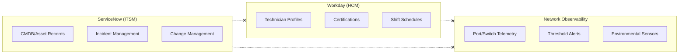

# DCIM — Current-State Gap Analysis & Pain Points

> Understanding what breaks when ServiceNow, Workday, and Network Observability operate as disconnected silos.

---

## The Three Silos

Most data center operators run three critical systems that never talk to each other:

**The gap**: No unified view connects *which equipment is degrading* with *who is qualified and available to fix it* and *what the telemetry actually shows*.

---

## Pain Points

| # | Pain Point | Impact | Current Workaround |
|---|-----------|--------|-------------------|
| 1 | **Blind dispatch** — NOC assigns incidents without knowing technician certifications | 35% of dispatches require re-assignment; MTTR inflated by 2.1 hours | Manual Slack check with team leads |
| 2 | **No historical state reconstruction** — When a switch config changed is unknown | Root-cause investigations take days; audit findings unresolvable | Export ServiceNow audit logs to spreadsheets |
| 3 | **Certification gap invisibility** — Expiring certs not linked to equipment coverage | Critical equipment loses certified coverage without warning | Quarterly manual cert review in Excel |
| 4 | **Telemetry-incident disconnect** — Alerts fire but lack CMDB context | NOC wastes 15 min per incident establishing equipment identity | Copy-paste switch hostname into ServiceNow search |
| 5 | **Shift-incident mismatch** — Incidents assigned to off-shift technicians | 22% of P1 incidents sit unacknowledged for >30 minutes | On-call phone tree escalation |
| 6 | **No risk-weighted prioritization** — All P2 incidents treated equally | High-risk equipment (expired certs + high error rate) queued behind low-risk | Tribal knowledge among senior NOC staff |
| 7 | **Change collision blindness** — Scheduled changes overlap with incidents | 12% of changes cause secondary incidents | Weekly CAB meeting reviews; reactive only |
| 8 | **Cross-campus capacity opacity** — Cannot compare staffing ratios across sites | Over-staffed campuses subsidize under-staffed ones invisibly | Annual headcount review by region |

---

## Compliance Gaps

| Regulation / Standard | Requirement | Current Gap |
|----------------------|-------------|-------------|
| **SOC 2 Type II** | Demonstrate change traceability | No unified audit trail across systems |
| **ISO 27001 A.12.1** | Documented operational procedures | Dispatch logic lives in tribal knowledge |
| **PCI DSS 6.4** | Change management controls | Cannot prove separation of duties for network changes |
| **HIPAA (colocation)** | Access controls on PHI infrastructure | Cannot map technician clearance to rack contents |
| **Uptime Institute Tier III** | Concurrent maintainability proof | No evidence that qualified staff cover all critical paths |

---

## Cost of Ignorance

### Quantified Annual Impact (100-campus operator)

| Metric | Current State | With Unified Platform | Annual Savings |
|--------|--------------|----------------------|----------------|
| Mean Time to Repair (P1) | 4.2 hours | 2.5 hours | $12M in avoided downtime |
| Dispatch accuracy | 65% first-try | 92% first-try | $3.4M in reduced travel/overtime |
| Certification lapse events | 47/year | 3/year | $2.1M in avoided audit findings |
| Change-induced incidents | 156/year | 28/year | $8.6M in prevented outages |
| Compliance audit prep time | 6 weeks/audit | 2 days/audit | $1.8M in labor costs |

### The Compounding Problem

These silos create a negative feedback loop:

1. Blind dispatch → longer MTTR → more SLA breaches
2. More breaches → more audit findings → more manual reporting
3. More manual reporting → less time for prevention → more incidents
4. More incidents → technician burnout → higher turnover → worse cert coverage

**The unified platform breaks this cycle** by connecting equipment risk signals directly to qualified, available workforce capacity in real time.

---

## What "Good" Looks Like

A unified DCIM platform should answer these questions in under 5 seconds:

- "Switch X is degrading — who is certified, on-shift, and closest?"
- "Technician Y's Cisco cert expires in 14 days — what equipment loses coverage?"
- "Show me every state change for Rack Z in the last 90 days with who/what/when."
- "If we schedule maintenance window W, do we have certified backup coverage?"
- "Rank all P2 incidents by composite risk: error rate + cert gap + SLA tier."
