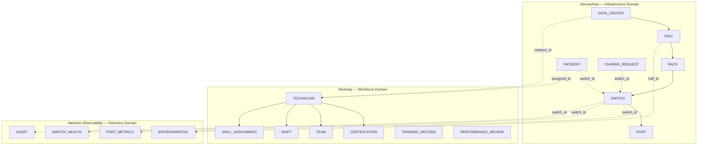

# DCIM — Cross-System Ontology Map

> Defining how ServiceNow infrastructure, Workday workforce, and Network Observability telemetry connect through a unified knowledge graph.

---

## System Landscape



---

## Node Type Catalog

### ServiceNow Domain

| Node Type | Source Table | Node ID Format | Key Properties |
|-----------|-------------|----------------|----------------|
| `DATA_CENTER` | `RAW_DEV.SERVICENOW.DATA_CENTERS` | `dc:{campus_id}` | region, tier_level, power_capacity_mw, address |
| `HALL` | `RAW_DEV.SERVICENOW.HALLS` | `hall:{hall_id}` | campus_id, floor, power_capacity_kw, cooling_type |
| `RACK` | `RAW_DEV.SERVICENOW.RACKS` | `rack:{rack_id}` | hall_id, row_position, u_capacity, u_used |
| `SWITCH` | `RAW_DEV.SERVICENOW.SWITCHES` | `sw:{switch_id}` | rack_id, model, firmware_version, install_date |
| `PORT` | `RAW_DEV.SERVICENOW.PORTS` | `port:{port_id}` | switch_id, speed_gbps, status, connected_device |
| `INCIDENT` | `RAW_DEV.SERVICENOW.INCIDENTS` | `inc:{incident_id}` | severity, sla_tier, status, created_at, resolved_at |
| `CHANGE_REQUEST` | `RAW_DEV.SERVICENOW.CHANGE_REQUESTS` | `chg:{change_id}` | type, risk_level, scheduled_date, status |

### Workday Domain

| Node Type | Source Table | Node ID Format | Key Properties |
|-----------|-------------|----------------|----------------|
| `TECHNICIAN` | `RAW_DEV.WORKDAY_DCIM.TECHNICIANS` | `tech:{technician_id}` | campus_id, team_id, hire_date, clearance_level |
| `CERTIFICATION` | `RAW_DEV.WORKDAY_DCIM.CERTIFICATIONS` | `cert:{cert_id}` | vendor, level, issue_date, expiry_date |
| `TEAM` | `RAW_DEV.WORKDAY_DCIM.TEAMS` | `team:{team_id}` | campus_id, specialization, headcount |

### Telemetry Domain (Implicit Nodes)

Telemetry data does not create independent graph nodes. Instead, telemetry metrics attach as **properties** or **signals** on existing infrastructure nodes:

| Signal Type | Attaches To | Metric Examples |
|-------------|-------------|-----------------|
| Port throughput | `PORT` node | bytes_in, bytes_out, error_count, drop_count |
| Switch health | `SWITCH` node | cpu_percent, memory_percent, temperature_c |
| Environmental | `HALL` node | ambient_temp_c, humidity_percent, power_draw_kw |
| Alert | `SWITCH` or `PORT` node | threshold_type, severity, triggered_at |

---

## Edge Type Catalog

### Infrastructure Hierarchy (ServiceNow)

| Edge Type | From | To | Cardinality | Description |
|-----------|------|----|-------------|-------------|
| `HALL_IN_DC` | HALL | DATA_CENTER | N:1 | Hall physically located in data center |
| `RACK_IN_HALL` | RACK | HALL | N:1 | Rack physically located in hall |
| `SWITCH_IN_RACK` | SWITCH | RACK | N:1 | Switch mounted in rack |
| `PORT_ON_SWITCH` | PORT | SWITCH | N:1 | Port belongs to switch |

### Operational Relationships (ServiceNow)

| Edge Type | From | To | Cardinality | Description |
|-----------|------|----|-------------|-------------|
| `INCIDENT_AFFECTS_SWITCH` | INCIDENT | SWITCH | N:1 | Incident is about this switch |
| `INCIDENT_AFFECTS_PORT` | INCIDENT | PORT | N:1 | Incident is about this port |
| `CHANGE_TARGETS_SWITCH` | CHANGE_REQUEST | SWITCH | N:1 | Change will modify this switch |
| `INCIDENT_CAUSED_BY_CHANGE` | INCIDENT | CHANGE_REQUEST | N:1 | Incident resulted from change |

### Workforce Relationships (Workday)

| Edge Type | From | To | Cardinality | Description |
|-----------|------|----|-------------|-------------|
| `TECHNICIAN_HAS_CERTIFICATION` | TECHNICIAN | CERTIFICATION | 1:N | Tech holds this cert |
| `TECHNICIAN_IN_TEAM` | TECHNICIAN | TEAM | N:1 | Tech belongs to team |
| `TECHNICIAN_ON_SHIFT` | TECHNICIAN | SHIFT (temporal) | 1:N | Tech is working this shift |
| `TECHNICIAN_HAS_SKILL` | TECHNICIAN | SKILL_ASSIGNMENT | 1:N | Tech has this skill rating |

### Cross-System Edges

| Edge Type | From | To | Cardinality | Description |
|-----------|------|----|-------------|-------------|
| `TECHNICIAN_ASSIGNED_TO_INCIDENT` | TECHNICIAN | INCIDENT | N:N | Tech dispatched to incident |
| `TECHNICIAN_COVERS_CAMPUS` | TECHNICIAN | DATA_CENTER | N:N | Tech can be dispatched here |
| `CERTIFICATION_QUALIFIES_FOR_MODEL` | CERTIFICATION | SWITCH | N:N | Cert qualifies tech for this switch model |
| `SAME_AS` | Any | Any | 1:1 | Identity resolution across systems |

---

## Cross-System Linkage Keys

| Linkage | System A | System B | Join Key | Resolution Method |
|---------|----------|----------|----------|-------------------|
| Campus ↔ Technician | ServiceNow | Workday | `campus_id` | Direct FK (same uuid5 seed) |
| Switch ↔ Telemetry | ServiceNow | Telemetry | `switch_id` | Direct FK (same uuid5 seed) |
| Technician ↔ Incident | Workday | ServiceNow | `technician_id = assigned_to` | Direct FK |
| Cert Vendor ↔ Switch Model | Workday | ServiceNow | `vendor` ↔ `model` prefix | Semantic mapping table |
| Hall ↔ Environmental | ServiceNow | Telemetry | `hall_id` | Direct FK |
| Team ↔ Campus | Workday | ServiceNow | `campus_id` on TEAM | Direct FK |

### UUID5 Namespace Strategy

```
SERVICENOW_NS  = uuid5(DNS, "servicenow.dcim.dca-demo")
WORKDAY_NS     = uuid5(DNS, "workday.dcim.dca-demo")
TELEMETRY_NS   = uuid5(DNS, "telemetry.dcim.dca-demo")

campus_id      = uuid5(SERVICENOW_NS, f"{campus_name}:{region}")
technician_id  = uuid5(WORKDAY_NS,    f"{employee_number}")
switch_id      = uuid5(TELEMETRY_NS,  f"{campus_id}:{rack_position}:{slot}")
```

This ensures the same entity always gets the same ID regardless of when or how many times it is generated.

---

## SCD6 State Tracking

Every raw table implements SCD Type 6 columns to support temporal graph queries:

### Column Schema

| Column | Type | Description |
|--------|------|-------------|
| `_VALID_FROM` | TIMESTAMP_NTZ | When this row version became active |
| `_VALID_TO` | TIMESTAMP_NTZ | When this row version was superseded (NULL = current) |
| `CURRENT_{field}` | varies | Latest known value (denormalized for fast lookup) |
| `HISTORICAL_{field}` | varies | Value as of `_VALID_FROM` |
| `ORIGINAL_{field}` | varies | Value at first ingestion (never changes) |

### Temporal Query Patterns

**Point-in-time state:**
```sql
-- What was Switch X's firmware on 2024-03-15?
SELECT HISTORICAL_FIRMWARE_VERSION
FROM RAW_DEV.SERVICENOW.SWITCHES
WHERE switch_id = :switch_id
  AND _VALID_FROM <= '2024-03-15'
  AND (_VALID_TO > '2024-03-15' OR _VALID_TO IS NULL);
```

**State change history:**
```sql
-- All firmware changes for Switch X
SELECT _VALID_FROM, HISTORICAL_FIRMWARE_VERSION, CURRENT_FIRMWARE_VERSION
FROM RAW_DEV.SERVICENOW.SWITCHES
WHERE switch_id = :switch_id
ORDER BY _VALID_FROM;
```

**Drift detection:**
```sql
-- Switches where current state differs from original deployment
SELECT switch_id, ORIGINAL_FIRMWARE_VERSION, CURRENT_FIRMWARE_VERSION
FROM RAW_DEV.SERVICENOW.SWITCHES
WHERE _VALID_TO IS NULL
  AND CURRENT_FIRMWARE_VERSION != ORIGINAL_FIRMWARE_VERSION;
```

---

## Graph Traversal Patterns

### Nearest Qualified Technician

```
INCIDENT → (INCIDENT_AFFECTS_SWITCH) → SWITCH
    → (SWITCH.model) → required CERTIFICATION.vendor
    → (TECHNICIAN_HAS_CERTIFICATION) ← TECHNICIAN
    → filter: TECHNICIAN.campus_id = SWITCH.campus_id (proximity)
    → filter: TECHNICIAN currently ON_SHIFT
    → rank by: skill_level DESC, distance ASC
```

### Impact Analysis (Upstream)

```
SWITCH → (SWITCH_IN_RACK) → RACK
    → (RACK_IN_HALL) → HALL
    → (HALL_IN_DC) → DATA_CENTER
    → all other SWITCH nodes in same DC
    → all INCIDENT nodes affecting those switches
    → risk cascade calculation
```

### Certification Coverage Gap

```
DATA_CENTER → all SWITCH nodes (via hierarchy traversal)
    → unique switch MODELs requiring certification
    → (CERTIFICATION_QUALIFIES_FOR_MODEL) ← CERTIFICATION
    → (TECHNICIAN_HAS_CERTIFICATION) ← TECHNICIAN
    → filter: cert.expiry_date > NOW()
    → filter: technician.campus_id = data_center.campus_id
    → GAP = models with zero qualified, on-campus technicians
```

---

## Node Property Enrichment

Graph nodes are enriched with computed properties from the analytics layer:

| Node Type | Enriched Property | Source |
|-----------|------------------|--------|
| SWITCH | `risk_score` | DCIM_RISK_SCORES |
| SWITCH | `mttr_avg_hours` | DCIM_MTTR_METRICS |
| TECHNICIAN | `active_certs_count` | COUNT(valid certs) |
| TECHNICIAN | `incidents_resolved_30d` | FACT_INCIDENTS aggregate |
| DATA_CENTER | `coverage_ratio` | qualified_techs / critical_switches |
| INCIDENT | `dispatch_recommendation` | DCIM_DISPATCH_RECOMMENDATIONS |

---

## Edge Weights

Edges carry weights that influence graph traversal algorithms:

| Edge Type | Weight Factor | Range | Purpose |
|-----------|--------------|-------|---------|
| `TECHNICIAN_HAS_CERTIFICATION` | cert_level (1-5) | 1.0–5.0 | Prefer higher-certified techs |
| `TECHNICIAN_COVERS_CAMPUS` | distance_km | 0.1–50.0 | Minimize travel time |
| `INCIDENT_AFFECTS_SWITCH` | severity (1-4) | 1.0–4.0 | Prioritize critical equipment |
| `CERTIFICATION_QUALIFIES_FOR_MODEL` | relevance (0-1) | 0.0–1.0 | Exact vs. partial match |
