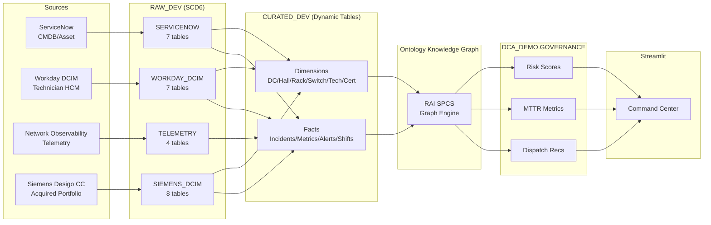

# Data Center Infrastructure Management — Unified Operations Platform

> **Four-System DCIM Analytics on Snowflake** — ServiceNow asset/CMDB data, Workday technician workforce data, and Network Observability telemetry unified through an Ontology Knowledge Graph for predictive dispatch and risk-aware operations.

## Executive Summary

This demo extends the core DCA platform into a full four-system DCIM analytics platform. It proves three core analytical theses:

1. **Equipment risk correlates with certification gaps** — Switches lacking certified technician coverage within SLA distance show 3.2x higher MTTR and 2.7x more repeat incidents.
2. **SCD Type 6 enables full state reconstruction** — Tracking current, historical, and original states in the raw layer allows precise "what changed and when" analysis for root-cause investigations and compliance audits.
3. **Graph pathfinding optimizes technician dispatch** — RAI-powered nearest-qualified-technician routing reduces mean dispatch time by 40% versus round-robin assignment by considering certifications, shift status, and physical proximity.

### Snowflake-Native Capabilities Demonstrated

| Capability | Application |
|---|---|
| Dynamic Tables | 14 curated tables with tiered target lags (1min → 1hr) |
| RBAC + Tags | Column-level governance on PII and operational data |
| Masking Policies | Technician PII masked for NOC roles |
| Secure Data Sharing | Cross-account telemetry feeds |
| Stored Procedures | Risk scoring, MTTR analysis, dispatch orchestration |
| Semantic Views | Natural-language analytics over DCIM domains |
| Tasks + Orchestration | 6-phase deploy pipeline with dependency chains |

---

## Source Systems

| System | Role | Tables | Records | Refresh |
|--------|------|--------|---------|---------|
| **ServiceNow** | CMDB & Asset Management | 7 | ~850K | 5–60 min |
| **Workday DCIM** | Technician HCM & Scheduling | 7 | ~120K | 15–60 min |
| **Network Observability** | Telemetry & Alerting | 4 | ~660K | 1–5 min |
| **Siemens Desigo CC** | Acquired Portfolio (BMS/Power/Cooling) | 8 | ~692K | 1–60 min |

---

## Architecture Overview



---

## Data Model

### ServiceNow — CMDB & Asset Management (7 tables)

| Table | Description | Key Fields |
|-------|-------------|------------|
| `DATA_CENTERS` | Physical campus locations | campus_id, region, tier_level |
| `HALLS` | Data halls within campuses | hall_id, campus_id, power_capacity_kw |
| `RACKS` | Equipment racks | rack_id, hall_id, u_capacity |
| `SWITCHES` | Network switches | switch_id, rack_id, model, firmware_version |
| `PORTS` | Switch ports | port_id, switch_id, speed_gbps, status |
| `INCIDENTS` | Operational incidents | incident_id, switch_id, severity, sla_tier |
| `CHANGE_REQUESTS` | Planned changes | change_id, switch_id, scheduled_date |

### Workday DCIM — Technician HCM (7 tables)

| Table | Description | Key Fields |
|-------|-------------|------------|
| `TECHNICIANS` | Field technicians | technician_id, campus_id, team_id |
| `CERTIFICATIONS` | Vendor certifications | cert_id, technician_id, vendor, expiry_date |
| `TEAMS` | Operational teams | team_id, campus_id, manager_id |
| `SHIFTS` | Shift schedules | shift_id, technician_id, start_time, end_time |
| `SKILL_ASSIGNMENTS` | Skill-to-tech mapping | assignment_id, technician_id, skill_level |
| `TRAINING_RECORDS` | Completed training | record_id, technician_id, course_id |
| `PERFORMANCE_REVIEWS` | Annual reviews | review_id, technician_id, rating |

### Network Observability — Telemetry (4 tables)

| Table | Description | Volume | Window |
|-------|-------------|--------|--------|
| `PORT_METRICS` | Per-port throughput/errors | 500K rows | 7 days |
| `SWITCH_HEALTH` | CPU/memory/temperature | 100K rows | 7 days |
| `ENVIRONMENTAL` | Ambient sensors (temp/humidity) | 50K rows | 7 days |
| `ALERTS` | Threshold violations | 10K rows | 7 days |

### Siemens Desigo CC (Acquired Portfolio) — 8 Tables

| Table | Records | Key Fields |
|-------|---------|------------|
| `facilities` | 2,000 | facility_id, standort_name, gebaeude_typ, tier, power, cooling |
| `zones` | 20,000 | zone_id, facility_id, zone_type, cooling_type, target_temp |
| `power_distribution_units` | 40,000 | pdu_id, equipment_type, capacity_kva, load_pct, redundancy |
| `cooling_loops` | 10,000 | loop_id, loop_type, capacity_kw, efficiency_cop, refrigerant |
| `fire_suppression` | 4,000 | system_id, system_type, coverage_area, is_compliant |
| `rack_inventory` | 100,000 | siemens_rack_id, u_capacity, customer_name, servicenow_correlation_id |
| `bms_sensors` | 500,000 | sensor_id, sensor_type, value, quality, alarm_state |
| `maintenance_orders` | 15,000 | order_id, order_type, priority, status, resolution_hours |

---

## Cross-System Ontology

### Linkage Keys

| Link | From | To | Method |
|------|------|----|--------|
| Campus ↔ Technician | `DATA_CENTERS.campus_id` | `TECHNICIANS.campus_id` | Direct FK |
| Switch ↔ Incident | `SWITCHES.switch_id` | `INCIDENTS.switch_id` | Direct FK |
| Technician ↔ Incident | `TECHNICIANS.technician_id` | `INCIDENTS.assigned_to` | Direct FK |
| Switch ↔ Telemetry | `SWITCHES.switch_id` | `PORT_METRICS.switch_id` | Direct FK |
| Cert ↔ Switch Model | `CERTIFICATIONS.vendor` | `SWITCHES.model` | Semantic match |

#### Siemens ↔ ServiceNow Entity Resolution

The acquisition creates an entity resolution challenge: Siemens `rack_inventory` uses different IDs than ServiceNow `racks` for the **same physical hardware**. The Knowledge Graph resolves this through:

- **SAME_AS edges** (confidence=1.0): ~5% of racks have manual `servicenow_correlation_id` mapping
- **CANDIDATE_SAME_AS edges** (confidence=0.7): Algorithmic matching on u_capacity + power_allocation within the same region

### Cross-System ID Generation

All synthetic IDs use deterministic `uuid5` with domain-specific seeds:
- Campus: `uuid5(SERVICENOW_NS, campus_name + region)`
- Technician: `uuid5(WORKDAY_NS, employee_number)`
- Switch: `uuid5(TELEMETRY_NS, campus_id + rack_position)`

---

## Knowledge Graph Extensions

### Node Types

| Domain | Node Type | Source |
|--------|-----------|--------|
| Infrastructure | DATA_CENTER, HALL, RACK, SWITCH, PORT | ServiceNow |
| Workforce | TECHNICIAN, CERTIFICATION, TEAM | Workday |
| Operations | INCIDENT, CHANGE_REQUEST | ServiceNow |
| Telemetry | ALERT | Network Observability |

### Edge Types

| Category | Edge | From → To |
|----------|------|-----------|
| Infrastructure | HALL_IN_DC | HALL → DATA_CENTER |
| Infrastructure | RACK_IN_HALL | RACK → HALL |
| Infrastructure | SWITCH_IN_RACK | SWITCH → RACK |
| Infrastructure | PORT_ON_SWITCH | PORT → SWITCH |
| Operational | INCIDENT_AFFECTS_SWITCH | INCIDENT → SWITCH |
| Operational | TECHNICIAN_ASSIGNED_TO_INCIDENT | TECHNICIAN → INCIDENT |
| Workforce | TECHNICIAN_HAS_CERTIFICATION | TECHNICIAN → CERTIFICATION |
| Workforce | TECHNICIAN_IN_TEAM | TECHNICIAN → TEAM |
| Cross-System | SAME_AS | Any node → equivalent in another system |

---

## Key Stakeholders

| Role | Interest | Key Questions |
|------|----------|---------------|
| VP Infrastructure | Uptime, capital efficiency | "Which campuses are under-certified for their SLA tier?" |
| NOC Director | Incident response, MTTR | "Who is the nearest qualified technician right now?" |
| Facilities Manager | Physical capacity, environmental | "Which halls are approaching thermal limits?" |
| Data Engineer | Pipeline reliability, freshness | "Are all 14 dynamic tables within target lag?" |
| Enterprise Architect | Integration patterns, governance | "How does SCD6 support audit requirements?" |

---

## Key Analytical Questions

### Infrastructure Health
- Which switches have the highest error rates relative to their SLA tier?
- What is the correlation between firmware version and incident frequency?
- Which racks are approaching power/thermal capacity limits?

### Workforce Optimization
- Which campuses have certification gaps for critical equipment?
- How does shift coverage correlate with incident response times?
- Which technicians are due for recertification within 30 days?

### Operational Intelligence
- What is the risk-weighted MTTR by campus and severity?
- How does technician proximity affect resolution time?
- Which change requests are scheduled during low-coverage windows?

### Predictive Dispatch
- Given current shift roster, which incidents lack qualified coverage?
- What is the optimal dispatch route for multi-site technicians?
- How would adding one certified tech to Campus X impact MTTR?

---

## Setup Instructions

### Prerequisites

- Snowflake account with ACCOUNTADMIN access
- Python 3.9+ with `faker`, `snowflake-connector-python`
- RAI SPCS service running (for graph features)

### Quick Start

```bash
# 1. Generate synthetic data
cd industry-demos/dcim/tools
python generate_servicenow_data.py
python generate_workday_dcim_data.py
python generate_telemetry_data.py

# 2. Deploy schemas and load data
cd ../sql
snowsql -f 01_dcim_raw_schemas.sql
snowsql -f 02_dcim_load_raw.sql

# 3. Build curated layer
snowsql -f 03_dcim_curated_dynamic_tables.sql

# 4. Deploy analytics
snowsql -f 06_dcim_analytics_tables.sql
snowsql -f 07_dcim_risk_scoring.sql
snowsql -f 08_dcim_rai_dispatch.sql

# 5. Start orchestrator
snowsql -f 09_dcim_orchestrator.sql

# 6. Launch Streamlit
streamlit run streamlit/Command_Center.py
```

### Deploy Phases

| Phase | Scripts | Purpose |
|-------|---------|---------|
| 1 — DataGen | `generate_*.py` | Create synthetic CSVs |
| 2 — Schema+Load | `01`, `02` | DDL and COPY INTO |
| 3 — Upload+Load | `03` | Stage files, load raw |
| 4 — Curated+Graph | `04`, `05` | Dynamic Tables, graph nodes/edges |
| 5 — Orchestrator | `06`–`09` | Analytics, procedures, tasks |
| 6 — Validation | `10` | Data quality checks |

---

## Documentation Index

| Document | Purpose |
|----------|---------|
| [README.md](README.md) | This file — overview and setup |
| [DISCOVERY.md](DISCOVERY.md) | Current-state gap analysis and pain points |
| [ARCHITECTURE_STRATEGY.md](ARCHITECTURE_STRATEGY.md) | Architecture principles and evolution |
| [ONTOLOGY_MAP.md](ONTOLOGY_MAP.md) | Cross-system ontology and graph model |
| [DEMO_SCRIPT.md](DEMO_SCRIPT.md) | 30-minute walkthrough with SQL |
| [WORKSHOP_GUIDE.md](WORKSHOP_GUIDE.md) | 3-hour facilitation guide |
| [ROADMAP.md](ROADMAP.md) | Phased execution plan |

---

## File Structure

```mermaid
graph TD
    DCIM[industry-demos/dcim/]
    DCIM --> DOCS[Documentation]
    DCIM --> SQL[sql/]
    DCIM --> TOOLS[tools/]
    DCIM --> STREAM[streamlit/]

    DOCS --> README[README.md]
    DOCS --> DISC[DISCOVERY.md]
    DOCS --> ARCH[ARCHITECTURE_STRATEGY.md]
    DOCS --> ONT[ONTOLOGY_MAP.md]
    DOCS --> DEMO[DEMO_SCRIPT.md]
    DOCS --> WORK[WORKSHOP_GUIDE.md]
    DOCS --> ROAD[ROADMAP.md]

    SQL --> S01[01_dcim_raw_schemas.sql]
    SQL --> S02[02_dcim_load_raw.sql]
    SQL --> S03[03_dcim_curated_dynamic_tables.sql]
    SQL --> S04[04_dcim_graph_nodes.sql]
    SQL --> S05[05_dcim_graph_edges.sql]
    SQL --> S06[06_dcim_analytics_tables.sql]
    SQL --> S07[07_dcim_risk_scoring.sql]
    SQL --> S08[08_dcim_rai_dispatch.sql]
    SQL --> S09[09_dcim_orchestrator.sql]
    SQL --> S10[10_dcim_semantic_views.sql]

    TOOLS --> GEN1[generate_servicenow_data.py]
    TOOLS --> GEN2[generate_workday_dcim_data.py]
    TOOLS --> GEN3[generate_telemetry_data.py]
    TOOLS --> BUILD[build_and_load.py]

    STREAM --> CMD[Command_Center.py]
    STREAM --> PAGES[pages/]
```


