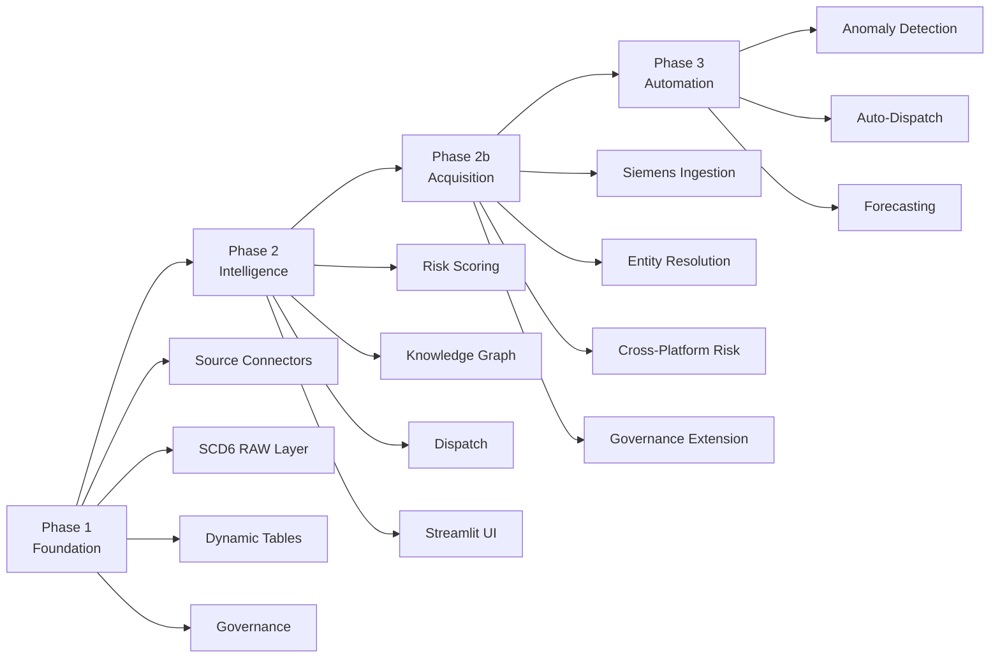

# DCIM — Phased Execution Plan

> From governed data lake to predictive operations in three phases.

---

## Phase 1: Foundation — Governed Data Lake

### Objective

Unify all three source systems into Snowflake with governance, SCD6 state tracking, and declarative freshness.

### Deliverables

| # | Deliverable | Details |
|---|-------------|---------|
| 1 | Source ingestion | Fivetran (ServiceNow), Airbyte (Workday), Snowpipe Streaming (Telemetry) |
| 2 | RAW layer with SCD6 | 18 tables across 3 schemas; CURRENT/HISTORICAL/ORIGINAL columns |
| 3 | CURATED Dynamic Tables | 14 tables with tiered target lags (1min–1hr) |
| 4 | RBAC + Tags + Masking | 4 roles, column tags on all tables, PII masking for NOC |
| 5 | Cross-system ID resolution | Deterministic uuid5 linkage across all three systems |
| 6 | Validation suite | Data quality checks on freshness, completeness, referential integrity |

### Success Metrics

| Metric | Target |
|--------|--------|
| All 14 Dynamic Tables within target lag | 99.5% of time |
| Cross-system join accuracy | >99% on uuid5 keys |
| Query response time (curated) | <3 seconds for standard analytics |
| Tag coverage | 100% of columns tagged |
| Zero unmasked PII exposure to NOC role | 0 violations |

---

## Phase 2: Intelligence — Cross-System Analytics

### Objective

Layer analytics that require joining across system boundaries: risk scoring, MTTR analysis, and graph-based dispatch.

### Deliverables

| # | Deliverable | Details |
|---|-------------|---------|
| 1 | Risk scoring engine | SP_DCIM_RISK_SCORING: 40% error rate + 30% cert gap + 30% SLA tier |
| 2 | MTTR analysis | SP_DCIM_MTTR_ANALYSIS: risk-weighted resolution metrics by campus |
| 3 | Knowledge Graph | RAI SPCS with infrastructure + workforce nodes and edges |
| 4 | Dispatch optimization | SP_DCIM_NEAREST_QUALIFIED_TECH: graph pathfinding for dispatch |
| 5 | Time Travel procedures | SP_DCIM_TIME_TRAVEL: full state reconstruction for any entity |
| 6 | Audit trail | SP_DCIM_CHANGE_AUDIT_TRAIL: cross-system change correlation |
| 7 | Semantic views | 3 views for natural-language analytics |
| 8 | Streamlit Command Center | NOC-facing dashboard with dispatch, risk, and time travel UI |

### Success Metrics

| Metric | Target |
|--------|--------|
| MTTR reduction (P1 incidents) | >35% vs. baseline |
| Dispatch accuracy (first-try correct) | >90% |
| Time-to-root-cause (post-mortem) | <15 minutes |
| Certification gap detection lead time | >30 days before expiry |
| Risk score refresh cadence | <5 minutes |

---

## Phase 2b: Acquisition Integration — Siemens Portfolio (2K DCs)

### Objective

Absorb the acquired Siemens Desigo CC estate (2,000 data centers, 47 countries) into the unified platform without disrupting existing operations. Entity resolution, governance extension, and cross-platform risk visibility.

### The Acquisition Context

A $4.2B acquisition brought 2,000 Siemens-managed data centers online. Board timeline: unified visibility in 60 days, SOC 2 compliance in 90 days, synergy realization in 180 days. Traditional approach (ERP migration) would take 3 years. Knowledge Graph approach targets 90 days.

### Deliverables

| # | Deliverable | Details |
|---|-------------|---------|
| 1 | Siemens data ingestion | 8 tables (facilities, zones, PDUs, cooling, fire, racks, BMS sensors, maintenance orders) via Snowpipe |
| 2 | Siemens curated layer | 8 Dynamic Tables in CURATED_DEV.SIEMENS_DCIM with 1-min to 24-hr lags |
| 3 | Entity resolution engine | SAME_AS edges (manual mapping, ~5%) + CANDIDATE_SAME_AS (algorithmic, ~18%) |
| 4 | Siemens graph population | 6 node types (SM_FAC_, SM_ZONE_, SM_PDU_, SM_COOL_, SM_RACK_, SM_MO_) + containment edges |
| 5 | Siemens risk scoring | Cooling degradation, ungoverned facilities, maintenance backlog detection |
| 6 | Acquisition integration dashboard | Streamlit Tab 5: migration progress, entity resolution, cross-platform risk |
| 7 | Cross-platform semantic views | DCIM_ACQUISITION_INTEGRATION_STATUS, DCIM_CROSS_PLATFORM_RISK |
| 8 | Governance extension | Tags, masking policies, RBAC for acquired schemas |

### Success Metrics

| Metric | Target |
|--------|--------|
| Facilities with governance status "GOVERNED" | >30% within 90 days |
| Entity resolution coverage (racks matched) | >60% (SAME_AS + CANDIDATE_SAME_AS) |
| Cross-platform risk visibility | 100% of CRITICAL/HIGH risks visible to NOC from Day 1 |
| BMS sensor freshness | <2 minute lag for all 500K sensor readings |
| Maintenance order ↔ Incident correlation | >50% auto-linked |
| SOC 2 evidence for acquired estate | Exportable within 90 days of close |

### Siemens-Specific Risks

| Risk | Likelihood | Impact | Mitigation |
|------|-----------|--------|-----------|
| BMS sensor volume overwhelms Snowpipe | Medium | Delayed cooling alerts | Implement tiered ingestion: ALARM/CRITICAL first, NORMAL batch |
| Entity resolution false positives | High | Wrong rack mapped → wrong tech dispatched | Two-tier: auto-match at 0.7, human confirmation required above threshold |
| German naming creates search failures | Medium | NOC can't find Siemens assets | Bi-lingual display names in graph nodes (Standort / Site Name) |
| Acquired staff unfamiliar with Snowflake | High | Adoption stalls at Siemens team | Training sprint + read-only Streamlit access from Day 1 |

---

## Phase 3: Automation — Predictive Operations

### Objective

Move from reactive to predictive with ML-driven anomaly detection, automated dispatch, and capacity forecasting.

### Deliverables

| # | Deliverable | Details |
|---|-------------|---------|
| 1 | Anomaly detection | Cortex ML on telemetry streams; detect degradation before threshold breach |
| 2 | Automated dispatch | ServiceNow API integration; auto-assign based on graph recommendations |
| 3 | Capacity forecasting | Power, thermal, and staffing forecasts by campus |
| 4 | Certification pipeline | Proactive training recommendations based on coverage projections |
| 5 | Change risk scoring | ML-based risk assessment for scheduled changes |
| 6 | Self-healing playbooks | Auto-remediation for known failure patterns (firmware rollback, port reset) |

### Success Metrics

| Metric | Target |
|--------|--------|
| Incidents predicted before alert | >25% of P1/P2 |
| Automated dispatch (no human in loop) | >60% of P3/P4 |
| Capacity forecast accuracy (30-day) | >85% |
| Change-induced incidents | <5% of changes |
| Mean time to detection (anomaly) | <10 minutes before traditional alert |

---

## Phase Dependencies

---

## Risk Register

| Risk | Likelihood | Impact | Mitigation |
|------|-----------|--------|-----------|
| ServiceNow API rate limits | Medium | Delays P1 ingestion | Batch CDC with Fivetran; negotiate API tier |
| RAI SPCS availability | Low | Blocks P2 graph features | Dispatch falls back to rule-based scoring |
| Telemetry volume exceeds estimates | Medium | Cost overrun on Snowpipe | Implement sampling; tier by criticality |
| Workday data quality (cert dates) | High | False cert gap alerts | Validation layer with manual override |
| Organizational change resistance | High | Adoption stalls at NOC | Start with "advisor mode"; human confirms dispatch |
