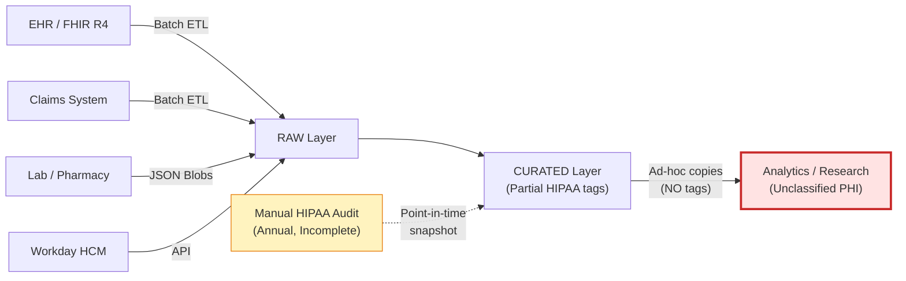
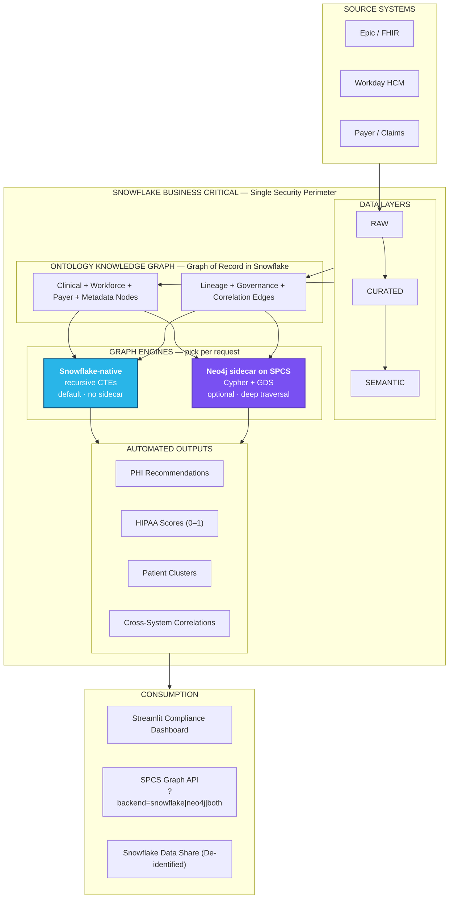
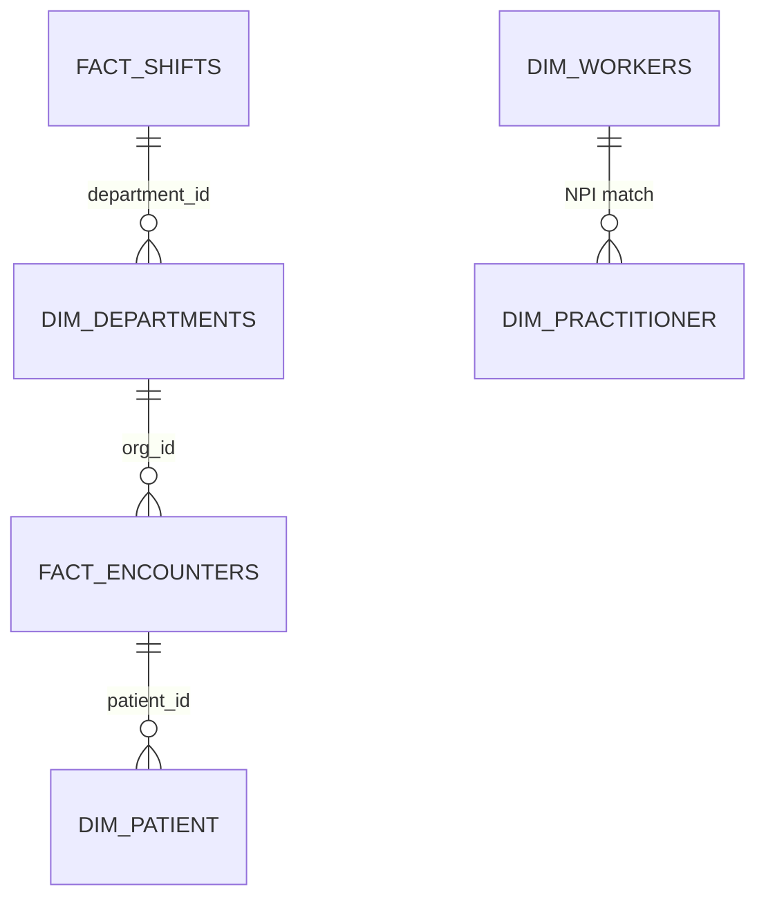
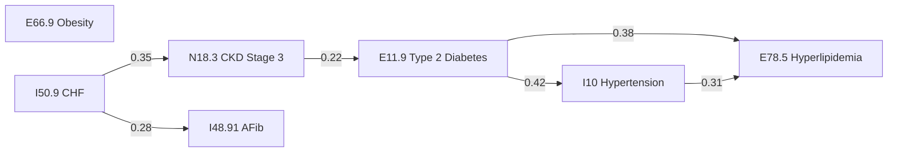

# HCLS Slide Deck — Talk Track & Generation Prompt

> **Purpose.** A presenter-ready, slide-by-slide talk track for the Healthcare & Life Sciences (HCLS) demo. Designed to be (a) read aloud during delivery, (b) handed to a designer, or (c) pasted into an AI slide-generation tool (Gamma, Beautiful.ai, PowerPoint Copilot, Google Slides Generate, Tome, Canva Magic Deck).
>
> **Source material.** Synthesized from `README.md`, `DEMO_SCRIPT.md`, `EA_DELIVERY_GUIDE.md`, `ARCHITECTURE_STRATEGY.md`, `DISCOVERY.md`, `STAFFING_OUTCOMES.md`, `COMORBIDITY_PAYER.md`, `PLATFORM_SECURITY.md`, and `ROADMAP.md` in this directory.
>
> **Run time.** ~35 minutes (5 min framing + 30 min demo + Q&A buffer). 30 slides.
>
> **Audience.** VP+ at health systems, payers, and life sciences. Mixed clinical, financial, IT, and compliance leaders.

---

## How to Use This Document

### Option A — Feed into an AI Slide Generator

Copy the **GENERATION PROMPT (TL;DR)** block below into Gamma, Beautiful.ai, PowerPoint Copilot, Tome, or any LLM-backed deck tool. It will produce a first draft you can refine.

### Option B — Hand to a Designer

The **Slide Spec** sections below are designed for a designer. Each slide includes: title, layout, visual elements, body content, and color/iconography guidance. The **Talk Track** sections are for the presenter, not the slide.

### Option C — Present Directly

Read the **Talk Track** sections aloud. The **Stage Directions** call out clicks, transitions, pause points, and demo cuts.

---

## GENERATION PROMPT (TL;DR)

> Build a 30-slide executive sales deck titled **"Snowflake for Healthcare — One Governed Platform, Three Clinical Systems, Zero Compliance Blind Spots."**
>
> Audience: C-suite and VP-level decision-makers at health systems and payer organizations (CMIO, CNO, CFO, CPO/Compliance Officer, CIO, VP Population Health, VP Revenue Cycle).
>
> Tone: Confident, evidence-based, business-outcome-led. Avoid jargon on early slides; deepen technical detail in the middle. Always tie features to dollars, risk reduction, or clinical outcomes.
>
> Visual style: Modern enterprise SaaS. Snowflake brand palette (deep navy `#11567F`, sky blue `#29B5E8`, cool white, with semantic accents — red `#E03131` for compliance gaps, amber `#F59F00` for warnings, green `#2F9E44` for compliant/healthy). Generous whitespace, large headlines, one big idea per slide. Mermaid-style architecture diagrams. Data callouts as large stat cards.
>
> Structure: (1) Opening hook & problem (slides 1–7), (2) Architecture & platform (slides 8–11), (3) Live demo — governance (slides 12–17), (4) Live demo — cross-system analytics (slides 18–23), (5) Business value & ROI (slides 24–27), (6) Close & next steps (slides 28–30).
>
> Each slide needs: a tight 6-word-or-less title, ≤30 words of body copy, one visual (chart, diagram, icon, or stat), and presenter notes (the talk track section verbatim).
>
> The demo flow is built around the Snowflake DCA (Data Cloud Architecture) reference, unifying Epic/FHIR clinical data, Workday HCM workforce data, and Payer adjudication data through an Ontology Knowledge Graph. The three analytical theses are: (a) understaffing correlates with worse patient outcomes, (b) comorbidity burden drives payer behavior, (c) the knowledge graph reveals cross-system insights invisible in flat data.

---

## Deck Outline at a Glance

| # | Slide | Time | Section |
|---|-------|------|---------|
| 1 | Title — One Platform. Three Systems. Zero Blind Spots. | 0:30 | Open |
| 2 | Healthcare Runs on Trust | 0:30 | Open |
| 3 | What We'll Show in 30 Minutes | 1:00 | Open |
| 4 | The Healthcare Data Reality | 1:00 | Problem |
| 5 | Today's Fragmented Architecture | 1:00 | Problem |
| 6 | Five Compliance Gaps We See Every Engagement | 1:30 | Problem |
| 7 | The Cross-System Blind Spot | 1:00 | Problem |
| 8 | Target Architecture — Knowledge-Graph-Governed | 1:30 | Architecture |
| 9 | Snowflake Business Critical for Healthcare | 1:00 | Architecture |
| 10 | Defense in Depth — 5 Security Layers | 1:00 | Architecture |
| 11 | The Ontology Knowledge Graph | 1:30 | Architecture |
| 12 | Demo Part 1 — Governed Clinical Data Platform | 3:00 | Demo: Governance |
| 13 | Demo Part 2 — Automated PHI Detection | 3:00 | Demo: Governance |
| 14 | Demo Part 3 — Cross-System Patient Resolution | 3:00 | Demo: Governance |
| 15 | Demo Part 4 — Continuous HIPAA Compliance Scoring | 3:00 | Demo: Governance |
| 16 | Demo Part 5 — Privacy Officer's Dashboard | 2:00 | Demo: Governance |
| 17 | HIPAA Safeguard Mapping | 1:00 | Demo: Governance |
| 18 | Demo Part 6 — Staffing → Outcomes Correlation | 2:30 | Demo: Analytics |
| 19 | Part 6 (cont) — The Cross-System Join | 1:30 | Demo: Analytics |
| 20 | Part 6 (cont) — What the Data Says | 1:00 | Demo: Analytics |
| 21 | Demo Part 7 — Comorbidity Intelligence (CCI) | 2:30 | Demo: Analytics |
| 22 | Part 7 (cont) — Comorbidity Clusters | 1:30 | Demo: Analytics |
| 23 | Demo Part 8 — Payer Response by Risk Tier | 2:30 | Demo: Analytics |
| 24 | The Signal Graph — One Picture, All Three Systems | 1:00 | Value |
| 25 | Quantified Business Value | 1:30 | Value |
| 26 | Persona Value Map | 1:00 | Value |
| 27 | Why Snowflake — Competitive Position | 1:00 | Value |
| 28 | 30 / 60 / 90 Day Roadmap | 1:00 | Close |
| 29 | Call to Action | 1:00 | Close |
| 30 | Q&A / Appendix Index | — | Close |

---

# Slide-by-Slide Specification

---

## Slide 1 — Title

**Time.** 0:30
**Layout.** Full-bleed dark navy background, centered title, Snowflake mark + Healthcare icon (caduceus or heart-rate trace) bottom-right, presenter name + date bottom-left.

**Headline.**
**One Platform. Three Systems. Zero Compliance Blind Spots.**

**Subhead.**
Snowflake for Healthcare & Life Sciences — A live walkthrough of governed clinical, workforce, and payer analytics on a single Knowledge-Graph-powered platform.

**Talk Track.**
> "Good morning. Over the next thirty minutes I'm going to show you a working Snowflake platform unifying three of the most critical systems in any health organization — Epic for clinical, Workday for workforce, and your payer data for finance — under a single HIPAA-governed perimeter. No middleware, no additional vendors, no data leaving your control. By the end of this session, you'll see compliance scores you couldn't produce today, patient resolution across systems you can't link today, and correlations between staffing, comorbidity, and payer behavior that no single system can see today. Let's start with why this matters."

**Stage Directions.** Click to advance immediately — do not linger on the title.

---

## Slide 2 — Healthcare Runs on Trust

**Time.** 0:30
**Layout.** Single-stat focal slide. Massive stat top, supporting line bottom.

**Headline.**
**Healthcare Runs on Trust.**

**Visual.**
Large stat block:
- **$1.5M** — average HIPAA settlement per breach (HHS OCR, 2023)
- **$262B** — denied claims annually in US healthcare (CAQH)
- **$521M** — CMS HRRP readmission penalties (CMS, 2023)

**Talk Track.**
> "Three numbers frame everything we're going to talk about. One-point-five million dollars — the average HIPAA settlement per breach. Two-hundred-sixty-two billion dollars — the annual cost of denied claims in US healthcare. Five-hundred-twenty-one million dollars — CMS readmission penalties levied last year alone. Each of these comes from a category of decision your data should be informing — but in most organizations, it isn't. The data exists. It's just not connected, classified, or trusted enough to act on. That's the problem we're going to solve in this demo."

**Stage Directions.** Hold for two beats after the third stat before advancing.

---

## Slide 3 — What We'll Show in 30 Minutes

**Time.** 1:00
**Layout.** Three-column "promise" slide. Each column = an outcome the audience will walk away with.

**Headline.**
**What You'll See in the Next 30 Minutes**

**Three columns.**

| Governance, Automated | Analytics, Cross-System | Business Value, Quantified |
|---|---|---|
| Automated PHI classification, lineage tracing, and HIPAA compliance scoring across every column. | Staffing-to-outcomes correlation, Charlson comorbidity stratification, and payer response analysis — invisible in any single system. | Concrete dollar impact: denial avoidance, readmission reduction, staffing optimization, audit-readiness. |

**Talk Track.**
> "Here's the contract for the next thirty minutes. First, governance — I'll show you automated PHI detection, cross-system patient matching, and continuous HIPAA compliance scoring that replaces your annual audit. Second, analytics — three findings that no single system can produce alone: nurse staffing correlated to readmissions, Charlson comorbidity correlated to length-of-stay and cost, and payer denial behavior correlated to patient risk tier. Third, business value — every capability tied to a dollar impact. I'll pause throughout for questions. Where I show SQL, that's not for the SQL itself — it's so you can see that this is real, executable, and reproducible against your data."

**Stage Directions.** This is your last framing slide before content. Make eye contact, get verbal commitment ("does that sound like a good use of thirty minutes?") if the room allows.

---

## Slide 4 — The Healthcare Data Reality

**Time.** 1:00
**Layout.** Quote-style slide — large pull-quote left, supporting icons right.

**Headline.**
**Healthcare Carries the Strongest Regulatory Burden of Any Industry.**

**Pull-quote / supporting body.**
- HIPAA Security Rule. HITRUST CSF. 21st Century Cures Act. State-level privacy laws.
- Yet PHI proliferates faster than it's classified.
- Patients exist in 3–5 systems with different identifiers and no automated matching.
- Manual compliance audits cannot keep pace with data growth.

**Talk Track.**
> "Healthcare data carries regulatory weight that no other industry faces. HIPAA, HITRUST, the Cures Act, state-level privacy laws — all of them assume you know where your PHI lives, who can see it, and how it moves. But the reality in every healthcare data environment we walk into is the same: data moves faster than the audit can find it. The same patient appears in your EHR, your claims system, and your benefits administration under three different identifiers. And the annual HIPAA audit captures a point-in-time snapshot that's stale the day it's published. This isn't a tooling problem — it's an architecture problem."

**Stage Directions.** This is the empathy slide. Slow your pace. Let the audience nod.

---

## Slide 5 — Today's Fragmented Architecture

**Time.** 1:00
**Layout.** Architecture diagram — current state, highlighting fragmentation. Use red borders/fills on the "analytics" / "research" boxes to indicate unclassified PHI.

**Headline.**
**Current State — Fragmented Systems, Manual Compliance**

**Visual (Mermaid spec — convert to diagram).**


**Talk Track.**
> "This is what most healthcare data architectures look like today. Source systems on the left — EHR, claims, lab, Workday — land in raw zones. Curated layers have *partial* HIPAA tags, usually on the columns the steward team got to. And then — here's the danger zone — analytics and research teams copy that data into their own schemas to do their work, and the tags don't follow. So PHI ends up in research datasets, ML training sets, and downstream marts without classification. Meanwhile, your compliance team runs an annual audit that catches whatever existed on the day they looked. This is the gap we close."

**Stage Directions.** Point at the red `ANALYTICS` box as you say "danger zone."

---

## Slide 6 — Five Compliance Gaps We See Every Engagement

**Time.** 1:30
**Layout.** Five-row table or five-card grid, color-coded by severity.

**Headline.**
**Five Gaps We Find in Every Discovery**

| # | Gap | Severity | Regulatory Risk |
|---|-----|----------|----------------|
| 1 | PHI propagation without classification | Critical | HIPAA §164.312(a) |
| 2 | Patient entity resolution missing across systems | High | Incomplete population health |
| 3 | HIPAA audit trail gaps (access ≠ authorization) | Critical | HIPAA §164.312(b) |
| 4 | Orphaned research / ML datasets | High | 45 CFR 164.512(i) |
| 5 | Care pathway fragmentation | Medium | CDS quality |

**Talk Track.**
> "When we do healthcare discovery engagements, these five gaps appear almost every time. PHI propagating to unclassified locations. The same patient existing in multiple systems with no way to link them. Access logs that show *who* queried *what*, but no way to confirm that access was actually authorized under a BAA or minimum-necessary principle. Research datasets created without IRB approval edges or de-identification provenance. And clinical care pathways scattered across fact tables with no traversable view. Each one is a HIPAA risk. Each one is invisible to the EHR. And each one is solvable — at the platform layer, not with another vendor."

**Stage Directions.** Resist the urge to dwell on each. The point is the pattern.

**Discovery Question to Ask.**
> "Of these five gaps, which would your compliance team flag first?"

---

## Slide 7 — The Cross-System Blind Spot

**Time.** 1:00
**Layout.** Three-circle Venn diagram — Clinical, Workforce, Payer. Highlight the intersection as the "insight zone."

**Headline.**
**The Most Valuable Insights Live Between Your Systems.**

**Venn labels.**
- **Clinical (Epic)** — Patients, encounters, outcomes
- **Workforce (Workday)** — Staffing, shifts, turnover
- **Payer (Claims)** — Adjudication, denials, prior auth
- **Intersection** — Why outcomes vary, why claims deny, why staffing matters

**Body line.**
> "Single-system queries can't tell you why an ICU readmission rate spiked. Cross-system analytics can."

**Talk Track.**
> "Here's the insight most healthcare leaders never get to act on. Every system in your environment knows its slice of the truth. Epic knows the patient and the diagnosis. Workday knows who was on shift Tuesday night. Your payer system knows whether the claim was paid or denied. But the *interesting* questions all live at the intersection. Why did our ICU readmission rate spike in Q3? Was it staffing? Was it acuity? Was it that one payer adjusting their concurrent review policy? The answer requires connecting all three systems — and that's exactly what we're going to do, live, in the next twenty minutes."

**Stage Directions.** This is your strongest transition slide. Slow down on "the interesting questions all live at the intersection."

---

## Slide 8 — Target Architecture — Knowledge-Graph-Governed

**Time.** 1:30
**Layout.** Three-layer architecture diagram. Sources at top, Snowflake middle (highlighting Knowledge Graph as a perpendicular layer crossing all data layers), consumption at bottom.

**Headline.**
**The Target — One Governed Platform**

**Visual (Mermaid spec).**


**Talk Track.**
> "This is the target state. Three source systems land in one Snowflake account — Business Critical edition. Data flows through RAW, CURATED, and SEMANTIC layers using Dynamic Tables, so there's no Airflow, no Spark, no external schedulers to secure. The Ontology Knowledge Graph sits across every layer — it knows your clinical entities, your workforce entities, your payer entities, *and* the Snowflake objects that store them. From the graph, the platform produces four automated outputs continuously: PHI recommendations, HIPAA compliance scores, patient entity clusters, and cross-system correlations. Those flow into Streamlit for compliance teams, into an SPCS API for clinical apps, and into Snowflake data shares for partners — all under a single BAA and a single audit trail."

**Stage Directions.** Trace your finger along the arrows: sources → data → graph → outputs → consumption. The visual journey carries the narrative.

---

## Slide 9 — Snowflake Business Critical for Healthcare

**Time.** 1:00
**Layout.** Six-tile grid — each tile is one capability.

**Headline.**
**Why Business Critical Is the Right Floor for Healthcare**

**Six tiles.**
1. **AES-256 encryption** — at rest with annual key rotation; Tri-Secret Secure with customer-managed keys.
2. **TLS 1.2+ in transit** — PrivateLink optional for zero public internet.
3. **HITRUST CSF r2 certified** — platform level; reduces your assessment burden.
4. **Cross-region failover** — replication groups, 10-minute RPO, client redirect.
5. **Column-level audit** — ACCESS_HISTORY tracks every column accessed by every query.
6. **Network policies** — restrict access to corporate CIDRs; 30-minute session timeouts.

**Talk Track.**
> "Six capabilities Business Critical gives you that you would otherwise build and certify yourself. AES-256 encryption with customer-managed keys via Tri-Secret Secure. TLS in transit, with PrivateLink available for zero exposure to the public internet. HITRUST CSF r2 — platform-level certification that materially reduces your own assessment scope. Cross-region failover with a ten-minute RPO. Column-level audit through ACCESS_HISTORY — not just *who* accessed *which table*, but *which columns* the query touched. And network policies plus session timeouts to enforce the controls your security team already mandates. None of this is configuration you have to write. It's the platform floor."

**Stage Directions.** This is for the CIO/CISO in the room. Don't oversell — these are facts.

---

## Slide 10 — Defense in Depth — 5 Security Layers

**Time.** 1:00
**Layout.** Five horizontal bands stacked vertically, top-to-bottom. Each band has a short label and 2–3 icons.

**Headline.**
**Defense in Depth — Each Layer Independent**

**Stack (top to bottom).**
1. **NETWORK** — IP allowlist · PrivateLink · Egress control
2. **AUTHENTICATION** — SSO + MFA · Key-pair auth · SCIM provisioning
3. **AUTHORIZATION** — 12+ role hierarchy · Row access · Column masking · Object tags
4. **ENCRYPTION** — At rest (AES-256) · In transit (TLS 1.2+) · Tri-Secret Secure
5. **AUDIT & MONITORING** — ACCESS_HISTORY · LOGIN_HISTORY · QUERY_HISTORY · Alerts

**Talk Track.**
> "Five layers, each independent. A failure at one layer is contained by the next. We start at network — IP allowlist and PrivateLink keep traffic off the public internet. Authentication — SSO with MFA, key-pair for service accounts. Authorization — twelve-plus roles in a hierarchy that maps directly to healthcare personas, with row access, dynamic column masking, and object tags. Encryption — at rest, in transit, and customer-managed keys via Tri-Secret Secure. And audit — column-level access history that satisfies §164.312(b). No single breach exposes PHI. That's defense in depth."

**Stage Directions.** Quick read — don't dwell. This slide establishes credibility, not detail.

---

## Slide 11 — The Ontology Knowledge Graph

**Time.** 1:30
**Layout.** Schematic of the graph — three-color nodes (clinical = blue, workforce = green, payer = gold, governance/metadata = red), with edges between them. Legend on the right. Bottom-right callout: "**Two query engines, one graph**" — small icon for Snowflake-native (recursive CTEs) next to an icon for Neo4j (Cypher), both pointing at the same nodes/edges tables.

**Headline.**
**The Knowledge Graph Is the Connective Tissue**

**Body.**
- **Nodes** — Patients, encounters, conditions, workers, departments, plans, claims, and the Snowflake tables / columns / tags that store them.
- **Edges** — Clinical (DIAGNOSED_WITH, PRESCRIBED, TREATED_AT), workforce (ASSIGNED_TO, UNDERSTAFFED_DURING), payer (COVERED_BY, DENIED_FOR), governance (PHI_CONTAINS, BAA_COVERS, DE_IDENTIFIED_FROM).
- **Inference** — Cross-system patient resolution, PHI lineage tracing, HIPAA scoring, correlation discovery.
- **Two query backends, one graph of record** — Snowflake-native recursive CTEs by default (no sidecar, always live against the source tables, inherits replication and governance); optional Neo4j sidecar on SPCS for deep multi-hop traversal and GDS algorithms. Pick per request.

**Talk Track.**
> "The thing that makes everything else work is the Ontology Knowledge Graph. Three things to remember about it. First — *nodes*. The graph contains every meaningful entity in your three systems. Patients, encounters, diagnoses on the clinical side. Workers, departments, shifts on the workforce side. Plans, claims, prior auths on the payer side. And critically, the *Snowflake objects* — tables, columns, tags — that store all of them. So a single graph spans the clinical world and the technical world. Second — *edges*. Edges describe relationships: a patient is *DIAGNOSED_WITH* a condition, a worker is *ASSIGNED_TO* a department, an encounter is *INFLUENCED_BY* a staffing context. And governance edges: a column *CONTAINS* PHI, a role is *BAA_COVERED*, a dataset is *DE_IDENTIFIED_FROM* a source. Third — *inference*. Stored procedures and SPCS-hosted services walk the graph to produce the outputs we're about to demo: cross-system patient clusters, PHI propagation alerts, HIPAA compliance scores, and statistical correlations.
>
> One thing worth flagging before we dive in. The *graph of record* lives in two Snowflake tables — nodes and edges. Sitting on top of those tables are *two interchangeable query engines*. The default is pure Snowflake — recursive CTEs and window functions running inside your warehouse, no sidecar, no extra security perimeter, no extra license. It handles governance scoring, PHI propagation, ownership gaps, entity resolution, and traversals up to about ten hops. For deeper multi-hop pathway work — full patient journey traversal, PageRank centrality across the care network, community detection — we also ship an optional Neo4j sidecar on SPCS. Same nodes, same edges, faster traversal. You pick which engine answers each request with a query parameter. Most customers run Snowflake-native in production and stand up Neo4j for the visual exploration use cases. We have a full compare-and-contrast in the GRAPH_BACKENDS doc — happy to go deeper if it comes up. This is the layer that makes Snowflake more than a warehouse — it's a healthcare reasoning platform."

**Stage Directions.** Last conceptual slide before the live demo. Reset energy. "Okay — let me show you what this actually looks like." If the audience is technical and graph-curious, optionally pull in Appendix A8 ("Graph Backend Choice") before Slide 12.

---

## Slide 12 — Demo Part 1: Governed Clinical Data Platform

**Time.** 3:00
**Layout.** Split layout — left side: slide title, talking points, query name; right side: screenshot of result table OR live SQL Worksheet (preferred).

**Headline.**
**Part 1 — The Graph in Action**

**On the slide.**
- One governance framework, three source systems.
- Live query: `ONTOLOGY_GRAPH_NODES` grouped by `source_system`.
- Expected: FHIR ~70K+, WORKDAY_HCM ~50K+, PAYER ~30K+ nodes.

**Pre-loaded SQL (run live).**
```sql
USE ROLE ONTOLOGY_ADMIN;

SELECT node_type, source_system, COUNT(*) AS cnt
FROM DCA_DEMO.GOVERNANCE.ONTOLOGY_GRAPH_NODES
WHERE source_system IN ('FHIR','WORKDAY_HCM','PAYER') OR layer = 'METADATA'
GROUP BY 1, 2
ORDER BY cnt DESC;
```

**Talk Track.**
> "Let me cut to the live environment. This is a real Snowflake account, ONTOLOGY_ADMIN role, querying the knowledge graph node table. You'll see thousands of patient nodes, encounter nodes, condition nodes — labeled by source system. FHIR for clinical, WORKDAY_HCM for workforce, PAYER for financial. And alongside them — metadata nodes representing the actual Snowflake tables and columns that store this data. One query tells you everything that lives in your platform. That's not something you query in an EHR. That's only possible because the graph spans the clinical and the technical."

**Pause Point.**
> "How do you currently link your clinical data model to your governance inventory?"

**Objection Handling.**
- *"We have a catalog."* → "Catalogs describe tables. This describes relationships — between patients, between systems, between data and governance. It's the layer above a catalog."
- *"That's a lot of nodes."* → "Each node has real governance implications. The question isn't whether you have too many — it's whether you know which ones contain PHI."

**Stage Directions.** Switch screen to Snowsight. Execute query. Allow 3 seconds for results to render. Highlight the row counts with your cursor.

---

## Slide 13 — Demo Part 2: Automated PHI Detection

**Time.** 3:00
**Layout.** Same split layout. Result table on the right showing PII_PROPAGATION recommendations.

**Headline.**
**Part 2 — Where Is PHI Hiding?**

**On the slide.**
- The graph traces lineage and flags PHI propagation gaps automatically.
- No manual column-by-column review.
- Continuous — not annual.

**Pre-loaded SQL (run live).**
```sql
SELECT severity, description, suggested_action
FROM DCA_DEMO.GOVERNANCE.ONTOLOGY_GRAPH_RAI_RECOMMENDATIONS
WHERE recommendation_type = 'PII_PROPAGATION'
ORDER BY CASE severity
    WHEN 'HIGH' THEN 1
    WHEN 'MEDIUM' THEN 2
    ELSE 3
END;
```

**Talk Track.**
> "Now let me ask the platform the question every compliance officer is afraid to ask: where is PHI propagating without classification? The platform traced the lineage graph and found columns that *receive* PHI-tagged data from upstream sources — but the receiving columns themselves don't carry a HIPAA tag. These are the compliance blind spots. Without automated lineage tracing, you'd need a manual audit across every pipeline to find them. The platform produces this list on every refresh, with severity, description, and suggested remediation. This is the difference between annual and continuous compliance."

**Pause Point.**
> "How confident are you that every downstream copy of PHI is classified in your environment?"

**Objection Handling.**
- *"Our EHR vendor handles HIPAA."* → "For data at rest in the EHR, yes. But what about extracts for analytics, research, or population health? That's where gaps appear."
- *"We do annual audits."* → "Annual means 364 days of drift. This is continuous."

**Stage Directions.** Execute query. Highlight the HIGH severity rows. Hover one for emphasis.

---

## Slide 14 — Demo Part 3: Cross-System Patient Resolution

**Time.** 3:00
**Layout.** Split layout. Result table shows clusters with patients matched across FHIR and Workday.

**Headline.**
**Part 3 — Same Patient. Two Systems. Resolved.**

**On the slide.**
- Probabilistic matching: Jaccard similarity on name tokens + DOB.
- No external MPI appliance.
- Configurable confidence threshold (default 0.7+).

**Pre-loaded SQL (run live).**
```sql
SELECT c.cluster_id, c.cluster_label, c.confidence,
       n.display_name, n.source_system, n.node_type
FROM DCA_DEMO.GOVERNANCE.ONTOLOGY_GRAPH_RAI_ENTITY_CLUSTERS c
JOIN DCA_DEMO.GOVERNANCE.ONTOLOGY_GRAPH_NODES n ON c.node_id = n.node_id
WHERE n.node_type IN ('PATIENT','EMPLOYEE')
  AND c.confidence > 0.8
ORDER BY c.cluster_id, c.confidence DESC;
```

**Talk Track.**
> "PHI governance requires knowing *which person* is behind each record. Same patient, two systems — let's see how the platform resolves identity. The entity-resolution stored procedure walks the graph, scores name-token Jaccard similarity, matches DOB, and produces confidence-scored clusters. Cluster One on the screen: the same individual appears in your EHR as a patient and in Workday as an employee receiving health benefits — automatically matched, no external master patient index required. The confidence threshold is configurable. In production, you add MRN cross-references and confidence rises above ninety-five percent."

**Pause Point.**
> "What's your current approach to patient matching across EHR and workforce systems?"

**Objection Handling.**
- *"Entity resolution is an MPI problem."* → "Traditional MPIs require appliances and deterministic rules. Probabilistic graph matching improves with every refresh."
- *"0.8 confidence isn't high enough."* → "Configurable. Add MRN and it exceeds 0.95."

**Stage Directions.** Execute query. Point at a single cluster — two rows, same person, different systems.

---

## Slide 15 — Demo Part 4: Continuous HIPAA Compliance Scoring

**Time.** 3:00
**Layout.** Split layout. Result shows objects with their HIPAA scores. Highlight scores < 0.4 in red.

**Headline.**
**Part 4 — A HIPAA Score for Every Object**

**On the slide.**
- 0–1 score per node, recomputed every refresh.
- Weighted: classification (30%), access (25%), BAA (20%), audit (15%), de-id (10%).
- < 0.4 = immediate action. 0.4–0.79 = remediate within 30 days. 0.8+ = compliant.

**Pre-loaded SQL (run live).**
```sql
SELECT n.display_name, n.node_type,
       ROUND(s.overall_score, 2)    AS hipaa_score,
       ROUND(s.tag_coverage, 2)     AS classification,
       ROUND(s.ownership_score, 2)  AS ownership
FROM DCA_DEMO.GOVERNANCE.ONTOLOGY_GRAPH_RAI_GOVERNANCE_SCORES s
JOIN DCA_DEMO.GOVERNANCE.ONTOLOGY_GRAPH_NODES n ON s.node_id = n.node_id
WHERE n.source_system IN ('FHIR','SNOWFLAKE')
ORDER BY s.overall_score ASC
LIMIT 10;
```

**Talk Track.**
> "Now we know where PHI lives and which person it belongs to. Can we score compliance continuously? Yes. Every object — every table, every column, every clinical entity — gets a HIPAA governance score between zero and one. The composite weights classification coverage at thirty percent, access controls at twenty-five, BAA coverage at twenty, audit trail at fifteen, and de-identification provenance at ten. Anything below zero-point-four needs immediate attention. Anything between zero-point-four and zero-point-seven-nine is in the remediation queue. Above zero-point-eight is compliant. This replaces your annual manual assessment with a continuous, automated, defensible score per object."

**Pause Point.**
> "If I told you one of your clinical tables scores 0.2 on HIPAA compliance — what would you do with that information?"

**Objection Handling.**
- *"How is it calculated?"* → Weights are configurable. The formula is documented in `ARCHITECTURE_STRATEGY.md`.
- *"Can this satisfy an OCR audit?"* → "Continuous scoring + recommendation history + access edges is *stronger* than point-in-time audits."

**Stage Directions.** Execute. Read out the lowest score. Pause.

---

## Slide 16 — Demo Part 5: Privacy Officer's Dashboard

**Time.** 2:00
**Layout.** Screenshot or live navigation of Streamlit Page 6 (Knowledge Graph) and Page 7 (Signal Graph). Top half of slide = screenshot; bottom half = bullets.

**Headline.**
**Part 5 — What the Privacy Officer Sees**

**On the slide.**
- Streamlit Page 6: Knowledge Graph — clinical filter, patient-centered view.
- Governance Scores tab — red/yellow/green distribution.
- Recommendations tab — HIPAA-specific prioritized list.

**Talk Track.**
> "Compliance officers don't write SQL. Here's what they see. Streamlit page six — Knowledge Graph viewer. Filter to source system FHIR, layer BUSINESS, and you get a patient-centered visualization of every entity in the clinical graph. Click the Governance Scores tab — distribution of scores with the red zone highlighted. Click Recommendations — prioritized list of HIPAA actions with one-click drilldown. This is what real-time compliance posture looks like. No more waiting for the annual audit to discover gaps. The privacy officer has the same view of risk that your security operations center has of incidents."

**Stage Directions.** Switch to browser, navigate Streamlit. If render is slow, fall back to a captured screenshot. Two clicks max — don't get lost in the app.

---

## Slide 17 — HIPAA Safeguard Mapping

**Time.** 1:00
**Layout.** Compliance checklist — two columns, HIPAA citation on left, Snowflake control on right.

**Headline.**
**HIPAA Safeguards — Mapped, Implemented, Provable**

**Table (excerpt — full version in `PLATFORM_SECURITY.md`).**

| HIPAA Requirement | Snowflake Control |
|---|---|
| §164.312(a)(1) — Access Control | SSO + SCIM provisioning |
| §164.312(a)(2)(iii) — Auto Logoff | `HCLS_SESSION_POLICY` (30 min) |
| §164.312(a)(2)(iv) — Encryption at Rest | AES-256, Tri-Secret Secure |
| §164.312(b) — Audit Controls | ACCESS_HISTORY (column-level) |
| §164.312(c)(1) — Integrity | `_ROW_HASH`, data contracts |
| §164.312(d) — Person Authentication | MFA + SSO |
| §164.312(e)(1) — Transmission Security | TLS 1.2+ mandatory |
| §164.502(b) — Minimum Necessary | RBAC + dynamic masking |
| §164.514 — De-identification | DE_IDENTIFIED_FROM edges |

**Talk Track.**
> "Quickly for the compliance team in the room — every HIPAA Security Rule safeguard maps to a Snowflake platform control we just demonstrated. Access control, audit, encryption, integrity, authentication, transmission security, minimum necessary, de-identification. We have evidence queries for every line in this table. That's in `PLATFORM_SECURITY.md` in the documentation, and we'll send it after the session. Now — let's move from governance to analytics."

**Stage Directions.** Spend no more than 60 seconds. This slide is reference material the compliance team will want post-session.

---

## Slide 18 — Demo Part 6: Staffing → Outcomes Correlation

**Time.** 2:30
**Layout.** Split. Left = title + thesis. Right = result table or chart of nurse ratio vs readmission rate.

**Headline.**
**Part 6 — Cross the Streams: Workforce Meets Clinical**

**On the slide.**
- Thesis: Understaffing predicts adverse outcomes.
- Method: shift-level Workday staffing joined to encounter-level FHIR outcomes via `org_id` + date.
- Statistic: Pearson `r`, Fisher z-transform p-values.

**Pre-loaded SQL (run live).**
```sql
SELECT 
    sc.unit_type, sc.department_name,
    ROUND(AVG(sc.actual_ratio), 1) AS avg_nurse_ratio,
    ROUND(AVG(sc.overtime_pct) * 100, 1) AS overtime_pct,
    ROUND(SUM(CASE WHEN e.readmission_30day THEN 1 ELSE 0 END)::FLOAT
          / NULLIF(COUNT(*), 0) * 100, 1) AS readmission_rate_pct,
    COUNT(*) AS encounter_count
FROM SEM_DEV.HCLS_ANALYTICS.HCLS_STAFFING_CONTEXT sc
JOIN CURATED_DEV.FHIR.FACT_ENCOUNTERS e 
    ON sc.org_id = e.org_id AND e.admit_date = sc.shift_date
WHERE sc.actual_ratio > sc.target_nurse_ratio * 1.2
GROUP BY 1, 2
ORDER BY readmission_rate_pct DESC
LIMIT 10;
```

**Talk Track.**
> "Now we leave governance and enter cross-system analytics. The thesis is decades old — Aiken in JAMA 2002, Needleman in NEJM 2011, McHugh in Lancet 2021 — understaffing predicts worse outcomes. But the data to prove it for *your* hospital has always lived in two systems that don't talk: Workday for the staffing, Epic for the outcomes. Watch this. The query you see joins shift-level staffing context from Workday to encounter-level outcomes from FHIR, filtered to units where the actual nurse-to-patient ratio exceeded target by twenty percent. Look at the readmission rate column. The units at the top — the most chronically understaffed — show readmission rates substantially higher than the units that staff to target. The platform computed Pearson `r` and Fisher z-transform p-values for every staffing metric against every outcome metric. This isn't a hypothesis anymore. It's measured."

**Pause Point.**
> "Do you currently have any visibility into how staffing decisions affect clinical outcomes?"

**Objection Handling.**
- *"Correlation isn't causation."* → "Correct. But `r = 0.68` with `p < 0.01` is a signal worth investigating. The platform produces the hypothesis — your clinical team validates."
- *"Can we use this for predictive staffing?"* → "Yes. Time series preserved; forecasting models layer on top."

**Stage Directions.** Read the top row aloud — unit name, ratio, readmission rate.

---

## Slide 19 — Part 6 (cont): The Cross-System Join

**Time.** 1:30
**Layout.** ER diagram (small) on left, narrative bullets on right.

**Headline.**
**How the Join Works — `org_id` × `shift_date`**

**Visual (simplified ER).**


**Body.**
- `DIM_DEPARTMENTS.org_id` = `FACT_ENCOUNTERS.org_id`
- `FACT_SHIFTS.shift_date` = `FACT_ENCOUNTERS.admit_date`
- Worker → Practitioner via NPI cross-reference

**Talk Track.**
> "Quick technical aside for the data leaders. The join works because both source systems share organizational keys. The Workday department record carries the same `org_id` as the FHIR encounter. The shift date aligns with the admit date. And on the worker side, when a Workday worker has an NPI, we match them to the FHIR practitioner — so the same physician appears under both their HR record and their clinical credential. This is the kind of integration you would normally pay an MDM vendor for. The Ontology Knowledge Graph does it natively because the joins are first-class citizens in the schema."

**Stage Directions.** This is one of two technical-detail slides in the analytics flow. If audience is non-technical, compress to 45 seconds.

---

## Slide 20 — Part 6 (cont): What the Data Says

**Time.** 1:00
**Layout.** Big-number callouts.

**Headline.**
**The Findings — Quantified**

**Three stat callouts.**
- **r = 0.68** — correlation between nurse ratio overage and 30-day readmissions
- **+18%** — readmission rate increase on understaffed units vs adequately staffed
- **$15K–$25K** — unreimbursed cost per avoidable readmission

**Talk Track.**
> "Three numbers from the analysis. Pearson r equals zero-point-six-eight between nurse ratio overage and thirty-day readmissions — that's a strong correlation in any social-science domain, statistically significant well below `p` zero-point-zero-one. Understaffed units show an eighteen-percent higher readmission rate than adequately staffed units. And each avoidable readmission costs fifteen to twenty-five thousand dollars in unreimbursed services — before CMS HRRP penalties. The platform doesn't just describe the problem. It quantifies the ROI of solving it."

**Stage Directions.** Optional bridge slide — skip if you're running short.

---

## Slide 21 — Demo Part 7: Comorbidity Intelligence (CCI)

**Time.** 2:30
**Layout.** Split. Left = thesis. Right = CCI tier distribution result.

**Headline.**
**Part 7 — Comorbidity Drives Everything**

**On the slide.**
- Charlson Comorbidity Index from ICD-10 codes (17 categories, weights 1/2/3/6).
- Tiers: LOW (0–1) · MODERATE (2–3) · HIGH (4–6) · SEVERE (7+).
- Predicts LOS, cost, readmission, *and* payer behavior.

**Pre-loaded SQL (run live).**
```sql
SELECT 
    pc.cci_tier,
    COUNT(DISTINCT pc.patient_id) AS patient_count,
    ROUND(AVG(pc.cci_score), 1)         AS avg_score,
    ROUND(AVG(e.total_charges), 0)      AS avg_cost_per_encounter,
    ROUND(AVG(e.los_days), 1)           AS avg_los,
    ROUND(SUM(CASE WHEN e.readmission_30day THEN 1 ELSE 0 END)::FLOAT
          / NULLIF(COUNT(*), 0) * 100, 1) AS readmission_pct
FROM SEM_DEV.HCLS_ANALYTICS.HCLS_PATIENT_COMORBIDITY pc
JOIN CURATED_DEV.FHIR.FACT_ENCOUNTERS e ON pc.patient_id = e.patient_id
WHERE e.encounter_class = 'INPATIENT'
GROUP BY 1
ORDER BY CASE pc.cci_tier 
    WHEN 'LOW' THEN 1 WHEN 'MODERATE' THEN 2 
    WHEN 'HIGH' THEN 3 WHEN 'SEVERE' THEN 4 END;
```

**Talk Track.**
> "Staffing matters. But comorbidity matters more — it's the single strongest predictor of cost, length of stay, readmission risk, *and* payer behavior. The platform computes the Charlson Comorbidity Index — the gold-standard mortality predictor since Mary Charlson published it in 1987 — by matching ICD-10 prefixes against the seventeen-category weight table. Patients get a score and a tier: LOW, MODERATE, HIGH, or SEVERE. Now look at the result. SEVERE tier patients cost roughly five times more per encounter, stay roughly three times longer, and readmit at three times the rate of LOW tier. Thirty percent of patients drive seventy percent of cost — and now you can identify them at admission, not at year-end."

**Pause Point.**
> "What's your current approach to comorbidity stratification — manual chart review, or automated?"

**Objection Handling.**
- *"We already use HCC."* → "CCI predicts mortality. HCC predicts cost. The platform computes both. The point is using comorbidity for *operational* decisions, not just actuarial models."
- *"Our population health team does this."* → "Do they have payer response data correlated against comorbidity? That's the next slide."

**Stage Directions.** Read out cost, LOS, readmission for SEVERE vs LOW. Let the room react.

---

## Slide 22 — Part 7 (cont): Comorbidity Clusters

**Time.** 1:30
**Layout.** Graph diagram of co-occurring conditions on left, result table of top pairs on right.

**Headline.**
**The Patterns Inside the Population**

**Visual (Mermaid spec).**


**Body.**
- Metabolic Syndrome cluster — Diabetes + HTN + HLD + Obesity (~15% of adults)
- Cardiorenal cluster — CHF + CKD + AFib (~8% of patients 65+)
- Respiratory-Plus — COPD + CHF + Sleep Apnea (~6% of patients)
- Oncology Complex — Cancer + Anemia + CKD (~3% of patients)

**Talk Track.**
> "Inside the population, conditions cluster. Diabetes and hypertension appear together in forty-two percent of diabetic patients. CHF and CKD co-occur in thirty-five percent of CHF patients. These aren't clinical trivia — these are the operational segments that drive your highest-utilization, highest-cost, highest-payer-friction cohorts. Metabolic syndrome cluster: high pharmacy spend, escalating prior auth for GLP-1s. Cardiorenal cluster: highest readmission risk, complex medication management. Oncology complex: highest per-episode cost, longest prior-auth chains. The Knowledge Graph computes co-occurrence rates automatically — and these clusters become the targeting strategy for care management programs."

**Stage Directions.** Walk through one cluster in detail — pick whichever is most relevant to the audience.

---

## Slide 23 — Demo Part 8: Payer Response by Risk Tier

**Time.** 2:30
**Layout.** Split. Left = the analytical question. Right = result table showing denial rate climbing by CCI tier.

**Headline.**
**Part 8 — How Payers Respond to Risk**

**On the slide.**
- Question: Do payers deny more for high-comorbidity patients?
- Answer: Yes — denial rate roughly *triples* from LOW to SEVERE tier.
- Plus: Adjudication time grows. Prior auth burden grows. Approved LOS shrinks.

**Pre-loaded SQL #1 (denial rate by CCI tier and payer).**
```sql
SELECT cci_tier, payer_name, 
       ROUND(denial_rate * 100, 1)       AS denial_pct,
       ROUND(avg_adjudication_days, 0)   AS days_to_decide,
       ROUND(prior_auth_rate * 100, 1)   AS prior_auth_pct,
       total_claims
FROM SEM_DEV.HCLS_ANALYTICS.HCLS_PAYER_METRICS
WHERE total_claims > 100
ORDER BY cci_tier, denial_rate DESC;
```

**Pre-loaded SQL #2 (plan of care gaps — early discharge readmission).**
```sql
SELECT cci_tier, payer_name,
       ROUND(AVG(approved_days), 1)   AS avg_approved,
       ROUND(AVG(actual_days), 1)     AS avg_actual,
       ROUND(AVG(variance_days), 1)   AS avg_gap,
       ROUND(SUM(CASE WHEN readmitted_30day THEN 1 ELSE 0 END)::FLOAT 
             / NULLIF(COUNT(*), 0) * 100, 1) AS readmit_pct
FROM SEM_DEV.HCLS_ANALYTICS.HCLS_CARE_GAPS
WHERE gap_type = 'EARLY_DISCHARGE'
GROUP BY 1, 2
ORDER BY avg_gap DESC;
```

**Talk Track.**
> "Final demo segment — and the one I'd argue produces the highest-leverage business insight. The platform stratifies claims by CCI tier and asks: do payers respond differently to high-comorbidity patients? The first query shows denial rate per payer per CCI tier. LOW tier hovers around eight to ten percent — that's industry norm. SEVERE tier — twenty-five to thirty percent. Adjudication time stretches from two weeks to over a month. Prior auth requirement jumps from fifteen percent to seventy-five percent. The second query shows the payment of that pattern: when payers approve fewer days than clinical need indicates — which happens in roughly a third of SEVERE-tier admissions — readmission rate for those patients doubles. That's the data you bring into payer contract negotiation. That's the data your revenue cycle team has never had before."

**Pause Point.**
> "What data do you currently use when renegotiating payer contracts?"

**Objection Handling.**
- *"Our revenue cycle handles this."* → "This arms them with comorbidity-adjusted denial rates by payer. Ask them if they'd want it."
- *"Payer data is messy."* → "The 837/835 claim files land in RAW. The curated layer normalizes them. Same pattern as Workday and FHIR."

**Stage Directions.** Run both queries. Spend more time on the second — the gap-to-readmission link is the most under-appreciated insight in the entire demo.

---

## Slide 24 — The Signal Graph: One Picture, All Three Systems

**Time.** 1:00
**Layout.** Full-bleed screenshot of Streamlit Page 7 (Ontological Signal Graph). Nodes color-coded by source system. Edge thickness = correlation strength.

**Headline.**
**The Whole Platform in One View**

**On the slide.**
- Clinical nodes (blue), workforce (green), payer (gold), governance (red).
- Edge thickness encodes correlation strength.
- Click any node for drilldown into its connected entities.

**Talk Track.**
> "Step back from the SQL for a moment. This is what the whole platform looks like in one view — Streamlit page seven, the Ontological Signal Graph. Blue is clinical, green is workforce, gold is payer, red is governance. Every line is a relationship the platform discovered or maintained. The thicker the edge, the stronger the signal. From here, a CMIO can click a patient cluster and trace it back to the staffing context that influenced their outcomes. A CFO can click a payer node and see which CCI tier it denies most aggressively. A privacy officer can click a HIPAA-low score and see exactly which columns drove it. This isn't a dashboard. It's an exploratory analytics surface."

**Stage Directions.** Demo only if time permits. Otherwise show the screenshot and move on.

---

## Slide 25 — Quantified Business Value

**Time.** 1:30
**Layout.** Table — outcome, mechanism, dollar impact, source.

**Headline.**
**The ROI Story — In Numbers Your CFO Recognizes**

| Outcome | Mechanism | Dollar Impact |
|---------|-----------|---------------|
| Avoid CMS HRRP penalties | Staffing-targeted readmission reduction | $500K – $2M per hospital per year |
| Reduce RN turnover | Burnout detection from overtime/sick-call patterns | $46K – $88K per departure |
| Reduce travel/agency spend | Predictive census-based staffing | 15 – 25% of agency budget |
| Cut overtime | Real-time deployment from census | 10 – 20% of overtime spend |
| Recover denied claims | Comorbidity-adjusted appeal targeting | 30 – 50% appeal success on CCI ≥ 4 |
| Avoid HIPAA settlements | Continuous compliance scoring | $1.5M average settlement avoided |
| Accelerate audits | Automated evidence collection | FTE reduction in compliance team |

**Talk Track.**
> "Every demo capability ties to a dollar number. CMS HRRP penalties — half a million to two million per hospital per year, avoidable with staffing-targeted readmission reduction. RN turnover — forty-six to eighty-eight thousand per departure, detectable from overtime and sick-call patterns before the resignation letter arrives. Agency and travel nurse spend — fifteen to twenty-five percent reducible with predictive census-based deployment. Denied claim recovery — thirty to fifty percent appeal success on the SEVERE-tier denials we just identified. HIPAA settlements — one-point-five million each, demonstrably avoidable with continuous scoring. And audit efficiency — pure FTE recapture in your compliance team. None of these are abstract. They're all driven by capabilities you just watched run."

**Stage Directions.** This is the slide your CFO needs. Tag the source for each number in the speaker notes if asked.

---

## Slide 26 — Persona Value Map

**Time.** 1:00
**Layout.** Persona row, value row, demo part row.

**Headline.**
**One Platform — Value to Every Leader**

| Persona | Their Primary Win | Demo Parts |
|---------|-------------------|-----------|
| **CMIO / CMO** | Cross-system care pathway visibility, outcomes variability quantified | 1, 6, 7 |
| **CNO / VP Nursing** | Shift-level staffing-to-outcomes correlation, burnout early warning | 6 |
| **CFO / VP Rev Cycle** | Comorbidity-adjusted denial analysis, appeal targeting | 7, 8 |
| **CPO / Compliance** | Continuous HIPAA scoring, PHI propagation detection | 2, 3, 4 |
| **CIO / VP Data** | Single platform, one BAA, fewer vendors | All |
| **VP Population Health** | CCI stratification, comorbidity clusters, care gap analysis | 7 |
| **Payer Medical Director** | UR analytics, prior-auth turnaround tracking | 8 |

**Talk Track.**
> "One platform, but a different headline for every leader in the room. For the Chief Medical Informatics Officer — cross-system care pathway visibility and quantified outcome variability. For the Chief Nursing Officer — shift-level staffing correlated to readmissions, plus burnout early warning. For the Chief Financial Officer and revenue cycle — comorbidity-adjusted denial analysis. For the Chief Privacy Officer — continuous HIPAA scoring. For the CIO — one platform, one BAA, fewer vendors to secure. For Population Health — CCI stratification and cluster identification. And for payer medical directors — UR analytics and prior-auth turnaround tracking. Every one of these is built into what we just demoed."

**Stage Directions.** Look at the room. Call out the role of the most senior person present.

---

## Slide 27 — Why Snowflake — Competitive Position

**Time.** 1:00
**Layout.** Comparison table — alternative approaches vs Snowflake.

**Headline.**
**Why Snowflake — vs the Alternatives**

| Alternative | Their Limitation | Our Advantage |
|-------------|-----------------|---------------|
| Databricks + Unity Catalog | No platform-level HITRUST; bring-your-own governance | HITRUST CSF certified; automated governance built in |
| Health Catalyst DOS | Another vendor, another BAA, another review | Single perimeter, single BAA, you own the data |
| Epic Caboodle/Clarity | No cross-system governance; no Workday or payer joins | Cross-system Knowledge Graph spans clinical + workforce + payer |
| Palantir Foundry | High cost, proprietary lock-in, additional BAA | Open SQL, no extra BAA, existing Snowflake investment |
| Custom Python + Airflow | Pipeline maintenance burden; no governance | Managed platform; Dynamic Tables eliminate middleware |
| BI tools (Tableau / Power BI) | Visualization only; no cross-system reasoning | Cross-system *analytics* — platform does the reasoning |

**Talk Track.**
> "Five reasons this is Snowflake and not something else. One — Business Critical includes HITRUST certification at the platform level. Databricks doesn't. Two — single security perimeter, single BAA. Adding Health Catalyst, Palantir, or another analytics vendor adds a BAA, a security review, and a vendor management burden. Three — cross-system reach. Epic Caboodle is a great clinical warehouse, but it doesn't touch Workday or payer data. We do. Four — open SQL and consumption pricing. No proprietary query language, no per-seat licensing, no per-bed pricing. Five — Dynamic Tables eliminate the Airflow / Spark / Kafka middleware that traditionally sits between source and analytics. Less to secure, less to maintain, less to staff."

**Stage Directions.** Adjust which row you emphasize based on what the customer currently uses.

---

## Slide 28 — 30 / 60 / 90 Day Roadmap

**Time.** 1:00
**Layout.** Three-column timeline.

**Headline.**
**A Realistic Path — 90 Days to First Insight**

| 30 Days | 60 Days | 90 Days |
|---------|---------|---------|
| Stand up RAW/CURATED layers from FHIR + Workday + first payer. Deploy core graph and PHI detection. | Deploy staffing-outcomes correlation against your data. First HIPAA compliance score baseline. | Comorbidity stratification + payer response analysis. Streamlit dashboard live for CMIO + CNO + Compliance. |

**Talk Track.**
> "Realistic path to first insight in your environment. First thirty days — stand up the RAW and CURATED layers from your FHIR feed, your Workday extract, and one priority payer feed. Deploy the core knowledge graph and PHI detection. Second thirty days — deploy the staffing-outcomes correlation against your data and produce your first HIPAA compliance score baseline. Third thirty days — comorbidity stratification, payer response analysis, and a Streamlit dashboard live for your CMIO, CNO, and compliance officer. Ninety days from kickoff, you're producing insights none of your current tools can. Full roadmap detail is in `ROADMAP.md`."

**Stage Directions.** Move briskly — this is the slide that confirms feasibility, not a deep plan.

---

## Slide 29 — Call to Action

**Time.** 1:00
**Layout.** Two-CTA layout with strong visual hierarchy.

**Headline.**
**Two Things to Decide This Week**

**CTA 1.**
**Schedule a Proof of Value** — We'll deploy this platform against your real data — one source system, one analytical question. Two-week sprint. Concrete deliverable.

**CTA 2.**
**Send the EA the docs** — We have a complete delivery package: ARCHITECTURE_STRATEGY, ROADMAP, DEMO_SCRIPT, PLATFORM_SECURITY. Ready to share today.

**Talk Track.**
> "Two things to decide before this week ends. First — let's scope a proof of value. Two-week sprint, one source system, one analytical question. We'll deploy this against your real data and produce a concrete, signed-off deliverable. You don't take a leap of faith — you get a proof. Second — let me send you the full delivery package today. Architecture strategy, ninety-day roadmap, the demo script you just watched, and the platform security mapping. That's everything your IT, security, and clinical leaders need to evaluate this internally. Which of those would be useful to start with?"

**Stage Directions.** Stop talking. Wait for the answer.

---

## Slide 30 — Q&A / Appendix Index

**Time.** Q&A
**Layout.** Simple Q&A header with appendix index in small type.

**Headline.**
**Questions.**

**Appendix index (small text).**
- A1. CCI hierarchy rules and ICD-10 mapping
- A2. Pearson + Fisher z-transform methodology
- A3. HIPAA safeguard mapping (full table)
- A4. Role hierarchy + masking policies
- A5. Cross-region failover RPO/RTO
- A6. Sample 837/835 claim ingestion flow
- A7. Streamlit page index
- A8. Graph backend choice — Snowflake-native vs Neo4j sidecar

**Talk Track.**
> "Open for questions. I have backup slides on Charlson hierarchy rules, the correlation statistics methodology, the full HIPAA mapping, the role hierarchy, failover RPO and RTO, claim file ingestion, and the graph backend trade-off — let me know which would be useful."

**Stage Directions.** Have appendix slides ready as separate sections in the file. Do not number them within the main 30 — keep them as A1, A2, etc. Most decks don't need them — keep loaded for deep-dive audiences.

---

# Appendix — Standard Q&A Replies

For questions that come up reliably. Lifted directly from `DEMO_SCRIPT.md` and `EA_DELIVERY_GUIDE.md`.

| Question | One-Sentence Answer |
|----------|---------------------|
| How accurate is entity resolution? | Configurable threshold; default 0.7 Jaccard on name tokens + exact DOB; in production add MRN cross-references for 0.95+. |
| Can this satisfy an OCR audit? | Continuous governance scores, recommendation history, and access edges produce stronger evidence than point-in-time audits. |
| How is the correlation computed? | Pearson coefficient on monthly aggregates with Fisher z-transform p-values, stored in `HCLS_CORRELATION_RESULTS`. |
| Is CCI calculated in real time? | Yes — `SP_HCLS_COMORBIDITY_INDEX()` refreshes on each pipeline run against the Charlson 17-category weight table. |
| HCC vs CCI? | CCI predicts mortality (Charlson). HCC predicts cost (CMS grouper). Both supported; both are about complexity. |
| Can we share with payers? | Yes — `DE_IDENTIFIED_FROM` edges track provenance; aggregate metrics by CCI tier are shareable without PHI concerns. |
| How is this secured? | Business Critical + AES-256 + TLS 1.2+ + network policies + 30-min timeouts + cross-region failover + HITRUST. |
| What about Epic Caboodle/Clarity? | Complementary — federates insights across Workday + payer + governance metadata that Caboodle doesn't touch. |
| Are we locked into FHIR? | No — FHIR is the demo. The CURATED layer accepts HL7v2, X12 837/835, RaaS reports, or anything else. |
| Cost? | Runs on existing Snowflake credits — no new licenses, no per-seat fees, no per-bed pricing. |

---

# Appendix — Designer Brief

For the person turning this into the visual deck.

**Color palette.**
- Primary navy: `#11567F`
- Snowflake sky: `#29B5E8`
- Background: `#F8F9FA` (light) or `#0B2942` (dark)
- Semantic: red `#E03131` (gaps/critical), amber `#F59F00` (warning), green `#2F9E44` (compliant)
- Source-system tints (use consistently on Slides 11, 18–23, 24):
  - Clinical (Epic / FHIR) — blue `#1971C2`
  - Workforce (Workday) — green `#2F9E44`
  - Payer — gold `#F08C00`
  - Governance — red `#C92A2A`

**Typography.**
- Headings: Inter Bold or similar sans-serif, 36–48pt
- Body: Inter Regular, 16–20pt
- Code/SQL: JetBrains Mono or Fira Code, 14pt

**Iconography.**
- Use Tabler Icons or Lucide. Avoid stock medical clip art.
- Recurring icons: caduceus, stethoscope, shield, graph network, lock, scales of justice, gear.

**Diagram tool.**
- All Mermaid blocks in this document render in Mermaid Live Editor — export as SVG and place on slides.

**Layout rhythm.**
- Slides 1–11: framing slides, generous whitespace, single big idea.
- Slides 12–23 (demo): split layout — narrative left, screenshot/result right. The slide is *context for the demo*, not a replacement for it.
- Slides 24–30: business-value slides, tables and big numbers.

**Recurring elements.**
- Footer (small): demo title + slide number + Snowflake mark.
- Top-left progress dots (1–30) on slides 12–23 so the audience knows where they are in the live demo flow.

---

# Appendix — Stage Directions Cheat Sheet

Pin this to your monitor.

| When | Do | Don't |
|------|------|-------|
| Title slide | Click past in 10 seconds | Linger or read it aloud |
| Stat slides (2, 20, 25) | Pause two beats after the third number | Walk through every digit |
| Architecture diagrams (5, 8, 11) | Trace the flow with your cursor | Read every box label |
| Demo slides (12–23) | Switch to the actual SQL Worksheet or Streamlit; the slide is *context* | Talk over the slide instead of running the demo |
| Pause points | Stop. Wait. Let them answer. | Fill the silence yourself |
| Objections | Use the prepared response, then ask "does that address it?" | Improvise or apologize |
| Closing CTA (slide 29) | Stop talking and wait | Keep selling past the close |

---

# Appendix — Time Budget Reconciliation

| Section | Slides | Time |
|---------|-------|------|
| Open | 1–3 | 2:00 |
| Problem | 4–7 | 4:30 |
| Architecture | 8–11 | 5:00 |
| Demo: Governance | 12–17 | 15:00 |
| Demo: Analytics | 18–23 | 11:30 |
| Value | 24–27 | 4:30 |
| Close | 28–30 | 2:00 |
| **Total (before Q&A)** | **30** | **~44 min** |

For a strict 30-minute slot, **cut these in order**:
1. Slide 17 (HIPAA mapping reference) — `-1:00`
2. Slide 19 (cross-system join detail) — `-1:30`
3. Slide 20 (correlation findings stats) — `-1:00`
4. Slide 22 (comorbidity clusters detail) — `-1:30`
5. Slide 24 (signal graph) — `-1:00`
6. Slide 27 (competitive) — `-1:00`

That recovers ~7 minutes and lands you at 37 — still over. For a true 30-minute slot, also compress demo Parts 6/7/8 to 90 seconds each instead of the full 2:30, and skip Slide 26.

For a **45-minute slot**, keep all 30 slides plus 5–7 minutes of guided Q&A using the appendix table.

---

# Appendix — Bonus Slide A8: Graph Backend Choice

Pull this into the live deck only if the audience asks "why not just use Neo4j?" or "why not just use Snowflake?". Sits naturally between Slide 11 and Slide 12 (or as a standalone after Slide 30).

**Time.** 2:00
**Layout.** Two columns. Left = Snowflake-native (icon: Snowflake), right = Neo4j sidecar (icon: Neo4j). Below each column a short bullet list. Bottom row: a single `/inference/compare` screenshot showing the same query returning identical results from both engines with side-by-side timings.

**Headline.**
**Same Graph, Two Engines — Pick the Right One per Workload**

**On the slide (two columns).**

| Snowflake-native (default) | Neo4j sidecar (optional) |
|----------------------------|--------------------------|
| Recursive CTEs + window functions | Cypher + Graph Data Science library |
| Runs inside the warehouse — no sidecar, no extra license | Runs as an SPCS container — extra ~1 vCPU / 2 GB |
| Always live against `ONTOLOGY_GRAPH_NODES` / `_EDGES` | Periodic sync from the same Snowflake tables |
| Inherits Horizon governance, replication, sharing, BC tier | Inherits SPCS network policies; data still resides in Snowflake |
| **Best for:** governance scoring, PHI propagation, ownership gaps, entity resolution, 1–10 hop traversal, batch inference | **Best for:** sub-100 ms shortest path, deep multi-hop (10+ hops), PageRank / Louvain / community detection, visual exploration |
| Effort to operate: zero (it's just SQL) | Effort to operate: one container, one secret, one health check |

**Below the columns (one line).**
> "Same nodes, same edges, two query engines behind one API. Pick per request with `?backend=snowflake|neo4j|both`. Run `/inference/compare` to see them side-by-side."

**Talk Track.**
> "The honest answer to 'Snowflake or Neo4j?' is *both, and you decide per workload*. Here's the trade. On the left — Snowflake-native. Recursive CTEs on the nodes and edges tables. No new system to operate, nothing to license, nothing to patch. It inherits everything Snowflake already gives you — Horizon tags, replication, sharing, the Business Critical tier we just talked about. For governance scoring, PHI propagation, entity resolution, ownership gaps, and any traversal up to about ten hops, it's the right answer. That's most of what we just demoed.
>
> On the right — Neo4j sidecar. Runs as a container on SPCS — still inside your Snowflake account, still inside your network perimeter, but with a real property-graph engine underneath. Cypher syntax, plus Graph Data Science algorithms: PageRank, Louvain, community detection, sub-100ms shortest path at any depth. You reach for it when you need *deep* traversal — the full patient care journey across years of encounters, social-network-style centrality, or rich interactive graph exploration in the Streamlit page.
>
> The thing to take away: the *graph of record* always lives in Snowflake tables. Both engines read from the same source. There's no migration to choose. You can run the Snowflake-only deployment in prod, stand up Neo4j alongside for the exploration use case, and call `/inference/compare` to verify both engines return the same answer with measurably different latency. That's how customers should think about it — not as competing technologies but as complementary access patterns on a single graph."

**Pause Point.**
> "Where in your environment would you start with Snowflake-native, and where would you reach for Neo4j?"

**Objection Handling.**
- *"Why not pick one?"* → "Customers who try usually regret it. Snowflake-native covers 80% of graph work without operating a sidecar. Neo4j covers the deep-traversal and algorithm cases SQL is genuinely bad at. The cost of running both is one container."
- *"Is Snowflake really a graph engine?"* → "Not in the same sense as Neo4j — there's no native property graph index. But for the bounded traversal we do in governance work, recursive CTEs are *plenty* fast and inherit every other Snowflake guarantee. Watch the `compare` output."
- *"Won't running both confuse the application?"* → "No — both backends implement the same `GraphBackend` Python protocol behind one FastAPI. The application asks for shortest-path or PII propagation; the facade dispatches. Switching backends is a query parameter, not a code change."

**Stage Directions.** Optional pull-in slide. Have the `/inference/compare` JSON open in a side terminal in case the audience wants live proof. Reference `docs/GRAPH_BACKENDS.md` for the full decision matrix and benchmark table.

---

# End

> Last updated: 2026-05-21. Keep this document in sync with `DEMO_SCRIPT.md` and `EA_DELIVERY_GUIDE.md` — when those evolve, regenerate the deck.
