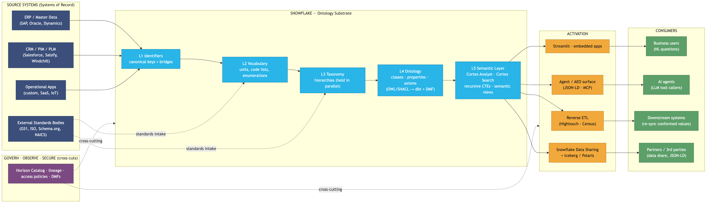
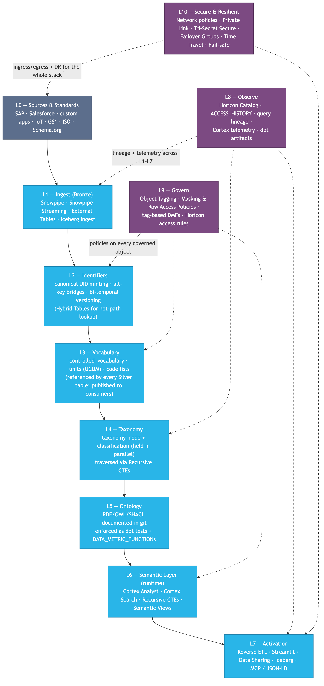
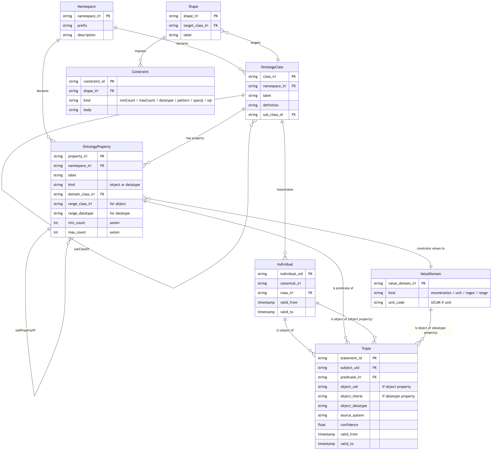
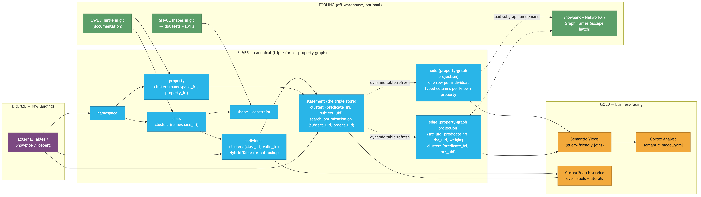
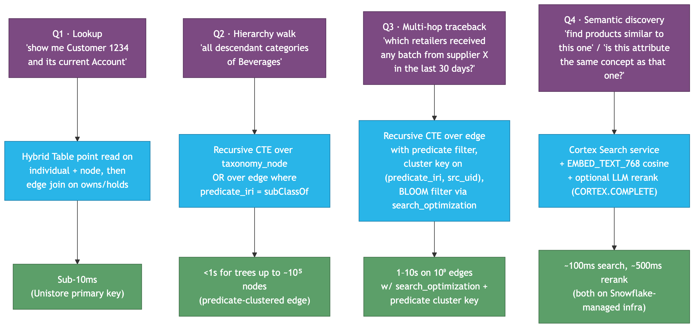
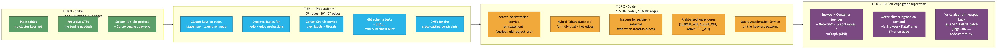

# Snowflake Data Cloud — Ontology Reference Architecture

**Generic, industry-agnostic blueprint for building an ontology on Snowflake — from a handful of nodes and edges to billions, with no separate graph database.**

A **Snowflake-native ontology / knowledge-graph substrate** — a triple store and
property graph that live entirely inside the Snowflake Data Cloud, governed by
Horizon and reasoned over with Cortex. No external graph database, no vector
database, no inference cluster. The same ontology powers natural-language
analytics, graph RAG, data-quality enforcement, and row-level governance.

> ⚠️ Everything here uses **synthetic data** (Faker-generated CPG products,
> retailers, and locations). No customer or proprietary data is included.
>
> Companion to [`demo/`](./demo/) (runnable DDL + Cortex examples).
> Diagram source lives in [`diagrams/`](./diagrams/) as both `.mmd` and `.png`.

---

## Repository layout

| Path | What it is |
|---|---|
| [`demo/`](./demo/) | Runnable SQL + Streamlit that builds the architecture in your account |
| [`demo/ontologies/`](./demo/ontologies/) | Per-source TBox in SQL + OWL/SHACL Turtle (generated from the mappings) |
| [`demo/tools/`](./demo/tools/) | The ontology adapter: mapping specs + ABox/TBox/semantic-model generators |
| [`diagrams/`](./diagrams/) | Mermaid (`.mmd`) sources and rendered PNGs for every figure below |
| [`_tools/`](./_tools/) | Helper to render Mermaid diagrams to PNG |

See [`demo/README.md`](./demo/README.md) for the full, step-by-step run book.

---

## Quick start

Requires a Snowflake account with Cortex enabled, `ACCOUNTADMIN` for first
setup, the [Snow CLI](https://docs.snowflake.com/en/developer-guide/snowflake-cli/index)
with a configured connection, and Python 3.11+.

```bash
cd demo

# Small demo (5 classes · 17 individuals) — end-to-end smoke test in ~5 min
snow sql -f 01_setup_database.sql
snow sql -f 02_load_synthetic_data.sql
snow sql -f 03_query_patterns.sql
snow sql -f 04_dbt_tests_and_dmfs.sql
snow stage put 05_semantic_model.yaml @ont_demo.config.cortex_analyst_models/
```

For the **multi-source demo** (SAP, Salesforce, Oracle, FHIR, Workday,
ServiceNow) and the full **Graph RAG + Governance demo** (embeddings,
row-access policies, masking, Cortex Guard, audit, feedback loop), follow the
staged run order in [`demo/README.md`](./demo/README.md). Synthetic CSVs are
not committed — regenerate them with the ontology adapter:

```bash
python3 -m venv .venv && source .venv/bin/activate
pip install -r tools/requirements.txt
python3 tools/generate_ontology_data.py --system all   # data/<prefix>/*.csv
python3 tools/generate_tbox.py                         # ontologies/<prefix>.{sql,ttl}
python3 tools/generate_semantic_models.py              # analytics_models/analytics_<source>.yaml
```

### The Streamlit console

`demo/streamlit_app.py` deploys an interactive, source-aware **Ontology Console**
(Streamlit-in-Snowflake) with nine tabs. A sidebar selector picks the active
source system; every tab drives its class / predicate / view lists from SILVER
metadata for that source:

| Tab | What it shows |
|---|---|
| **Chat** | Cortex Analyst over the selected source's semantic model (natural-language SQL) |
| **Graph RAG** | Hybrid vector + ontology retrieval, small-model synthesis, citations, Cortex Guard |
| **Signal Graph** | Interactive importance-weighted relationship map with click-to-drill into classes → relationships → individuals |
| **Recall** | Impact / blast-radius walker from any entity (the headline business demo) |
| **Health** | Live Data Metric Function dashboard (SHACL constraints as quality checks) |
| **CISO Audit** | Row-access policies, masking, Horizon tags, Cortex query history, RAG feedback log |
| **Browse** | Paginated lookups across the generated `GOLD.V_<SOURCE>_<CLASS>` views |
| **Search** | Cortex Search service (lexical + semantic) over labels and literals |
| **Explore** | Recursive-CTE n-hop walk from any individual along any predicate set |

```bash
cd demo
snow streamlit deploy --replace
```

The model dropdown in the Graph RAG tab is populated by **live model discovery**
(`12_model_discovery.sql`) — it probes which Cortex `COMPLETE` models are
actually available in your account/region rather than hard-coding a list.

---

## 0. What this document is — and what it is not

**Is**: a reference architecture for an *ontology substrate* — the layered, machine-checkable model of "what kinds of things exist, what properties they have, and how they relate" — built natively on Snowflake.

**Is not**: a vendor pitch for any particular graph engine. The central thesis is that for the overwhelming majority of enterprise ontology use cases — taxonomy walks, multi-hop traceback, similarity, classification, semantic Q&A — Snowflake's native primitives (recursive CTEs, Cortex Search, embeddings, dynamic tables, Iceberg, Snowpark) cover the surface, and you avoid licensing, replicating, and governing a second database.

**Audience**:

| Reader | What to read |
|---|---|
| Exec sponsor | §1 (why), §2 L0 marketecture, §7 (the one sentence) |
| Architect | §1–§4 in order; skim §5–§6 |
| Data engineer / dbt dev | §3 L1 stack, §4 L2 component views, §5 (build path), `demo/` |
| Platform / FinOps | §6 (scaling tiers + cost), §4 L2d |
| Standards / governance | §5.3 (OWL / SHACL → dbt + DMF mapping), §8 (standards table) |

---

## 1. Why an ontology in the data platform at all?

Every enterprise that has tried to "centralize the data" has discovered the same thing: **centralizing the rows is the easy half.** Centralizing the *meaning* — the agreed-upon definitions of `Customer`, `Product`, `Account`, `Asset`, `Site`, and their relationships — is the hard half, and it is what determines whether the data platform actually gets used.

An ontology is the formal answer to four questions:

1. **What kinds of things exist?** (`Customer`, `Account`, `Product`, `Site`, `Contract`…) — the **classes**.
2. **What properties do those things have, and what values are legal?** (`Customer.dateOfBirth : Date`, `Product.netWeight : Quantity[g]`) — the **properties** + **value domains**.
3. **How do those things relate to each other?** (`Customer holds Account`, `Order shipsTo Address`, `Asset locatedAt Site`) — the **relationships**.
4. **What rules must always hold?** (every `Order` has at least one `LineItem`; every `Customer.dateOfBirth` is in the past; every `Account` has exactly one owning `Customer`) — the **axioms / constraints**.

A schema answers question 2 partially. A foreign-key model answers question 3 partially. Neither answers question 4 mechanically. **The ontology pins down all four in a form that both humans and machines can check.**

**Headline claim**: you can express the ontology in standards (RDF / OWL / SHACL), document it in a git repository, and *enforce it natively in Snowflake* via `dbt` tests and `DATA_METRIC_FUNCTION` definitions — without standing up a triple store, a property-graph DB, or a separate semantic platform.

---

## 2. L0 — Marketecture

One picture, one minute. Sources on the left, ontology substrate in the middle (in Snowflake), consumers on the right.



**What this picture commits to**

1. **The ontology lives in Snowflake.** Not in the source systems, not in a separate graph DB, not in a documentation wiki.
2. **Source systems remain Systems of Record** for instance data. The ontology *governs* that data, it does not replace it.
3. **External standards** (GS1, Schema.org, ISO, industry verticals) are *intaken* into the ontology — they shape the vocabulary and taxonomy, they don't bypass it.
4. **Activation closes the loop.** Conformed identifiers, vocabularies, and classifications are pushed back to source systems via reverse ETL; the agent-readable surface is published via Schema.org / JSON-LD and (Track 2) MCP.
5. **Govern / observe / secure are cross-cutting.** Horizon Catalog, lineage, masking policies, and DMFs touch every layer; they are not bolted on at the end.

---

## 3. L1 — Layered Stack

Top-to-bottom; each layer names the Snowflake primitives that implement it.



**Layer-by-layer responsibilities**

| Layer | Purpose | Snowflake primitives |
|---|---|---|
| **L0 Sources & Standards** | Authoritative *instance* data + external *reference* data | External systems; standards bodies |
| **L1 Ingest (Raw)** | Land raw data; preserve fidelity | `Snowpipe`, `Snowpipe Streaming`, `External Tables`, `Iceberg` ingest, `COPY INTO` |
| **L2 Identifiers** | Canonical UIDs + alt-key bridges; bi-temporal versioning | Regular tables; `Hybrid Tables` (Unistore) for hot lookup; `Time Travel` |
| **L3 Vocabulary** | Code lists, units, value domains; the atoms of meaning | Tables clustered on `(domain_code, code)`; published as shared views |
| **L4 Taxonomy** | Hierarchical classifications (multiple in parallel) | Recursive CTEs; cluster keys on `(taxonomy_code, parent_code)` |
| **L5 Ontology** | Formal model — classes, properties, axioms | OWL/Turtle in git; **enforced** via `dbt` tests + `DATA_METRIC_FUNCTION` |
| **L6 Semantic Layer** | Where humans and agents ask business questions | `Cortex Analyst` semantic model YAML; `Cortex Search` services; recursive CTEs; `Semantic Views` |
| **L7 Activation** | Push conformed values back; serve agents and partners | Reverse ETL tools; `Streamlit in Snowflake`; `Data Sharing`; `Iceberg`; MCP server hosted in Container Services |
| **L8 Observe** | Did the constraints hold? Did the agent answer well? | `ACCESS_HISTORY`, `QUERY_HISTORY`, lineage views, Cortex telemetry, dbt run artifacts, DMF results |
| **L9 Govern** | Who can see what; what tags imply which controls | Object Tagging, Masking Policies, Row Access Policies, tag-based DMFs, Horizon access policies |
| **L10 Secure & Resilient** | Ingress, egress, DR | Network policies, Private Link, Tri-Secret Secure, Failover Groups, Time Travel, Fail-safe |

> **Terminology**
>
> The narrative architecture uses **Raw / Curated / Semantic** to name the three persistent data layers. The accompanying SQL demo keeps the legacy schema names `BRONZE` / `SILVER` / `GOLD` for backward compatibility with the existing scripts; conceptually they are 1:1:
>
> | Narrative layer | SQL schema | What lives there |
> |---|---|---|
> | **Raw**      | `BRONZE` | Landing-zone tables, external tables, file format objects, ingest stages |
> | **Curated**  | `SILVER` | Triple store (`statement`, `individual`), MDM bridges, `node` / `edge` Dynamic Tables, taxonomies, vocabularies, SHACL shapes, DMFs |
> | **Semantic** | `GOLD`   | Cortex Analyst semantic model, Cortex Search service, friendly `v_*` views, semantic views, Graph RAG procs |
>
> Avoid "Bronze / Silver / Gold" in customer-facing narrative; refer to **Raw / Curated / Semantic** layers and call out the schema names only when pointing at a specific SQL object.

---

## 3.1 L1b — Patterns by Layer

A finer-grained look at the same stack: every primitive, pattern, and Snowflake service that lives inside each of the three persistent layers (Raw, Curated, Semantic), plus the cross-cutting Govern / Observe / Secure planes.


**How to read it**

- Three persistent layers stacked vertically; data flows **Sources → Raw → Curated → Semantic → Activation**.
- Each layer is grouped by **type of pattern**, not by file/table. So "Identity & MDM" sits alongside "Models" and "Quality" inside Curated, regardless of whether the implementation is a triple store, a star schema, or a Hybrid Table.
- Cross-cutting concerns at the bottom — **Govern**, **Observe**, **Secure & Resilient** — apply to every layer simultaneously. The dotted arrows are deliberately many-to-many: an object tag, an `ACCESS_HISTORY` row, or a network policy is a property of an *object*, not of a layer.
- The pattern boxes inside Curated and Semantic deliberately mirror what the demo's `01–12_*.sql` files create. Use this diagram to map any demo file to a layer in 5 seconds.

**Why this picture, not Medallion?**

- Medallion (Bronze/Silver/Gold) is a *pipeline-stage* metaphor. It tells you the *order* in which data is processed but not the *kind* of pattern that lives in each stage.
- Raw / Curated / Semantic is a *responsibility* metaphor. It tells you what each layer is *for* — and therefore which Snowflake services are appropriate inside each.
- For an audience that includes a CISO, a CDO, and a VP of Engineering, the responsibility frame lands faster than the color frame.

---

## 4. L2 — Component Views

Four focused diagrams covering the meat of the build: logical model, physical model, query patterns, and scaling tiers.

### 4.1 L2a — Logical data model (RDF-style triple store, expressed relationally)

The standards-aligned mental model: **everything is a triple of `(subject, predicate, object)`.** This is the surface that round-trips to RDF/JSON-LD/Schema.org. It's not necessarily the only physical layout you ship (see L2b) — but it is the canonical logical view.



**Read this diagram as five concentric rings:**

1. `NAMESPACE` declares everything else (each ontology lives in a namespace IRI, e.g. `http://schema.org/`, `http://gs1.org/voc/`, `http://yourco.com/ontology/`).
2. `CLASS` + `PROPERTY` define the **TBox** (the schema — "what kinds of things exist").
3. `VALUE_DOMAIN` constrains property values (`UCUM` units, enumerations, regex, ranges).
4. `INDIVIDUAL` + `STATEMENT` are the **ABox** (the instance data — "the actual things"). Every fact is a `STATEMENT` row.
5. `SHAPE` + `CONSTRAINT` are the **enforcement layer** (SHACL shapes — "rules that must hold"). Each `CONSTRAINT.body` compiles to a `dbt` test or a `DATA_METRIC_FUNCTION`.

This single mental model is the round-trip surface to RDF / JSON-LD / Schema.org. **It is not the only layout you ship** — for hot paths you also keep typed wide tables (see L2b).

### 4.2 L2b — Physical layout in Snowflake (property graph + wide tables)

A pure triple store in Snowflake scales — but on its own it loses the optimizer's structural advantage. The pragmatic build keeps the triple store as the *canonical* layer and *materializes* property-graph and wide tables for the hot paths.



**Why this two-layer physical layout works**

| Need | Where it's served from | Why |
|---|---|---|
| Standards round-trip (RDF, JSON-LD, SPARQL-like queries) | `statement` (the triple store) | The triple store is the source of truth |
| Low-latency single-entity lookup (`get Customer 1234`) | `individual` Hybrid Table + wide `node` projection | Avoid the triple-join blowup; sub-10ms point reads |
| Multi-hop traversal (e.g., supplier → batch → SKU → retailer) | `edge` projection + recursive CTE | Predicate-clustered edge table walks fast |
| Semantic / similarity (e.g., "find products like this one") | `Cortex Search` + `EMBED_TEXT_768` on labels + literals | Snowflake-native; no separate vector DB |
| NL Q&A from business users | `Cortex Analyst` over `Semantic Views` | Grounded against the ontology; provenance returned |
| Graph algorithms (PageRank, community detection, max-flow) | `Snowpark` + `NetworkX` / `GraphFrames` on a materialized subgraph | The 1% case; doesn't need a permanent graph DB |

The `node` and `edge` projections are refreshed via **`Dynamic Tables`** — Snowflake takes care of incrementality; you don't write orchestration.

### 4.3 L2c — Query patterns

How the four canonical kinds of question are answered, end to end.



Reference implementations of all four patterns live in [`demo/03_query_patterns.sql`](./demo/03_query_patterns.sql).

### 4.4 L2d — Scaling tiers (the "few nodes → billions" path)

This is the answer to *"how does this scale?"* Each tier adds a small number of Snowflake mechanisms; the underlying data model never changes.



**Key insight**: the journey from tier 0 to tier 3 is **additive** — at no point do you redo the data model. Each step is an opt-in Snowflake feature applied to the same `individual` / `statement` / `node` / `edge` tables.

---

## 5. How to build it — the build path

This section answers "OK, where do I start Monday morning?"

### 5.1 The seven concrete artifacts

| # | Artifact | Where it lives | Tooling |
|---|---|---|---|
| 1 | **Namespace + class + property catalog** (the TBox) | `ontology/*.ttl` in git; loaded into `silver.class`, `silver.property`, `silver.namespace` | Hand-authored in Turtle; validated with `pySHACL` or `rdflib` in CI |
| 2 | **Controlled vocabulary tables** (the value domains) | `silver.value_domain`, `silver.controlled_vocabulary` | Loaded from CSV / external standards (UCUM, FALCPA, ISO 4217) |
| 3 | **Taxonomy load + parallel classifications** | `silver.taxonomy_node`, `silver.product_classification` (or `entity_classification`) | dbt seed for the trees themselves; dbt models for assignments |
| 4 | **Individuals + statements (the ABox)** | `silver.individual`, `silver.statement` | dbt models from Bronze ingest; Snowpipe Streaming for high-velocity sources |
| 5 | **`node` + `edge` projections** (the property-graph view) | `silver.node`, `silver.edge` as **Dynamic Tables** | dbt or direct `CREATE DYNAMIC TABLE` |
| 6 | **dbt tests + DMFs** (the operational ontology enforcement) | `dbt/tests/`, `dbt/models/schema.yml`; Snowflake `DATA_METRIC_FUNCTION` objects | Generated from the SHACL shapes in `ontology/shapes.ttl` |
| 7 | **Analytics model YAML + Cortex Agent** (the runtime) | analytics models staged into `@config.cortex_analyst_models/`; Cortex Agent definition | Snow CLI; `demo/` shows the full path |

The runnable scaffolding for items 1–7 lives in [`demo/`](./demo/) and is intentionally small enough to read top-to-bottom in an afternoon.

### 5.2 The standards stack to adopt

Don't invent your own — extend, don't reinvent:

```
              Your-Org-specific OWL/SHACL extension
                            ↑ extends
                ┌───────────┴───────────┐
                │  Industry vocabulary  │   ← GS1 (retail) · FIBO (finance) · HL7 FHIR (health) · etc.
                └───────────┬───────────┘
                            ↑ extends
                ┌───────────┴───────────┐
                │     Schema.org        │   ← web / SEO / conversational / agent-readable
                └───────────┬───────────┘
                            ↑ uses
                ┌───────────┴───────────┐
                │  RDF / RDFS / OWL 2   │   ← formal substrate
                │     + SHACL           │   ← constraints
                └───────────────────────┘
```

| Standard | Adopt? | Use it for |
|---|---|---|
| **RDF + RDFS + OWL 2** | ✅ As the formal substrate | Express classes, properties, subClassOf, domain/range — documented in `.ttl` |
| **SHACL** | ✅ For constraints | minCount/maxCount/pattern/datatype — compiled to dbt tests + DMFs |
| **Schema.org** | ✅ For the web/agent-readable surface | Round-trip via JSON-LD; consumed by agents and SEO |
| **JSON-LD** | ✅ As the wire format | What you publish via the MCP / AEO surface |
| **SKOS** | ✅ For publishing taxonomies | Lightweight concept hierarchies; round-trip with GPC, NAICS, etc. |
| **PROV-O** | ✅ Lightweight | Attribute-level provenance metadata |
| **Industry verticals** | ✅ When relevant | GS1 (retail), FIBO (finance), HL7 FHIR (health), GoodRelations, CIM (utilities) |
| **SPARQL** | ⚠ Reference only | Don't run a SPARQL endpoint; translate the recurring patterns to SQL |

### 5.3 SHACL → dbt + DMF translation (the operational rule)

This is the single piece of mechanical work that turns the documented ontology into enforced code. Every SHACL constraint has a one-to-one Snowflake expression:

| SHACL construct | dbt expression | Snowflake DMF expression |
|---|---|---|
| `sh:minCount 1` | `dbt_utils.not_null_proportion(at_least=1.0)` | `DATA_METRIC_FUNCTION` returning `COUNT(*) WHERE col IS NULL` |
| `sh:maxCount 1` | unique key test | DMF: `COUNT(*) > 1 PARTITION BY subject_uid, predicate_iri` |
| `sh:datatype xsd:decimal` | dbt column test (`data_type: number`) | column type enforcement + DMF on parse failures |
| `sh:pattern "^[A-Z]{2}$"` | `dbt_expectations.expect_column_values_to_match_regex` | DMF using `REGEXP_LIKE` |
| `sh:in (val1 val2 …)` | accepted_values test | DMF: `COUNT(*) WHERE col NOT IN (…)` |
| `sh:class :Customer` | relationships test | DMF: `COUNT(*) WHERE object_uid NOT IN (SELECT individual_uid FROM individual WHERE class_iri = :Customer)` |
| `sh:sparql { … }` | bespoke dbt test (SQL macro) | bespoke DMF |

The shape `:Customer a sh:NodeShape ; sh:targetClass :Customer ; sh:property [ sh:path :hasEmail ; sh:minCount 1 ; sh:datatype xsd:string ] .` becomes a dbt test that `silver.statement` has at least one row per `Customer` individual where `predicate_iri = :hasEmail`, plus a DMF that emits a count of violators on a schedule. The truth is in `shapes.ttl`; the *enforcement* is in dbt + DMFs; the *observation* surfaces in Horizon Catalog.

### 5.4 The minimum viable build (Phase 0, ≤ 2 weeks)

1. Stand up an `ONT_DEV` database with `BRONZE`, `SILVER`, `GOLD`, `CONFIG` schemas (`demo/01_setup_database.sql`).
2. Author 1 namespace + 5 classes + 15 properties + 5 SHACL shapes in `.ttl` (e.g. `ontology/your-domain.ttl`).
3. Load 10–50 individuals and 100–1000 statements from one source (`demo/02_load_synthetic_data.sql`).
4. Materialize `node` + `edge` as Dynamic Tables (`demo/03_query_patterns.sql`).
5. Generate the first 5 dbt tests + 2 DMFs from the SHACL shapes.
6. Drop a 20-line `semantic_model.yaml` into `@config.cortex_analyst_models/`.
7. Open a Cortex Analyst chat. Ask three questions. **Done with Phase 0.**

Everything beyond Phase 0 — taxonomy import, Cortex Search, reverse ETL, MCP surface — is layered on this base **without changing it**.

---

## 6. Scaling — cost & latency profile

What it actually costs to grow the substrate, with order-of-magnitude numbers from comparable Snowflake deployments.

| Tier | Scale | Storage | Compute (steady state) | Typical latency |
|---|---|---|---|---|
| **T0 Spike** | 10⁴ nodes, 10⁵ edges | < 1 GB | XSMALL × ~2h/day | <100ms point read; <1s traversal |
| **T1 Production v1** | 10⁵ nodes, 10⁷ edges | 1–10 GB | XSMALL × ~8h/day + SMALL bursts | <50ms point read (Hybrid Table); <2s recursive walk |
| **T2 Scale** | 10⁷ nodes, 10⁹ edges | 100 GB – 1 TB | search_optimization service + MEDIUM/LARGE on heavy walks | <20ms point read; 1–10s billion-edge walk with predicate filter |
| **T3 Graph algorithms** | Same data; transient subgraph extracts | Same compute spend; Snowpark Container Services for the algorithm host | 30s–10m PageRank-class jobs (depending on subgraph size + GPU) | n/a — batch |

**The economics that win the comparison**:

| Cost line | "Snowflake-only" path | "Snowflake + dedicated graph DB" path |
|---|---|---|
| Database license | included in Snowflake spend | separate license (often six figures/yr) |
| Ops staffing | shared with the rest of the platform | dedicated graph DBA / SRE |
| Replication, backup, DR | already paid for (Snowflake's Failover Groups / Time Travel) | re-implement for the graph DB |
| Governance | one access model, one catalog | two |
| Network egress / data movement | none — the data is already there | continuous ETL out to the graph DB |
| Skill gap | "your data engineers" | "your data engineers + Cypher / SPARQL experts" |

The escape hatch in Tier 3 (Snowpark Container Services + `NetworkX` / `GraphFrames` / `cuGraph`) covers the legitimate graph-algorithm use cases without adding a permanent database. You materialize a subgraph for the duration of the algorithm, then drop it.

---

## 7. The single most important sentence

> **The ontology lives in Snowflake — documented as OWL/SHACL in git, enforced as `dbt` tests and `DATA_METRIC_FUNCTION` definitions, queried via recursive CTEs and Cortex, and exposed to agents via Schema.org / JSON-LD — and at every scale you choose, you add Snowflake features to the same data model, never a second database.**

If you only remember one paragraph from this document, that is it.

---

## 8. Quick glossary

| Term | One-line definition |
|---|---|
| **Ontology** | Formal, machine-checkable model of classes, properties, and axioms |
| **Taxonomy** | Hierarchical classification of types (a tree or DAG) |
| **Vocabulary (controlled)** | Bounded list of legal values for an attribute |
| **TBox** | The schema-level part of an ontology (classes, properties) |
| **ABox** | The instance-level part (individuals, statements) |
| **Triple** | `(subject, predicate, object)` — the canonical unit of RDF |
| **IRI** | Internationalized URI; the globally-unique identifier scheme |
| **OWL** | Web Ontology Language — the standard for TBox |
| **SHACL** | Shapes Constraint Language — the standard for axioms / constraints |
| **JSON-LD** | JSON serialization of RDF; the wire format for agent-readable data |
| **Property graph** | Graph model with typed nodes + typed edges + key-value attributes |
| **DMF** | Snowflake `DATA_METRIC_FUNCTION` — scheduled SQL that returns a number, used for continuous data-quality enforcement |
| **Hybrid Table** | Snowflake table optimized for low-latency point + small-range access (Unistore) |
| **Dynamic Table** | Snowflake table whose contents are refreshed automatically from a query, with built-in incremental refresh |
| **Cortex Analyst** | Snowflake-native NL → SQL service grounded on a semantic model YAML |
| **Cortex Search** | Snowflake-native hybrid (lexical + semantic) search service |
| **MCP** | Model Context Protocol — the emerging standard for exposing tools/data to LLM agents |
| **AEO** | Answer Engine Optimization — the practice of publishing data in a form agents will pick up |

---

## 9. What to read next

| If you want to… | Open |
|---|---|
| See it run | [`demo/README.md`](./demo/README.md) |
| Build the TBox | [`demo/ontologies/`](./demo/ontologies/) (generated per-source SQL + Turtle) |
| Build the ABox | [`demo/02_load_synthetic_data.sql`](./demo/02_load_synthetic_data.sql) |
| Wire up the projections | [`demo/03_query_patterns.sql`](./demo/03_query_patterns.sql) |
| Enforce the ontology | [`demo/04_dbt_tests_and_dmfs.sql`](./demo/04_dbt_tests_and_dmfs.sql) |
| Talk to it in English | [`demo/05_semantic_model.yaml`](./demo/05_semantic_model.yaml) |
| Load any source system's ABox | [`demo/02b_load_source_ontology.sql`](./demo/02b_load_source_ontology.sql) (`snow sql -D "SYSTEM=<prefix>"`) |
| Add an industry vertical (e.g. CPG) | [`demo/ontologies/cpg.sql`](./demo/ontologies/cpg.sql) + [`demo/ontologies/cpg.ttl`](./demo/ontologies/cpg.ttl) |
| Build a Graph RAG over the ontology | [`demo/08_graph_rag.sql`](./demo/08_graph_rag.sql) — embeddings · hybrid retriever · small-model synthesis · recall blast-radius |
| Wire CISO governance (RAP, masking, tags, Cortex Guard) | [`demo/09_governance_policies.sql`](./demo/09_governance_policies.sql) |
| Capture RAG feedback + fine-tune | [`demo/10_rag_feedback.sql`](./demo/10_rag_feedback.sql) |
| Discover available Cortex models | [`demo/12_model_discovery.sql`](./demo/12_model_discovery.sql) |
| Drive it all from one app | [`demo/streamlit_app.py`](./demo/streamlit_app.py) (9 tabs incl. Graph RAG, Signal Graph, Recall, CISO Audit) |

---

## License

Licensed under the Apache License, Version 2.0. See [`LICENSE`](./LICENSE).

## Disclaimer

This is an independent reference implementation provided as-is for
demonstration and educational purposes. All data is synthetic. It is not an
official Snowflake product and carries no warranty or support.
